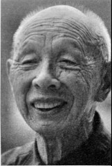

# 兄弟：老兄胆子比较细，我打死就打死了

_上午11点，浏阳普迹镇，刘光德拐着拐杖从卧房走到堂屋，双腿瑟瑟发抖。70年前，他曾挑着子弹跑遍湘赣，在枪林弹雨中爬无数山坡，趟大小河流。坐在凳子上，目光茫然。“耳朵聋，不听见，娘啊？早病死了，不记得了。”老人像看着我，又像看着远方。_

_1945年，从江西萍乡的部队赶回浏阳，刘光德看着母亲吐血而死，弟弟刘光尧此时在前线打仗，两个月后才收到家信．刘光尧清楚地记得是4月21日早晨，他说他印象中的母亲，“刮瘦刮瘦，哭个不停”。_

_问他，假如没有战争，会是怎样？“起码不会见不到母亲最后一面吧。”父亲呢？“父亲也悲伤，不记得太多，他1964年过世。”89岁的刘光尧说。_

_70多年前，两人一同参战，又先后平安返乡。这对幸运的兄弟兵如今都住在普迹镇，尽管两家相距只有6公里，但上一次相见还是半年前，“年纪都大了”，刘光德说。刘光尧认为，自己和哥哥不同，“老兄胆子比较细，我打死就打死了。”_

_2015年7月，我们在浏阳分別采访了这对兄弟。_

**口述人 /** 刘光德，1924年农历七月初五出生，浏阳市普迹镇人，现跟儿子住在普迹镇新府社区。1943年农历七月十三日入伍，进入100军19师输送连。1945年，母来病危请假回家，随后留在家中。老人现有风湿，行动不便。

**采集人 /** 明鹊 **采集时间 /** 2014年7月7日、7月14日、7月16日

### “任务急的时候走路没停过，慢了要挨打”

我当兵以前是竹匠。乡里捉壮丁，17岁就有名字，我不到二十岁去当兵，最恨日本人，恨不得用扁担拍死日本人。我屋里有九兄妹，我是老四。17岁就躲壮丁，开始是请人去[^1]，没钱了以后就自己去。我和我老弟（刘光尧），还有一个老兄（刘光厚）都进部队去了[^2]，老兄不晓得在哪个部队，我和老弟进了100军19师。

19师驻扎在青龙头。我们找部队打了证明，到政工所取了收条[^3]，他（刘光尧）进了特务连，我就去了输送连。输送连有80个人的样子，没得骡子没得马，总是靠人担，担起担子就跑。

到桃源漆家河就打仗了，他进我就退，退到王家棚，围了三个月，后来去了益阳、常德，还把日本人赶到湖北藕池。我们输送连没有枪咯，一根扁担，运子弹到前线去。

一个班只有一杆枪，拿枪的负责放哨。我只拿过三天的枪。班长把枪分给我，我就对他说：“你非要我拿枪的话，就莫怪我当逃兵。”

后来又去了安化、武冈、临澧、衡阳、芷江，我们杀了四个日本人。输送连送子弹，送粮食，还做扁担。他要我送就去送，送了又还要送，也不敢挑着粮食跑，没有一个人敢跑，万一被日本人打死呢。

我在部队里胀也胀过，饿也饿过，一天吃三餐，有时两餐，总是挑担子。走路穿草鞋，经常要站在水中，一站两三个钟头。任务急的时候，走路没停过，慢了要挨打。

### “衡阳过后，他走一条路，我走一条路”

我没有上战场打仗，送子弹粮食还搞不赢，夜里也要送，饭都没呷完就跑去送。老弟是特务连的，总是跟着师部走；我一直随唐伯寅[^4]走，来了信就跟着走，挑五六十斤，还要担起跑。七月份在衡阳明南寺打得狠，死了的摆在平地上，遍地都是死尸，哎呀，死尸闻不得，肚子生蛆虫了。

挑东西累，但没太大的危险，前面有人开道，除非是天上来飞机。有一次在衡阳送东西，飞机丢下的弹片从我后脑勺擦过去，只听见“嗖”的响声，我一摸，哎呀，手上都是血，现在这里还有印子。衡阳以后我们两兄弟就分开了，他走一条路，我走一条路，我去了江西。

接到娘的信时我在江西萍乡，我老弟没看到那封信。我耳朵聋，听不清，又没读什么书，只读了三年，信里面讲娘生病了，不晓得是什么病。

到江西萍乡后就接到屋里的信，娘已经病了好久。部队写了东西上去，然后就批准我回去，请了三天的假，走了半天到屋里，娘老子吐了好多血，第二天就死了。后来准备回部队去，结果部队去了浙江，就没回部队了。

**刘光德的抗敌军人出征证明。**

**口述人 /** 刘光尧，1926年农历八月初二出生，浏阳市普迹镇人。1943年农历七月十三日入伍，进入100军19师特务连，1948年返回家乡。

**采集人 /** 明鹊 **采集时间 /** 2014年7月7日、7月14日和7月16日

### “一天走了两个，她哭得不得了”

（1943年）农历七月十三日，天气不热，穿两件衣服，已经到秋天了。那天下雨，早上来了命令说12点走，队伍还没走就落雨了，然后说下午4点走，又没落了，等到四点又落了，一直落。那段行军的时候都落雨，走了15天，一休息就不落，一行军就落雨。

我娘住在普迹镇银皮洞，我夜里回自己屋里时，她晓得我要走，看着我，一直不肯回去。一天走了两个，她哭得不得了。就在下头那个供销社那里，她从这边跑到那边，那边跑到这边，一天饭都没呷。我民国三十二年（1943）离家，到民国三十四年（1945）娘死，都没见我娘的面啊。

我进部队先培训了三个月，到农历十月开始往北行军，路上冻死了好多兵。副师长叫杨任，看到死了兵，就跟我们讲，“你们慢慢来”。到桃源漆家河遇上了日本人，夜里一个连长被打死了，是57团第8连的连长，姓杨，当时他去拆浮桥（用竹子木板搭建的浮在水面的桥）。

那个晚上，日本人冲过了河，河有普迹河那么宽，他们设备足啊，加上河水又浅，汽车从河里就开过来，过来就把我们围了，然后放火烧了我们仓库。我们有三个团：55团、56团和57团，一共一万多人，日本人不晓得有好多。开始住在漆家河街上，日本人打过来后，我们就退到了金鸡山。围了两三个月，一直到74军从溆浦过来才解围。在漆家河那时，我老兄也在，有时候看到，但没讲过话。

### “每次打仗前，钱全部买牛蹄子吃，打死了就打死了”

我是特务连的，是负责保护师部、士官处、军械处、卫生处、参谋处的，我们有四个排，一百多人啊。打仗呢，我随师部走，我老兄搞补给，主要从兵械处把子弹运到的前方。漆家河后，一部分兵往常德、益阳开，我往沅凌，后来我去观音码头，在那里又军训了三个月。

特务连上战场不多，不过长期要围着师部走，夜里没好多时间睡觉。打衡阳的时候，我们傍晚5点得到命令要摸到后方去，只带武器，其他什么都不带。但是第二天天亮，城里面的第10军就全部瓦解了，我们也退到了水同江。日本人厉害呢，做了四五层防范，攻也不容易攻。

特务连没有迫击炮，配了机枪。我们拿步枪，一个人200发子弹，上战场时，还背两个手榴弹，多的时候配四个，有二三十斤重。

衡阳过后，就不晓得我老兄的去向了，我去了湘西洪江，那里小地方多得很，名字我都不清白。

1945年，我母亲病逝，日子我记得很清楚，是四月二十一日早晨。我六月才收到那封信，信上写着“母亲已死”。那时候我在武冈旁边一个叫长冲的地方，日本人还冇投降。母亲过世后，弟弟被送去做手艺，细得很呢，我父亲跟我大哥一起过。

信写得很简单，问“好不好？在哪里？”然后讲母亲死了，是请别人写的。我看了过后，心里很难过，流了眼泪，两三天没呷什么饭。连长曹昆做我的工作，“你母亲也是我母亲，人总有一死，不要悲伤。”他还说，“等任务不大了，我再准你的假。”听了连长的话，我后来就升了官，做了上士班长，管一个班，还加了钱，按级别加的，比下士要多。

特务连每次打仗前都会做些好呷的，钱全部买牛蹄子吃，打死了就打死了。我们后来打水同江、湘西长城、武冈，特别是打湘西长城时，日本人在山脚一个庙里面，我们得到信后爬到山顶，那大炮、手榴弹全部往下投，“轰隆轰隆”炸死了好多，马啊，人啊，惨得很。打仗就是这样，都靠机枪大炮，步枪是怎么呢，只能在一里以下，打冲锋的时候，特别夜里打冲锋，把刺刀上了，这样去拼命，我没去拼过。

### “那天我去上坟，烧了香，还打着一把伞”

日本人投降的时候，我们在安江还是洪江，接手了七百多匹马[^5]。那时候我在炮兵营，手上有七匹马，一个月后赶到湖北武昌，死了两匹，剩下五匹。走的时候108人，到湖北剩五十几个，有好多都跑了，马也一匹匹地死，到了武昌城外面，也不晓得交给了谁。

两三天后去了江苏镇江，在那里负责交按日本物资。没得何应应钦条子根本就不能交接，那要犯法的呢。我发了一双皮鞋，那鞋子是好鞋，要几块钱，衣服也好，是青的咔叽布，不过我没有发衣服。东北的新四军交接，听说那还要好一些。日本人投降，我们多发了一个月的饷，是在镇江补发的。

后来又去了泰州、杭州，那边有蛮多的苑房（女子卖身的地方），我那时候是班长，管十几个人，其中有三四个去过，只要天亮出操有人，就不会被抓到。我自己没去过，去那个苑房的，有些得了病，有的病得都不清白了。

在那里待了一年多，后来裁军，想回去你就回去，不霸蛮。民国三十七年（1948）六七月份，我把武器都交了，一把79式步枪，可以上五发子弹[^6]。回来看到父亲，他没有什么变化，看我回去蛮高兴。一起去了母亲的坟上，父亲和哥哥带我去的。那天我去上坟，下着雨，烧了香，还打着一把伞。

[^1]: 据刘光德口述，二十担谷请过壮丁，五十担谷也请过壮丁，一共请了五个壮丁，他们的名字都不记得了。

[^2]: 刘光厚从小过继给了别人，因为养父母家里条件不好，所以选择替别人出丁，战争结束后也没回来。据刘光尧口述，当时刘家情况是：大哥已经结婚，二哥过继给了别人，三哥给人当长工，要养活一家人，下面的弟弟妹妹都小，跟着娘老子讨米，老四刘光德和老五刘光尧当时在外面学手艺，迫不得已去当了兵。

[^3]: 打了证明条子以后，就不会再到刘家征兵了。

[^4]: 唐伯寅（1897~1952），字剑椿，号剑湘，湖南省湘潭县人。1939年8月任第19师师长，11月升陆军少将，先后参加了第一、二次长沙会战、常德会战、长衡会战。1946年退役回湘。1949年4月，参加了程潜、唐生智等人在湖南发起的和平自救运动，并积极策反湘军旧部。1952年2月21日，镇反运动中在湘潭被杀。

[^5]: 据刘光尧说，这些都是拉炮的马，很多受了伤，不能骑，也没有马鞍。交马时要点数，如果马死了，要把耳朵和尾巴割下来交上去。

[^6]: 刘光尧此说法与之前接受采访时的说法有差异。此前，刘光尧曾说自己是1950年在广西玉城向解放军起义投诚后回家的。