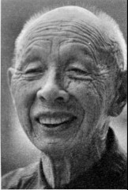

# 兄弟：老兄胆子比较细，我打死就打死了

**口述人 /** 刘光尧，1926年农历八月初二出生，浏阳市普迹镇人。1943年农历七月十三日入伍，进入100军19师特务连，1948年返回家乡。

**采集人 /** 明鹊 **采集时间 /** 2014年7月7日、7月14日和7月16日

### “一天走了两个，她哭得不得了”

（1943年）农历七月十三日，天气不热，穿两件衣服，已经到秋天了。那天下雨，早上来了命令说12点走，队伍还没走就落雨了，然后说下午4点走，又没落了，等到四点又落了，一直落。那段行军的时候都落雨，走了15天，一休息就不落，一行军就落雨。

我娘住在普迹镇银皮洞，我夜里回自己屋里时，她晓得我要走，看着我，一直不肯回去。一天走了两个，她哭得不得了。就在下头那个供销社那里，她从这边跑到那边，那边跑到这边，一天饭都没呷。我民国三十二年（1943）离家，到民国三十四年（1945）娘死，都没见我娘的面啊。

我进部队先培训了三个月，到农历十月开始往北行军，路上冻死了好多兵。副师长叫杨任，看到死了兵，就跟我们讲，“你们慢慢来”。到桃源漆家河遇上了日本人，夜里一个连长被打死了，是57团第8连的连长，姓杨，当时他去拆浮桥（用竹子木板搭建的浮在水面的桥）。

那个晚上，日本人冲过了河，河有普迹河那么宽，他们设备足啊，加上河水又浅，汽车从河里就开过来，过来就把我们围了，然后放火烧了我们仓库。我们有三个团：55团、56团和57团，一共一万多人，日本人不晓得有好多。开始住在漆家河街上，日本人打过来后，我们就退到了金鸡山。围了两三个月，一直到74军从溆浦过来才解围。在漆家河那时，我老兄也在，有时候看到，但没讲过话。

### “每次打仗前，钱全部买牛蹄子吃，打死了就打死了”

我是特务连的，是负责保护师部、士官处、军械处、卫生处、参谋处的，我们有四个排，一百多人啊。打仗呢，我随师部走，我老兄搞补给，主要从兵械处把子弹运到的前方。漆家河后，一部分兵往常德、益阳开，我往沅凌，后来我去观音码头，在那里又军训了三个月。

特务连上战场不多，不过长期要围着师部走，夜里没好多时间睡觉。打衡阳的时候，我们傍晚5点得到命令要摸到后方去，只带武器，其他什么都不带。但是第二天天亮，城里面的第10军就全部瓦解了，我们也退到了水同江。日本人厉害呢，做了四五层防范，攻也不容易攻。

特务连没有迫击炮，配了机枪。我们拿步枪，一个人200发子弹，上战场时，还背两个手榴弹，多的时候配四个，有二三十斤重。

衡阳过后，就不晓得我老兄的去向了，我去了湘西洪江，那里小地方多得很，名字我都不清白。

1945年，我母亲病逝，日子我记得很清楚，是四月二十一日早晨。我六月才收到那封信，信上写着“母亲已死”。那时候我在武冈旁边一个叫长冲的地方，日本人还冇投降。母亲过世后，弟弟被送去做手艺，细得很呢，我父亲跟我大哥一起过。

信写得很简单，问“好不好？在哪里？”然后讲母亲死了，是请别人写的。我看了过后，心里很难过，流了眼泪，两三天没呷什么饭。连长曹昆做我的工作，“你母亲也是我母亲，人总有一死，不要悲伤。”他还说，“等任务不大了，我再准你的假。”听了连长的话，我后来就升了官，做了上士班长，管一个班，还加了钱，按级别加的，比下士要多。

特务连每次打仗前都会做些好呷的，钱全部买牛蹄子吃，打死了就打死了。我们后来打水同江、湘西长城、武冈，特别是打湘西长城时，日本人在山脚一个庙里面，我们得到信后爬到山顶，那大炮、手榴弹全部往下投，“轰隆轰隆”炸死了好多，马啊，人啊，惨得很。打仗就是这样，都靠机枪大炮，步枪是怎么呢，只能在一里以下，打冲锋的时候，特别夜里打冲锋，把刺刀上了，这样去拼命，我没去拼过。

### “那天我去上坟，烧了香，还打着一把伞”

日本人投降的时候，我们在安江还是洪江，接手了七百多匹马[^5]。那时候我在炮兵营，手上有七匹马，一个月后赶到湖北武昌，死了两匹，剩下五匹。走的时候108人，到湖北剩五十几个，有好多都跑了，马也一匹匹地死，到了武昌城外面，也不晓得交给了谁。

两三天后去了江苏镇江，在那里负责交按日本物资。没得何应应钦条子根本就不能交接，那要犯法的呢。我发了一双皮鞋，那鞋子是好鞋，要几块钱，衣服也好，是青的咔叽布，不过我没有发衣服。东北的新四军交接，听说那还要好一些。日本人投降，我们多发了一个月的饷，是在镇江补发的。

后来又去了泰州、杭州，那边有蛮多的苑房（女子卖身的地方），我那时候是班长，管十几个人，其中有三四个去过，只要天亮出操有人，就不会被抓到。我自己没去过，去那个苑房的，有些得了病，有的病得都不清白了。

在那里待了一年多，后来裁军，想回去你就回去，不霸蛮。民国三十七年（1948）六七月份，我把武器都交了，一把79式步枪，可以上五发子弹[^6]。回来看到父亲，他没有什么变化，看我回去蛮高兴。一起去了母亲的坟上，父亲和哥哥带我去的。那天我去上坟，下着雨，烧了香，还打着一把伞。

[^5]: 据刘光尧说，这些都是拉炮的马，很多受了伤，不能骑，也没有马鞍。交马时要点数，如果马死了，要把耳朵和尾巴割下来交上去。

[^6]: 刘光尧此说法与之前接受采访时的说法有差异。此前，刘光尧曾说自己是1950年在广西玉城向解放军起义投诚后回家的。