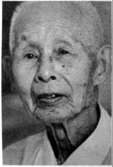
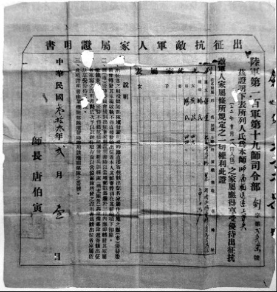

# 兄弟：老兄胆子比较细，我打死就打死了

**口述人 /** 刘光德，1924年农历七月初五出生，浏阳市普迹镇人，现跟儿子住在普迹镇新府社区。1943年农历七月十三日入伍，进入100军19师输送连。1945年，母来病危请假回家，随后留在家中。老人现有风湿，行动不便。

**采集人 /** 明鹊 **采集时间 /** 2014年7月7日、7月14日、7月16日

### “任务急的时候走路没停过，慢了要挨打”

我当兵以前是竹匠。乡里捉壮丁，17岁就有名字，我不到二十岁去当兵，最恨日本人，恨不得用扁担拍死日本人。我屋里有九兄妹，我是老四。17岁就躲壮丁，开始是请人去[^1]，没钱了以后就自己去。我和我老弟（刘光尧），还有一个老兄（刘光厚）都进部队去了[^2]，老兄不晓得在哪个部队，我和老弟进了100军19师。

19师驻扎在青龙头。我们找部队打了证明，到政工所取了收条[^3]，他（刘光尧）进了特务连，我就去了输送连。输送连有80个人的样子，没得骡子没得马，总是靠人担，担起担子就跑。

到桃源漆家河就打仗了，他进我就退，退到王家棚，围了三个月，后来去了益阳、常德，还把日本人赶到湖北藕池。我们输送连没有枪咯，一根扁担，运子弹到前线去。

一个班只有一杆枪，拿枪的负责放哨。我只拿过三天的枪。班长把枪分给我，我就对他说：“你非要我拿枪的话，就莫怪我当逃兵。”

后来又去了安化、武冈、临澧、衡阳、芷江，我们杀了四个日本人。输送连送子弹，送粮食，还做扁担。他要我送就去送，送了又还要送，也不敢挑着粮食跑，没有一个人敢跑，万一被日本人打死呢。

我在部队里胀也胀过，饿也饿过，一天吃三餐，有时两餐，总是挑担子。走路穿草鞋，经常要站在水中，一站两三个钟头。任务急的时候，走路没停过，慢了要挨打。

### “衡阳过后，他走一条路，我走一条路”

我没有上战场打仗，送子弹粮食还搞不赢，夜里也要送，饭都没呷完就跑去送。老弟是特务连的，总是跟着师部走；我一直随唐伯寅[^4]走，来了信就跟着走，挑五六十斤，还要担起跑。七月份在衡阳明南寺打得狠，死了的摆在平地上，遍地都是死尸，哎呀，死尸闻不得，肚子生蛆虫了。

挑东西累，但没太大的危险，前面有人开道，除非是天上来飞机。有一次在衡阳送东西，飞机丢下的弹片从我后脑勺擦过去，只听见“嗖”的响声，我一摸，哎呀，手上都是血，现在这里还有印子。衡阳以后我们两兄弟就分开了，他走一条路，我走一条路，我去了江西。

接到娘的信时我在江西萍乡，我老弟没看到那封信。我耳朵聋，听不清，又没读什么书，只读了三年，信里面讲娘生病了，不晓得是什么病。

到江西萍乡后就接到屋里的信，娘已经病了好久。部队写了东西上去，然后就批准我回去，请了三天的假，走了半天到屋里，娘老子吐了好多血，第二天就死了。后来准备回部队去，结果部队去了浙江，就没回部队了。

**刘光德的抗敌军人出征证明。**

[^1]: 据刘光德口述，二十担谷请过壮丁，五十担谷也请过壮丁，一共请了五个壮丁，他们的名字都不记得了。

[^2]: 刘光厚从小过继给了别人，因为养父母家里条件不好，所以选择替别人出丁，战争结束后也没回来。据刘光尧口述，当时刘家情况是：大哥已经结婚，二哥过继给了别人，三哥给人当长工，要养活一家人，下面的弟弟妹妹都小，跟着娘老子讨米，老四刘光德和老五刘光尧当时在外面学手艺，迫不得已去当了兵。

[^3]: 打了证明条子以后，就不会再到刘家征兵了。

[^4]: 唐伯寅（1897~1952），字剑椿，号剑湘，湖南省湘潭县人。1939年8月任第19师师长，11月升陆军少将，先后参加了第一、二次长沙会战、常德会战、长衡会战。1946年退役回湘。1949年4月，参加了程潜、唐生智等人在湖南发起的和平自救运动，并积极策反湘军旧部。1952年2月21日，镇反运动中在湘潭被杀。