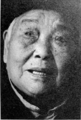
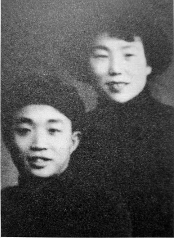

# 军中情：最艰难的时候，爱情也没有消失

_2015年4月15日，长沙望城区安华山庄。阳光打在窗台，王琦霞松弛的脸上，显出淡淡的妆容。她给我唱了一首《我的家在东北松花江上》。_

_“一定有不少人爱慕过您吧？”我问。她笑着摇头：“北方人耿直忠心。”旁边，闭目养神的张谷初，嘴角不经意露出一丝笑意。_

_1948年，国民党和共产党在各地交战，揣着一叠张谷初写给她的信，王琦霞独自一人搭上火车，一天一夜，从河南到了湖南。没有婚礼，两人就这样生活在一起。1949年后，王琦霞成为浏阳市相树乡的一名老师，张谷初则在常德市的行攻公署任职。但好景不长，自“反右”运动起，他们开始遭受打压，一直到“文革”结束，两人备尝艰难，但爱情从未消失。_

_木心说，以前的日色变得慢，一生只多爱一个人。事实是，战争年代，一切变化太快，能够始终如一的，只有坚定的情感。相识相伴70年，两人都早已不记得来往情书的内容，但爱情沉淀在彼此心里。2015年4月29日，养老院的大厅有演出，王琦霞对着里屋的张谷初叫道，“张大嗲，去看戏不？”_

**口述人 /** 王琦霞，1925年农历八月初五出生，河南信阳人。1944年参加青年军，进入205师614团政工队，抗战胜利后复员回老家，1948年到湖南和张谷初组建家庭，后育有三个子女，目前住在长沙。

**采集人 /** 明鹊 **采集时间 /** 2013年12月17日、2015年4月29日

### “宋美龄骂她们：国军在抗日，难童在逃亡，你们竟然还穿高跟鞋”

我是河南信阳人，家住一小火车站旁边。那时候日本人一来，沿铁路一路烧杀，所以，大人把十五岁以下的儿童一批一批地送到四川保育院[^1]。

我那时十二三岁的样子，和我妹妹一起，跟着一群人去了四川。我们首先寄住在武昌法租界，后来又换到一个英国地方（英租界）。我妹妹很小，她坐在火车头上，火车灌水的时候，她跳下去玩，火车一开动，她的两条腿被轧断，还冇到四川，在路上她就死了。

我们到宜昌坐船，船来接还没接上的时候，飞机在天上炸，我们在地下跑，一批一批死了好多。当时有十二艘船的三百多学生，全部翻船被淹死了。

过了三峡，到一个叫大渡河的地方，那地方容易翻船，宋美龄特意到那里看我们。她站在河边，腰上系一根皮带，穿白衬衣，黑裙子，脚下是一双白色的跑鞋。看到那些穿高跟鞋的，宋美龄还骂了她们：“国军正在抗日，难童正在逃亡，你们竟然还穿高跟鞋。”

我们后来到了四川歌乐山保育院[^2]。有一次围着吃饭的时候，宋美龄来了，她问了我们的情况，我没跟她说话，我站在她背后。宋美龄非常漂亮。

我在保育院从没吃过一餐饱饭，经常只有几颗蚕豆，常年打赤脚，冬天一双草鞋，怕头上长虱子，就把头发剃光。也教认字，但是没有本子没有书。保育院的院歌有几句是，“我们离开了爸爸，我们离开了妈妈，我们失去了土地，我们失去了老家……”大家每次唱到这里都唱不下去了。

### “我在重庆培训了三个月，团长是蒋介石，主任是蒋经国”

到1944年，一寸山河一寸血，十万青年十万军，蒋介石号召知识青年当兵。我报名参加了青年远征军，但我没文化，我就给他们唱，“日本鬼子的大炮轰炸了我们的家，抢走了爸爸，又拉走了亲爱的妈妈，叫爸爸也不答应，叫妈妈也不答应，单单留下我难童一人到处飘零”，唱到这里我就哭脸了，然后我一边唱一边哭，他们就录取了我。当时我十八岁左右。

我在重庆培训了三个月，学开枪打靶，学唱歌，团长是蒋介石，主任是蒋经国，还发了证明书和青年远征军的通讯录，上面有远征军、有学生老师名字，后来1957年打右派就是根据这个。日本投降后，怕被搜到，我把它们放在屋梁上面，他好像没有。

那时候参加青年军，看戏看电影不要钱，发帽子和衣服，伙食也好。后来我们去了贵州修文，我进了205师614团[^3]政工队，相当于现在的文工团，在那里认识了他（张谷初）。

我们整个205师都没打过仗。如果要去我们也会去，我们可以上前线做护士。河南好多同学参加了青年军，有一个还给我写信，说她去前线打仗了，好像是到印度，我不记得她名字了。

**1950年代的张谷初和王琦霞。**

当时在修文，我住这边，他住对面，就这样认识了。205师当时在修文办了一个民众小学，他就在那里教书。我们政工队也在那里练唱歌。我们相对而住，我经常练习唱歌，他经常朗读英语，他有时过来听我唱歇，我有时也过去看他的文章。

我不跟男的一起玩，他那时年纪小，只有16岁，我比他大，有18岁。我们政工队一共有六个女的，有一个贵州30岁的大姐，现在已经不在了，那时经常喊他“小鬼，小鬼”，所以我们都跟着喊他“小鬼，小鬼”。他不喜欢跟大哥哥玩，经常跟在我们屁股后面跑。

他会写，写得好，还教我读书认字，很上进，又不吸烟、喝酒，一个年轻伢子。日本投降后，我自己脱离部队回了家，那时候205师是流动的，参军也是来去自由。我回去后，他就每天一封信、每天一封信地写给我，告诉我部队发生的事，还写了一些其他的，想我之类的话。他的信写得好，我给他写信少得很，我那时不认得好多字。

在河南的时候，青年军要给我介绍对象，我一直都不同意，在河南待了一年多后，决定回湖南找他。1948年，我坐火车到湖南花了一天一夜，当时他已经退伍，在湖南大学读书，我到学校找他，然后他带我回了浏阳，我们就这样在一起了。当时有没有办酒我记不太清了。那时候，他一放假回来，就教我读书认字。解放后，我参加教师培训，后来就在浏阳柏树乡教一年级的小孩认字。

[^1]: 1938年3月，中国战时儿童保育会成立，由宋美龄担任会长。当年5月1日，汉口第一（临时）保育院建院，随后各地保育院陆续出现，最多时有五十多个，一直到1946年9月，全国保育院被撤销，历时八年多。

[^2]: 歌乐山保育院其实属于重庆。历史上四川和重庆分分合合，至20世纪40年代，重庆（市中心）就不属于四川管辖。但把重庆说成四川，依旧是当时百姓的习惯。歌乐山保育院于1951年10月撤销，其历时十三年又五个月，是存在时间最久的战时儿童保育院。

[^3]: 第205师由1945年2月在贵州驻扎的新编第23师为基干改编。1946年9月整编为第205师第1旅，师长刘安祺、胡素（1946年2月），下辖第613、614、615三个团。