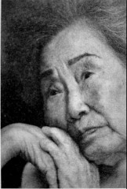
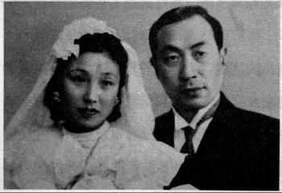
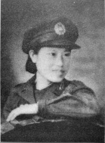

# 去台湾：一个永安女人的一生

_一头银发的柳庆禧身穿白色的休闲衬衣，深深陷入硕大的沙发之中。这位漂亮的老太太，年轻的时候在彭位仁将军家里用餐，被彭将军称“庆禧啊，什么都不用做，看着她吃饭，就是一种享受！”，但是此刻，她说：“我是个小人物，而且我老了，也没有用了”。_

_对于老人来说，回忆往事，总是悲喜交加。对于他们这一代人，悲伤远多于欢乐，谁愿意老叨念那些悲伤的故事？除非他的内心一直对此无法释怀。相较于大陆很多老兵，台湾的柳庆禧显然更幸福，甚至相比台湾其他老兵，她也应该算是快乐的，因为她和丈夫周以成一直在一起。_

_给台湾老兵画像的陈琪说：“很多台湾老兵，九十年代回大陆找老婆，因为他们在台湾找不到老婆。”我有时候想，1949年的时候，柳庆禧如果没有找到周以成，今天的她将会是一种怎样的状况？命运没有假设，这就是人生的奇妙之处。_

_所以，柳庆禧说：“我很感谢我先生，他把我带出了永安”。_

**口述人 /** 柳庆禧，1924年农历十二月二十七日出生，浏阳市永安人，1941年进入73军后方医院，从护士做到军医，1949年随丈夫周以成去台湾。周以成1995年去世后葬回浏阳东沙湾。柳庆禧现居高雄市左营区106巷，她有四个女儿、一个儿子，其中大女儿在浏阳，二女儿在马来西亚，三女儿和小女儿在美国，儿子在台湾。

**采集人 /** 明鹊 **采集时间 /** 2015年7月28日

### “他说，我追不到你妈妈，这辈子都不结婚”

他开始住上营盘街[^1]。我后来问他：“那里不远有一个戏院，对不对？”他说：“对的。”他叫周以成，江苏扬州人。有一天，周以成看戏回来，碰到也是从扬州逃难过来的他的家庭医生，好像叫做杨天佩。他问周以成：“你这个小孩在这里做什么？”周以成回答：“我跟姐姐逃出来的，我没赶上火车。”[^2]于是杨天佩告诉他说：“73军的孔繁瑾是我同学，他在部队里当处长，你到里面去找他吧。”那时周以成大概十八九岁。

我第一次见他，是在我们永安市（浏阳的一个镇，旧称永安市），他那时已经是军医了，住在离永安五里远的彭家冲[^3]。他比我大四岁，他追我的时候，我只有17岁，什么都不懂。当时我父亲也不肯，他就请来军医处处长和军事处处长，向他们发誓保证以后会对我好。周以成后来跟我们的大女儿讲：“我当时就想，我追不到你妈妈，这辈子都不结婚！”

1940年，我们结婚了。头一天部队出发，他当天才告诉我，我一直很怪他这点。那时我们结婚才几天，我一边走一边哭，到了长沙他就说：“我对你不起，因为你爸爸那么严厉，我不敢回去，到了目的地我们再写信回去！”我父亲一直不满意这个女婿，甚至我们结婚也没有去参加，这也是让我最痛苦的事。

大女儿是在路上怀的，是“跨门喜”。他把我寄在补充团，每个礼拜来看我一次。我们每天要走60里路，我那时没吃过这样的苦。补充团的团长姓贺，他看到我就说：“新娘子，你怎么老是愁眉不展？应该要高兴啊！”我也不讲话，只晓得低着头，好像我先生故意害我似的。

1941年，我回到永安，大女儿三月份在娘家出生，他当时和部队在江西，我带了女儿一百天后，就离开了永安去找他。再次回来看女儿时，已经是抗战结束了。

我到73军不久，就进了后方医院。军长彭位仁是湘乡人，他喜欢培养年轻人，进部队的时候，我跟我先生打赌，我说，“周以成，等你回来后，再看看我柳庆禧是什么样子！”

**彭位仁将军与夫人结婚照。**

他那时经常调到其他地方，我们分分合合，很多次都是我去找他的。我在长沙伍家坡[^4]受训，每天早晨到塘里面洗脸，冬天也是这样的。在后方医院，我开始学做护士，后来又学做药师，最后又当了军医。我东西都整整齐齐，配药也非常利索，每个箱子放什么药，我都搞得清清楚楚。军医处军医院来拿药，我一下子就拿给了他们，我们院长谢树庭非常信任我。

当时伍家坡有几十个学生，每月有月考，中间还有小考，挑到后来只剩三十几个。我们学习了六个月，然后到了后方又断断续续地培训。我先生也是一样，他到台湾后还补了课，原来没有学完嘛。

### “我虽然是军医，可开枪的步骤我都掌握了”

那年秋天，73军奉命以77师为主力编成一个加强师，从湖北郝家枝江角横渡长江。那次过长江的时候，我和另一个医生奉命到前线救治伤员，子弹就在我们耳边“嗖嗖”飞。我们冲上阵地，夹住一位伤员的左右臂，然后将他拖了回来。那是我第一次抢救伤员。

我们医院都是随着部队走，每次一打仗，伤员首先会送到我们这里，伤重的再转往后方医院。看着那些战士一批批地死，现在想起来，我都非常难过，感觉心里在流泪。记得在江苏宜兴的时候，新四军跟我们73军并肩作战，和我们一起打日本鬼子。当时，后方医院也是死了一批批的人。

73军暂编第五师师长彭士量，他也是浏阳人，常德会战时牺牲了。当时他奉命掩护73军撤退，完成任务撤出石门时，部队遭到了日军的围击，彭将军在南岩门口被机枪射中。彭士量很帅的，可惜了啊，当时只有三十几岁，台北忠烈祠有他的灵位。[^5]

在江西铜鼓，部队还设置了靶场，不定期进行射击训练。我虽然是军医，可开枪的步骤我都掌握了。1944年，长衡会战时，73军从慈利向长沙挺进，当时我们后勤人员留守在桃源。六月的一天，突然接到前方来电需军款。当时我一个战友叫曾异三，他也是我和周以成的好朋友，他奉命带了军需和输送兵，加起来一共二十几个人，他们将现金包在军毯里，再打成背包背在身上，走了三百多里路，到达军部所在宁乡县横铺子。曾异三后来说：“要不是平时训练用枪，我们一定都到不了那里。”

### “他说，以后要给我做春夏秋冬的衣服”

那一年的秋天，我去了江苏扬州，第一次见了他爸爸，也就是我的公公。当时我一个人，他爸爸到南京来接我，回去的路上有一条河，需要坐那种“砰砰砰”响的轮船，我记得当时在轮船上，我们遇到了他舅妈。舅妈问我是谁，他爸爸说，“这是小成子的太太。”舅妈还回说了一句，“哦，那很不错！”当时我怀了小孩，一到我公公家，孩子马上就流掉了。

我公公非常喜欢我，他说，“我们家啊，还只有我们小成子，只有他还比我争气。”意思是讨了我这个好太太。他们家开了一家粮食行，叫做“恒源祥粮食行”，我回去后，公公要我管家里的粮食行。他说，“你很聪明，你帮我管粮食行。”我说，“不行啊，我又没有学过做生意。”“你只要会把算盘，把出进的账写一下就可以。”但是我又说，“没有做过生意，我害怕呢！”他耐心地说，“不要害怕，我慢慢教你。”我那时心里想：我不愿意在家里，我一回去孩子就掉了，所以根本就不想待在家里。坐完月子，我就回南京去了，那时我已经有职务了嘛！

周家还有一个米厂，叫做“万大米厂”，是与别人合伙开的。公公怕人不在吃亏，要周以成去打理，所以他抗战胜利以后还回过一次家。周以成以前经常跟同事讲，“我们家里不说多有钱，但还是很不错咯，我会让我的太太去吃苦吗？我不会要她吃苦的。我们现在都穿军服，以后要给她做春夏秋冬的衣服。”大陆有春夏秋冬嘛，台湾是没有的，台湾都是夏天。那时候，周以成也不愿意在家，他说：“抗战虽然胜利了，但在部队里面还有事情！”

**着戎装的柳庆禧。**

### “我拿了四万块钱奖金，那时候算非常多的了”

抗战胜利时，周以成在云南昆明，是第五军的远征军，负责第五军的药品。当时药房一女的追他，还说要招女婿呢！他们营长周中粱把他关在牛栏里，然后对他讲，“周以成，我听说你有太太了，你太太还写了信给我呢！”我当时写了信过去，还跟我们处长孔繁瑾讲，想调到他们第五军去。他就说，“你这个孩子真是天真，我就是派个人送你去，我也不放心呢！”1946年，周以成回南京归队73军。

从他家出来后，我又去了湘潭，当时我还拿了四万块钱奖金，那时候算是非常多的了。我在那里学了骑马呢，那些马是日本人留下的，每个医院当官的都有一匹。那时刚好有一匹矮一点的马，我们院长对我讲，“柳庆禧，你赶快学骑马，这匹马配给你，比较矮一点。”只学了几天，我就会骑马了。

那时候，我们同学关系都非常好，到后来也是。我先生死的时候，徐怀印夫妻俩哭得不得了，一直喊：“周大哥周大哥……”他们刚到台湾时，就住在我六个榻榻米的房子里，当时很多同事住建业新村啊，自治新村啊，毕静琳他们去得晚，没有房子配给他们。

还有一个同学叫屈锦霞，她儿子刘光三现在在上海开妇产医院。那一年，国民党军在济南惨败的时候，我去南京参加屈锦霞的婚礼，就这样躲开了。当时我借了两个月的饷，还临时做了一件旗袍，留了一个纸条子给我先生，说我去南京参加婚礼了。负责借钱的军需叫宋望之，他的太太叫做廖孙，后来改名廖逸之，她也是我们长沙人。去台湾后，我们常常来往。

### “如果那一次找不到他，不知道后来会是什么样子”

后来局势越来越紧张，我们药房有一个叫石刚林的，他对我先生说，“周以成，你不要走，我到济南医院帮你找个职务，我是潜伏在73军里面的。”他说他是共产党。周以成就讲，“我还有柳庆禧在湖南呢。”那时候我已怀孕了。“没有关系，马上打到湖南。”石刚林讲。但周以成还是走了。

抗战胜利后，国防后方医院一个搬到零陵，一个搬到冷水滩，我调去了零陵，那时叫92后方医院。到了那里才十天，女儿就出生了。1949年，我带着八个多月的女儿离开92后方医院，去厦门找我先生。火车上人非常多，我还遇到了去衡山拜佛的很多人。

到了厦门，我遇到部队就问，厦门话我听不懂，终于找到一个工兵团，团长是湖南湘乡人。他们军需给我开了一张证明，这样检查就不阻拦我了。原来一直以为周以成在福建，到了才晓得他已经到了福建平潭岛，在那里当野战医院的院长。现在想来，好危险的呢，如果那一次我找不到他，就这样分离了，不知道后来会是什么样子。

平潭岛的人吃鱼，吃地瓜，日子很苦的，我看了却很想吃。我跟我先生说：“你去跟老百姓换点鱼和地瓜，我也尝一尝，好久没有吃过了。”我在那里只待了六天，五月的一个晚上登船，第二天早上就到了基隆。我们几个太太一起住进了眷村，一个星期后，周以成也过来了。他进了海军医院，我们很多朋友后来都进了海军部队。

抗战胜利时，我曾经在新化看到了日本军队，还是整整齐齐的。（上世纪）八九十年代，我去过一次日本，街道干干净净，人也很有礼貌。

[^1]: 周以成姐姐叫周方，读高中的时候加入共产党，和父母关系不是很好，于是带着弟弟周以成，从江苏跑到了湖南长沙，住在上营盘街的夫家。柳庆禧说：我先生蛮会唱戏的，部队里的周纪赏会拉胡琴，他就附和着唱戏，我以前都记得，现在都忘记了，但我儿子还记得，他经常会说，“爸爸和周叔叔就是会唱这个戏呢！”

[^2]: 周以成的姐姐坐火车去了延安，他就跟着姐夫家的妯娌一起过。

[^3]: 1939年3月，73军参加南昌会战后，调至湖南平江、浏阳一带整补。当时浏阳永安还没有日军侵入，于是周以成所在的团部一千多人就驻扎在永安彭家冲。

[^4]: 现在叫野猫坡（位于今长沙市岳麓区），自抗战起到1944年，伍家坡的洪家大屋，一直都是73军的后方医院。

[^5]: 彭士量烈士遗体于1944年公葬于南岳，南岳忠烈祠有烈士的纪念碑、遗书。“文革”中，彭士量墓遭损毁，后修复。1992年10月，墓地由忠烈祠驾鹤峰寿苑迁移至忠烈祠东岗。台北忠烈祠也有烈士的灵位。