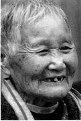
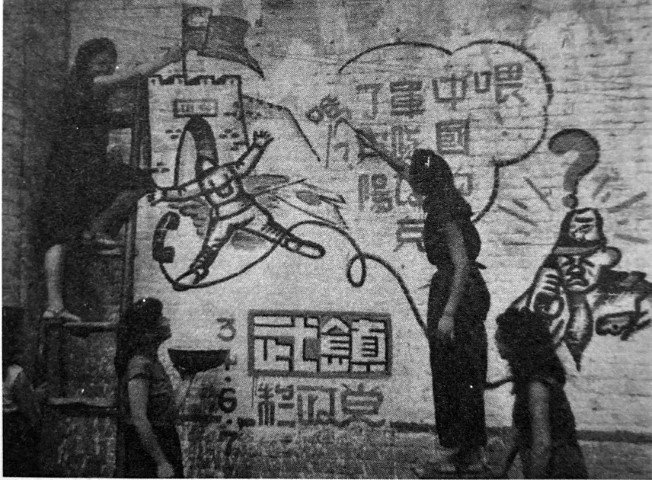
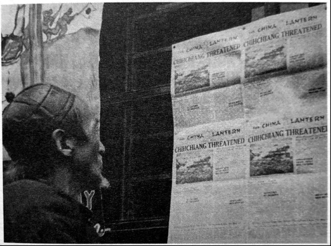

# 嫁给他：做了两年半的夫妻

_“他很爱我，随便什么都依我，我说得不好，他也依着我。”年轻时候的邓得凤，一定是个任性的女孩。14岁离开泸溪老家，此后的家乡记忆是大花园，父亲的辫子和爷爷的“顶子帽”。“留在家里学裁缝还好一些。”她说。_

_兵荒马乱，她却只是一个渴望爱的小女人。在贴标语，喊口号之际，邓得凤认识了大她15岁的朱炳乾，随后两人谈起了恋爱。_

_2015年7同17日，在岳阳楼区蔡家村的儿子家，邓得凤说以前的事自己记得不多，但记得和朱炳乾有关的所有细节，说到动情之处，88岁的老人开心得像个小孩。_

_有时候，记忆会自动筛选，只留下美好的东西。来不及深刻认识和了解，邓得凤对于这场战争的记忆，便慢慢被时间洪水所淹没。可是，谁又能苛求于她？她只是一个小女人。_

_左手中指上有一只金戒指，用青布包着边，“孙女买给我的”。朱炳乾被抓后，那对金手镯随之消失。处说：“谁痛惜我？谁爱护我？没有半个人痛惜我！”。1951年，邓得凤第二次结婚，庆幸的是，第二任丈大对她很好。_

**口述人 /** 邓得凤，1927年农历正月初四出生于泸溪县。14岁被姐姐带去重庆，在秀山难民学校学习，一年后进入黔江县政工队[^1]，主要负责贴标语、搞宣传、喊口号。1946年，调入灵县“第一旅”，与部队的朱炳乾认识并相爱。前后两次，邓得凤在第一旅待了几个月，但她不记得自己部队的番号。1947年，两人在晃县结婚。1948年，回岳阳老家，1950年，朱炳乾自杀，1951年，邓得凤再婚。

**采集人 /** 明鹊 **采集时间 /** 2015年7月17日

### “政工队三分军事，七分政治，每天要走60多里路”

我父亲留着好长的辫子，还照了相。我出生的时候，他有48岁，等到我14岁，父亲就过世了，他死的时候，飞机把我家后面的屋炸了。我家前面通正街，后面通河街，中间一个大花园。我爷爷是戴顶子帽（清朝官员戴的帽子）的，我不晓得他是几品，他死的时候，把顶子帽也戴走了，我那时只有4岁。

父亲叫邓守平，是田赋管理局局长，在省里管钱管粮，平时和我二娘住长沙。我就在泸溪家里，由奶娘带着[^2]。我还有个叔叔，那时在长沙读大学，他后来也被逮捕了。我去过一次长沙，8岁的时候，奶娘带我去的，是坐轿子去的，不记得好多，只晓得中间换了几趟。

我小学毕业，父亲就病死了，我姐姐知道后就从四川回来了。我姐姐大我10岁，我很小的时候，她就去了长沙，在一个绣花厂绣龙绣凤，在那里认识了我姐夫，后来他们去了四川。父亲过世时，她回家把我接了出去，我当时在学裁缝。一直到1975年，我才回的泸溪。

1941年，我离开泸溪，当时我弟弟不愿意我去，他站在门口望着我，问：“么子时候回来？”我说：“姐姐送我回来我就回来。”我有一个姐姐和一个同父异母的弟弟。

我姐夫是黄埔四期的，他叫萧书一，比我姐姐大15岁，比我大25岁，他是重庆宪兵营的中队长，相当于究兵旅营长，他的警卫喊他“中队长”。我们到四川后，他把我送去秀山的难民学校。学校有四五十个人，连煮饭的一起有六十个人左右，都是家里条件比较好的，那个学校一般人还进不了。

在家里读书时，日本人来轰炸，就没读出什么名堂，在难民学校时，没书就读报纸，还学了几个宇。有一个老师叫张志中，他在地上写了好多字，还教我们读报纸，学习七七八八的事情，他也是我们后来政工队的教导员。

难民学校吃饭呢，早上吃稀饭，中午黄豆打成粉，放点油和青菜一起煮，这样一个人一碗。平时三个星期打一次牙祭，就有点肉、鸡、鱼。过年，初一的早晨，每人这么大一个饼子，比手还大一点，还有一个蛋。年三十晚上，每个人也吃一个饼子。

读了不到一年，我就到了黔江县的政工队，主要负责贴标语，做宣传，在外面喊口号，“打倒日本帝国主义，保护中华民族！”我们政工队三分军事，七分政治，每天要走60多里路，边走边贴标语。穿草鞋，用布绑了腿，走了黔江、秀山、恩施、巴中等好多县。白天出去贴，夜里坐卡车回来，我专门贴标语、喊口号，演话剧都演得少，只少了人我才去演，因为没读什么书。有一次演话剧，我扮了一个老太婆，一个男同学扮日本兵，他就欺负我，好多老百姓来看，有一坪的人来看。后来日本投降了，标语归《大公报》去贴，我们就不管了，那时乡政府和县里要我们搞宣传，我们就去。

**抗战后期，“武镇” 政工队的抗日宣传。**

我在政工队的时候，一个月只有五块钱。后来，我姐夫就把我送进了政工团，一个月15块，是银元。15块钱一个月用不完，两块钱到馆子里吃，有时候还吃不完。我姐姐、姐夫对我非常好，我到了政工团以后，他们说：“你自立了。”我就哭了。姐姐说：“说你自立，你还哭！”我其实是想父亲，想二娘，还有弟弟。

### “在重庆的大街上，我看到了蒋介石”

从政工队入政工团时，我们去部队里学习，当时我和蒋介石还照过相呢。那时候在重庆，有人说，“把政工团的小朋友们搞过来照一个相。”我们政工团的六女、六男就坐在地上和蒋介石一起拍照。白崇禧也在。蒋介石穿军装，长得帅，讲普通话。我戴个宪兵帽子，歪着左边戴，上面有一朵蓝花，帽子是绿色的，衣服也是绿色的，穿个薄袜子，外面套个麻草鞋。

当时蒋介石讲，“抗战第一首要，打仗不要怕死，该死的就死，不该死不会死，不要学汪精卫。”

我后来还看到过蒋介石，在重庆的大街上，宪兵旅一旅人跟着他，我姐夫也跟在后面，参谋长高克平也跟着，他是我姐夫黄埔四期的同学。

当时的重庆街道不宽，屋很多，蒋介石住的地方好宽。有一次，我姐姐、姐夫带我去杨森的家里玩。杨森是20军的军长，他是极有名的，长得好，有12个老婆，个个都漂亮，他的第三个老婆跟我姐姐玩得好。那时我见到的杨森有五十多岁了，听说好厉害，1937年出川，淞沪会战后，一直往南方退守，打了武汉保卫战、长沙保卫战、常德保卫战。在常德，日本人死了三万多，两边的山上有好多尸体，杨森当时也在那里打。

政工团多半时间在黔江县，受训就去海棠溪。有一次，六个姑娘在那里游泳，有白崇禧的姑娘，孔祥熙的姑娘，还有一个麻子姑娘，我们也不知道是谁，就在边上招呼。那个布篷很高，我们就站在外面，不挨着她们的身，不跟她们讲话，她们也不跟我们讲话。我们像警卫一样，帮她们招呼一下，怕衣服丢啊，怕有人进去啊。当时，别人在那里说，我就在那里听。回去就讲给领导听，一就是一，二就是二，不能加也不能减。

在黔江待了四五年后，1946年，我被调去晃县第一旅，是我姐夫介绍去的。我在那边政工处搞宣传，不记得是哪个师了，只记得旅长姓王，他爱人姓李，他们都是湖南人。在那里认识了朱炳乾，他是黄埔五期的，当时在医药室搞管理。其实也算我姐夫介绍的。

开始调过去时也不讲这个事，他们怕我不肯去，也不晓得我恋爱没，我姐夫试验我呢！看我在里面规矩不规矩。后来，在旅部见了个面，就是认了个同事。王旅长堂客就做媒，问我：“小邓啊，你同意不？”我没作声。她继续讲：“你不作声就写一下。”写也不写。

过了一天，王夫人又跑到我宿舍，我睡在里面，她把我喊起来讲：“来来来，我跟你讲清楚。”我也没作声。问了两夜，我才说了一个“好”。她说，“好，是你好，还是我好啊？”我讲，“你好。”我那时只有二十岁，不好意思呢。我个性强，怕随随便便，别人看我不来。也不敢跟我姐姐讲，怕她说我。平时她给我钱，我就接着，问她要我不要。

我一答应了，他就拿了一对金手镯给我，我没接。他总是要我收点么子东西，我就跟王夫人讲：“拿东西是小事，假如心不好呢，我拿东西有什么用？”

### “我不愿意穿旗袍，穿旗袍走得慢，也不喜欢擦口红”

结婚之前，我跟他讲，“你不能瞒年纪，你要是有40岁，我就不同意和你结婚。”他就跪在地下发誓，“我只有35岁。”我那时只有20岁，他比我大15岁。那时没有年纪轻的，有些还瞒年纪，他没有。

几个月后，我又回了黔江县，我姐姐、姐夫同意后，1947年九十月份，我们到晃县（现新晃县）结了婚。他人长得漂亮，高大，结婚前，我要他去医院检查，他不肯去，最后没有去检查，但我还是相信他。

我结婚没穿旗袍，穿着黄制服，带个歪帽子，只收了他的一对金手镯。酒席是在部队办的，杀了一头猪，每个士兵都吃了肉。结婚证明是旅部打的，后来那个证明不见了，好多证件全部烧了，金圆券都烧了好多。

结婚后，我要他站东，他不能站西。王旅长就笑着跟我姐夫讲：“你妹妹好厉害，你晓得不？”王夫人后来转述给我听，我就讲：“怎么厉害了？ 我又没打日本人。”

结婚以后我就到了第一旅人事处。衡阳的彭年打电话来说：“不要在部队了，到县里来当科长。”彭年和他是亲戚，当时在衡阳当县长，叫他去当财务科科长，不过后来彭年也被抓了。

我们当时没去，我们又回了黔江县，我回到了政工团。1948年，我姐姐和姐夫去了南京，去之前对我讲：“我不能带你去，还有一个伢子，也不晓得什么情况，我先去把房子搞好，你后面再过来。”那是我最后一次见她。不晓得她死在南京，还是死在上海，要是不死的话，台湾早开通了，她不回来找啊？现在还音信全无。我估计，上海打仗的时候，他们就被打死了。

没过好久，我们买了去武汉的票，打算从武汉飞南京，再去台湾。票是提前五天买的，淮备过恩施、荆州到武汉机场，但是第二天就听说，汀泗桥被炸了，这样就去不成了。去不成武汉，就决定回岳阳。我们到荆州玩了半个月，和另外的几对夫妇一起，她们都穿了旗袍，我穿的是讨衫。他就笑我，说“没买衣给你穿呢”。我不愿意穿旗袍，穿旗袍走得慢，也不喜欢擦口红。

1948年6月，我们回到岳阳。我后来联系到政工团的指导员戴国成，他告诉我说：“从上海、南京也出不去，要从广东才能去台湾。”

### “一付了砖瓦钱，他就被逮捕了”

回岳阳后，他就靠着胡春台。我们在老火车站附近，现在的老二医院对面，一个大旅馆里租住了半年。朱炳乾娘爷都死了，乡里的房子被日本人搞坏了，所以准备在这里做个房子。

当时看地方，做屋、买田地，都是胡春台介绍的。买了一个半立方木头，烧窑烧砖，还买了三担五斗[^3]的庄田，一共用了六百银元。砖瓦钱全部付了，你要不相信，我带你去问。一付了砖瓦钱，他就被逮捕了。

1950年上半年，胡春台被抓了，他打死了三个解放军。在一个叫康王的地方，当时两边各一个士兵，在他身上一边串一根铁丝，在梅溪桥那里枪毙了。

朱炳乾被逮捕以后，屋里所有东西都没收了，包括我那对金手镯。

速捕前，他跟我讲：“我死了你要去看不？”我说：“我怎么不去看，我要去看呢。”他就讲：“不能去看。你也万万不能回泸溪，钱都找不到，一千多里路，你也走不回去，只有在岳阳，嫁个老实农民，好好过日子。”

他被速捕后，我们就离婚了。过了八天，他就自杀了。四月份死的，我躲在山上哭，当着群众不能哭，我又不是岳阳人，哪个看得起我。一只狗子过身，人家还喜欢，我一个人过身，人家还骂。他对我是真心，只怪我命不好，结婚才两年多他就死了。

我被扫地出门后，附近一家姓赵的收留了我。她对我讲：“小邓啊，你不要哭，我给你做个媒，你做我的女儿。”我在他们家住了大半年。

1950年腊月三十八，易志书父母接我到易家，正月初八就请客，然后打了结婚证。易志书一根扁担倒下来，一个“一”字都不认得。当时，赵家的人帮我做媒，他父母看中了我，说我老实本份，又不乱讲话。我那时不讲岳阳话，讲四川话和普通话，现在讲岳阳话。

我嫁到这里，嫁鸡随鸡，嫁狗随狗，我要是抽了脚（方言，指离去），那个人就不算人，所以我不能回去。我这个人讲志气，就是没得饭吃也不会到外面讲，就是易老嗲（第二任丈夫）对我不好，我也不到外面讲。1999年，易老嗲过世，死的时候73岁。

**中国昆明，市民正在看官方报纸《中国灯笼》，旁边的海报说的是德国已向盟军投降。**

[^1]: 按所在的区域，邓得凤所在的政工队极有可能是第六战区司令部黔江县政工队。邓所在的政工队，大队长邱健，副大队长潘世曾，中队长何真（音），教导员张志中，指导员宋世册，排长张彬，邓得凤担任班长。

[^2]: 邓得凤三岁时母亲过世，由奶娘带大。奶娘是邓的二娘请的，姓孙，邓得凤称她为孙婆。

[^3]: 当时在农村，习惯用“担”来衡量土地面积，一些地方至今还保留了这种习惯。一担就是十斗，三担五斗就是三十五斗，当时朱炳乾花了三百七十块银元购置这些田产。