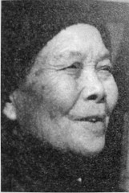
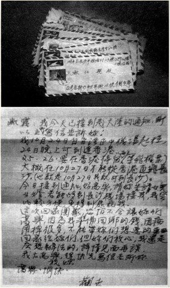

# 忘记他：如果当时和他去了呢

_1930年代，浏阳永安，一名中共地下党员因吸食鸦片误事，清晨被秘密处决[^1]，其女儿后来参加了青年远征军。_

_没人知道她参军的真正理由，1944年，这个叫文淑仙的女孩，如愿成为了一名青年军护士．在贵阳陆军野战医院，文淑仙看到“那些要死的伤兵，在病床上拱来拱去。”她不忍见到那种场景，申请调到中央军医联络站。_

_那时，她刚满二十，皮肤白皙，娇小玲珑，爱上了一个叫李观尧的同学。一年多的柏拉图恋爱后，两人于1948年在岳阳结婚，随后生下一个女儿。_

_1949年初，国民党军溃败前夕，李观尧去了南京，他本决定五月返回，带妻女逃亡台湾，却不曾料到，这一别竟是40年。_

_1989年两岸三通后，李观尧从台湾飞赴长沙．这场40年后的见面着实让人有些尴尬，曾经的丈夫，成了他人的丈夫，曾经的妻子，还算不算是妻子？_

_2015年5月15日，外面下着小雨，长沙市望城区安华山庄（养老院），文淑仙指着墙壁上的相片说：“就是他，2009年过世了。”依偎在一瘦高男人的怀里，照片中的文淑仙有着娇羞的笑容。_

**口述人 /** 文淑仙，1925年农历九月初九生，浏阳永安人，原名文淑霞。1944年参加青年军[^2]，在歌乐山中央卫生实验院学习医护知识，毕业后分配到205师军邮联络站[^3]。抗战胜利后退伍，1949年，带着女儿跑回娘家，后在长沙工作、定居至今。

**采集人 /** 明鹊 **采集时间 /** 2015年5月15日

### “谈了差不多一年多，我们一直没有拉过手”

1945年秋天，我在中央联络站（205师614团），礼拜天的时候，他（李观尧）和同学一起来玩，然后就看中了我。他问我叫什么名宇，是哪个学校的，家乡在哪里，我都告诉了他。回去后，他就给我写了一封信，在信里面说羡慕我，就是喜欢我的意思。第二次过来时，他跟我说话还脸红了。我看他还蛮老实的，就答应了他。谈了差不多一年多，我们一直没有拉过手，旧社会还是很规矩的。

刚准备上前线，就传来抗战胜利的消息。没多久，我请假回浏阳永安看祖父母。回家后，收到他的来信，他在信上说：“你不要回来了，现在大家都退伍了。”他叫我退伍，然后和他结婚。我祖父母就问我：“他家里的情况好不好过？”我冇晓得，也冇问过他，于是，我就写信问他：“你家里有多少田地？每年收多少谷？，他回信说：“每年二十担谷。”其实他撒谎，他家是个大地主，我后面才晓得，但我祖父母也同意了，主要是因为我喜欢他。他长得比较帅，性格也很好，牙齿很白，皮肤比较黑，笑起来好可爱的，而且对我也很好。他喜欢拉胡琴，喜欢唱京戏。我们结婚后，住在岳阳，有一次烤火的时候，他拉胡琴，我心烦，我说：“你不要拉了好不好？”但他还是拉，结果我抢过胡琴，在地上一摔，再用脚一蹬，胡琴当场就被我弄烂了，但他也冇发脾气。

商量好了之后，他从部队直接到了我家，然后把我接到岳阳去了。好像是1948年吧，回去后，我们就结婚了，不久生了一个女孩，当时叫李纯芝，后来改名李佩芝。

纯子还冇满周岁，他又回了部队，然后去了南京。我记得那一年，过了正月他就走了。走之前，他就决定了要去台湾[^4]，还讲五月份来接我和女儿，叫我在家里安心带小孩。我也冇讲要他不要去，我想他在部队里面，跟部队走也是应该的。但是，冇到五月，他就走了，走之前，他还到了株洲，当时来过一封急信，要我带小孩去株洲，然后和他一同去台湾。他父母都已经过世，家里只有一个后家娘。结婚的时候，她对我们都还蛮好，但后家娘毕竟是后家娘，她讲，“现在是国乱时期，这么危险，我哪里有钱啊。”所以最后冇去成。当时我要是和他一起去了呢，不知道会是什么样。

### “我哪里敢去呢，我怕一被抓住，就被枪毙呢。”

去台湾后，就没有通过音信了，也不知道他人是死是活，直到改革开放后。

开始很不习惯，我想他嘛，是自己的丈夫，但是冇过好久，就到了“土改”，我后家娘好拐（坏），本来家里是她当家，她把责任推到我身上。因为他们家，我差一点死掉，但我只恨我后家娘，不恨我老公，我们两个感情好啊。我嫁过去的时候，也不晓得有那么大的家产，他爸爸原来是海关税务局的，家里房产土地都有好多。我就被抓去了，东西都被没收了。幸好我参军的证据和在歌乐山学习的证据，都被我放到搞饭的灶里烧掉了。

新来了一个土改干部，是山冲冲里出来的，冇好多文化。他一接手，就想毙掉我和另外一个人。农协会一位干部看我老实可怜，他就讲：“她是异乡人，是长沙的，不是岳阳人。”

土改前，我当过一年时间的老师。那个干部后来又偷偷地问我：“文老师，你是长沙人，你回长沙还有书教撒？”我冇一个钱，怎么走呢？他讲他会想办法。我们住在铁路边上，当时在开娱乐会，民兵都到站里去了。晚上的时候，干部带了票过来，叫我带小孩赶快走。当时，大家都去看戏去了。我把小孩背在身上，走进草丛里，那个茅草好深，看到有人过来，我立即蹲下去，等人走了后，我又站起来走。我小孩也很听话，我对她讲，“纯子，你莫作声，有猫记（湖南方言。猫）。”她很听话，也冇作声，就这样一直到了铁路站台，那个干部把车票给了我，还对我讲，“你到长沙后要来信啊。”我哪里敢去信呢，我怕一被抓住，要被枪毙的呢。

我原来叫文淑霞，到长沙后，改名叫文淑仙。后来，碰到橡胶厂的张继成书记，他是南下的北方人，有两个小孩，都上幼儿园了。我到他们家做保姆，帮他们带小孩，也帮他们搞饭呷。那时我小孩寄在我姐姐家，六块钱一个月的伙食费，我自己工资才十多块钱。

张书记的老婆怀第三个小孩，我当时觉得做保姆工资低，所以等到小孩出生后，他就把我介绍到五一线袋厂，后来叫经编厂，就在坡子街那里。当时一个叫郭子群的，他叫我帮他写大字报，我冇想太多，然后就帮他写了，贴出去大家一看，说这是读过书的人写的字啊。然后我就被找去谈话，问我读过好多书？我讲没读过好多书。然后他们问我家里的成份，我还是冇承认，他们就去调查，结果知道了我是地主。从那个时候起，被戴上四类分子的帽子，虽然上班下班还是一样的，但有么子事就被盯着。

后来把我调到南门口，一个卖破棉毯子的地方，再后来又到了红旗织布厂，依旧是四类分子，一直到邓主席的改革开放那个时候才帮我纠正。

在红旗织布厂的时候，我打报告给保卫科，我说我不是四类分子，跟地主家里结婚，但也不是地主[^5]。保卫科的人就讲，“你不要着急，以后会给你解决的。”后来到公安局，“文淑仙，不属于地主分子，请留证”，这样，我的成分才被纠正。

### “大概1988年，他看到报纸寻人，终于和我们取得联系”

两岸三通后，他（李观尧）到他家乡找我；我已经回娘家长沙来了。后来，台湾有人回来，我托人在那边登报找他，大概是1988年吧，他看到报纸寻人启示，终于和我们取得了联系。

1989年，他第一次回来，已经不像年轻人了，几十年了呢。他一个人到那边，又冇亲人，就在那边我了个老婆，还生了一个儿子和两个女儿，这些我都不怪他。我就想他很可怜，应该找一个老婆的，哪个晓得他找一个冇文化的，是台湾本地的高山族人。

那个时候，我跟我女儿住浏城桥，我已经退休了，在家里帮女儿带小孩。他不讲多话，胆子很小，说怕有窃听器。看到我们的外孙女，他喜欢得很。外孙女叫李亚琴，跟着她外公姓李。后来，他几乎每年都过来，九月来，十月或十一月走，住一两个月。最后一次，他不愿意回台湾，台湾的大女儿来接他回去，我送他上火车的时候，他指着上面说：“你睡上面。”我说：“我不去，丽珠（台湾的大女儿）睡上面。”然后他对丽珠说：“你大妈人很好啊！”

他如果留在家里，就会被枪毙了，他是大地主，又参加了青年军。他结婚，我也不怨他，他去的时候还年轻撒。我冇结婚，因为我小孩小，怕对小孩不好，不是亲生的儿女怎么对她好，加上那时候打成四类分子，上班去下班回，不与人家打交道，而且好多男的坏得很，有老婆还思想不纯。

他其实想回（大陆），但他说不能回，因为那边有财产和儿女。他叫我去台湾，但我都冇去，他那边有老婆，我去了要怎么过？后来，他病了，因为老说我比他台湾老婆好，他们之间老闹矛盾。一直到2009年他过世，我都冇去过台湾，但我女儿去看过几次，和那边每年都联系，现在关系都还不错。

**两岸三通后，李观尧写给文淑仙的信。**

[^1]: 文淑仙的父亲曾是一名小商贩，当时家里有一个当铺，在永安镇条件算是非常不错的。他接触了一些进步青年，加入了中共地下党。不料因偶然原因，不小心染上了鸦片，最终因误事被秘密处决。

[^2]: 父亲走后，母亲改嫁。因从小失去父母，文淑仙懂事极早。文夕大火后，她考入芷江国立二十中，恰好上完高一，就参加了青年军。

[^3]: 614军邮联络站，主要是负责信件的收发及对外联络。当时联络站只有两个人，一个是叫罗文玉的湖北人，另一个人就是文淑仙。

[^4]: “太平轮”事件时，李观充还在老家岳阳，他跟妻子说起去台湾的事，文淑仙对他的决定并不反对。还是年前，南京的部队写信来催，告诉他形势已不容乐观，希望他尽早赶过去。此时人心惶惶，大家都在考虑去留的问题。在上海，二月过后，抢搭轮船的依旧络绎不绝，似乎几天就忘记“太平轮”事件。在湖南，没有人去关心“太平轮”，不少士兵南下又返回，有的甚至上船又下船。但李观尧很坚定，过完正月，他收拾好行李，出门时再三嘱咐妻子：“在家带好小孩，五月来接你们去台湾。”夜色矇胧，李观尧搭车去了南京，来不及返回岳阳，不久就搭船去了台湾。那时，女儿不满一周岁。

[^5]: 当时的政策是，嫁入地主家里，要在地主家住三年，才算地主成分。嫁给贫农，也要住满三年，才算是贫农。文淑仙嫁到李家只有两年多，所以有此说法。