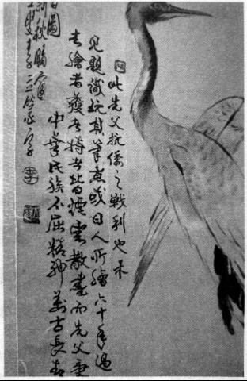

# 爷爷：我六十年前就肯定他

_1946年秋天，陈暄[^1]和刘伯承在郓城对峙。对于陈暄来说，愿望没有实观，生命戛然而止。10月30日，他死在了郓城，没人知道具体的细节。_

_在此三年前，陈暄在自传里写道：余愿派赴东夷三岛，参加安抚流亡，宣示我中华民族之伟大，为我赫赫神州伸张正义，为余唯一之愿也。_

_多年后，妻子刘容说丈夫，“29日那天晚上，他内心很矛盾痛苦，撕下白衬衣的一角，他用钢笔写上“速回长沙”，然后让副官化妆冲出来，最后把那字条交给了我。”_

_从最初相识相恋，到在汉口举行当时军见的集体婚礼，再到七十几人的坑里辨认丈夫的尸体，刘容用漫长的一生镌刻了和丈大陈暄的爱情。“我心里一直是肯定他的。”她说。_

_陈暄的孙子陈树说，“我穿军装的时候，奶奶觉得我很像爷爷。”被时光掩埋的历史，和被历史掩埋的生平，通过奶奶的诉说和查阅战史资料，在陈树的口述中慢慢浮出水面。_

**口述人 /** 陈树，1982年出生，湖南商学院图书馆馆员。爷爷陈暄曾亲历台儿庄战役、徐州会战、武汉会战等。

**采集人 /** 明鹊 **采集时间 /** 2015年6月4日

### “穿白色婚纱和黑色西装，在汉口举行了一场罕见的集体婚礼”

奶奶说我像爷爷，我自己看照片，觉得也是有点像。家里人说，爸爸和伯伯长得像爷爷，但他们偏书生气较多，我呢，神情中有军人的感觉，可能和我爷爷更相符一点。那张照片，是台北忠烈祠赠送的，里面陈列的也是这张照片。

**陈暄**

我奶奶叫刘容，出生于1910年，是名门之后。爷爷在他自传[^2]里写：妻子为刘武慎公[^3]的重孙女。民国初期，女人还是习惯缠足。奶奶生性自由，且喜欢搞些运动，所以每到晚上，她偷偷把绑带松开，这样慢慢到后来，她的脚长到38码。

年轻的时候，我奶奶个子比较高，在1米65到1米68之间，她是周南女校排球队的。她是毕业后在北正街一带认识我爷爷陈暄的，他当时是部队的一名营长。具体怎么谈上的，我不是很清楚。我后来听大伯说的是，他们谈恋爱的时候曾一起看过电影，一起坐过黄包车，这在当时都是比较潮的事情。我奶奶的父亲是湖南大学国文系教授，他不希望女儿和军人交往。为了讨好岳父大人，我爷爷还送过一辆黄包车给我奶奶的父亲，不知道是在他们结婚之前还是结婚之后。

后来，我爷爷部队到了武汉，我奶奶自己跑到汉口，并在那里和我爷爷举行了婚礼。那还是1931年，爷爷奶奶和其他29对新人，身穿白色婚纱和黑色西装，在汉口举行了一场集体婚礼，上了当天的报纸，我爷爷奶奶走在最前面。他们的证婚人是我奶奶的伯父，武汉大学代校长刘永济教授。

结婚后，奶奶跟着爷爷的部队成为了随军家属。大约是1941年，当时我八岁的大姑姑在随军途中得了痢疾，没多久就过世了。我奶奶非常伤心，经常晚上做噩梦。枣宜会战的时候，打仗回来的爷谷，给我奶奶一把日本军刀，他说“这个刀是可以辟邪的”。

刀大概有三尺长，是把狭长的弧形刀，刀面寒光闪闪，刀口斑斑血迹。我奶奶想把血迹擦掉，但我爷爷说：“别擦，日本军刀上的血，是我们同胞的血，留着这个刀口的血，激励我对日本人的仇恨。”所以一直到后来，这个刀口的血都没有擦。我伯父和我爸爸小时候都见过这把刀，上面的血迹已经变成黑黑的一层。“文革”的时候，奶奶因为怕人说这是阶级复仇工具，把它扔到了长沙泰安里的一个水池里，日本军刀就这样消失了。

他们起先打徐州会战，台儿庄战役后，我爷爷负责守在那里断后，那一战打得非常漂亮。徐州会战后，我爷爷的部队在安徽、河南、湖北北部等这些区域活动。作为第五战区部队，参加了第二次长沙会战，往大别山那个方向攻，成功牵制日本军的兵力。

后来，我爷爷又缴获了字画和墨盒，送给了在湖南大学教书的岳父，这些东西后来传给了我奶奶，接着又传到了我父亲的手里。我估计，这些物品缴获的时间相隔不长，大约在1940年到1942年之间。我查阅了战史，根据部队的移动情况，一步步去拼凑，去理顺他的人生轨迹。

### “你不怕她报仇，把我们女儿掐死？”

奶奶住通泰街的四合院，那是民国时期湖南省主席鲁涤平的院子。那时候奶奶喜欢跟我讲爷爷的故事，她记性很好，她告诉我爷爷的部队番号，我去图书馆查，之后发现了爷爷部队的很多战史。2005年，根据我写的一些文章，中央给我爷爷颁发了抗战勋章。

我奶奶随军的途中，曾经受过两次大的惊吓，一次是我大姑姑的过世，一次是她一个人在后方，河南开封叫陈留的村子里，碰到了鬼子进村。

这两件事情，让她备受打击。她父亲写信让她回长沙去，但奶奶舍不得爷爷。说起我爷爷，奶奶就会讲：他很爱干净，喜欢把皮鞋擦得光亮；喜欢冬天光着膀子到河里洗澡；进家门时，喜欢用门背后挂的拂尘把身上的灰尘拍掉；明明有军车可坐，偏偏喜欢骑马；甚至有一个冬天，在黄河边上跟日本人打仗，他还自己牵马到河边去洗澡。

大约在1942年左右，当时在河南，119师打了胜仗，俘虏了不少日本人。有一次，我奶奶在部队看到里面关着一个20来岁的日本女人，长得白净漂亮，问了部队的翻译，才知道她也是随军，丈夫是军官，不知道是死了还是跑了，反正是老公不见了。

我奶奶跟我爷爷求情说，想把这个女人带回家，让她帮忙做些家务。后来这个日本女人就进了我奶奶家门，和他们一同生活了两三年。

她非常勤快，也讲究卫生，一天要给我姑姑洗两三个澡，那时候我姑姑一两岁。有一次，爷爷打仗回来，看到日本女人在哄我姑姑，他就非常担心，“她老公是我们打死的，你不怕她报仇，把我们女儿掐死？”我奶奶倒是很坚定，她说：“不会，她很善良。”

过了一段时间，她能说些中国话了，为了方便沟通，奶奶还给她取了中文名，开始的时候叫李小玲，后来又叫她蒋玉英[^4]。李小玲喜欢叫我姑姑“芬子”，我姑姑叫陈书芬，她这种日本叫法，我奶奶不但没反对，还跟着她一起叫，这种习惯甚至一直持续到了晚年。

抗战胜利后，遣返日本战俘，李小玲哭哭啼啼的很不舍，丈夫估计是阵亡了，她不晓得日本还有没有亲人。李小玲去日本后，她们就没联系了，因为我奶奶随军，居无定所，在当时的情况下，想联系也联系不上。

### “第二天，张团长果真投降了，我爷爷后来也神秘失踪”

1946年10月30日，爷爷在郓城战亡。开始在山东菏泽，部队一直很顺利。我查了相关战史，听说郓城当时是一个空城。爷爷的119整编旅和集团军一个炮兵团，配置少见的美军榴弹炮，到郓城和刘伯承打。很奇怪，刘伯承开始打打退退，到一个叫白衣集的位置，五六倍的兵力突然包围了我爷爷所在部队。10月29日，爷爷部队里一位姓张的团长，晚上找到我爷爷说：“我们被包围两天，我已经打算投诚。”我爷爷听后，当时说了一句：“你滚！”到了第二天，张团长果真投降了，我爷爷后来也神秘失踪，死不见尸。

我奶奶说，29日那天晚上，爷爷内心一定很矛盾痛苦，他撕下白衬衣的衣角，用钢笔写上“速回长沙”。然后让自己的副官化妆冲出去，把字条交给我奶奶。后来，遵从我爷爷的遗愿，我奶奶怀着我爸爸，牵着我姑姑，抱着我伯伯，回到了长沙她的娘家。再后来，她去那里认尸，但都没有找到尸体，七十几个人一个坑，她被吓晕了过去。

我奶奶长得漂亮，有不少人喜欢她，但她对我爷爷感情深，此后几十年，她都没有再婚。我姑姑曾问过我奶奶：“我同学的父亲是个反动军官，他妈妈为儿女的前途改嫁给一个干部，妈妈你为什么不改嫁呢？”我奶奶说：“因为你们的父亲是个好人。”

2005年8月29日，长沙市统战部一位副部长看望在病床上的奶奶，说经过中央严格审查，已确认爷爷为抗战将领，于国家民族有功。我奶奶说：“谢谢你们的肯定，我六十年前就肯定他，我心里一直是肯定他的。”

2012年10月，奶奶刘容过世，享年102岁。

## 延伸：六十年来尘扑面，且将海水洗衰颜

68岁的陈书良说起父亲陈暄，几次热泪盈眶。那个从未谋面的父亲，一直影响着他。

1947年闰二月，陈书良在岳麓书院出生，在书院进门的左边平房里，呱呱坠地的男婴并不知道，父亲在他出生半年前已过世。陈书良儿时不快乐。他说，“五岁的时候，有一天在里屋睡午觉，听见外面一个街坊对我妈妈说，‘你死了丈夫，家里有三个小孩，你把最小的送掉，这样生活会好一点。’当时听了这个话，我心里非常害怕。虽然我妈妈拒绝了她的建议，可当时我心里那种难受、后怕，是很多人都没有体会过的。”

因为从末谋面的父亲是一位“反动军官”，“文革”时，陈书良被叫成狗崽子，高中毕业，档案被打上“不宜录取”的烙印，成为了一名搬运工。1977年恢复高考时，陈书良己经30岁，在亲朋鼓励下，决定参加高考。

他晚上学日语，白天拉车的空余看书。那个时候，他在北区搬运站工作，对于大街小巷，拐弯坡度，他几乎了如指掌，但工作并不仅仅如此。一次紧急任务：要从潘家坪的粮油库，运米到望城县仓库。于是，装上几百斤大米，他来回搬运了一整天。第二天，又是紧急任务：再把望城的米搬回潘家坪。他费力所做的这一切，只因一位首长要去望城参观。陈书良说：“我是个聪明人，但在错误路线下，也干过这样的蠢事。”在那些荒诞的岁月里，他口袋里始终装着一本书。1978年，陈书良以高中学历考上武汉大学研究生。

“我始终觉得父亲在看着我。”陈书良说。2005年，他到日本九州游学，在福冈大学讲授《文心雕龙》。福冈大学提出，根据陈的讲义，在日本出版《文心雕龙释名》。“我要求日方在扉页印上：六十年来尘扑面，且将海水洗衰颜。——谨以此书献给我父亲陈元明将军。没想到他们也都答应了。

2014年，陈书良在台湾忠烈祠看到父亲的灵位位于张灵甫灵位的隔壁。他还看到父亲1943年写的自传材料。“我父亲没给我留下什么东西，除了外祖父交给我的一幅画和一个墨盒外，另外就只有这本自传材料了”。那幅画，原来没有题目，后取名叫《松鹤同春》。那个墨盒，上面“京都”两个字，至今清晰可见。

**陈暄从日本人手里缴获的这幅画，原本没有题宇。后由陈暄之子陈书良在上面题了几句话，其中有：“此先父抗倭之战利也”“先父秉持之中华民族不屈精神万古长青”之句。**

## 延伸：陈暄自传（摘选）

余负责一一九师政治工作，因全部均能本亲爱团结，分工合作之旨，以故工作推展至称顺利。惟部队原为前西北军旧属，下级干部多出生行伍，头脑单纯，士兵则多系新进补充，水准低下，加以部队驻守前线，甚少休息与训练之机，故一般缺乏严格训练，但官兵均能吃苦耐劳，上下脉络一致，则其所长也。依据上述，余对于部队方面，工作要求，则不得不稍行降低，而以实际效果为重，同时亦未拘泥于固定方式，推因时因地以制宜，并顾全战地实际，尽量利用机会教育，更以加紧推行识字教育。对民众方面，则以协助地方政府，推行新县制，整理保甲，训练民众，防止奸伪，激励民气，协助耕作，使农产品增加，促进军民合作为主旨。关于国家现状之观察，日寇虽发动太平洋之暴行，实强化了民主国家阵线合作之力量，同时我中华民族蕴蓄力之伟大，在将近六年抗战艰苦中，毕竟确保最后之胜利，使和平之神，行将照耀着全人类的光明。

[^1]: 陈暄（1901年7月20日~1946年10月30日），字元明，又称陈元明。郴州桂阳人，黄埔五期毕业，后进入国民革命军第68军119师，任少将副师长兼政治部主任，抗战中打过台儿庄战役、武汉会战、长沙会战等。后参加国共内战，于1946年10月30日在山东郓城阵亡。据《陈暄自传》自述，陈暄早年参加过军阀军队，后与林彪一道进入黄埔四期，因生病到广东东山医院治疗，所以延迟至黄埔五期毕业。

[^2]: 据陈书良父子讲述，2014年，他们在台湾找到陈暄参加中央训练团时的自传。

[^3]: 刘武慎公，即刘长佑（1818~1887），宇子默，号荫渠（一作印渠），湖南新宁人，湘军重要统帅、清朝大臣。初在湖南办团练，与江忠源友善。1852年以拔贡随江忠源率乡勇赴广西镇压太平军及天地会起义。次年春因扑灭浏阳征议堂会众起事，擢知县，旋升同知。6月，太平军围困南昌时，奉命独领一军自长沙驰援南昌；旋即偕罗泽南赴援解吉安围，并分兵克泰和，后官擢知府。

[^4]: 第五战区长官李宗仁和陈暄、刘容夫妇关系很好，因此，刘容给日本女人取名叫李小玲。后来考虑再三，还是觉得跟着蒋委员长姓更合适，手是给她取了另一个名字叫蒋玉英。