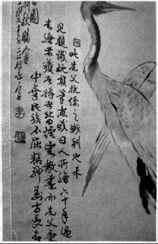

# 六十年来尘扑面，且将海水洗衰颜

68岁的陈书良说起父亲陈暄，几次热泪盈眶。那个从未谋面的父亲，一直影响着他。

1947年闰二月，陈书良在岳麓书院出生，在书院进门的左边平房里，呱呱坠地的男婴并不知道，父亲在他出生半年前已过世。陈书良儿时不快乐。他说，“五岁的时候，有一天在里屋睡午觉，听见外面一个街坊对我妈妈说，‘你死了丈夫，家里有三个小孩，你把最小的送掉，这样生活会好一点。’当时听了这个话，我心里非常害怕。虽然我妈妈拒绝了她的建议，可当时我心里那种难受、后怕，是很多人都没有体会过的。”

因为从末谋面的父亲是一位“反动军官”，“文革”时，陈书良被叫成狗崽子，高中毕业，档案被打上“不宜录取”的烙印，成为了一名搬运工。1977年恢复高考时，陈书良己经30岁，在亲朋鼓励下，决定参加高考。

他晚上学日语，白天拉车的空余看书。那个时候，他在北区搬运站工作，对于大街小巷，拐弯坡度，他几乎了如指掌，但工作并不仅仅如此。一次紧急任务：要从潘家坪的粮油库，运米到望城县仓库。于是，装上几百斤大米，他来回搬运了一整天。第二天，又是紧急任务：再把望城的米搬回潘家坪。他费力所做的这一切，只因一位首长要去望城参观。陈书良说：“我是个聪明人，但在错误路线下，也干过这样的蠢事。”在那些荒诞的岁月里，他口袋里始终装着一本书。1978年，陈书良以高中学历考上武汉大学研究生。

“我始终觉得父亲在看着我。”陈书良说。2005年，他到日本九州游学，在福冈大学讲授《文心雕龙》。福冈大学提出，根据陈的讲义，在日本出版《文心雕龙释名》。“我要求日方在扉页印上：六十年来尘扑面，且将海水洗衰颜。——谨以此书献给我父亲陈元明将军。没想到他们也都答应了。

2014年，陈书良在台湾忠烈祠看到父亲的灵位位于张灵甫灵位的隔壁。他还看到父亲1943年写的自传材料。“我父亲没给我留下什么东西，除了外祖父交给我的一幅画和一个墨盒外，另外就只有这本自传材料了”。那幅画，原来没有题目，后取名叫《松鹤同春》。那个墨盒，上面“京都”两个字，至今清晰可见。

**陈暄从日本人手里缴获的这幅画，原本没有题宇。后由陈暄之子陈书良在上面题了几句话，其中有：“此先父抗倭之战利也”“先父秉持之中华民族不屈精神万古长青”之句。**