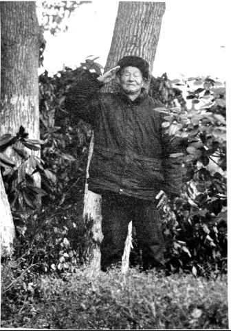

# 袍泽：我和李默庵

_民国二十八年（1939），日军向长沙逼近．初春时节，国民党第三次来舒家征兵，老大舒和荣终于站了出来。[^1]_

_舒和荣至今记得，他走的那天，初春寒气逼人，母亲站在门口依依不舍，刚上小学的弟弟一脸懵懂．他匆匆辞別家人，跟着舒家一族叔翻过大山，直奔李默庵的部队，从此，他的命运与战争交织。_

_2015年4月15日，望城区桥驿镇。在一栋漂亮的小洋房前，舒和荣说：“当年，我就是从这里出去当兵的，这些土地本来就是我们自己的。”_

_阳光明媚的四月，儿子舒德新说：“我爸爸从小习武，力气大得很，四百多斤重的东西，他一下子就拎起来了，我们两只手都难得搬动”。96岁的舒和荣，此刻身旁放了一根拐杖。_

**口述人 /** 舒和荣，1919年农历十月初四出生，长沙市望城区桥驿镇人。1939年参军，进入李默庵[^2]警卫营。后考入黄埔军校独山第四分校[^3]，参加独山之战，毕业后到浙江建德县任职，后回到李默庵身边，成为其警卫营副营长。1949年，李默庵南下香港时，他选择留在老家。董信美，1926年出生。浙江建德县人，舒和荣妻子，1947年随舒和荣来到桥驿镇。

**采集人 /** 明鹊 **采集时间 /** 2015年4月15日

### “李默庵是个和善的人，我没看到他发过脾气”

我和李默庵算是挂角亲（方言，指远房亲威），但两家冇交情。我们从这里（望城区桥驿镇）出发，翻过几座大山，走了四五个小时，到达李默庵老家，北山大屋。

那个时候，李默庵是游击干部教育长，他从老家召集了不少新兵。当时有一百多号人，属于保护李默庵老家的自卫队。训练了大概三个多月后，我们见到了李默庵本人。

李默庵当时穿了件黄色军服，他一出现，我就觉得此人气度不凡。不高不矮，长得端正，一看就是个官。我也是身材高大、年轻帅气，加上我原来学过武术，那么多人中间，李默庵一眼就看中了我。所以，后来他走的时候，就把我和另外两人一起带去了部队。

**1937年，忻口会战期间的李默庵（中）。**

就是这样，我进入了李默庵的警卫营。李默庵是个和善的人，原来他家里很苦，他老子是贩罐子的。当时作为他的贴身警卫，我没看到他发过脾气。有好几次，他给培训的学员搞演讲，总是说，“年轻人要为国家，要保卫我们祖国！”他的声音不算大，但非常坚定有力，大家听得清楚认真。

当时我们在南岳，李默庵搞游击培训，所以打的仗少。基本上是他到哪里，我们跟到哪里。警卫营有一百多号人，每天笔直地站在门口，主要任务是保护李默庵，保护游击培训基地。[^4]

那一年的秋天，日军第二次进犯长沙，李默庵奉命率部队回祁阳，作第二次长沙会战的预备战，以保卫后方的运输线。这是我跟随李默庵第一次近距离靠近战场，不过也没有打上一枪。

大概有两三年的时间，我每天守在李默庵门口，看着他吃饭睡觉，看资料，搞培训，开大小会议。彼此之间无须过多言语，就有一种天然的熟悉和亲近，要不，1949年的时候，他还特意派人来叫我和他一起去香港？

在警卫营的时候，我们也偶尔进行操练，不过更多的时间就是站岗。后来，因为我自己想去学习，好像是在1942年的时候，经过李默庵的推荐，我进入贵州独山黄埔四分校，是黄埔17期步科班的学员。

### “我从黄埔军校毕业，又回到了李默庵的身边”

进去的时候，我和其他人一样参加了军校考试。我还记得，那时有个题目是“青年人应有的责任？”，我当时写的就是“打日本鬼子”。

我们学校在贵州独山，除了基本的课程之外，学校还开设了日文课程。开姶时我也去过几次，不过，觉得实在没有语言天赋，后来就没去了。当时我心里就想，“我为什么要学日文呢？小日本帝国侵略我们，我还要去学他们的语言？”

当时日子很苦，在学校的时候，没有东西可吃，我们学员就吃糙米，菜也是几根豆芽和几粒豆豉，经常是填不饱肚子。但每天的锻炼非常充实，早上天还没亮就起床，到晚上还要进行“夜间教育”。

我在学校的第二年，冬天的时候，日本人突然攻打独山。当时的部队都在前线来不及调回求，我们学生被派到前线[^5]，我当时还担任了机枪连副连长（代理）。

这一仗打的惨，当时死了好多人。学校总共有两个队，一个是我们队，一个是华侨队。华侨队全部由海外华侨和外国人组成，当时他们独自在一个山头抵抗日军，前面有进攻，后面有偷袭，他们死得最惨，80%的都死了。我们队稍微好一点，但也是死了很多人。因为第一次上战场，开始有点害怕，后来胆子越来越大。日本人很矮，大部分都比我矮，但是也很滑溜。我没有杀蛮多日本人，可能就只有几个吧。

日本人的飞机炸了我们学校，房子有一半都起火了，当时，里面有十几个负伤的同学，他们全部被当场炸死了，我们队就有两个人。那一战，我们最后面打赢了，日本鬼子就是那里打退的。[^6]

那一仗不久后，日本人就投降了。我也从黄埔军校毕业，回到了李默庵的身边。

李默庵当时在浙江，负责解除日军武装并受降，我回到部队后，其实也没多少事情可做。李默庵有个秘书，叫做李明治，长得很帅气。有一天，他问我：“你愿意和我去建德从官不？”我当时就想，战争结束了，去做做小官也不错。

建德是浙江省的一个县，到那里后，李明治当上了建德县的县长，我做了建德县保安团的中队长，日子也算悠闲自在。有一个叫董其光的，是县里的保长，经常和我们一起玩，一起吃饭。

有一次，董其光邀请我们去他家里吃饭，那时候正是金秋时节，我进他们家门的时候，看到院子里有个女孩在玩，我当时就一阵心动了。

后来知道她是董其光的妹妹，叫董信美，当时十五六岁。那一次，我就喜欢上她了，不过，她是后来才中意我的。她哥哥是县里的保长，舅舅是当地有声望的人，门槛很高。我那时就是个穷小子，当兵的，没什么钱。

后来，李明治替我向董家提亲。我用八抬大桥迎娶了她，当时办了几桌酒席，请了一些贵人来，但我母亲没来，因为太远了，而且是战乱时期。

两年后，我们离开了建德县，回了湖南老家，那时我们已有一个小孩。从建德县到长沙县，当时走了好几个月。回来后，冇过多久，我又奔李默庵去了。

### “李默庵希望我能和他一同去香港，但那个时候我已经有两个小孩了”

回到部队后，我成为李默庵警卫营的副营长，当时，他正在领兵进攻苏中解放区。[^7]

在江苏东台县的战场，我和很多人一起被俘了。共产党给我们吃大米，自己吃麦子，还问我要不要加入他们部队。我那时一门心思只想着逃脱，就说：“我不想当兵了，我要回家去种田。”没想到，大半年后，竟然真的放我们走了。

回来后，我又回了李默庵身边，他还问起我被俘的情形，我只简单地说，是在路上，自己乘机逃跑回来了。跟了他这么久，脾气性格我都一清二楚。

1949年，李默庵准备和平起义，但是后来，也不知道什么原因，他去了香港。那一年，好像还是年初，他派人来我家，希望我能和他一同南下去香港，“但是，只准你一个人去。”那个来报信的人告诉我。那时候我已经有两个小孩了，我也想跟着他一起去，但最后还是留在了家里。

后来他回国，我还去北京看过他。他邀请我参加同学会[^8]，好像是九几年吧，那个时候我也去了。2001年，他在北京过世，我那次没去。

**舒和荣。**

[^1]: 此前两次征兵，两次抽到舒家老二。老二天性胆小，一把鼻涕一把泪，母亲只得花几十担谷请人代替。到了这第三次，家里已无力再请人，舒和荣只好主动参军。

[^2]: 李默庵（1904年10月17日~2001年10月27日），长沙县北山村人。毕业于长沙师范学校，后考入黄埔军校第一期，毕业后担任西南干部培训班教育长，第三十二集团军总司令，解放时，参与酝酿和筹商湖南和平起义。后出走香港，长期居住在阿根廷和美国。1990年回国定居，2001年在北京去世。

[^3]: 黄埔四分校，始建于1927年，原址在广州燕塘的黄埔军校第四分校，其前身为陈济棠创建的燕塘干部学校。它是国民政府军事委员会军训部指令，招收海外青年学生的定点军事院校。1942年春天，军校迁址贵州独山，校部设在城东北五公里的铜鼓井，距离盟军飞机场约三公里。

[^4]: 黄埔军校一期学员中，曾流传这样一句话：“文有贺衷寒，武有胡宗南，又文又武李默庵。”李默庵因卓有战绩，而得到国民党内部高度评价，以致被称为游击战的专家。1939年，李默庵被任命为南岳游击干部培训班教育长。

[^5]: 当时情况紧急，最高统帅部临时决定，成立黔桂边区警备司令部，任命军校中将主任韩汉英为司令，迅速整编军校学生阻击敌人。

[^6]: 黄埔军校独山这一战，并没能阳挡日军步伐。1944年12月2日，日军进入独山县城，发生震惊中外的“黔南事变”。大肆烧杀抢夺，居民逃散四乡，文化名城付之一炬，独山黄埔军校亦不能幸免。为制止日军继续北上，蒋介石急调29军由川入黔，和先头部队第91师协同对日作战。最终，因独城北10公里处的深河桥被炸毁，斩断了日军进攻路上的“最后一桥”，战事才由此开始出现转折。

[^7]: 李默庵与粟裕的苏中之战，被粟裕称为“七战七捷”。李默庵在其回忆录中称：我们之间的战争，各自写在了历史上。由于双方作战目的不一样，各自评价也不一样，我当时奉命收复地盘，所以尽管损失了一些部队，但最终收复了盐城以南的大部分地区。解放军以歼灭有生力量为主，从这一点看，粟裕部队也是胜利的。

[^8]: 1984年6月，李默庵回国参加“黄埔军校同学会”成立大会，并出任副会长。后回国定居的李默庵于1995年6月担任黄埔军校同学会会长。