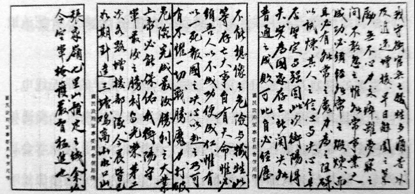
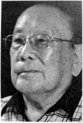

# 金兰：相识于岳麓山下

_1937年，18岁的刘俊明在山西太原遭遇了一场炮火轰炸。那个硝烟弥漫的夜晚，他出逃至陕西潼关，饥肠辘辘地走出火车站，随即加入“抗日敢死队”。自此，老家成为过眼云烟。_

_刘俊明随“敢死队”南下，经河南开封，最后到达长沙岳麓山，在此接受了基本培训，后又学习无线电技术。九个月的时间，让他从一名高中生转变成为“电波勇士”，同时让他庆幸的是，认识了金兰之交黄乃仁。”_

_无线电情报战是一场看不见的战争，1944年8月，刘俊明转发出衡阳守军的“最后一电”[^1]让看过的人潸然泪下，如今它却成为一封罗生门电报。_

_刘俊明说：“我们独听到自己的跳，也能听到敌人心中的声音。隔着70年的岁月，这封电报到底由谁发出？对于96岁的刘俊明来说已不再重要，“如果能找到黄乃仁和黄圣杰就好了。”刘俊明1947年奉命去台湾，因爱人病重，不久即返回湖南，而“金兰”黄乃仁同时却离开大陆去了台湾，从此再无联系。_

**蒋介石发给方先觉的电文原件，蒋希望第十军“存亡关头，努力杀敌”。1944年8月6日，不能再战的方先觉为保全近万名官兵性命，发出电报，“此电恐系最后一电，来生再见”。**

**口述人 /** 刘俊明，1919年农历十一月初五出生，山西太原人，1937年参加“抗日敢死队”[^2]，后进入第九战区军政部江南无线电总台，第二次长沙会战后升任电台台长。1945年，编入第四方面军，在天津接收日本投降物资。长沙和平解放后，在长沙市第八中学任教三十多年，现和女儿一家一起居住。

**采集人 /** 明鹊 **采集时间 /** 2015年6月23日、6月26日

### “在岳麓山底下的防空洞发密码、收密码”

黄乃仁原来叫做黄百川，是我们无线电培训班的同学。他是河南人，也是个美男子，他的个性啊，和我差不多，耿直又憨厚。我们当时有一百多人，在湖南大学的第五宿舍培训无线电技术。那时候，我们有一个物理学教授，是湖南大学的，还有一个美国顾问，他教会了我很多英语。[^3]

我们学习了莫尔斯通报技术，一些机务知识，还有通讯中的干扰技术。后来从岳麓山跑到了江西，在江西一中搞了一个多月，然后又回到了岳麓山，完成了总共六个月的培训。黄乃仁呢，他就没有回岳麓山，他从江西直接去了桂林。那个年代，我们搞无线电的，调动是很频繁的。

我通过考试，留在了岳麓山，当时只有25个人留下来。第九战区和重庆国民政府当时都靠（岳麓山的）江南无线电总台和（重庆的）江北无线电总台联系。我开始是通讯员，当时的司令长官是薛岳。在岳麓山底下的防空洞里，我们发密码，收密码，但是我们都不知道内容。密码的种类很多，比如第九战区发给重庆的电报，上面就写着“甲宗”、“乙宗”等等。

几个月以后，黄乃仁从桂林回来了。那个时候，我们晚上睡觉枕头都靠在一起，心情好的时候，我们就躺着聊天。我记得我跟他讲了我的初恋，那是我高中的女同学，叫做路微多（音），父亲叫做路介夫，很早就去了美国。有一个晚上，八九点钟了，我们在天心阁，她说要我跟她一路去美国，我当时想去又不想去，后来还是决定不去了。我说：“我很对不起你，但是我很喜欢你。”她就躺在我怀里哭脸了。我当时没有钱，一个穷光蛋，去那里要依靠她父亲，但我希望自己自立。后来，她一家人都去了美国。大学毕业后，她跟一个美国人结了婚，还生了三个小孩。她给我写了许多信，随着战局变化，后来我就没收到信了。

很快就是第一次长沙会战，我们电台撤退去了株洲。后来日本人由汨罗江打入长沙，我们就派人破坏公路，从新墙河到长沙的公路全部被我们挖断了，还埋了许多炸弹。这样，他们的机械化装备就不能同行了，长沙就是一座空城，到最后他们就这样撤退了。

我们都是随着部队进退来完成通讯任务的。我们通讯部队也有枪，有自卫能力，还有一个排来保护我们。

黄乃仁很聪明，在无线电通讯技术上搞过很多名堂，所以他调动很频繁。他后来又调去了平江，在那里遇到一个女学生，叫做董圣杰，家里人都是基督教徒。黄乃仁说，他们认识不到一个月就在一起了。那个时候抗战，相爱了，自然就在一起了。后来他们回长沙时已经生了一个女孩，长得非常漂亮，董圣杰也很漂亮。黄乃仁如果调到其他地方去，董圣杰就带着女孩回平江。

他们感情很好，虽然他们经常分开。黄乃仁经常跟我说：“结婚后，夫妻间的扯皮啊，是很正常的事情。”有时候黄乃仁脾气很大，还会打董圣杰，我就说：“你打人家就是不对。”他说：“你不要做这个裁判员，到了晚上，我们抱在一起，自然就好了。”我那时很天真，黄乃仁比我大一岁，他们的夫妻生活啊，什么都喜欢告诉我。我那时候是光棍，心里很羡慕他们。

### “日本投降了。”“啊？靠得住吗？”

第二次长沙会战时，我们电台问衡阳转移，在到株洲的前一站遇到了空袭，听说来了9架飞机。听到警报以后，我们马上出去睡在地上，只听见机关枪“哒哒哒，哒哒哒”，有的人就这样被打死了。无线电台有三十多个人，那一次，我们被打死了九个。当时我也中弹了，我跟三个报务员睡在一起，飞机走了以后，我看到他们都不动了，于是我站了起来，哪晓得站起来后，右腿像流水一样，我一看，才知道自己也中弹了。

那个子弹没打透，当时还摸得到，后来战地服务队把我抬到医疗的地方，也没有麻药打，就这样拿刀子划开，我当时也没有哭，只是叫了几声。第二天，我的这个腿肿得跟水桶一样大，一直青肿到小腿这个地方。我在临时医院疗养了三天，后来就让他们担架抬到无线电台，因为我还得继续工作啊。我当时在台里是班长，下面有18个人，每一组三个人，一天有六个班。我们无线电功率比较大，需要二十四小时保持联系。回来不久后，我就升了少校台长。

战争期间，日军经常全天发射干扰信号，使我们和重庆电台的通讯中断。开始的时候，我们准备了四个频道频繁切换。后来日本人掌握了我们电台的信号、通讯的时间，我们呼叫重庆电台，日本电台就冒充重庆电台，要我们把电报发给他们。日军电台的手法、信号和我们规定的暗语不同，我们将计就计发报给他们，这样既停止了电磁波干扰，重庆电台也能收得到，不过，敌台收到电报却不能破译，也没有用。

1945年日本投降时，我在洪江。我是电台台长，所以最早得到消息。洪江那边当时是第四方面军，王耀武是司令官。我就打电话给他，我说：“日本投降了”。“啊，靠得住吗？” “靠得住。”王耀武后来带着我和我的电台到了芷江。第二天开会，日本人是坐飞机来的，一下飞机就给我们行礼，再不是那个凶恶的样子了。我当时负责发报，就报这些消息给重庆。

### “你蠢里蠢气，你怕什么？”

我后来被编入第四方面军，升为了中校科长，肩膀上两朵梅花，袖子上一个黄杠。黄乃仁呢，他被分配到河南开封，在那里当公安局局长。

河南的封建势力严重，帮派势力很强。有一个帮派头子啊，说黄乃仁作为新任局长，应该要先去拜访他，黄乃仁就是不愿意去，没见面两人就生了矛盾。后来，黄乃仁叫卫兵去喊他来，他来了公安局，一开口就看不起黄乃仁，他说：“你当局长，你还要靠我来支持。”黄乃仁一听，脾气就来了，说：“你好大的一个帮会头子，地方上很多人都揭发你。”那个帮会头子说：“我看你还能当几天公安局长。”黄乃仁火气上来，拿起手枪“砰砰”，对着他脑壳开了两枪，当场就死了，外面的人都还不知道。和黄乃仁一路去的同事说，“这里的帮派势力好厉害，你最好还是躲一下，他们一定会来报复的。”这样，黄乃仁带着董圣杰和小孩，一家人跑到了上海。

他到上海后打电话给我，我当时已经在青岛了。我不记得那个时候我给他寄了多少钱，那时我已经结婚了，是经人介绍认识的，她当时在长沙。

当时的第四方面军司令官是王耀武，因为我学的是无线电，当时在前进指挥所负责接收日军的器材，像无线电机、交通材料、汽车，等等。现在想起来，我那个时候，一个礼拜就学会了开汽车，就是日本人那种小汽车。当时，第四方面军的参谋长叫做郭礼幸（音），他是我的老师，也是黄乃仁的老师，教过我们无线电培训。黄乃仁坐飞机到青岛，我就带他去见了参谋长，郭礼幸听了帮会头子的事后讲：“你这个事情太荒唐了！”他下命令让黄乃仁留在青岛，当少校科长，接收通讯材料，我负责接收交通等其他材料。

我们在青岛待了一年多，住青岛铁山路36号，我住楼上，他们住楼下，吃饭都不分彼此。我们楼对面住了四个日本女人，她们睡櫑榻米，都只有二十几岁，有两个丈大打仗阵亡，两个丈夫快被遣送回国。日本女人很温顺，好几次来敲我的门。我记得有一次，我早上才起来，她们敲门后看到我，就低头说：“早上好。”她们用中国话告诉我，希望能和她们的爱人一起回日本，但是当时规定她们不能一起回去。有一个日本女人说她的爱人牺牲了，她不想回日本去，还好像好关心我的样子，那个时候我爱人也不在身边。我后来告诉黄乃仁，他就说：“你蠢里蠢气，你怕什么？”我说：“军纪不允许，如果我跟她有了关系，她赖着不走，以后怎么办？”她后来还是回了日本。

### “电报里简单的两句话，是我们最后一次联系”

1947年左右，我去了台湾，黄乃仁那次没有去，他是后来去台湾的，我和他没有碰到头。我当时带了家属，和陈宝仓的外孙住在一起，他叫周秉穷，现在还在台湾。我的这个爱人当时是个新闻记者，我们抗战胜利时结的婚。

当时是介绍的，她姐姐也在电信局，原来就和我有过来往，她说要把妹妹介绍给我，托电信局的男同志给我讲。我当时在跳舞唱歌的时候其实也曾看到过我爱人，但不认识，自她这样说了之后，倒是很不自然了，我时常要注意她一下，一群人一起跳舞唱歌，心里就有一种特别的感觉。

后来一接触呢，就有了感觉。当时感觉是很痛苦，又不知道怎么很冲动，但是也不敢随便追求。我失眠睡不着觉，胡思乱想，到医院看医生，医生说：“你需要恋爱结婚了，不然会影响你的身体”。那个时候我26岁了，没有跟哪个女的真正按触过。

第一次正式见面就只留下我们两个，开始我坐这边，她坐那边，到后来，我们就抱在一起了。她就是我的爱人。

我们到台湾后，她心脏病经常发作，一天到晚往医院跑。我们是到台湾的先头部队，那时候有一个中将看到我这个情况，就要我把爱人送回湖南，我就买飞机票飞回了长沙，待到长沙和平解放的时候，我其实一直是想回台湾去的，当时也做了一些安排，那时她的病也好了一些，但交通突然就断了，火车票买不到，飞机也停飞了，我就这样被迫留在了长沙。也是那个时候，黄乃仁从香港九龙打电报来问我“是不是可以回长沙来？”我回他一个电报“回来也好，缓来也好”。就这么简单的两句话，是我们最后一次联系。

1983年，我爱人过世了，我一直想找黄乃仁。1993年，有二十几个台湾人回长沙来探亲，但我那个时候不敢提这个事情。去年（2014年）这边有人去台湾，了解到他去了美国，但具体在美国哪里不知道，也不知道他还在不在。

[^1]: 1944年8月7日，方先觉与各师检讨战况之后，以悲痛欲绝的心情，命参谋长孙鸣玉草拟呈蒋介石电稿，经大家研阅后交参谋处长饶亚伯送电台拍发，并依令对电台做炸毁之准备，此即当日震惊中外的衡阳守军“最后一电”：“敌人今晨由北城突入以后，即在城内展开巷战，我官兵伤亡殆尽，刻再已无兵可资堵击，职等誓以一死报党国，勉尽军人天职，绝不负钧座平生作育之至意。此电恐系最后一电，来生再见！职方先觉率参谋长孙鸣玉、师长周庆祥、葛先才、容有略、饶少伟同叩。”因为衡阳电站功率较小，不能直接发报到重庆。有人认为，“最后一电”是先发到江南无线电总台，后转发至重庆的；也有人称“最后一电”是通过芷江空军基地中转至重庆的；还有人怀疑“最后一电”的真实性。

[^2]: 1937年，刘俊明18岁，本来考取了清华大学，但是卢沟桥事变后，日本人很快就攻占他的家乡山西太原。刘俊明在日本人的炮火下，逃难跑了出来。他一个人跑到火车上，家里的人都不知道上哪里去了。刘俊明跑到河南到陕西的黄河口潼关，在火车站候车室待了两个晚上，没有吃饭，没有一分钱，后来走出车站来，看到军政部招“抗日敢死队”，他就去报名了，当时报名的青年有三百多人。当晚，火车就把他们运到河南开封，在开封他们转了另一趟火车，“也不晓得上哪里去，火车是敞篷的，赶着下大雨，300多人，个个打得透湿”。一天后，他们就到了湖南长沙。

[^3]: 1938年8月25日，湖南省无线电总台在长沙建成，并开始在各行政专员公署设立区台，各县设立分台。1940年冬天，各地区分台相继建成。在这之后，军政部开始招办无线电培训。