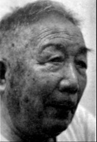
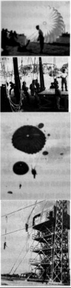

# 伞花：不是谁都能从飞机上跳下

**口述人 /** 谢慈友，1926年农历十月初六生于岳阳市平江县，中国第一支空降兵部队[^1]60小炮上尉、分队长。因伯父在国民革命军第五军当团长，谢慈友15岁投军，先在第五军留守处培训班学习汽车修理，后进入第五军干训班，因表现优异被提升为特务排长。1944年底，加入伞兵鸿翔部队，并参与空袭丹竹机场的作战。1946年，借看望母亲之故脱离部队。1949年后一直在家务农。上世纪80年代开始在平江县城关镇卖豆腐与自种小菜为生。2015年9月3日，以抗战老兵身份参加全国阅兵。

**采集人 /** 李桦 **采集时间 /** 2015年7月19日

### “我怎么跟你父亲交代，你父亲就你一个崽”

伞兵不是谁都能当的，那要求不是一般的高。太蠢的人当不了，胆子小的人也当不了。就像教官说的，“降落在敌人的后方，什么情况都可能会发生”，蠢的人反应慢，容易被敌人发现；胆子小的人，一般又不敢进行单兵作战，容易延误战机。

一开始伞兵都是不要考的，基本上都是从第五军里面挑，特别是特务营的人多，其他的也有，反正都是年轻力壮、打仗勇敢的。后来去印度打仗的那些人回国以后，看伞兵的待遇高，也有很多参加了我们的伞兵团。再后来因为伞兵扩充，又从学生兵中挑选了很多。不光要有文化，还要看他们的体格。医官检查通过后的，才能参加笔试跟口试，那挑选是极其严格的。[^2]

我进伞兵团时17岁，别看年纪小，来头可不小。我当时是特务排的排长，而且还受到过杜聿明的当面表彰。后面有几次我去军部办事，军部的那些头头还叫我“小娃娃”。他们之前在军训班见过我。

在军训班[^3]的时候，我也没有想到过我会留下来，因为我在曲靖[^4]日子过得也还好。训练的时候我很认真，只想快点搞完后，好回曲靖去。没有想到的是，结业考试时，总分我拿了第三名，加上我在受训的时候表现很好，像拼刺刀和班级攻防这两个科日，我都是第一名，所以上面的人就把我留在了军训班教导处当教官。没过多久，接到上面的命令，说是蒋介石和何应钦他们要来第五军看一看，我们军长杜聿明就安排了军训班的学员做汇报演出。但是时间掐得很紧。我找到的命令是在十五分钟内演示完拼刺刀和班级攻防。我一听就火了，这点时间哪里够，光是整队列、展开队形就要几分钟。我就跟处长说，这点时间，那我搞不好。处长说：“不要紧，他们也就是随便看看，搞得完好多是好多。”我心想，搞就搞，反正是你让搞的，出了问题末必还骂我啊。

演习那天，可能是年纪太小，一点也不晓得紧张。军长介绍完以后，就轮到我们上场表演了。我什么都没想，反正就是按照平时操练的搞起去，先整队列、报数，然后展开队形，接着喊口令，我喊“上前一步，刺”，大家就做动作，然后大家齐喊一声“杀”，那气势真的是蜜吓人的。刚刚搞了几个动作，时间就快到了，我就准备收队，这时执勤官跑过来，要我们继续表演。把全套劈刺的套路搞完以后，我看了看时间，这时执勤官又跑过来，要我们继续演习班级攻防。我反正都无所谓，因为这些东西我太熟了，搞到我的饭碗里来了（方言，指因熟练而胸有成竹）。搞完以后，我看了一下时间整整一个小时，蒋介石和何应钦都坐在那里没走，还一个劲地帮我鼓掌。军长就很高兴，特地过来表扬了我，团长当时也在。几天以后团长就把我调到了特务排。“小娃娃” 这个外号就是军长喊出来的。

我的亲伯伯[^5]是杜聿明的老部下，在第五军当过团长，后来调到了新22师，还当团长。我开始当兵就是冲他来的。当了排长我心里很高兴啊，就告诉了他，本以为会得到几句夸奖，没想到被他一顿臭骂：“你这个细伢子（方言，泛指小孩子、年轻人）懂什么咯，特务排执行的任务要比你在曲靖修汽车危险得多，你要出了事，我怎么跟你父交代？你父京就你一个崽。”刚好，那个时候伞兵团在招人，他就让他们把我招进了伞兵。

### “美国人也很干脆，照到后面就是一脚。我是第五个，‘啊’的一声就跳出去了”

在曲靖的时候，我觉得我们的伙食就已经很好了，美式罐头也偶尔可以吃个几回，跟那些美国人关系好的话，还可以抽几根美国烟。但到了伞兵团以后才发现，那些根本不算什么，跟伞兵比起来，我们之前在曲靖就跟叫花子差不多。

第一天吃饭我就吓了一跳，每人每天规定要吃四两肉，外加两个鸡蛋。那是什么年月，四两肉让你想你想得到吗？ 关键是天天都有吃。美式罐头就更不要说了，多的很，吃到后面都不想吃了。而且装备好，每个人都是全美式装备，手枪、钢盔、水壶、手电简，连药都是美国的。最牛的是还有一把伞兵刀，收在小腿那里，拿在手上威风得很[^6]。每次通过大街去野外进行战术训练时，老百姓看见我们戴着美式钢盔，穿着新军装，背着美国的最新装备，唱着《伞兵之歌》，都会跑上来围观，并且大声叫好，那是很骄傲的。

**中国第一支伞兵突击队的日常训练，站立、跳塔、伞降等。**

当伞兵虽然各方面待遇都很好，但是训练很苦，刚开始美国人的那些训练装备还没有全部过来，所以都是搞体能训练，也就是地面的低级训练。地面训练通过后，才能开始高级训练，也就是空中训练，这一部分就全部是由美国教官负责的了。除了这些，还要搞军事训练，这也是美国人负责的，主要是学习美式装备的性能和使用，还有单兵作战的技巧。反正训练也没别的，就是一个字：苦。到后来改编为陆军伞兵突击总队后，美式装备、洋教练就源源而来了[^7]。

**C-46运输机**

我第一次坐飞机，坐的就是美制的C-46[^8]。这东西不比汽车，汽车我还是坐得多，在曲靖时经常坐进口的美国车。这上天还是第一次，所以还是觉得蛮稀奇的。

练习空降那天，一开始大家都好兴奋，那年月不要说跳伞，就是坐一次飞机也是了不得的事情。平时大家都是在地面搞基本训练，那是蛮枯燥的，反正每天都是跳高、跳远、飞环、打翻，基本天天如此。飞机起飞的时候，大家都还有说有笑的，但一到降落点，大家的脸色就变了，你望着我，我望着你，都不作声。特别是预备铃响起的时候，我看到边上的几个云南兵好紧张的，腿抖个不停。到第二声铃响的时候，除了队长和美国教官外，所有的人都不作声了，就跟哑巴一样站在那里。

等教官做完最后的检查——主要是看挂钩挂好没有、装备带齐了没有、姿势是不是正确——然后队长喊口令，大家就排好队跟着他。飞机也慢慢下降，到一千米左右时，教官突然把舱门打开，那风就大啦，吹得眼睛也睁不开，人也站不稳。只听见教官在用英语喊口令：“One Second, Two Seconds, Three Seconds. go！”那个时候所有的人脸都白了，都怕得要死，第一次跳也没什么经验，其实怕来怕去就是一点，都怕伞包后面的挂钩钩不住，但是又不能让别人看出来，怕丢丑。不过我们队长的胆子还是真的大，听到“go！”的口令，半点犹豫都没得，就跳出去了。后面几个胆子小的，站在那里不敢跳，美国人也很干脆，照到后面就是一脚，人就出去了。我排在第五个，麻着胆子把眼一闭“啊”的一声就跳出去了，那感觉就跟自杀一样，直到伞打开后才敢睁开眼。[^9]

跟空降比起来，其实地面训练要苦得多。那个时候所有的装备都是美国人提供的，飞机数量少。另外就是伞也比较少，都是好珍贵的[^10]，所以基本上一开始都是跳高塔。先是背着降落伞练站立，站不稳的话，离机的姿势就肯定没得保障，然后每天还要在两米多高的平台上跳沙坑，这是炼腿劲，因为落地的时候那个冲击力很大，腿站不住的话，容易受伤。最后最恐怖的才是跳伞塔，那有几十米高，站在上面脑壳都发晕。其实原理我们都晓得，先在下面把伞用钢圈撑开，再由升降机升上去挂起，跳的时候，绳子一拉，钩就松开了，人就带着张开的伞下来。跟空降不一样的是，跳伞塔的时候眼睛看下面还是看得见的，那个高度，一下没搞好就会出事，不管你胆子有多大，没有不怕死的。

### “好巧的是，另外一个湖南人也参加了，他是翻译”

行动我只参加了一次。当时收音机里天天都在说日本人快不行了，不过我们自己也可以猜的到，当时像南宁、柳州还有桂林这些地方，以前是日本人占领的，都被我们抢回来了。出发的时候，我们都不知道要去哪里，飞机起飞以后我们才知道，是要去突袭丹竹机场。那个时候驻广西的日本军队已经不行了，大部分日本兵开始沿西江向广东那边撤退了。丹竹机场刚好就在西江边上，具体位置蛮不好形容，应该在平南县的下游，其实就是一个小型基地，负责补给物资的中转。那个附近修了一个简易机场。

我当时在60小炮分队当分队长，从昆明起飞的时候是7月18日，这个日子我记得特别清楚，因为这是我们分队第一次出战。总共是3个混合编队，大概有600多人[^11]。坐C-46和C-47去的，一路上还有美国的战斗机护航，经过柳州时还停了一下，然后就直飞丹竹了。当时由于太突然了，日本人根本没得什么防备，到达丹竹机场上空时，中美空军的轰炸机、战斗机首先开火，丹竹机场顿时腾起一片火海。接着由迫击炮分队、机枪分队、工兵分队组成的空降兵突击队跳伞着陆，抢占机场[^12]。日军龟缩在机场四周的地堡里用机枪疯狂地对我们扫射，我就指挥我们的分队，用60小炮打死角，没几分钟地堡就被我们的炮摧毁了，没有被炸死的、躲在里面的日本兵，也被我们用火焰喷射器烧焦了。

几天后，我们又配合其他的地面部队对守备的日军展开反击歼灭战，日本人那个时候虽然走下坡路了，但反击还是很猛烈的，幸亏我们的火力占有绝对的优势，日本人才没搞出什么名堂来。好巧的是，这次战斗另外一个湖南人也参加了，他是翻译。两年前，我跟他还在长沙见了一次面，聊了很多当年的往事，叫易延绶[^13]。

[^1]: 1942年初，杜聿明率远征军入缅作战，因英军为求自保而擅自撤退，致使中国远征军侧翼暴露给日军，蒙受了重大损失。突围途中，日军用伞兵空降至伊洛瓦底江右岸的渡口，在远征军从曼德勒向缅北和缅西撤退的路上插了一刀，给中国军队制造了很大的伤亡。 1943年1月，国民革命军第五集团军在昆明成立，杜聿明任总司令，当年12月在第五集团军内组建了一个伞兵团，团长李汉萍少將，副团长简立，部队驻地在昆明北郊岗头村。至此，中国第一支空降兵部队诞生。

[^2]: 伞兵最初成立时，人员大部分从第五军各师中挑选，特别是从特务营抽调的士兵最多，因为这些士兵的单兵能力较强，同时反应灵活，又较为勇敢。后来因为伞兵扩充，大部分士兵就从驻曲靖沾益的青年军207师的学生兵中挑选。他们有知识，年轻力壮，素质比一般部队士兵要好。

[^3]: 第五军自己办的一个培训班，全称是第五军军事干部训练班，主要是培训中下级军官的。

[^4]: 口述中提到曲靖的次数相当多，这与谢慈友本人的经历有关。1942年，15岁的谢慈友首去广西投军，因年纪小，最先被安排在第五军广西留守处训练班学习。在此期间，谢慈友不仅学习了文化，如物理、数学、化学等，还学习了汽车修理。1943年，拿到二级技师结业证的谢慈友被分配到了中印缅驻滇干训班，随后进入到设在曲靖的汽车学校，从事技术修理。曲靖离昆明不远，只有160公里，战略位置重要，是昆明的屏障，当时美国的援华军用物资在此地集散。美国的运输机不能运大卡车，只能在美国先拆卸大梁，到中国后再组装，因此曲靖一时成为了中国汽车工业中心。

[^5]: 谢慈友的亲伯伯谢蔚云，黄埔四期毕业，是远征军第五军新22师66团团长。第五军的骨干师是200师，1940年前后，新38师与新22师均被调入第五军系列，1942年又相继调出。

[^6]: 伞兵作为一个新兴兵种，又是全美式装备，当时不仅杜聿明看得重，连蒋介石也将其视为掌上明珠。因此伞兵的待遇比其他兵种要好的多，吃得好，也穿得好：平时军官带大沿帽，士兵戴船形帽，穿带帮短腰皮鞋，有时着帆布短腰胶鞋，扎美式带孔的宽腰帆布带，肩章是陆军特种兵，领章为空军小飞机标志，臂章为降落伞标志并有“鸿翔”二宇。伞兵军官平时可随身带手枪，士兵可带伞兵刀自由进出各种公共场所。

[^7]: 1945年4月8日，伞兵正式扩编为陆军伞兵突击总队。在陈纳德将军的帮助下，装备、训练器材及教官相继到位。总队下辖20个伞兵队，为了保密，每个队均有一个代号，大多是古今名将，如“诸葛”“伏波”“世忠”等，对外则统称为 “鸿翔部队”。

[^8]: C-46型运输机是由美国寇蒂斯菜特飞机公司生产的活塞式运输机。1940年3月26日原型机CW-20首次试飞，1942年装备美军部队后，命名为C-46，别名“突击队员”，总产量3180架。C-46飞机最大平飞速度424千米/小时，最大航程4140千米，最大装载量4630千克/50名士兵，机组乘员4人。它的发动机装有二速增压器，所以升限比较高，实用升限达7470米或8300米。在第二次世界大战中，美国和盟国部队曾广泛使用这一机型；在中国，它在1942~1945年间的“驼峰”空运中发挥过极其重要的作用。

[^9]: 伞兵团在扩编为突击总队后，随着装备与器材的完善，在美军顾问团的帮助下，以伞兵学校的名义实施组织，于1945年6月9日首次进行了空中跳伞训练，第一批训练至7月结束。

[^10]: 当时伞兵所有的装备及训练器材均依赖于美国进口，一顶伞兵伞按照当时的价值估算超过400美元，当时美国对华援助的重点也不在伞兵，伞兵伞的数量相当少，因此相当珍贵。当时中国伞兵部队所用的降落伞都是美国伞兵广泛使用的T-5和T-7型伞兵伞，由引导伞、伞衣套、主伞和捆绑带等主要部件组成，柔性纺织物制成，可在最大飞行速度小于250千米/小时的飞机上使用，采用强制开伞。为了保证伞兵伞的多次使用，还专门设置了折伞组，负责跳后的烘伞、折伞工作，并检查伞绳有无毛病，伞上有无破洞，有无胶着张不开等问题。折伞人员要负责未来跳伞人员生命的安全，折好以后要签名。为了鼓动折伞人员小心负责，还特别发给折伞津贴。

[^11]: 老人的记忆与相关史料有差异。有资料记载，在这次行动中，应该是出动了3个分队，即陆军突击总队的第八、九、十队各出动一小分队共二百余人，进行了混合编队，乘C-46和C-47型运输机由昆明起飞，经柳州，到丹竹，而不是老人说的600人，由40架C-46运输。

[^12]: 有资料记载，伞兵突击队抵达丹竹机场后，日军因基本没有防空装备，所以几乎没有作抵抗。伞兵突击队也没有采用伞降，而是采用的机降。

[^13]: 易延绶是鸿翔部队成员，少校翻译官，1945年7月18日也参加了对丹竹机场的突袭战斗。跟谢慈友不同的是，易延绶是学生兵，是从大学里抽调到鸿翔部队当翻泽的。易延绶在文革中受到迫害，被打成“美蒋特务”，剃阴阳头，挨批斗。2013年，在民间志愿者的帮助下，谢慈友与易延绶这两位分别了68年的战友在长沙见了最后一面。2014年，易延绶离世。

