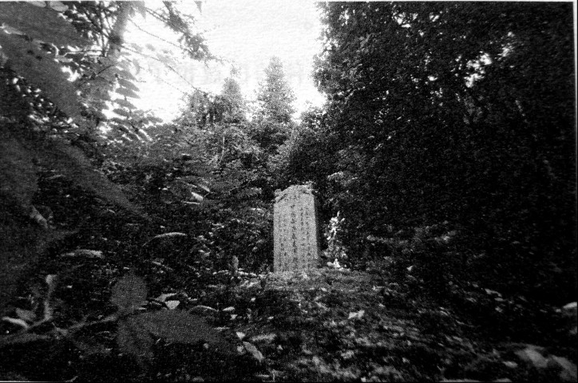

# 伞花：不是谁都能从飞机上跳下

**口述人 /** 陈玉龙，1934年出生，衡阳县礼梓乡加福村人。鸿翔部队在牧云庵驻扎时，11岁的陈玉龙经常在那里玩耍。鸿翔部队墓地就在陈的住房后，紧紧靠着他家的偏厢房，只有三四米远。

**采集人 /** 张映科 **采集时间** / 2015年7月8日

### “我们把伞包拿出来做衣服穿，又把骨头埋进去了”

他们啊，是从天上掉下来的，落在我们的田垄里面。落下来的时候，就像树上落花一样的，飘飘洒洒，当时我没有看到，我听别人说的，不过我和我继父老子捡到一个崴了脚的，还送到他们驻扎的牧云庵里。他们啊，都是些非常文气的人，对我们当地人也非常和气，就像教书先生。打洪市镇，他们死了几个人，埋在我的屋后面，就是这个鸿翔部队的墓地，都几十年了，没有外地人来这里看过，直到前一两年，有好心人（地方史研究者萧培和王辉）才修了墓碑。

**2015年重修的鸿翔墓地。**

**衡阳县礼梓乡加福村。1945年7月2日，中国伞兵降落此地，并驻扎在村里的牧云庵。**

我屋里原来住在云华村，士改时，我继父带着我搬到了加福村。我现在的屋，离鸿翔部队的墓地只有三四米远。

那些兵从天上掉下来的时候，这里还只有五六户人，是秋天，田里种的是一季稻，禾刚刚被杀了没多久（方言，指利用扮桶的缺口，人力将熟透的稻谷打落），田里是光的[^1]。伞兵掉了下来，掉在这个马路和牧云庵[^2]之间的田垄里。这个田垄有百把米长。

他们都穿着军队里的制服，背上背着个包，掉下来就坐在包上面，总共有百把个人，他们喊自己是“远征军”[^3]。这些人都住在牧云庵最里面那一进的瓦屋里，就是以前方丈住的地方，当时牧云庵蛮大，还有三四个和尚。

以前田垄没这么宽，边上还是树，我看到有一个人掉在树上，脚受伤了，我继父当时也在那里，就把那个人送到庵堂这里来了，我也就跟着来了，在这里耍了几天。

我不晓得哪些人是外国人，但是有几个人眼睛不对，眼珠里有光，像猫的眼珠，有些眼珠是黄的，脸上也有毛，毛一路连到肚子，鼻子还有个微微勾，这样的人有七八个，我看到他们在稻田里耍过几回。[^4]

这些当兵的驻扎在这里，他们要买鸡买蛋吃，我们当地有很多人就在牧云庵的门口摆摊，还卖烟酒、麻糖、米糖、芝麻糖及一些果子。这些当兵的用的是县里面发的一种法币，这种钱后来我们用也还是用掉了。

我当时还只有十岁出头，这些当兵的对我蛮好，还给衣服给我穿，衣服里还有钱，只是乡长不准我进庵堂里面玩，把我推出去，我就把衣服穿回去了。

第二次我又来了，那些人还认得我，又把我请进去，我又耍了一天。他们还给我糖吃，给我鸡吃，就是鸡汤不给我喝，他们只喝汤。

他们在这里住了有段时间，打完台元镇[^5]后，还住了将近两个月了，他们走的时候，我们这里没一个人看到。[^6]

打台源镇死了的那几个人，埋在我现在屋的后面，有4个人[^7]，其中有一个个子蛮高。每个人的降落伞也都放在棺材板子里，他们自己挖的士，自己立了个木头碑，我就在边上看着。[^8]

我们当地的人以为墓里面有钱，大概是到1951年的时候，就把墓给挖了，墓里什么都没有，就有副板里有双黑牛皮靴子。那些板也都烂了，里面也就剩下骨头，我们把伞包拿出来做衣服穿，又把骨头埋进去了。

我们当地有个叫易伟的己过世了的老师，不准我们直接拿那些伞包来用，说必须要消毒。我们就把这个降落伞放在沟里去洗，水好臭啊，臭好远呢。洗了后我们才拿出来用。

那些布很牢固，烂不了的，有两户人家家里可能还有这个布，一个是陈代铁家里，但他房子后来被山砸了，山垮了，把房子都埋了，蛮多东西都落在那房子里了，估计也没有了。还有个是原先村里的会计，他家用那个布做了被窝的套子，不知道现在还有没？

还有些布是那些兵给的，他们从天上掉下来的时候，伞就垫在屁股后面，大部分兵把伞都拿走了，我们自己去拿是拿不到的。有些兵跟我们关系好，他们就拿刀子割些绳子，拿给我们村里人用，有些人还给了伞包。现在人老的老，死的死，保留以前东西的人少了，以前还是有些人的屋里，有那些降落伞上的东西，那些绳子蛮经得起用。

[^1]: 据采集者调查走访，当地村民均认为这个时间应该为1945年6月7日，此说法应较为可信。但在周继厚所著《神秘的“鸿翔部队”——中国首支空降兵部队揭秘》（《环球军事》，2006年）一文以及《兵从天降：二战中的空降作战》（隋治刚，军事科学出版社 2004年）一书中，这个时间为1945年7月2日。

[^2]: 位于加福村牧云峰下，曾占地千余平方米。明朝末年修建，毁于“文革”，今只余断瓦残垣。据地方史研究者、鸿翔墓碑重立者之一的王辉介绍，牧云庵在清朝时曾是律宗第二祖庭，在南岳出家的和尚都要到牧云庵来受戒。此庙距王船山故居湘西草堂15公里，王船山常来此庙，为酬谢主持楚云禅师，还曾写有《牧云常住记》，此文并刻有石碑，现由县文物局保管。

[^3]: 鸿翔部队人员主要从远征作战的第五集团军中选拔，所以其自称为 “远征军”。

[^4]: 鸿翔部队降落衡阳的此次突袭行动，有美国顾问还是较为可信的。据衡阳市衡阳县曲兰镇邬求德（1924.8~2015.7）老兵口述，1945年6月，在攻取衡阳县西渡镇的一次战斗中，他趴在地上，被日本人的机枪扫中脚，受伤后被抬到牧云庵，就是被美国医生治疗痊愈的。

[^5]: 据《国民党军伞兵部队揭密》记载：1945年6月7日，华兵二队（队长为姜健中校，队副为美军少校）在严格保密情况下，全副战斗装备集结在昆明巫家坝机场附近。凌晨乘美空军十四航空队的C-46及C-47运输机15架（每架飞机可乾24-27人，即两个组的兵力，15架飞机中，伞兵队部人员乘坐1架，6个伞兵分队人员乘坐9架，另有5架装载重武器、弹药、器材等），在24架战斗机的护航下，从昆明巫家坝机场起飞，于当日上午9时许到达衡阳县洪寺镇附近。6月11日凌晨2点50分，伞兵二队夜行军于4点40分左右到达日军重要据点台元镇的前沿阵地，并向敌发起政击。其攻击部署是：两个分队迁回到敌后方阵地进攻。两个分队由敌右侧阵地进攻，一个加强分队（含迫击炮、重机枪）正面攻击，一个分队为预备队。当地游击队在敌阵地左侧配合作战。经两小时的激烈战斗，日军损失惨重，有一个联队被击溃，一个骑兵中队损失过半，近百匹军马被打死、炸死，大批武器弹药被缴获，一两百名日军死伤。伞兵攻占台源寺，切断了日军从衡阳以南沿零陵方向撤退的后路，也打乱了衡阳城内日军原有的战路部署。在此战斗中，伞兵二队阵亡上尉分队长1人，士兵5人，负伤官兵10余人（其中有2名美军顾问）。（资料来源：http://bbs.tiexue.net/post2_5569531-1.html）

[^6]: 据王辉介绍，日军在长沙投降（1945年9月9日）前几天，鸿翔部队即作为先头部队赶往长沙，准备受降并维持城内秩序。

[^7]: 另有说法为6人。据王辉及当地关爱老兵志愿者刘小明介绍，6人的说法较为可信。

[^8]: 当时墓里是否埋葬有牺牲的美国顾问，受访者陈玉龙也不能确定，只说到埋葬的人中，有一个人个子很高，像美国人。在一般情况下，美方会把牺牲人员的遗骸运回国内。而据当地村民反映，抗战胜利后至今，并没有美国人来过此地。但据王辉介绍，《衡阳县志》及《兵从天降》一书都相当确定的记载，有两名美国顾问埋骨于此。