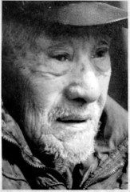
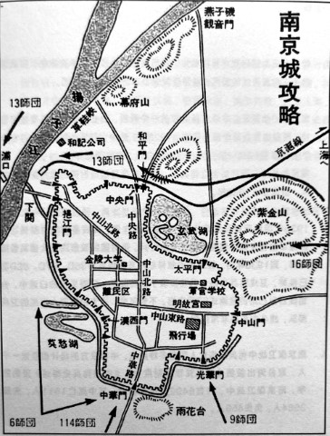

# 宪兵：他眼中最后的南京

_即使用最挑剔的眼光，周义云都绝对是一位标准的美男子，大眼高鼻，坐在小板凳上还是身板挺直，像一尊线条干净有力的雕像。_

_门前堆着的枯枝和树叶，应该是周义云留着过冬的柴火，他身后的土砖房上开有西个窗，用胶带纸与塑料布紧紧粘着，在冬天微暖的阳光下，像两个陈旧的伤疤。在得知来意后，老人警惕地示意儿子，对我们的身份进行核查[^1]。在确认无误后，长时问沉默的老人，终于开始了他的讲述。_

_作为国民攻府的第一代特种宪兵[^2]，周义云通过了纳粹冲锋队王牌教官勃罗姆的残酷训练[^3]。在这次训练中，有4000名士兵被淘汰，剩下的人在1937年全部投入到了南京保卫战。跟以往的认知不同，南京并不是一座不设防的城市。共有6400名宪兵投身这场战斗。1937年12月10日至12日的城外防御战中，曾给日军以重创。城破之后，幸存下来的宪兵只有四百多人[^4]。12日晚，从南京跳江突围后，周义云回到长沙太平街做起了生意。因时局不稳，最终再次投身行伍。解放后的事情，老人用一句“那何事（方言：怎么）讲得清”一语带过。_

**口述人 /** 周义云，1918年农历十月初五出生，原国民党南京卫戍司令部宪兵特务营迫击炮连士兵，现住汨罗三姊桥。说起50多岁的女儿，“跟我年轻时一样，长得几好的，可惜一直单身”，老人一声叹息。

**采集人 /** 李桦 **采集时间 /** 2014年1月15日

### “他那种想哭买不出，想笑笑不出的样子，这么多年过去了，还是会出现在我眼前”

为什么当宪兵啊，不为别的，宪兵威风啊，见官大三级。我从小就喜欢诗词歌赋，小时候上过私墊，读过《幼学》《唐诗》，记性又好，一直到读完初小，都没挨过老师的骂，打就更没有了。后来去湘潭当学徒。16岁时，宪兵学校在湘潭招考，我就去报了名，好多人去考，考上的不多，不过我考上了，那还是很有牛皮的。

1937年，接到撤退的命令时，我还在光华门那里，连长指挥我们沿着马路两边堆沙包，说是准备巷战。还没堆完，我就趴在沙包上睡着了。你要晓得，从9号开始，三天三夜老子就没合过眼，那个困啊，你想都想不到。估计睡下还没有十几分钟，就听见有好多人在喊：“撤退啦，撤退啦。”那声音跟打雷一样我立马醒了。这时，我就看见营里的传令兵，扯着嗓子，在那里做死地喊，跑得好快就跟有子弹追一样。

奇怪的是，听到撤退，所有的人都不兴奋，我记得很清楚，大家都呆呆地站在那里，特别是连长，脸上有一种古怪的表情。这么多年过去了，我只要一想起他，他那种想哭哭不出，想笑笑不出的样子，就会出现在我的眼前。我当时也愣了一下，但是脑壳里立马反应了过来，我知道，肯定要出大事了，了不得难了（方言，指解决不了的麻烦）。

为什么这样说啊？ 因为，我们虽然是宪兵，但是都受过严格的军事训练和培训。对南京的战场态势，我们虽然嘴上不说，心里却明白得很。10号那天，日本人两次用炸药炸破了光华门的城墙，还冲了进来，那个时候没有一个人后退，心里只有一个想法，就是决不能让他们进城。你想啊，整个南京的东、南、西三面都被包围了，只有北面还空着。但北面你敢去啊？那是长江！因此，大家就玩了命地打，因为城一破大家都要死。打到晚上时，我们把冲进来的日本人都消灭了，只有小部分日本人还躲在门洞里向我们打冷枪。我们在上面，枪打不到他们，扔手榴弹又扔不进去，最气人的是，我们的人在上面一露头，他们就开枪。最后，我们搞了两个汽油桶砸下去，把敢死队吊下去扔于榴弹，把那些日本人都烧死了。现在来喊撤退，一定是其他的地方被日本人冲进来了。因为，我们的阵地离市中心还有一段距离，退路很容易被日本人截断，大家反应过来后，立马就开始慌乱了。

### “有当兵的脱下自已的绑腿想从城墙上吊下去，跌死好多”

跑到中山北路时，路上就到处是人了，有老百姓，也有士兵。我们宪兵的纪律还是很严的，到鼓楼时，我们都还是排着队的，而且还带着迫击炮。结果一进山西路，那就全部乱了套，我当时都吓住了，只看见数不清的人，像发了疯一样地向下关的方向跑去，就像是一股洪水，你根本不用动，别人就会推着你跑。一眨眼的功夫，整个连队就散了。我跟我们班的几个人，离得近就还跑在一起。

往江边的路上，那情况就稀烂的（长沙方言，指非常糟糕），四路子（长沙方言，指到处都是）都可以看到，被丢弃的来复枪、机枪，军用皮带、军装，甚至还有汽车和迫击炮，到哪里都是火，跟探照灯一样照得好像是白天。好不容易跑到挹江门，这个地方的人就更多了，脚都踩不下地。本来挹江门有三个门洞，现在被封了两个，只剩下中间的一个，而且守备的部队还架设了机枪，不让通过。他们是宋希濂的部队，他们说没有接到上峰要求撤退的命令，就是不肯开门。我的个天，几万人堵在那里，你挤我，我挤你，你推我，我推你。就那样互相挤，互相推，就跟发了疯一样。

我那时只有19岁，人又长得高大，快要挤到门边，我就听见了枪声，是出城的士兵跟守城的36师打了起来[^5]。枪一响，人就更乱了，我看到好多人，脱下自己的绑腿想从城墙上吊下去，跌死好多。靠门洞边的好多人被挤倒，爬不起来的就被踩死了，一层又一层，起码有四五层，那恐怕死了有几千人。我们班的几个人，受的训练不一样，比其他的人还是厉害些，都还冲了出来。

跑到码头上一看，冇得（方言，没有的意思）一条船，一条都冇得，那又是冬天，江水好冷勒，冷得刺骨。往回跑，又全部是人，根本跑不动。站在江边，后面的人又会把你挤下长江去。那天晚上的风又大，风大浪就大，胆子小的人，根本不敢下水。江面上日本人的军舰又在开炮，有13艘。天上面，日本人的飞机又在轰炸，又是扫射。那是好惨的，就跟割韭菜一样，人一排排地死。飞机一来，好多人就往长江里面跳，一跳下去浪头一打就没看见人了，有的人就灵泛些，不晓得从哪里搞的木头盆，木头，还有门板，跳下去顺水漂，班长就是在江边被日本人打死的。我们当时还想帮他报仇，向日本人的军舰开炮，人太多、太乱，没法打嘞，没办法，只好把炮丢到江里去。我们的炮是德国的82迫击炮，好可惜的。我下水的时候，城门那边机枪响得好凶哒。下去之后，我回头看了一眼，什么都没看到，就只是看到冲天的大火。

**日军绘制的南京城攻略图。资料图**

我在江边长大的，水性好。我们七个人，搞了两根杉树，泡在水里一直向下漂，漂了有十几里，才到对岸，上岸时只有三个人了，其他的都被日本人的飞机扫射打死了[^7]。我上岸后，经平汉铁路，过蚌埠，到徐州，跑到郑州后，又由汉口回了长沙。

回到长沙后，没有事做，我就跟我爷老子学做生意，我爷老子以前也是经商的，后来在太平街开了一间旅馆，叫新长记。1941年前后，长沙时局不稳，生意跨下的（长沙方言，泛指非常糟糕），我最后还是回到了部队，跑到77师做了一名文书。在常德桃源一线守仓库。除了1943年的那次轰炸，那是农历九月，日本人的飞机来了有二十几架，在常德投了好多旧衣裤、烂棉絮、破毛毯[^8]。开始还好，几天以后，好多人得病，说是鼠疫，死了不少人。总体来说，日子还是安逸。

现在的事情就不讲了吧，那何事讲得清，也冇办法讲得清啊。就跟唐生智一样，你怪得他啊，他根本没得亲信，指挥不动。哎，你不晓得咧，老子那时打战好猛的嘞，没想过别的，就是想搞死他们一两个日本人，我嬲哒他的娘。

[^1]: 周义云因为国民党士兵的身份，在历次运动中遭受了多次冲击，因此对陌生人有着天生的警惕，直到今天这个习惯依然根深蒂固。

[^2]: 宪兵是泊来词汇。本质上是陆军的一个兵科，独立运作，但不受陆军管辖，而是由宪兵司令部所管辖。1923年，孙中山正式创建宪兵，并制定了宪兵章程19条，规定宪兵领章为白色，隶属于陆军部。1924年，黄埔军校从第二期开始设立宪兵科。特种宪兵是指当时国民政府的卫戍部队，始成立于1933年。

[^3]: 1933年国民政府与德国陆军开始紧密合作后，有很多有丰富实战经验的德军教官来到中国培训国民党军士兵。当时国民政府决定大量装备德式师，到1936年时，桂永清的教导总队及国民党军36D、87D、88D都已换装，卫戍宪兵当然也已经换装了德式装备。在周义云的口述中，他也提到自己用的是德式82迫击炮。不管怎样，这支由德国人训练的卫戍部队，战斗力应是非常强悍。

[^4]: 南京保卫战中宪兵的伤亡人数有多种版本，中日双方的统计相差近一千人，取台湾出版的《国民党军事制度史》《中国宪兵史略述》里的数字，南京保卫战中，共有6492名宪兵参战。其中死亡1511人，失踪3584人，负伤456人。

[^5]: 当时36师是宋希濂的部队，负责守卫下关码头。由于缺少必要的组织，导致出城的部队接到了撤退的命令，但守城的部队没接到命令。进出双方在当时的形势下，最终爆发了兄弟部队的火拼，酿成惨案。

[^6]: 南京保卫战前，总司令唐生智为了鼓舞士气，表示死守南京的决心，下令将所有的渡江船只实行军管，有的被烧毁，有的被转移。结果，后来死守不成决定撤退时，下关码头竟然无船可用。这个命令导致很多士兵在冰冷的江水中丧生。

[^7]: 文中提到的情节，在另一个南京保卫战亲历者陈德兴的回忆录中亦可得到佐证：“南京城下，我军四面楚歌，三军溃散。自古兵败如山倒，其惨败之情，难以形容。临下关江边，轻重武器，拋奔四郊，人山人海，淼淼长江，船只全无，非渡江不能保全性命。于是冒万险，揽独木渡长江，任波浪之漂流，如此危境，共患难官兵漂泊满江，顺流而下，几近镇江。在敌舰机枪扫射下，罹难死于江中，在腊月寒天，冻死殒命者，尚难数计。”

[^8]: 文中提到的这段，其实是指常德会战前，日军在农历九月对常德地区实行的细菌战。

