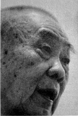
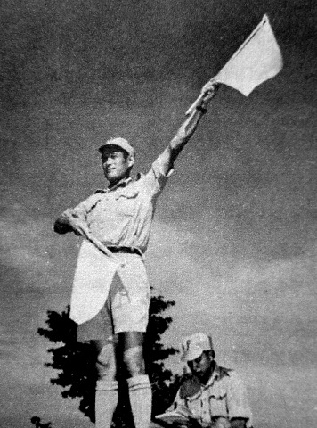
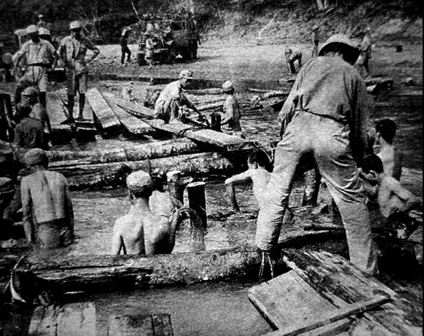
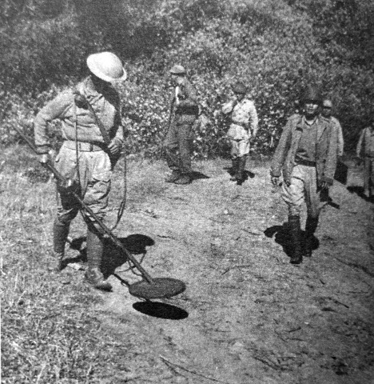

# 工兵：从这里通向东京
_谢浦高是典型的“南人北相”，身材高大，国宇脸，浓眉大眼，长期的井下作业让他患有严重的肺气肿，躺在医院病床上，脸色就跟灰色的上衣一样毫无光泽。但回忆起70多年前的那场战争，他的情绪一下子亢奋起来，脸也突然变得红润，“我们38师很能打，英国人见了我们都说，Chinese Ok”。_

_1942年，谢浦高家里因无钱买丁，万般委屈去投了军。从耒阳、到都匀、入云南、飞印度。从印度又一直打到缅甸。“在印度蛮好玩的，我们师长孙立人很能打，孙悟空也很能打，我们开玩笑是跟孙猴子来取经了，师长听了也不生气。”吳承恩笔下的西游，师徒四人历经千辛万苦，最终修成正果，功德圆满。而谢浦高的西游，九死一生，结局却是意兴阑珊。_

_工兵谢浦高关于印度的记忆里，雷多是印象极深的。在这条伟大的公路上，曾立有一块路牌，上面用英文写着：Road to Tokyo（从这里通向东京）。1945年，抗战胜利后本来准备前去日本驻军的谢浦高[^1]，却最终在长春放下了武器，而东京作泊一个地名，一直停留在他记忆里的那块路牌上。_

**口述人 /** 谢浦高，1927年农历五月十四日出生，原国民革命军新38师工兵营2连士兵。14岁当兵的谢浦高，亲历了1943年缅北大反攻，从印度一边修路，一边作战，穿越了缅北大丛林。因军姿威武，谢后被抽调到国民革命军第67师，准备东渡日本，结果却被裹挟进了内战。在长春谈妥“三个条件”[^2]后，谢浦高最终放下了武器。

上世纪50年代初，谢浦高从新疆建设兵团自愿回乡务农，后进入马田煤矿当了一名矿工，退休后，随着孩子住郴州。现患有严重肺气肿的谢浦高，经常为了医疗费和“工资”问题四处奔波。

**采集人 /** 李桦 **采集时间 /** 2014年9月11日

### “上飞机前，要求我们把身上所有的衣服都脱掉”
我老家在耒阳，没有读过书，也不认识字。饭都没得吃，哪还有可能让我去读书。我家里人多，不算姊妹，光是弟兄就有六个。那种日子，想都想得到。我大哥年纪比我们大很多，一直在乡下种田。二哥死的早，我好小的时候他就死了。日本人来了以后，乡下开始抓丁，三哥胆子大，脾气也倔，为了躲抓丁，一个人偷偷跑到湘江上去掌船。按当时的规矩，三丁抽一，五丁抽二，四哥（谢浦郎），五哥（谢浦方）就只有去当兵去了，民国二十八年 （1939）入的伍。五哥后来战死在安徽，三哥后来一直没敢回家，他认为是他把五哥害死了。

按道理，四哥、五哥去当了兵，我家里就不用派丁了，但我们当地的保长很坏，那个时候发国难财的人也蛮多，他才当了两年的保长[^3]，就已经买了二十几头猪。保长到我家里找到我父亲，要我家出钱买丁，我家里哪里有钱买丁咯，反正家里人多，我父亲就让我去乡里报了名。

到了乡公所，有个穿黄衣服的人过来帮我量身高，我记得是1米5，过磅不到100斤，那个人可怜我，就对保长说“太矮了，当不得兵”。保长说：“矮？以后又不是不长了。”没办法，我就这样跟其他11个人被分成了两组，我们6个人这一组被送到了衡阳。

没有车，乡里到耒阳县城三十几公里，走了快一天。从耒阳坐车到衡阳，再从衡阳坐火车到柳州，再到贵州的独山，最后到了都匀，那已经是1942年秋天了。在营地体检，年纪上了三十岁的、身体不好的，站一边，三十岁以下的站一边。我体检还不错，接着打针[^4]，也不知道是什么针，每个礼拜打一次，打了快一个月后，就要我们打了针的从贵阳去云南。

到云南后就有美国的飞机在等我们，上飞机前，要求我们脱光身上的衣服[^5]，其他的东西都不让带，每个人只发一个呕吐袋，那个飞机颠得厉害，估计是翻喜马拉雅山。[^6]

下飞机后，一个个都狼狈不堪，有穿草鞋的，也有光脚的，有光上身的，也有光下身的，很多人站都站不稳。旁边的老外叽里呱啦地一顿乱说，后来听翻译说，他们讲“你们这个样子是什么兵咯，你们哪里打得了仗咯，一看就是来送死的”。我们听了心里不舒服，但也没办法，只有不理他们。我们待在机场排队领装备，每人一套衣服，一双鞋子，一顶帽子，还有一个蛮漂亮的斜挎包[^7]。开餐时，我发现伙食很好，还有牛肉，这个时候心里就好受多了。那美国人真的可以，发那么多东西，就一个人在发，还不搞错，我们部队就不行，就算两个人都不行的。然后就是没完没了的行军。先坐火车，坐了一天一夜，然后坐船，又是一天一夜，这样来回搞了两次，才到了目的地[^8]。下来一问，说这里是蓝姆迦。当时新38师就退守在这里。[^9]

我那时年纪小，但个子真的跟那个保长说的一样，长了不少。因为没打过战，分到了师里的工兵营。我们一个营有三个连，我是第二连。整个师一共是三个团，我们就一个工兵连跟一个团。我们连当时配属于112团。

**工兵园旗语兵在史迪威公路修筑工地。**

**1942年7月30日，缅甸，中国远征军搭起一座浮桥。**

蓝姆迦其实不大，但人多，有美国人、英国人、澳大利亚人，我还看见过黑人。我们在印度，是美国出钱、英国出物资、中国出人，因此跟那些外国人的关系也还算好。我们在印度发的是卢比，但是没什么东西买，也没地方用钱，出去连坐车都不用钱，只要看见军车是空的，招手就停。休息的时候，我们也出去玩，只是晚上一定要归队，我有一次坐车去了一个寺庙，离开营地有七十多里，听老兵们说，那个寺庙是当年西游记取经的一个庙[^10]，叫什么不记得了，那个庙也不大，和尚就多了去，怕有一千多个。

### “缅甸的那个雨季，很长”

当时印度与缅甸交界的地方没有公路，我们被派过去修路，那个地方叫雷多，我们工兵都叫它卡多。那个时候，工兵营已经升级为工兵团，我们就在美国人的配合下开始修路，那条件就差了。到那时我才明白为什么要体检，那个苦，身体不行的根本吃不消。一是热，夏天很少低于40摄氏度的；二是虫子多，毒蛇多；三是条件实在太差，工程量太大。先要砍树，把树砍倒后，再去找石头，雷多那一段路泥沙多，需要从峡谷里背很多石头去巩固路基。后来美国人的修路机到了后，进度才开始加快。

日本人也知道我们在修路，就来搞破坏。我们是边打边修。那个时候正赶上雨季，受伤了又没有药，就很危险。为了这个，我们还修了一个小型简易机场，每次可以送两个伤兵，带担架的话，就只能送一个。美国飞行员的胆子大，那么小的地方，都敢降落[^11]。

**缅甸南坎附近，扫雷的工兵和孙立人将军（右三）。**

我们的武器已经算很好了，都是美式的，面对面打，日本人搞我们不过，他们就开始搞埋伏。一般都是在洼地里，先埋上地雷，然后人就躲到几百米外的树上，专门打排雷的。因为埋的雷多，连我们工兵也要排雷，我就排过。背上背一个接收器，耳朵上还要戴耳机，胸前还要挂一个表，当探测器探到雷时，那个表上的指针就会归零，耳机里也会传出呜呜的声音。没有探到雷，指针就会两边摆。我就跟乌龟一样，趴在地上，慢慢地爬，不然摸不到。好危险。找到雷后，我就用手摸，是火雷管还是电雷管，不同的雷排除的手法是不一样的。后来我们也学聪明了，用60或80迫古炮吊射树上的日本兵，老兵们把这个叫打“人鸟”。

再后来就到了孟康。日本人在这里有重兵，硬冲肯定不行，又是我们工兵连夜偷偷地在河上架桥。雨季的那个雨好大，工兵那么辛苦，一晚上也就运过去了三个营。我们只管架桥，不敢问别的，到第二天早上枪炮声响了，我们才知道，战斗打响了。

就这样一直修，一直打，一直打，一直修。最后到缅甸时，还搞了个仪式，史迪威也参加了。他们美国人把这条路叫“史迪威之路”，不过我们中国人还是习惯叫“雷多之路”。

我们一直走到南坎才停下来。有一部分人在这里回国，我们连留下来修墓，其实就是给那些死去的人收尸。墓有十几米长，七八米宽，三四米深。给我们的时间很短，所以搞得也很简单。尸体堆在路边，用一块大的雨布盖着，那味道好难闻。缅甸的那个雨季很长，好像每天都在下雨，为了不淹着尸体，我们在墓中心挖了一条排水沟。那些尸体，一层层地码放上去，码一层，就用针叶和草隔开，再码一层，又用针叶和草隔开，估计码了有十几层。正中间留了一个洞，用水泥浇筑，用来立碑。旁边还开了一个门，有些后面的尸体要放进去，那进去要戴防毒面具，天气热，闻不得的。本来立碑后还要修栏杆的，但时间不够，就没搞了，那个碑上的字不太记得了，好像是中国远征军阵亡纪念碑。

我们后来是从密支那回到云南的。后来又从云南去了广西南宁。8月15日那天，只听见外面放枪，机枪9发，冲锋枪6发，步枪3发，就这样不停地放，原来是日本投降了。

在南宁也好玩，每天就是游泳，上午两个小时，下午两个小时，游了几个月，晚上还要教我们跳交谊舞。后来才听说是要派我们去日本接收冲绳岛，准备从广州出发。但是没多久，就要我们北上，去打内战。[^12]

[^1]: 日本投降后，美苏中英等11个同盟国于1945年在美国华盛顿召开会议决定，委托美国全权统一办理占领日本事宜。经商议决定，由中国派出一支5万人组成的军队，协助盟国占领日本，并特别希望派遣由孙立人率领的曾参加过印缅作战的新一军去。但此时内战已经爆发，新一军已派往东北，加之驻军日本所需经费高昂，经与美军协商，最终决定由曾在河内担任受降任务的荣誉一师和荣誉二师合编成67师前往日本驻军。就在一切准备就绪的当口，蒋介石却下令驻扎在上海的67师开往苏鲁豫边区进攻人民解放军。此后这支部队在内战中遭到重创，再也没有能力前去日本。
[^2]: 所滑的“三个条件”，据老人回忆是指：第一，所有投诚人员的军衔与官职保留不变；第二，对所有投诚人员实行过往不究，民愤极大者除外；第三，所有投诚人员的家属与私人财产均受保护。
[^3]: 这个保长名叫唐世章，因为大发国难财，借口买丁，实为中饱私囊，民愤极大，“土改时上吊身亡”，时间大约在1950年前后。
[^4]: 打的是卫生防疫针，而不是像谢浦高老人所回忆的是打营养针。在《国家记忆》（章东磐主编，山西人民出版社 2010年）一书中，美军中缅印164照相连的随军摄髟师拍摄有多幅照片，可以确定的是，去印度的士兵都必须体检，不合格的必须淘汰。
[^5]: 按《国家记忆》和《在同一面战旗下：中国二战老兵回忆录》（邓贤主编，五洲传播 2005年）所载资料，因为当时国内物资奇缺，很多士兵入伍后，都没有装备可发。去印度的士兵在印度会接收新的装备。为了不浪费资源，上飞机前，长官会命令登机的士兵脱光，留下装备给国内的士兵。
[^6]: 指驼峰航线。驼峰航线西起印度阿萨姆邦，向东横跨喜马拉雅山脉、高黎贡山、横断山、萨尔温江、怒江、澜沧江、金沙江，进入中国的云贵高原和四川省。航线全长500英里，地势海拔均在4500~5500米，最高海拔达7000米，山峰起伏连绵，犹如骆驼的峰背，故而得名。
[^7]: 《在同一面战旗下：中国二战老兵回忆录》有描述，盟军给中国士兵配发的装备，当时的标准配置是：毛巾一条，咔叽布衣服一套，胶鞋一双，帽子一顶，蚊帐一顶，油布一张，毯子一条，再加上防虫药一瓶。从这里也可看出当时的作战环境。
[^8]: 从印度旁遮普邦的汀江到蓝姆迦直线距离并没有那么远，之所以多次换车，是英国人为了控制印度，人为地将铁轨修得宽窄不一。
[^9]: 第一次入缅作战失利后，新38师在孙立人的带领下，没有选择走野人山，而是撤向了印度。经中英两国协商后，新38师在蓝姆迦接受整训。
[^10]: 蓝姆迦位于印度中部的比哈尔邦，当年玄奘取经时，曾经在此地逗留。
[^11]: 1944年，美军就已经将直升机投放到了战场上。1945年，美军从高黎贡山转运阵亡士兵的遗骨就是用的直升机。
[^12]: 谢浦高后来参加了锦州、四平的战役，“我们南方人在那边打不过北方人。行军负重四十多斤，路上又结冰，走都走不稳，怎么打。后来被围住在长春，再后来就起义了。1954年，进新疆建设兵团，看见有人写申请回老家，就让他代加上我的名字，这样就回来了，回来后日子也不好过，刚好马田煤矿招人，我家里就托人找了个熟人，给他送了些鸡蛋，就这样去了马田煤矿”。
