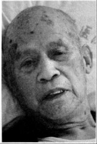
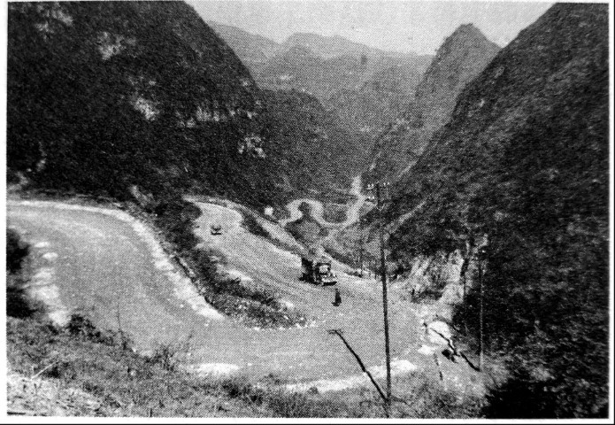
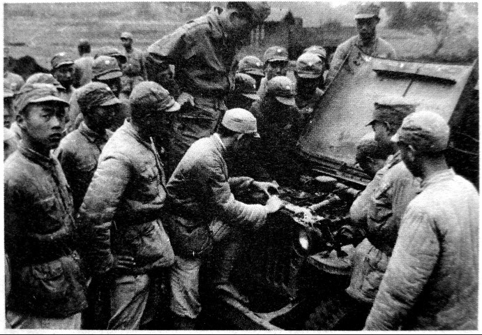

# 汽车兵：我们开车不配枪，每人背一把大刀

_躺在病床上的李祖元病情很严重，气喘得厉害，但眼晴直视着你的时候，眼神却清亮得很，而且毫不避让。为了要把自己的故事完整地讲述出来，李祖元拒绝了子女善意的关心，那种决绝的气势，带有家长特有的粗暴。_

_他的经历和故事与其他老兵相比并没有什么不同，那个时代里这样的情节每天都在上演，但他平常的经历却让人印象深刻，也许是因为老人急于表述的急迫，让这种表述看起来有一种告別的姿态，跟自已，也是跟过往。_

_“我不想把这些事情都带到棺材里去”，他说。_

**口述人 /** 李祖元，1921年生，湖南嘉禾人，原国民革命军陆军第五军辎重兵团三营二连汽车兵。1938年，李祖元在衡阳志愿入伍。昆仑关战役后随军入缅，缅甸战事失利后，走野人山回国。此后一直服役于第五军，淮海战役中阵前起义。1949年后，因起义身份，由政府安排在镇政府工作。现住永州市蓝山县国土局大院。

**采集人 /** 李桦 **采集时间 /** 2014年9月11日

### “有报纸报道了大刀队，说我们‘刀光映月，杀气冲天’”

我家里有两个哥哥，一个姐姐，两个妹妹。37年的时候，我大哥就抽丁走了，直到常德会战受伤后，才回到家里。我父亲是在我十二岁的时候去世的，生前对我说的最多的话就是，“人啊，还是要多读一点书才好”，就这样，我才能够读到高小。在学校里，我参加了抗日宣传队，主要是谴责日本人的暴行。赶集的时候，到市场上去给老百姓讲南京大屠杀，讲上海守四行仓库的八百壮士的英雄事迹。大量国土沦陷了，我们每一个中国人都要为国家出力。

1938年的时候，我考取了桂阳县的广德中学，不过家里实在是太穷了，没有办法负担学费。刚好我在《大公报》上看到第五军机械化部队在衡阳招考，我就和几个同学说，反正家里也交不起学费，不如我们去当兵吧。于是我和另外四个同学一起，穿个破草鞋，从桂阳徒步到郴州，再偷偷爬上粤汉铁路去往衡阳的火车。

到了衡阳后，我们在一个老乡开的小饭店里吃饭休息了一下。老乡问我们来衡阳做什么，我们说是来报考陆军第五军机械化学校[^1]。老乡一听就很惊讶地说：“那个学校去不得呀，那是去打仗的呀。人家抓兵都抓不到，你们自己还跑过去当炮灰！”我们那时年轻，没有听他的话。第二天在衡阳“进步” 电影院参加招考，经过五官、体型等方面的检查后，我和另外两个同学被录取了。被第五军录取后，我就和另外两个同伴一起搭乘部队的“铁篷子”火车从衡阳西站到达广西。当时应该是在柳州，开始了驾驶训练，学习开汽车。两个月培训结束后，我就当了“副驾驶员”。第五军当时就驻扎在广西，在广西境内设了好几个大的军需仓库，我就在各个军需仓库之间送物资。没有好久，应该是38年底，39年初，昆仑关战役就开打了，我们第五军是主力，我就不停地向柳州、南宁方向送弹药。

我们第五军的装备是很好的，我开的第一台车就是十个轮子的奔驰。不过我们开车的是不配枪的，每人背一把大刀，带四个手榴弹。遇到紧急情况我们也上前线杀敌。昆仑关战役的时候，我们往前方送弹药时，在路上，看到我们的人跟日本人在拼刺刀，我们就下车，拿着刀去帮忙，当时有家报纸还专门报道了我们“大刀队”，说我们“刀光映月，杀气冲天”。

### “走野人山时，上面命令汽车坦克能过就过，过不了就丟”

奔驰车是好车，当时都是烧柴油的。柴油困难时，我们就自己提炼的桐油，代替柴油[^2]。不过，我们提炼的桐油，对车的损害还是很大的，奔驰车修起来还不麻烦，就是配件难得搞。没有那个配件，有时光修是解决不了问题。后来，德国人不给我们配件，我们就找美国人，美国人的配件装上去，没有德国人的好用，就拿点火器来说，美国人的一打，火都是红的，德国人的一打，就是蓝幽幽的。而且经得搞。

昆仑关之后，我们修整了一段时间，我们辎重团也补充了不少美国的吉普车，这个车也很好开。当时我们第五军号称是机械化部队，连战车都给我们配了。

再后来，就是从云南入缅甸，我们也是过的惠通桥[^3]。到缅甸之后，我们被英国人坑了。先是打同古，死了不少人。后来那个仗就越打越难了，打了没多久，说日本人己经穿插到了腊戌[^4]，这个仗就没法打了。

打同古的时候，我们打头阵。结果英国人撤退了，搞得我们的部队被敌人包围了。现在，又让我们护送英国人到印度去，杜聿明不同意，让我们撤回云南来，这就要过野人山。我那个时候是在军部汽车队，搞通信联络的，负责往各师各团送命令。走野人山时，上面命令汽车坦克什么的，能过就过，过不了就丢。坦克和汽车我们都还是炸毁了，其他的小东西就随便扔了。

为了防蚊虫、蚂蝗，我们都是戴着面罩，打着綁腿。有一次我们装甲部队宿营，打好帐篷，正挖厕所的时候发现一条蟒蛇盘在那儿，人去赶也赶不走，没有办法，就报告了连长，连长下令调动两部坦克，对着蟒蛇交替着打，那蟒蛇一下就被打成了稀泥。好奇怪的是，我们走到哪里，日本人的飞机就炸到哪里。原姶丛林，大山里头，我们又没用无线电，敌人怎么知道我们在哪儿。后来才发现同行的当地和尚是“日本鬼子”装的，他们还带有电台。害得我们长官差点把带路的华侨给毙了。后来，车子都丟掉了，开车的病死的也有，俄死的也有。到达云南交界的地方时，我们这拔人已经没剩下几个人了。

回到云南后就是休整，也没太多的事，当时惠通桥己经被炸毁了，物资运输就很困难了，主要是靠美国人的飞机运送，我们汽车队就是在云南的各个机场跑。

在云南我印象最深的就只有三件事，第一件是个大事，具体时间我记不得了，蒋介石给我们下命令，要我们第五军就地解决龙云，要他下台。龙云当时是云南的主席，对中央的话，他一般都不听，想搞自己的一套。围攻龙云时，我们的装甲部队，还有炮兵都出动了，为了突然袭击，连伞兵都用了，把龙云团团围住在城里，没有开枪，就是请龙云去重庆开会。龙云本来不想去，一看这个架势，没办法，只好坐派来的飞机去了重庆。后来就是卢汉管事了。

第二件是小事，我们当时经常在云南和贵州之间来回跑，有一次在路上，我们的车队碰到南洋华侨志愿队，他们也开着车，堵在路上不肯让，非要他们先走，那我就不管那些，下去就骂，让他们看看车牌，他们看到7字头的车，才明白是第五军，就让开了，我们第五军的车，哪个敢拦。我的车牌照是77712，是美国的GMC十轮大卡，那时很威风的。

**行进在滇缅公路上的运输卡车。**

**一辆威利斯吉普前的驾驶兵和维修人员。**

第三件其实是私事，当时我们经常要去印度拖油料，那个距离太远了，拖一次，来回要烧掉快一半油，不合算，而且美国车也容易坏，经常要修。我们大修一般都跑到曲靖的修理厂去搞，那个厂里有一个小官也是我们嘉禾人，好像是叫王勇，看我也是嘉禾的，对我就很好，有一次他问我，想不想回老家，说这个兵没什么当头了，想的话，他就给钱给我回去。我当时在部队里，长官很器重，我就回绝了。后来美国人从加尔各答修了一条输油管道到昆明，我们就很少去拖油了。也再也没有见过这个同乡了。前年清明我到他的乡里打听他，他们说有这个人，不过已经死了。

抗战胜利后，我才第一次回到湖南，当时要我去芷江接美国人留下的好车，我接到车后，就跟参谋长一起开车翻越了雪峰山，后来从武汉去到南京，参加日军受降。

再后来，去的地方就多了，记都记不清。我去过东北，开始一直打胜仗，后来就一直打败仗。后来我又去了徐州，在陈官庄时，我们被包围了，下着大雪，交通壕里堆满了家伙，车根本开不出去。后来，连长要我们把车破坏掉，我们也没听，第二天我们就投诚了，因为我们保护了车，还受到了表扬。

[^1]: 文中所说的机械化学校实际上是第五军内部直属的培训学校。第五军作为国民革命军第一个也是唯一一个机械化军，其核心是第200师，这是中国近代史上第一个机械化师。全班人马都是以1935年成立的交通兵学校（机械化学校）为班底构建的。后于1937年3月，以200师为基础组建国民党军第一支机械化兵团。1938年11月，国民政府军委会在湖南湘潭地区组建新编第十一军，后改为第五军，隶属军委会直辖，于广西全州整训。由于成立之初，军部所在地设在湖南，因此部队中以湘籍子弟居多，尤以湘南的衡阳、郴州、永州等地为甚。第五军虽然号称是装甲部队，但抗战初期的装备依然很差，只有少量的苏制坦克和德式战车，主要的装备还是以汽车为主。

[^2]: 文中所指这一描述当时是客观存在的，由于抗战初期军事上的失利，导致战路物资极其匮乏，所有的作战物资都必须依赖进口，而作为机械化部队的第五军，对油料的需求更是迫切。为此，国民政府组织以高国恕总工程师为首的研发团队，进行研发。1944年3月15日的重庆《中央日报》头版报道：中国汽车制造公司创桐油发动机行驶汽车成功。

[^3]: 惠通桥始建于明朝末年，初为铁链索桥。它位于滇缅公路（中国段）六百公里处，是联接怒江两岸的唯一通道，在滇缅战役中有独特的战路地位。

[^4]: 腊戌为缅北重镇，远征军第一次入缅时，因日军派出小股部队快速穿插占领腊戌，导致远征军归国的道路被切断。