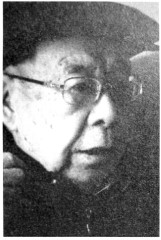
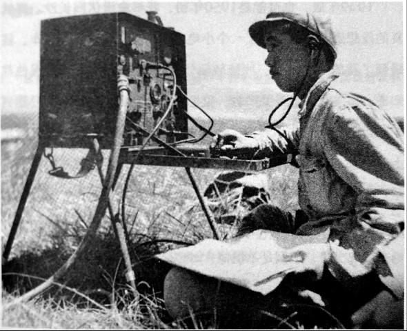

# 潜伏者：至今不轻易吐露身份

_“我的一生充满了宿命的冲突”。语文老师肖若霖说。这位抗战时期的军统[^1]谋报员以不向外人吐露他的秘密身份。“含着金钥匙”在长沙南门口出生，却因战乱四处漂泊。想逃离前线，却鬼使神差去了最前线，搞潜伏、暗杀。1948年香天，背着电台从被解放军包围得水泄不通的临汾城成功出逃，却在一年后潜伏回长沙时，因为喝酒酒叙旧“被同学出卖”束手就擒。一个老牌的军统，潜伏的时间竟然没有超过48小时．而且是在他从小长大的城市。_

_肖若霖讳莫如深的国民党军统局创立于1938年，由“中国近代历史上最神秘人物之一”的戴笠所领导。据军统破译专家迟步洲回忆，专事破译的军事委员会密电检译所，最鼎盛时也只不过一百多人；整个抗战期间，经过专业训练的谍报人员仅有三千多人；而真正接受特训潜伏到敌占区的谍报人员就更少了，约五百人左右。_

_现在只要是出太阳的日子，肖若霖都会让保姆把轮椅推到阳台上，一个人静静地看着远方发呆。透过高楼间稀疏的空隙，远处的田野灰蒙蒙的一片，就像他尘封了九十多年的记忆。_

**口述人 /** 肖若霖，1924年农历七月初四出生于长沙南门口，生肖属鼠[^2]。1941年，长沙时局紧张，为躲避危险，他报考了远在后方的军令部第二厅无线电培训班。毕业后，通过审核的他，奉命到陕南与豫西一带搞潜伏与情报。抗战胜利后，肖若霖晋升为“临汾站120分台台长”。1948年，临汾战役中，他冒死爬下15米高的城墙，渡汾河得以逃脱。1949年底，回长沙潜伏，被同学举报后投诚。1949年后，“因为我有立功表现，运动中都是正面教材，没受什么冲击。我家里的人，还有单位上的人，都不知道我的身份，只有政府里的几个人知道”。现由保姆照顾起居的肖若霖，退休前是长沙市㮾梨镇中学语文老师。

**采集人 /** 李桦 **采集时间 /** 2015年3月19日

### “你不要以为不危险，蛮危险的，敌人也在搜我们”

我爷爷是湘潭的，哪一年到长沙经商的，我倒是记不蛮清了，反正我是正宗的长沙人。小时候住在南门口，家里蛮有钱的。当年长沙只有两个大的建材铺，北门一个，南门一个，南门那个就是我家里的。店的名字就叫“肖协泰石灰砖瓦行”，专卖石灰和沙子，那个时候没有水泥。

1938年，文夕大火。我家里背时，烧光了。起火前我们全家就跟丁公和酱园的亲戚一起跑到我外婆家去了，回到长沙后，家里全部家当都烧光了。我记得，废墟上只有一个打糍粑的石白还在，但也没用了。

1941年，长沙的形势好紧张的，我爷老子（方言，指父亲）就想让我躲到外地去。我爷老子是我屋里的另类，我屋里生意做得蛮大的，但是他从西安的无线电学校毕业后就进了电报局，后来当了常德电报局的局长。我听他这么说，就想干脆去考学。当时有两所学校招生，一所在湖南衡阳，另一所在重庆綦江。我爷老子跟我讲，长沙如果守不住，衡阳也不安全，到时又要跑，重庆的话就要安全得多，因为日本人离得比较远。我就去考了重庆，当时学无线电外语要好，我外语其实不好，也就是去试一试，没想到，我还考上了，学校叫什么名字不记得啦，只记得是：军令部第二厅无线电培训班。[^3]

先搞了三个月的步兵操典，接着就学习电报的收发。我跟你说，电报机有两种，一种是人工，一种是自动，发送也是两种，一种是有线发送，一种是无线发达。你们不晓得，我跟你说，你就清白（清楚）了。人工电报机就是由人来按动电键，使电键接点开闭，形成“点”“划”和“间隔”信号，经电路传输出去，收报端那一头接到这种信号后，便控制音响振荡器产生出“嘀”“嗒”声，“嘀”声为“点”，“嗒”声为“划”，供收报员收听抄报。无线通信的情况，要复杂得多，发报端除有发报电键外，还必须要有发射机，要把电键发出的信号变换成高频载波信号，才能发送出去。在接收那一头，除了耳机外，还一定要有接收机，它将信号接收下来，再供人工收听抄报。

**位于昆明的步兵训练中心，学生兵正在操作一台SCR-284战地收发报机。**

毕业后，我就分配到了陕南和豫西一带[^4]。搞什么啊？搞潜伏。每天晚上，我们都要搜电台，搜日本人的，也搜伪军的。三班倒，全大候的侦测，还要根据侦测到的功率，判断敌后的方位。你不要以为不危险，蛮危险的，敌人也在搜我们，搜到了，就不得了了，那密码就有可能泄密。明码无所谓，关键是密码。

要说我们的功劳，那还是有的，我们有一次端掉了日军在豫西的一个电台，那些电文和资料拖了三车才拖完，拖到西安去破译。还有一次，就是那个盟军的威尔士亲王号军舰，当时我们已截获了日军的电报，还破译出来了，不过时间太紧了，等我们通知到盟军时，日本人的飞机已经起飞到了军舰的上空，后面那艘军舰被日军搞沉了。[^5]

除了搞电台，也搞点别的。间常子（偶尔）也去搞一下暗杀[^6]。抗战胜利时，我们电台的人最先晓得，那高兴得不行，搞了两个晚上没睡觉。搞什么啊？庆祝啊，喝酒啊。

1949年底，也可能是1950年初，我奉命潜伏回长沙。那就真的没想到，我当时带了一个小电台，一支左轮枪。刚下车，就碰到了我的一个发小，叫陈毓麟[^7]。他是地下党，我的情况他都知道，哪里晓得他是共产党，见了面，那就高兴啊。我们还跑到年站边上找了一家小酒馆，喝酒叙旧，连家都没有回。第二天早上，刚起床，他来叫门，我一看后面有两个兵，我就晓得冇路哒。我就让他在旅馆等我，说要回去看一下我的母亲。他点了点头，要我12点之前要回来。我把从西安给母亲带的点心送回家，回来就起义了。恨倒是不恨他，时势如此。

[^1]: 军统（BIS）是中国国民党设立的一个特务组织，全称是国民政府军事委员会调查统计局。其架构体系，一般是五级制，依次是：局、区、站、组、队。组是军统的最基本单位，大致分为：普通组、潜伏组、行动组、策反组、随军组、防谍组。

[^2]: 肖若霖在口述过程中，多次提及命理学说对其一生的影响。他将生命中很多无奈的事归结为宿命。1924年是闰年，岁甲子，五行属海中金，屋上之鼠。按照中国的命理传统，这一年出生的人，为人伶俐聪明，但学业上不会有太多成就，做事往往会有始无终。

[^3]: 全面抗战之前，戴笠就开始举办小型培训班，如上海附近的青浦班、松训班，湖南的临澧训练班等。肖若霖提到的培训班，从其口述判断，应隶属于渝训班中的特训班。培训班主要分为：情报、行动、警报、外事和电讯等几类。肖若霖参加的是电讯培训班，学员首先要接受为期半年的军事训练，之后被分入四个系：情报系、行动系、警政系和电讯系，特训班会将情报系和行动系合为秘密工作系。他们要学习情报学、化妆术、侦查术、密码、密写、武器使用、爆破、毒物学、测量、筑城学、战木学、擒拿术等科目；专业则以学习电学和无线电收发报技木为主。像肖若霖这种负责潜伏的工作人员，是真正的“谍中谍”，挑选尤其严格。第二次深度走访时，肖若霖曾说：“毕业时，教官亲自跟我说，当年学校曾派人到长沙调查过我”。

[^4]: 文中肖若霖提到的这一区域为军统西北局所辖。军统最初活动重点在长江流域东南各省，红军于1935年10月到达陕北之后，军统立即在西安设立了军统局西北局，以统一指挥陕西、甘肃、宁夏、青海四个省区的情报活动。以西安为中心，陕西、甘肃两省为主要环节。此后，陆续成立了五个省站一级的组织，其中包括西安站、兰州站、榆林站、晋南站、太原站。无线电设备方面，军统局从1935年起在西安设立了无线电支台，各地组织的无线电分台，经常保持在二三十座。

[^5]: 1941年下半年，军统侦测得知日军将在马来西亚登陆。12月4日，军统判定日军发现了抵达新加坡的英舰，但在向英军传递情报时，却受到了日军的疯狂阻截。12月10日通知到盟军时，日海军第22航空战队已在关丹东南的海域发现了英舰，并迅速将其击沉。英国首相丘吉尔接报后哀叹：这是我一生中最沉重和最痛苦的打击。但奇怪的是，二战结束后，日军不知出于何种心理，坚持认为电报是美军破译的。

[^6]: 暗杀分为两个方面：一是在沦陷区行刺敌伪汉奸等特定目标，二是有时也会对前去延安的进步学生进行绑架和杀害。

[^7]: 陈毓麟是肖若霖的同学，也是富家子弟，两人在学生时代的关系很好，几乎无话不谈。从学校分开后，肖若霖加入了军统，并潜伏到第一线去抗日：陈毓麟则留在了家乡，加入了地下觉。长沙解放时，陈毓麟已是共产党的一名中层干部，后来还当了湖南省的人大代表。“文革”期间，还去㮾梨中学看望过肖若霖，这也是他们的最后一次见面，此后两人再无联系。