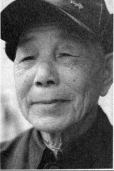
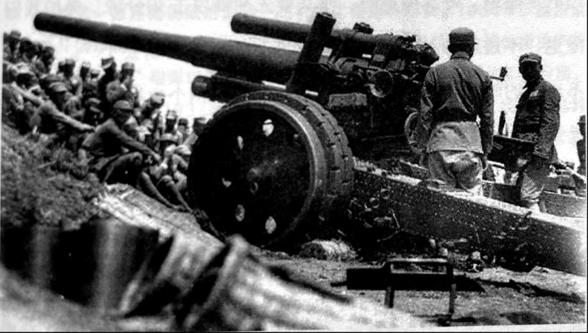

# 炮兵：一个炮弹48公斤

_叶菊明与父京叶书庭有着迥然不同的人生。父京在铜官做了一辈子的窑工，困窘到连6个儿子都无法养活，甚至于30公里外的长沙城“至死都没能去看上一眼”。只上了4年小学的叶菊明，骨子里秉承了父亲的朴实，胆子却大得多，10岁就开始外出“混饭吃”。_

_叶菊明14岁就自找窍门去了军队，本想“混饭吃”的他，居然“混进”了当时全国仅有的两支机械化部队之一的重炮第一旅[^1]。下衡阳、过广西、出贵州、入云南，差一点就出国去了缅甸。_

_从1941年开始，开着“10个轮子的大卡车”一直游走在西南诸省。在贵州，“看见9字头的车，冇人敢查”。为此叶菊明有时甚至以“一次一万块”的高价帮人走私带“黄鱼”[^2]。_

_1938年的文夕大火，让14岁的叶菊明开始了自己的抗战。多年的军旅生涯，叶菊明最爱的是抽烟，现在一天一包软白沙，“管得住”，酒也没戒掉，但奇怪的是身板却非常硬朗。“我细时候练过一点把式，前几年家里进了贼．差点被我抓住了，”生性腼腆的叶菊明不愿意当众露两手，不过话却说得非常豪气，“湘雅医院就是我们旅打的”。[^3]_

**口述人 /** 叶菊明，1924年农历八月二十九日出生于长沙市望城区铜官镇中山村叶家老屋。14岁时因为 “混饭吃”去衡阳当了看护兵，后加入野战重炮第一旅，任独立机械化炮兵第十团第一营副官。内战爆发前，对军旅生涯已觉索然无味的他回乡务农。现在，年过90的叶菊明身板硬朗，烟酒均沾，有时偶尔还下地干点农活。

**采集人 /** 李桦 **采集时间 /** 2014年1月2日

### “在驾驶连搞了6个月，开的是10个轮子的GMC”

长沙大火（1938年11月13日）那年，我14岁。乡下到处都在抽丁，我那时年纪小，就找了点窍门。刚好在衡阳62兵站医院当医生的同乡叶德宏回老屋探亲，他就跟我爷老倌（长沙方言，父亲）讲，既然家里搞不下地（长沙方言，指一件事虽经多方努力，但仍无法解决），要不就介绍我去当兵，好歹也能混口饭吃。我爷老倌想都没想就同意了。

到衡阳后，在62兵站医院当看护兵，当了两年。我那时年纪小，那些伤兵都不怎么为难我，有时让我帮他们去买东西吃，也让我吃一点。对其他的人，伤兵的态度那是有蛮恶的，动不动就骂人，打人，还摔东西。伤兵主要是从九战区的前线下来的，也不是每天都有，间常子来，一次怕有几十个。搞了两年以后，刚好36步兵处招人，我就偷偷去报了名，因为怕我爷老倌晓得，我屋里虽然弟兄多，但是我爷老倌还是不想我上前线。后来我就被分配在炮兵第一旅的补充营。当时补充营下面有三个连：一个是步兵连，一个是通讯连，一个是驾驶连，我是在驾驶连。

在驾驶连我搞了6个月，开美国的GMC，10个轮子的大卡车。车还好开，就是那里的条件太硕哒（长沙方言，很差）。训练的时候，一个人只能开20根杆子，就是那种电线杆子，大概一百多米，就要停下来换人。不过在驾驶连玩还是好玩些，比其他连轻松点。新兵连的时候，跟其他连一样，晚上我们也要轮流站岗。有一天轮到我站岗时，我们补充营的营长就过来摸哨，那营长是关外人，长得蛮高大的。我看到有影子，就喊哒一声：“哪个？”那个影子冇出声，我就赶快往旁边一跳。站岗是有套路的，不能呆站在一个地方，我一边跳开，一边把枪上膛。一般喊第二声，还冇人答应的话，就可以开枪哒。这时营长就讲是他。第二天开会，他就跟别人表扬我胆子大，反应快，说这个小鬼蛮厉害的，其实我当时也是怕得要死。

当时新兵连也是要考试的，15名以内才能毕业，我考了第13名。考试的时候，上去就要背歌[^4]，背不出来就用竹篾片打，前村吴三伢子的爷老子就是被打跑的。毕业后我就去了炮十团，按照当时的规定，前13名直接分到炮十团”[^5]，其他的人分到其他的团。我们团是直属于炮兵第一旅的，旅长是彭孟缉[^6]。还有一个团就是打湘雅医院的炮十四团。

### “一个连只配三门炮，三发炮弹打不中，连长就不要搞了”

我们一个团是24门炮，全国这样的炮只有48门[^7]。一门炮有六吨半重，每次行军就挂在牵引车后面，用车拖起跑。一个连是三门炮[^8]，基本上是一个排一门炮，那炮的口径就大啊！估计有海碗那么粗，那个炮弹一个都有48公斤，96斤重，又打得远，可以打30华里远。我们都是分散的，分到每个战区，比方说九战区就是4连，还有一部分派去打滇缅路去了。那时我们的炮好金贵的，一个连只配三门炮，三发炮弹打不中，连长就不要当了[^9]。不过话说回来，我们炮十团的连长还是蛮好搞的，打仗的时候又安全。他们主要是观测，就好像我们现在要打铜官，连长起码要跑到离阵地十几里的地方去设观测哨，那还是难得被打死。最麻烦的是撤退。每次撤退时，步兵要先冲锋攻击30分钟，掩护我们撤退，不过麻烦的是，如果路炸毁了，就撤不出去了[^10]。一般撤不出去的时候，我们也会炸路，路一炸，别个也拖不走这些炮。岳麓山上的那几门炮，就是路被日本人炸了，结果撤不下来了，后来日本人缴获这些炮后，还用油布把这些炮都裹了起来。抗战胜利后我还去岳簏山上看过。后来那些重炮都搞到镇江、江阴那边去做要塞炮[^11]去了，主要是封锁长江。

**“32倍15榴” 远程榴弹炮。**

我进炮十团的时候，一开始就在团部。后面边打边撤，就退到了贵州，后面又把我调到了炮十四团。打滇缅路时，我主要就是负责运输，从贵阳先到昆明，再从昆明去保山，缅甸我就冇去哒。总的来讲我在贵阳待得最久。有一天冇事做，就在街上走，结果碰到了老营长王升，他刚升为炮十团的副团长，他要我到他那里去，我其实冇答应，但是他从团部下了调令，就又把我调回了炮十团，在第一营当副官。要讲那时日子也还过得，当时全国只有两支机械化部队，一个是杜聿明的第五军[^12]，一个就是我们，我们的车在路上，从来冇人敢查。那个时候，只要是看见7字头和9字头的车，冇人敢碰，第五军杜聿明的是7字头，我们第一旅是9字头，没人敢管的。有时从贵州去云南，路上也带点“黄鱼”，一次就收一万块，出了事算我的。抗战胜利后，又让我去53军，我就不想去了，你想啊，我都当了六年兵了，冇味哒。我就回家了。

[^1]: 重炮第一旅是国民政府的第一支机械化重炮兵部队。1934年，国民政府开始筹建新型重榴弹炮部队，最后选定了由德国菜茵金属公司生产的“32倍15榴”榴弹炮，并在此基础上，成立了第一支机械化重炮兵团，序列为第十团。1937年，第二批 “30倍15榴”到货后，又成立了炮兵第十四团。抗战开始后，因炮兵损失严重，国民政府对炮兵进行了重组，第一旅下辖两个团，一个是第十团，一个是第十四团。

[^2]: “黄鱼”原意指金条，后被广泛引申为走私物品。

[^3]: 1942年第三次长沙会战爆发时，中国守军在长沙城北以湘雅医院为火力支撑点，在麻园岭构筑了外围阵地，战前对长沙周边进行了标尺测量，并制成二万五千分之一的标点图。长沙城北的参照物，是当时的湘雅医院的红楼。攻城战打响后，日军一度攻入城北，并占领了湘雅医院。在守军的请求下，部署在岳麓山上的重榴弹炮，对湘雅医院进行了火力覆盖，日军被逼撤退，伤亡惨重。

[^4]: 教官为了便于士兵记忆，将操作要领编成了歌。

[^5]: 老人这样说是有原因的，因为炮兵第十团装备的重炮是“32倍15榴”，比第十四团装备的“30倍15榴”射程要远，因此在缺乏重火力的国军体系里，第十团的地位比第十四团的地位要高，连人选上也要优先。

[^6]: 彭孟缉，近代中国军史上炮兵三杰之一，生于1908年，1926年入黄埔五期，1928年赴日本野战炮兵学校进修。1937年任陆军独立炮兵第十团（机械化重炮团）团长，1943年任炮兵第一旅旅长，1997年在台湾去世。

[^7]: 指从德国进口的重型榴弹炮，全称是：Schwere Feld Haubize18.18表示1918年设计定型，有的也简称SFH18。该炮由德国开发，S是德语中远程的开头字母。这些炮当时花费了国民政府的巨资，由于没有足够的外汇，部分货款是以以物易物的方式进行的，中国政府为此向德国提供了数量极为庞大的蚕丝、布匹、锡矿等紧俏物资。军政部因此下令，在每门炮的炮身上贴有铭牌，上书：“人民血汗，小心爱护。"第一旅下辖的两个团，分别配属有SFH18/32L和SFH18/30L这两个型号的重型榴弹炮各24门。到1943年，这48门炮就只有20门能打了。1947年，剩下的这些重炮，被运到江阴、镇江一线作要塞炮。现在全中国就仅剩下一门SFH18/32L，保存在南京理工大学的仓库里。

[^8]: 炮兵最初的建制是一个团下辖三个营，一个营下辖两个连，每连四门炮，但随着战事的进行，炮兵损失严重，到抗战中期时，已变成了每连三门炮，到后期时，有时一个连就只有两门炮了。

[^9]: 国民政府最初从德国只采购了2.4万发炮弹，抗战爆发后，虽然通过第三方贸易又向德国采购了6000枚炮弹，但依然不能满足需要，炮弹显得特别金贵。据湖南文史档案记载，第三次长沙会战中，日军数次攻入城内，情况危急，守军请求岳麓山上的重炮进行炮火压制，因弹药紧缺，直到最后关头，重炮才开了炮。后战事一度胶着，第九战区指挥部急电重庆，要求弹药支援，得到的答复竟然是：“弹药尚在途中，待运。”由此可见弹药的珍贵。

[^10]: 这些重榴弹炮的确是太重了，没有牵引车的牵引根本没有办法撤出战场。比如，淞沪会战时，彭孟缉率炮十团参战，虽然给予了日军重创，但其在撤退时，因为日军在公路桥上埋了地雷，重炮无法通行，只能忍痛将其推入河中。

[^11]: 设置在要塞上的重型火炮，能保护重要的永久性工事。抗战胜利后，国军的重炮基本换装为美式火炮，但这些德式重炮，因为火力强大、射程远，也没有被淘汰，而是放在了长江江防要塞上，用来封锁江面。

[^12]: 第五军是近代中国军事史上的第一支机械化兵团。该军在杜聿明率治下表现达到顶峰，200师是其中的核心骨干。第五军在昆仑关战役中表现出色，后被抽调入缅作战，在缅甸损失惨重。第五军装备精良，主要装备有苏制T-26坦克80余辆、德制“豪须”装甲车100辆、美制福特卡车400多辆、摩托车40多辆。军属重炮团拥有150毫米榴弹炮24门，各师均配有大量的山炮、野炮。这样的装备，在抗战中前期中国军队中是首屈一指的。