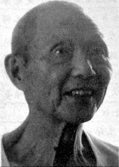
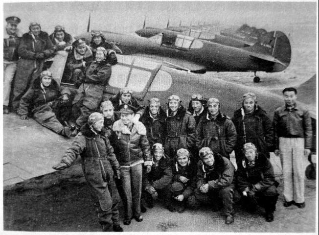

# 空军：考上第五批留美飞行员

**口述人 /** 李启炽，1921年农历三月二十九日出生，原中央航空学校第五批留美飞行员。1940年考入黄埔成都本校，在军校里学的是工兵科。1941年考入中央航校，因表现突出，被选为第五批留美训练飞行员。1945年归国，1946年为躲避内战主动脱离部队，1949年后，考入湖南医专，后在南华大学附属三医院退休。

**采集人 /** 李桦 **采集时间 /** 2015年8月4日

### “我的老师和同学都有被日本飞机打下来的”

我叫李启炽，“炽热”的“炽”，一个“火”字旁一个“只”，不是“智慧”的“智”。

说起打日本鬼子，那就惭愧得很。跟其他的老兵比起来，我这点事算不得什么，不能算是抗战老兵呢。打仗的事情真的没什么说的，不过当飞行员的事情呢，说起来还是蛮曲折的。

我以前在长沙读书，那个日本鬼子的飞机啊，三天两头来长沙轰炸。你说那书如何能读得成器。后来学校就搬家到了涟源的蓝田[^1]。当时日本鬼子已经占领了湘北，多次向长沙这边发动进攻，就算跑到了涟源书也肯定读不好了。那个时候年轻啊，不读书又没有路搞（长沙方言，无事可做），刚好黄埔军校在涟源招生，我就去报了名，我记得是1939年年底。1940年1月份我就去了成都，在那里入的伍。成都分校是南京搬去的本校[^2]，我入伍以后先分到工兵科，叫工一队。

1941年冬天，昆明航空学校在全国招生。特别是在成都、重庆、贵州到处都贴了招生的告示，我就又动了心思，毕竟工兵比较枯燥啊。跟飞行员比起来，那是一个天上，一个地下。所以一看到消息，我毫不犹豫地就去报了考。考试结束后，我的学科啊、体检啊，都符合飞行员的要求。就这样我就到了昆明，在昆明航校第15期。后来因为训练表现好，就被选上了第五批留美飞行员训练班[^3]，讲起来好惭愧的，一直到1944年啊，我都没打过日本人。1944年回到印度时，以为会派我们去打仗，那个蒋介石啊，不知道搞什么名堂，非要把我们留在印度，不让我们回来，在那里住了好几个月，一直到1945年日本鬼子投降了才回来。

但是我们中间也有回得早的，他们就参加了抗日。比方说刘英爱，他是武汉人，在武汉跟日本人的飞机对打，把日本人的飞机打下来了以后，自己的飞机也受损，辆牲了。还有的呢，回来以后就参加飞昆明到印度的那个驼峰航线。日本人知道以后，就派飞机从缅甸起飞在中途进行拦截，想把我们的运输机打下来。我的老师和同学都有被日本飞机打下来的。老师是我原来在15期培训时的国内教官，东北人，叫闵征杰。我的同学叫夏日升，是湖南益阳人。在驼峰航线上我的同学还死了很多，只不过他们的名字我记不起了。

惭愧的是我没有参加过抗日，唯一一次打日本人，还是在云南的祥云，当时中国政府在那里修了两个机场：一个叫云南驿机场，另外一个好像叫什么北屯机场[^4]。我们的飞机就停在云南驿那边。那个时候美国己经派了一个飞行队来，叫志愿飞行队，就是Volunteer，中国人爱喊“飞虎队”。美国飞虎队的飞机也停在那里。日本人占领越南以后，想把这条运输线打掉，就经常从越南那边起飞，跑到中国这边来偷袭，他们就是想要搞掉美国人的飞机。为了应对，我们就在机场上放假飞机迷惑敌人。

**中美飞行员在P40战机前合影。**

有一天下午，警报突然响了，我们就赶快去取武器，当时所有飞行员都配发武器，每人一杆步枪。远远地看见日本人的飞机飞过了前面的山头，然后迅速朝下面俯冲，去打跑道上的木头假飞机。我们就作死地向山上跑，因为山上有保护飞机场的陆军，他们有高射机枪的，一看见飞机飞过来，他们首先开了火。我们一看他们开火了，就都开了枪。日本人的飞机一看中了埋伏，掉头就飞跑了。教官后来同我们讲，那个日本飞机被我们打得冒烟，飞了没好远，就落在弥渡那边的稻田里面去了。

所以，我这个人，从1940年元月份到那个成都军校算起，直到日本人投降，要说抗日，就只有在云南驿这里我是抗日的，其他时候我都没有对日本鬼子打过枪。你们叫我抗战老兵，我真的是不敢当啊，这真的不是谦虚。

### “初级飞行是民航教官，到中级飞行才有军航的教官，这点还比不得国内”

我在美国待了有两年多吧。那个时候的日子还是不错的，可惜“文化大革命”的时候把那些相片都搞走了，不然你们可以看看我在那边拍的照片。我们那个飞行训练，整机飞行，毕了业的都会发一个本子的，就跟现在的毕业证一样。在“文化大革命”的时候，这些都是罪证啊，我就主动上交了。

在美国的时候，也有一些华侨去慰问我们。不过次数也不是很多，去了也就是给我们带点吃的，其他的也就没什么了。我们那个时候是在加利福尼亚州过去的一个省（老人口语，省应为州），叫做Arizona，中文译过来叫亚利桑那省，差不多所有的中国学生学飞都是在那里，从初级飞行到中级飞行到高级飞行。在这里培训毕业以后，就要到亚利桑那北面的一个省叫做Colorado，科罗拉多，在科罗拉多那里主要的就是学习战斗机的飞行。像轰炸机那些，也都是在那里学。学完以后才能回国，回国以后就飞战斗机和轰炸机两种。

老实说我的外语水平还是一般，没有你们认为的那么好。但是在美国出门买东西跟人沟通是没有问题的。那个时候像我们这样的中国留学生是一批一批来的，我们第五批只来了五十多个人，主要是那个时候交通很不方便，海上德国鬼子有潜水艇，船经常被击沉。航空就更不用说了，要过那么多国家，到处都可能会遇到危险。到美国来那就费了八辈子劲。当时我们是从印度的孟买坐的轮船，先要统道非洲，到了摩洛哥以后，再绕道南非，然后再过好望角，转到大西洋，这才到了纽约上了岸。

在美国的生活跟你们想的也不太一样，其实也就是部队的生活，不是自己在家里过的生活，吃饭都是像现在解放军一样的啦，用铁盘子。美国人的饮食并不很合我们的口味，而且有一样东西吃的非常多，洋芋头，就是土豆，土豆磨成粉，做成面条，就跟我们的方便面一样的，做成一坨坨的用纸盒子装起，吃的时候用牛奶或者什么鬼东西再泡发，这是中午的吃法。晚上会换一些花样，有时土豆杠杠（湘南方言，意指一条条，其实就是土豆条），有时土豆浆糊，好大一缸土豆糊糊放在那里，你经过那个地方炊事员就挖一瓢给你，不管你喜不喜欢。听那些老兵说，一个美国人一年要吃掉一百多斤土豆。所以说土豆还是蛮好的嘞，土豆里面含磷啊。其他的家伙就更没得选了，只能按照美国人的规定搞，没有什么好挑剔的。

在美国学习飞行的时候，我们基本上不跟美国人在一起玩，就算待在一个飞机舱里面，有美国学生、中国学生、英国学生、法国学生，但是互相之间也是不打交道的。最多互相看一看，点点头就算打了招呼了。平时都是中国学生跟中国学生在一起玩，外国学生跟外国学生在一起玩。初级培训和中级培训的教官都是美国人，到高级飞行的时候就有几个中国教官了，跟他们交流就亲切得多。初级飞行是民航教官，到中级飞行才有军航的教官，这点还比不得国内，没打仗的时候，在杭州的航校里就都是部队教官，后面到昆明也都是部队的教官，四川一个培训班里连初级飞行都是部队教官。我听他们老兵讲，这些教官都是在新疆由苏联人教的。其实我们的飞行水平还是可以的，主要是飞机不行。

1945年回国以后，第一次开飞机上天，是从印度飞回到成都。回国以后日本鬼子已经投降了，我们飞行大队就被安排到了上海大昌飞机场。1946年，我们部队有两个飞行员，一个叫刘善本，一个叫张邵怡，他们就开着飞机飞到延安去了。那个时候我也受到了影响，1948年秋天我自动离开上海回了湖南，后来飞行部队到湘潭到处通缉抓人，我就跑到乡下我叔父家里躲了起来，这一躲就是大半年。[^5]

[^1]: 蓝田地处湘中，为涟水发源地。抗战时期，因地处后方腹地，因而成为了众多学校的迁徙之地。

[^2]: 文中所指的本校指黄埔军校。该校于1924年6月16日在广州成立，后因北伐迁至武汉，宁汉合流后，又迁至南京。1937年8月，因战事黄埔军校迁出南京，1938年11月，迁抵成都。抗战爆发后，黄埔军校在全国开办了多所分校，为了区分，人们习惯性称成都分校为本校。

[^3]: 日军占领越南后，经常从越南起飞空装昆明，起初中国方面还能勉力接战，由航校的教官驾机截击，但我方的飞机多为苏联造的E15、E16型战机，飞行高度不够，无法对抗日军的零式驱逐机。后昆明航校被日军炸毁，制空权为日军掌握。在此情况下，陈纳德返美后，推动美国政府与中国方面的合作，因为当时美日还有外交关系，所以只能通过租借法案进行合作。一方面中国选派航校学员去美国接受培训，培训地点为亚利桑那州的菲尼克斯城；另一方面，陈纳德组织100架P-40战机援华参战。所有的费用都由租借货款支付。这就是留美飞行员的由来。由于交通及人选问题，留美飞行品是分批次出发的，总共有12期学员，分成两批赴美，每批50人。

[^4]: 抗战时期，国民政府曾经在此修筑了两个机场：云南驿机场和北屯机场。云南驿军用机场在祥云县下川坝云南驿古镇至旧日站村之间，占地约260亩，有用粗石砂铺就的跑道和停机坪。机场建成后，国民党航空部队第38站建立并由守备团、宪兵队、高炮连等三类地勤兵种分工协作，进行机场的维修保护，建制比较完善。1941年，美军第14航空队的25战斗机队和第23运输机队各类飞机两百余架进驻该机场。

[^5]: 抗战后的事情，李启炽自述“我虽然惨，还算是幸运的”。1949年8月，他参加了测量队，后来考上了湖南医专。那个搞了一架飞机飞到延安的刘善本，后面又到东北的航空学校当校长，也死了。1956年肃反运动时，组织上给我下了结论，属于95%以内的好人，就是已经搞清了，我是清白人。”他现在身体不错，还能担两桶水下楼梯，每天都要静坐，常吃鱼，他还说，“这个人啊，就像一盆花，你要浇水，但是不要浇开水”。