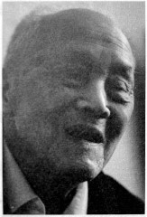
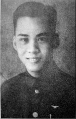

# 防空兵：有些装备，你们见都没见过

**口述人 / 刘建白**，1922年农历五月初八出生，长沙霞凝人。原湖南防空司令部下属防空情报所上尉科员，主要职责是负责组织地方民众防备日机轰炸。因为是土生土长的老长沙，虽然年岁已高，身体也不行了，但豪气依然，调子（长沙方言，泛指行事高调、张扬）很高。从煤炭厅退休的刘建白，平时热衷书法，跟他的性格一样，刘建白偏爱草书与大字，出身书香门第的妻子是中学老师，写得最多的是小楷。由于文化程度较高，加之参与了湖南的和平解放，一直都当干部的他，目前退休工资有5000多元，日子过得安详而充实。前不久刚从美国的女儿处回来。

**采集人 /** 李桦 **采集时间 /** 2014年5月12日

### “当时长沙只有三个电动警报站，其他街巷都是敲庙里拆下来的钟”

我是长沙人，但是在湖北开始上学的，因为我父亲刘培元在1927年的“马日事变”中受冲击，全家跑到了汉口，后来1938年初日军逼近黄梅、武穴，武汉告急，我们又冒死跑回了霞凝。

回到长沙时，我已经差不多十六七岁了，我想从军，但家里人不同意，我家就我一个儿子，而且我身体不蛮好，从小就经常生病。最后，我跟我父母打商量，他们同意我去投考湖南省防空司令部的防空训练班[^13]，这样就不用上前线了。

当时考试的人也不是很多，我的考试还算顺利，成绩合格，但体质较差，培训了三个月后，把我安排到防空司令部下属的防空情报所，专门搞防空情报。

当时湖南防空最上面是湖南防空司令部，下属有防空情报所，每个县有防空监视队。大的县设大队，小的县就设小队。县下面的乡里都设防空监视哨，每个哨有六七个人，有一个哨长，其余的都是哨兵，他们每天分成几个班，用望远镜日夜轮流对空监视。

当时日本人的飞机轰炸湖南，主要目标就是怀化的芷江机场。所以怀化周边我们设了很多队哨，连靖县我们都设了好多人。前哨站设在岳阳与平江一线，像当时的平江、湘阴这些地方都设了哨所。这些哨兵经过培训后都很有经验的，有时候只要一听声音就知道来的是什么飞机。比方说，轰炸机的声音就要比战斗机的声音闷一些，战斗机的声音要尖一些。

哨所一旦发现敌机的情況，立即用乡村电话通知县上的队里，队里按报后通知省里，省里再长途电话通知到部里，部里再根据情况通知到各防空情报总台，总台再用无线电通知下面的各分台，就这样层层传递。我们这边也有代号，比方说4队报告，4队就是指湘阴，4队5哨报告，就是指湘阴云田发现的敌情，都是有套路的。情报上传到后方后，如果可以接敌，我们的飞机就出动，如果不行，我们的飞机就转场疏散。

哨所一般观测日本了机的数量、方位、速度、机型。像我们搞多了就很熟，轰炸机就是用F-B代替，侦察机就用F-X代替。日本飞机的出动其实也是有规律的，每逢农历的十三、十四、十五、十六都是高频期。一般三架一小队，九架一中队，十八架一大队。

长沙这边，在防空司令部下面还设有防空防护团，这个团主要的工作就是防空善后和拉警报。他们的组成比较复杂，有负责救人的医生、负责灭火的消防，还有负责疏散的军警。长沙的每一条小街小巷都设有专人负责。

当时长沙只有三个电动警报站，一个是在中山路的国货陈列馆，一个是在南门的天心阁，还有一个是裕湘纱厂的汽笛。其他的街巷都是用庙里拆下来的钟。一听到空袭警报，每个负责的人就敲钟，大家就在防护团的指挥下进行疏散。当时薛岳在文艺路的司令部开会，就是派我坐在电话机旁边。一接到电话，就要中断会议进行疏散。

我们的设备很差，但责任心很强。所以日本飞机每次临空时，我们的人都疏散了，我们虽然没上前线，还是有功劳的。1945年，抗战胜利前夕，美国飞虎队的陈纳德受命回国，在回国前，为了感谢中国防空情报人员的工作，特意给每人赠送了一枚镀金的勋章。

**佩戴襟翼勋章的刘建白。**

[^13]: 抗战中期，随着战事的深入，国民政府逐步丧失了制空权，为了最大限度地减少日机轰炸的损失，全国各地都成立了地方防空组织，一是培养防空人才，二是宣传防空，提高民众的防空意识。文中所指的防空训练班，当时隶属于第九战区。