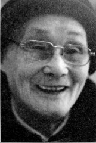
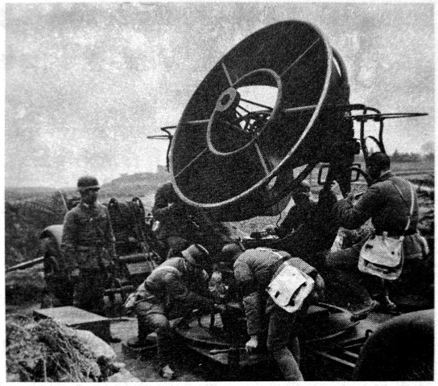
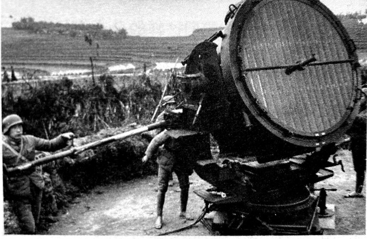

# 防空兵：有些装备，你们见都没见过

**口述人 /** 房可吉，1927年农历五月初九出生，湖南宁远县太平乡新白土村人。原国民党军事委员会防空情报六总台120分台无线电通信队通信兵，主要职责是在湘黔边界的玉屏，监视飞往“陪都”重庆与“飞虎队”驻地怀化芷江的航线。在长沙市第一监狱待了28年后，房可吉在长沙市近郊的洪山桥安了家。75岁时，房可吉还踩着三轮车去三十几里外的高桥大市场进货。随着万家丽路的扩建，拿到拆迁补偿款的房可吉跟儿子住在月湖大市场的安置房里。

**采集人 /** 李桦 **采集时间 /** 2013年12月17日

### “国产的这个家伙天线有35米高，一点都不保密”

我是在四分校[^3]学的无线电。当时在41师当师长的大表兄李资[^4]，为了我既可以不用上前线去冒险，又可以稳妥地谋到一个前程，在给我的回信中，强烈建议我去考军校，当时湖南武冈有个二分校[^5]，主要培训的是步科，但是步科上前线的可能性太大，所以他强烈要求我去投考四分校。

我给他写信大概是在1942年前后，我差不多15岁，离了老屋“司马第”[^6]，先是跟着本家大哥房可圣去祁阳黎家坪投靠表哥李直，他在陆军第52野战医院当政治处主任，分管后勤。在医院里干了快3个月，我觉得没什么意思，当时年纪小，一心想干点大事。就写信给了大表兄，后来他就委托我的表嫂以九战区最高长官薛岳的名义[^7]写了一封推荐信给四分校，就这样我从长沙去了广西，当时四分校已经从桂林迁到了广西的怀远。

到学校的时候，考试已经结束了。因为我是推荐的，有靠山，所以我是直接入学的。我们那个通讯队有41个人，后来有一个郴州永兴的被淘汰了，就只剩得40个。我们分队主攻的是无线电通讯。当时的队长是宁远人胡振华，副队长是蔡波。学校的条件很艰苦，房子是用竹子盖的，没有瓦，屋顶上全部用杉木皮挡雨，吃得也不好，反正是很艰苦。

虽然不用考入学考试，但是科目考核还是要参加的，考不好照样淘汰。每天有12个小时的课程，训练相当严格，主要学习电报的收发、电译、无线电修理，还有英语简语。比方说，飞机就用一个字母代替，我记得好像是用F。常用的词语我们都能背出来，像东、南、西、北、中国飞机、美国飞机、日本飞机。还有就是飞机的高度、速度、方位，这些我们一看就知道。一分钟要记190个字母才算及格，最快的可以记得400个字母。星期天晚上还要夜间演习，教官在教室发电报，我们就在另外的教室接收，不合格的要淘汰。考试非常严格，三人一组在野外考核，轮流发轮流记，回来老师一看就知道，做不得假的。没有好久，我们就被调到了贵阳的中央防校，防校的条件就比四分校好多了，我们在贵阳的驻地在南厂兵营，那房子在当时就好得很，有好几栋，操场也很大，操场上放了好多设备，你们都不认得的。

那个听音机[^8]，操场上有好几台，都是德国西门子的，一个好大的喇叭，里面缠了很多线圈，下面还有四个轮子，可以推着跑，也可以用车牵引，一找到敌机就用探照灯照。一般是两个探照灯同时交叉照，那个探照灯也是德国西门子的，里面不是灯泡，是碳棒，两个碳棒一靠近，发出的光好亮，温度也高，人一般不得拢去的。轰炸机最怕探照灯了，一照住，飞行员就看不清了，地上的炮也好打些。

**听音机。**

**防空探照灯。**

还有一种装备，你们更是没见过，就是这种四米探测仪[^9]，中间是一个观察镜，两头也有两个观测镜，两头的镜子是可以转动的，通过折射就可以看到飞机。管子里面有刻度，通过计算，一下就可以算出飞机的高度和速度。后来我到玉屏时用的没这个大，是个小的，可以用两根皮带吊在脖子上追着飞机跑。

我是1944年到的玉屏，一直待到抗战胜利。1944年5月，我们正在分组通报演练，接到总队通知，全部到防空第六总台[^10]紧急集合。后来点名分台时，我和一位四川同学张英分到了120分台,台长是湖北人葛清。

第二天，我就和张英还有葛清乘车到达了湘黔交界处的玉屏。我们的工作是监视重庆、成都和芷江的航线和天气情况。玉屏是山区，没有米吃，每天吃苞谷。

我们台用的是湘潭电机厂生产的15瓦的小电台，最多只能传60公里，发电还要两个人手摇，没有美国的先进，他们的是汽油发电，还不用天线。我们国产的这个家伙，那天线要35米高，一点都不保密，别人好远就能发现，所以我们一般都躲在深山里。整个六总台像我们这样的分台有好多个，一般都是按品字形分布的[^11]，但我们对邻台的情况也不清楚，都是保密的。

那个时候，日本人的飞机来得少，因为这边有美国人的飞机。每天我们三个人轮流值班，24小时不间断，连说话的人都没有，每天都觉得好枯燥的。不过，美国人还算有良心，1945年抗战胜利后，给我们六总台的每一个人都发了一枚胜利金质奖章[^12]。领奖的那天我一看，我们六总台的人也不少，估计差不多有300人。那个奖章做得好，两边是翅膀，中间是一个圆圈，里面有字，还有一架小飞机。可惜的是，解放后，被他们抄家搞走了，真的是可惜了。

[^3]: 抗日战争时期，黄埔军校一共设立了九所分校。广州分校1938年1月改称中央军校第四分校，抗战爆发后该校多次迁移，最终确定以贵州独山为校址。分校主任韩汉英。该分校从1936年到1945年共毕业学员25212人。

[^4]: 李资是国民革命军41师师长，与其弟李直及其妻三人皆毕业于清华大学，后渡江战役前死在镇江。系房可吉的远房表哥。

[^5]: 1937年“七七事变”后，原中央军校武汉分校，迁往湖南省武冈，改为中央军校第二分校，分校主任为李明灏。该分校从1938年至1944年共毕业学员23487人。

[^6]: 老屋名“司马第”。房可吉据此推断祖上应有人为官。

[^7]: 以薛岳的名义写信是有可能的。李资是41师师长，划归9战区，为薛岳所领导，他的妻子清华毕业后投身教职，薛岳在湖南大办教育时，双方关系很好。

[^8]: 听音机是早期地面防空设备的一种，主要与探照灯、高射炮等装备配合使用。一般的程序是，先用听音机辨别敌机来袭的方位，然后再用探照灯指明方位，最后由高炮射击。

[^9]: 当时一种地面防空设备。

[^10]: 抗战期间，为了应对战争的需要，国民政府在全国各地建设了不少防空情报无线电台。因为无线电设备的功率决定了信息传输的距离，因此国民政府一般是在重点区域先设一个总台，然后再围绕总台按照传输距离设立相应的分台。

[^11]: 抗战时期，大功率的电台多需要进口，在军队装备中非常少。一般基层部队中装备的多是国产小功率电台，以15瓦的为常见，这种设备的传输距离非常有限，一般不会超过60公里。为保证信息通畅，多以60公里为基准建设分台，同时为了保证联络与信息备份的需要，均以品字型分布。

[^12]: 此处老人的记忆有误，应是“襟翼勋章”，是陈纳德为感谢防空情报员对飞虎队的帮助，给每位中国防空情报员所颁发的纪念奖章。房可吉称其为“胜利金质奖章”。刘建白看到报道后辗转联系上我们，指出房老记忆的偏差，并出示了一张自己戴着襟翼勋章的照片，照片中勋章的模样与房老手绘的图案完全一致。