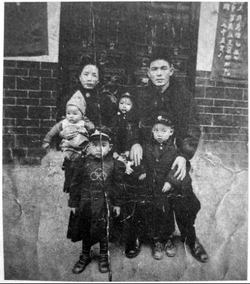

# 别动军：装备比嫡系、王牌都还好

_别动军[^1]第四纵队是一支军统下属的武装，是游击队，装备却可能比那些嫡系、王牌都要好，前后抓俘虏一千二百余人的战果也算得上“辉煌”。_

_2014年6月7日，宁乡县老粮仓新光村狭窄的村道上，白衬衣外罩着灰色薄背心，手臂上搭件黑色外套，腰背挺直地朝我们走过来的何月祥不像个当兵的，他戴着眼镜，看起来更像个教书先生。他思维清晰，性格直爽、客气，热情大方，礼数周到，精神状况也不错，但记忆力稍有退化，一些人名地名“堵住了”，想不起来。_

_这支部队的司令，湖南宁乡人、少将何际元[^2]也很少有资料记载。其子何衡生对于父亲的生平及活动，跟我们一样，也只能从档案里了解。_

_“听姑姑说，他很爱干净，姑姑帮他洗军人的那种白衬衣，没有肥皂，就用淘米水反复洗。他身体强健，作息规律。每天早起，双手往前平伸，提两大桶水，在三根木头做的桥上，走四个来回，锻炼体力和平衡力”。_
。
_当时的湖南，除了别动军第四纵队，在衡阳、祁阳一带还有别动军第七纵队，在怀化芷江有第三、第六纵队。_

_其中数何际元的四纵队最为出名，他本人也有“湘中抗日名将”的名号。七十多年前，这支队伍在湘北、湘中的山林、水泽、小道旁打游击，抓掉队的日本兵，用麻袋套俘虏．抗战结束后，队伍随即被解散。_

**口述人 /** 何振球，1929年农历十二月十六日出生，宁乡县人，1944年加入别动军第四纵队，任特务队副官。现居宁乡县老粮仓镇新光村。1950年何际元被枪毙后，受牵连被判刑到青海改造18年。1983年平反后回宁乡，现与哥哥的遗孀及子侄辈一起生活。

**采集人 /** 刘见华 **采集时间 /** 2014年6月8日

### “我们哭哭啼啼地回去报告，何司令发了很大的火”

我呢，对于打日本人，对于战争的看法，也没什么好多说的。只知道老百姓很苦，到了1944年，日本人也很困难了，他们经常在村子里扫荡，搜刮粮食，还抓老百姓去给他们做挑伕干杂务。那时我们上宁乡还没有被鬼子占领，老百姓都往这跑。

何际元在宁乡招青年学生还有退伍的官兵抗日，我父亲在何际元的部队，我就和一百五十多个宁乡学生一起，参加了三个月的“宁乡沦陷区青年训练班”。后来又去了宁乡田坪里，分到中美特训班第5期学生队，武器都是美式的，我们学习武器的使用、装卸、养护等[^3]。

田坪里那地方都是山，中间有一块开阔地，是陈家祠堂，有七八间屋子，除了每年祭祀以外，大部分时间闲着。地主庄园和民房也不少，住几百号人不成问题。我们每个队驻扎一个祠堂，屋子很宽敞，都有小操场，场内搭指挥台，让司令训话、阅兵，还有军乐队表演。每天早上，何际元会登台训话，有时也由他的参谋代劳。然后，一起唱班歌，也就是军统局的局歌。

何际元爱体面，他的兵马刚开到宁乡的时候，要经过草冲河的木桥，他就让警卫队骑着马绕着圈子来回过木桥，马蹄“得得得”响了一夜，第二天就有人传开了：何际元回来啦！过了一夜的兵马，不知道他带了多少人回来了！为了扩大影响，显示威风，何际元又在这边的林山学校摆宴席，宴请这地方所有的乡长、保长、甲长、族长，摆上几十桌。何际元穿着高级黄制服，咔叽布做的，戴了少將领章，金质的，摆够了面子。

**何际元全家福，1948年摄于宁乡大宅。（从右至左，后排为何际元、次子何宁生、妻李素梅；前排为长子何衡生、次女何舜珍、三子何蒲生。长女何碧茹在外上学，小女儿何寄婧尚未出生。）**

毕业后，我到了特务队。别动军主要就是抓俘虏[^4]，方法很多，日本人走路的时候，有少数掉队的，我们就从树林中突然冲出来，截住尾巴上的几个，抓了就跑！有的据点日本人不多，搞伙食的、挑水打杂的，常常找中国人效劳。游击队员就装成老实农民，混进去当伙夫，表面上老老实实，一看时候到了，跟外面的队员一起，十多个鬼子的据点就连锅端了。

除了日本兵，其他日本人也抓。其中一个叫春堂芳子的，是三井洋行的，常常自己出去买菜，游击队就派一个队员装扮成卖菜的，故意挑一些晒黄的菜叶，还有烂菜，她嫌菜烂了，那队员就说他的菜园子离这不远，可以让她挑。然后把她带到菜园子，她刚弯腰拣菜，队员就从菜担子下取出麻袋，兜头一罩，背起她就进了林子[^5]。

抓的俘虏都统一在别动军总部，就是宁乡这边看管。我们特务队都是小队员，任务除了警卫总部，就是看俘虏。在长塘湾的屋后有一口大鱼塘，到了夏天，我们就荷枪实弹押着日本俘虏在塘里洗澡。对于当地百姓来说，看着鬼子赤身裸体在中国人的枪口下洗澡，没有什么事比这更痛快的，村民们常常往塘里撒尿，向鬼子身上投石头、吐口水，戏弄日本鬼子。

关押的俘虏大多很老实，但也出现过意外。1945年的一天，我跟另外三名队员，谢迪佳、彭沅浜等押送十二名俘虏。我们几个都是十五六岁的少年兵，警惕性不高，途中突然四个俘虏分别上来抱住我们，其余的一齐上来夺枪，然后一溜烟往山里逃走了。

我们哭哭啼啼地回去报告，何司令发了很大的火，让特务队长戴模宗马上去追，但这地方全是深山老林，哪里找得到？只好在四周设卡，封锁出路。

后来，其中一个俘虏受伤后在池塘边喝水淹死了；有两个被老百姓包围打死；还一个到老百姓的红薯地偷吃红薯，被农民发现，叫来乡丁就地枪毙，农民还把他的头割下去领赏。至于其余的，也许都饿死在深山野林了。

何际元性格比较严谨，治下很严，发起脾气来大家都怕他。但他写得一手好字，也讲道理，喜欢穿白讨衣，并不是什么草莽武夫。

抗战胜利后，我开始当何际元的副官，以后一直跟着他，到现在与他的后代家属还有联系。[^6]

**口述人 /** 何月祥，1923年农历四月二十五日出生，宁乡县人，1944年在乡参加别动军，编入第四纵队第一支队第二大队，任上士副官。他像个教书先生一样，把自己的一生娓娓道来：当学生，当老师，然后是当兵，再然后是当修房子的犯人。他现在住在宁乡县老粮仓镇新光村，还能干些简单农活。

**采集人 /** 刘见华 **采集时间 /** 2014年6月7日

### “抓到鬼子俘虏，马上就要把他们的鞋子脱了”

民国的好大学啊？北大、清华、复旦、中山，这些吧。哦，还有医学院。我呀？我没上大学。因为学费便宜，我初中毕业就去了职业学校，在“精炼高职”[^7]读土木科。没去上普通高中，要听父亲的，土木学了出来有工作。如果读个普通高中，那没工作，那还得去读大学。我父亲就负担不起了。上大学，那是幻想，那我不想。只想着早点高职毕业，能够自己谋生活。

我高职没有读完，日本鬼子就来了，屋里也没有钱了，我父亲就讲，“算了，你莫出去了”。保上的人看我读书多点，让我在地方上教书，教小学。

才教了一个月书，日本鬼子来了宁乡。我不愿意再在乡下当老师，认为当老师没有出息，打不得日本鬼子。那时对日本鬼子的仇恨是很深的。我读书的时候就知道“九·一八”，1937年打卢沟桥，“八·一三”又打上海。搞得我们书也读不成，老百姓也苦，恨死了日本鬼子。

我要报名去当兵，父亲不同意。他说，别人抓壮丁都不去，你却要自己跑去？我母亲很怕，但也不说什么，就是一个劲哭。我上过几年学，比一般农民要开化点。我们读书的时候有宣传，保家卫国、匹大有责！这次我没有听父亲的，参加了别动军。

到1944年6月间，日本鬼子已经打到了石潭，就在湘潭那个地方。那个时候，我们负责在后面阻击日军，友军还有73军、74军。第九战区司令长官薛岳组织我们这几个军在石潭阻击日军，要拖缓敌人向株洲、衡阳方向的进攻。在石潭打了两天两晚，日本鬼子的伤亡很重，我们伤亡还不见得大。为什么呢？因为我们是在这里等着他们来的。但是，因为日本鬼子实在太多，结果我们还是没有守得住。他们虽然有消耗，但还是通过了。[^8]

8月，日本人占领衡阳后，湖南只剩下湘西还在中国人手里，湘东、湘北、湘南都沧陷了。我们的部队，没地方撤，就在衡山到岳阳的铁路沿线打游击。打游击，那就和大规模作战不同。打得赢，我们就打，打不赢的时候，我们也不去送死。[^9]

1944年底，日本人的火车也开不动了，没有煤。我记得那时火车都烧柴火，一般的步兵都是靠走路。他们走路，地形也不熟悉，我们躲在隐蔽的地方，看到日本鬼子来得少的时候，就冲上去抓他们。一次我们抓到五个人，有两个人我现在还记得名字：玄板德三郎、金井四郎。

**2014年6月7日，何月祥接受采访。**

冬天，我们一个大队在长沙周边打日本鬼子。那个时候其实日本鬼子也好打，他们补给跟不上，已经没有饭吃了，老要派人到外面“打捞”，就是去老百姓家搜刮粮食，抢吃的，抢穿的。

有一次，在长沙跳马的石门村，我们看到一个日本鬼子出来“打捞”。就一个人，拿一条手枪，押着五个老百姓，让他们担着东西。那天下着雨，他们正从一个水塘边经过。塘边黄土溜滑溜滑的，“啪”的一声，那个日本鬼子脚下打滑，摔倒在泥潭边，弄得一手的泥水。他把枪放在脚边上，弯腰够水塘里的水洗手。这五个民伕站在边上，望着，不动一点儿。我们在远处看着，真是急死个人。打，怕打到老百姓，不打，又实在太可惜。这几个人就是太老实了！随便哪个从后面给一脚，就能把那日本鬼子踹塘里去。可他们就只望着，结果那个日本鬼子洗完手，拿上枪，又押着他们继续往前走。

**日军军靴。**

我们一路跟着走，后来他们进了大路边上一个茅草屋，里面有十几个日本鬼子，那里大概是他们集合放东西的地方。我们从外面把他们团团包围住了，喊话让他们投降。但他们就是打死不投降，我们就把那屋子点了火。他们受不了往外跑，那就好打了。他们出来的时候，一个个蒙着脑袋，哭的哭叫的叫，实在是痛快。这次12个鬼子，我们通通都抓住了。哈哈！

抓到鬼子俘虏，要特别注意，马上就要把他们的鞋子脱了，他们鞋子上有铁钉，踢起人来也是武器呀。而且，抓到俘虏，要走在他们后面。如果走前面，你就危险。他随时可能跑上来掐住你的脖子，日本鬼子训练有素，那都是学了武功的嘞，身手厉害得很。

那个时候国民党讲人道，俘虏不杀。但是日本鬼子就不像我们呢！抗战胜利的时候，中国的俘虏基本冇得。他们如果有俘虏，就让做劳工做苦工，任务完成了就集体消灭。日本鬼子真是世界上最残酷的人。我们中国人呢，抓到日本俘虏，如果有病还要给他们治病，要给他吃的，还要吃好。[^10]

日本鬼子投降后，我们放肆庆祝，那个热闹，敲锣敲碗，下不得地。[^11]再以后，讲起来就不怎么光荣了。我被编入新六军169师505团，担任补给副官，在东北打共产党。后来回到湖南，在长沙起义投诚。

我后来受的磨难多了，可是，人呀，受到那些苦，却是越磨难越不得死。我活到九十多岁了，我无怨无悔。

## 延伸：四纵队及何际元的结局

别动军为戴笠所控制，抗战胜利后，陈诚力主裁撤别动军，1946年戴笠死后，别动军即与交通警察部队以及汪伪税警总团，合并成立了交通警察总局，别动军至此完成了它的使命。

宁乡县流沙河镇政府编写的《少将何际元》一书（未刊行）记载，别动军解散后，作为四纵队司令的何际元，辗转到东北，后任79师少将师长。当解放军反攻时，何际元认识到，国民党大势已去，便假借母亲病危，请假回家省亲，并辞去了师长之职。1949年春，何际元下决心“反水”，脱离国民党。他组织部队起义，建立“湖南人民自救军湘中纵队”，自任纵队司令，与他接头的共产党党员汤菊中当了政委。

在与国民党军队的交战中，何振球与他的司令何际元生死与共，“何司令曾肋下中了两枪，逃到一家牛棚顶上，才没被发现”。有一次在战斗中被沖散，国民党军队追了过来，那时何振球19岁，“我也背不动司令，只好拖着他跑，看到路边民房有一个厕所，我掀开厕所的木板，一起跳进粪坑里，再盖上木板。敌人把民房、猪圈、牛棚都搜了个遍，就是没到厕所里来”。敌人走后，何际元还告诉何振球，“这件事跟谁都不要说，影响人的尊严”，何振球小声答了一句，“胜败乃兵家常事”，何际元一下子气急了，“不是败在厕所里！”

1949年秋，何际元回到宁乡老家，做起了开明绅士。1950年9月25日，湖南省人民法院判处何际元死刑。罪名有十几条之多，“地主出身” “参加反革命集团” “军统特务” “盘踞一方” “勾结白匪” 等。

行刑地点就在今天的烈士公园内，家人当时不在场，他们是后来才知道。“听说，第一枪打了后，没打死，求生的本能，使他又跑了七八百米，行刑队的另外两个人又各补了一枪，才打死，致命的一枪打在后脑勺”，何志辉说。

何际元死后，他的妻子李素梅带着几个孩子回宁乡，想开个小店自谋生路。“但到了宁乡，地方上就说她跟着何际元，又有文化，上过高小，那肯定也搞过特务工作。就让民兵给逮捕了，关在我们村子的一个破庙里”。何际元有个遗腹子，刚出生，取名何寄婧，也跟妈妈一起关在庙里，夭折于襁褓之中。不久后，李素梅被判处死刑，枪毙的地点在宁乡盘石湾。

**别动军第四纵队的驻地分布图**

[^1]: 1942年，军统局与美国合办了一支敌后抗战武装，名为军事委员会别动军。他们主要活动于广东、广西、河南、湖南、湖北、江西和山东等地，以搜集情报，袭扰日军为主。其中，别动军第四纵队驻扎湖南。

[^2]: 何际元，1908年农历二月十八日出生于宁乡草冲，1925年冬经谢觉哉、何叔衡介绍，入广州黄埔军校第五期学习。1927年9月入国民革命军第22师，历任排长、连长，1933年1月经人引荐，加入军统。1937年抗战爆发后任粤汉铁路防空护路大队队长，参与抢修被日军炸毁的铁路、公路和桥梁等。1940年在军统下属的忠义救国军任团长，1941年7月，任湘鄂路边区挺进军总指挥部调查室少将主任。1942年6月，在戴笠的保荐下，何际元出任第四纵队指挥，直到1946年别动军解散。

[^3]: 曾在第四纵队任军需主任的张季任撰文（《何际元与别动军第四纵队》，《湖南文史资料》 第32辑）回忆，初期全纵队只有四百多个人，配发一百多支步枪，少数的驳壳枪，建制小，装备也差。1944年到南岳特训，人员进行了扩编，达到一千余人，并配备了若干名盟军顾问。武器换成了清一色的美式，除了汤姆森冲锋枪或卡宾枪外，每人还配有威逊左轮或马牌手枪，此外还有马铃机枪、重机关炮、火箭筒、信号枪、TNT炸药等。纵队与各支队之间，都有美式无线电台联系。四纵队重新整编，下设三个支队，此外还有一个特务队。 南岳受训结束后，为了扩充实力，争取美国人更多的武器支持，何际元又在老家宁乡办训练班。学员来源主要有以下几条渠道：宁乡和附近几县有一定文化基础的青年；没有参加过培训的部队陆续补充进来的人员；在乡的失业军官；部队干部推荐的亲威；较有声望的本乡军官。

[^4]: 张季任回忆，抓日本俘虏是四纵队的特点，由于他们驻地分散，都穿便服，有不少是久经历练的军统特工人员，单打独斗能力强，又规定了高额奖励，抓一名日俘奖稻谷20担，所以抓俘虏的效果好。

[^5]: 春堂芳子的下落，老兵口述中没有提到，宁乡县政府编印的《少将何际元》一书（未出版）提到，春堂芳子在抗战结束后随其他俘虏被一起移交到重庆，但不知后事如何。

[^6]: 1946年别动军裁撤后，何振球随何际元去东北，1949年又回湖南，于长沙起义，被编入中国人民解放军第21兵团。1949年底至广州军区军政大学学习。1950年何际元被枪毙后，何振球受到牵连被判刑送至青海劳动改造18年。1983年平反后回到宁乡，直接离休，后与哥哥的遗孀及子侄辈一起在老家生活。

[^7]: 据《民国教育史》（李华兴主编，上海教育出版社 1997年），当时的高职也即高等职业学校接收初中毕业生，属于中等教育，与今天属于高等教育的高职不同。

[^8]: 张季任回忆，到了打石潭那一仗时，别动军的作战素养已经有了很大提高，派出的侦查员只用十来分钟，就摸清了周围的地形，并找到了当地百姓作为向导。何际元命令特务队分成前后两组，將指挥部包括美国人夹在中间，其余人马由支队长卢国璜带领，驻守另一个山头，与日军对峙，掩护指挥部撤退。这11个美国教官其实没打过仗，一听说被包围就吓得不行，不知道怎么指挥，只是不停地在胸前划着“十”宇。在当地向导指引下，特务队和指挥部借着山脉和树林的掩护，沿着一条狭长的山沟快速南撤。特务队多数生长在湖南，对这里的山路很适应，草鞋走路，悄无声息。但对于美国大兵，这草鞋就让他们受苦了。习惯了皮鞋的他们，在从南岳到湘潭的路上，早已把脚弄的满是水泡和血泡，走路一瘸一拐的。特务队长戴模宗急了，只好把他们连搀带背拖着跑。特务队翻过一个山头，将指挥部和美国人向西送出，随后折返，绕到日军背后。日军的注意力在前面的山头，想不到后面杀出一彪人马，招架不及，败下阵来。汤姆森和卡宾枪发挥了优势，与日军的三八式步枪对比，武器上占了绝对上风。日军仓皇逃审，丢下了将近两百具尸体。战斗持续了一个多小时，何际元不敢恋战，见好就收，指挥部队迅速撤离。时近黄昏，日军也摸不清别动队的底细，害怕有埋伏，不敢追击。但战斗结束后，美国兵又神气起来，吹嘘他们训练出来的部队是过硬的，急忙用无线电向中美合作所和美国海军司令部报捷。消息甚至传到了美国白宫，美国方面对中国军人能保护“美国朋友”很满意。后来还由美国教官转来一份纪念品，是罗斯福夫妇赠送给何际元夫妇的。其中一件是罗斯福的一帧照片，一尺多高，上面用英文题字，写的是“何际元将军纪念”，总统亲笔签名；另一件是一个精致的化妆用品手提箱，内有十多样化妆品，如口红、胭脂、眉笔之类，说是总统夫人赠给何际元夫人的。何际元的妻子李素梅爱好梳妆打扮，得了这个箱子，特别惬意，来了客人都要打开看看，借此炫耀。

[^9]: 四纵队的作战水平虽不错，但军纪却很糟糕，同样参加过第四纵队的老兵廖湘述就承认，四纵队通通着便装，不拿军饷，吃穿住行都靠当地百姓供给。核心队员大多数是军统特工，训练有素，但是核心队员远远没有外国人员多。因为军饷自筹，直接就地取用，所以队员发展得很快，且鱼龙混杂。建制混乱导致纪律败坏，别动军又称正义军，宁乡一带的百姓就叫他们“正义军伯伯”，意思是惹不得的。 张季任在回忆文章中总结道，造成纪律差、作风坏的原因有这样几个：部队建制特殊，没有士兵，一般成员都称为组员，级别为准尉、少尉，因而骄傲自大，如果待他们稍有怠慢，就把胸膛一拍，“老子见官大三级”；他们分布广，达十多个县，隔指挥部远，奈何不了，虽然何际元也曾约法三章，但鞭长莫及，很难贵彻执行；他们都穿便衣，没有番号，闯了祸，犯了法，弄不清单位，更不知道姓名，受害者只好忍气吞声，不去计较。 张季任也说：第四纵队在沦陷区是分散驻扎的，驻地的房子不但要选好的，一切生活物资都要当地供应；有事去指挥部，或是队与队之间联络，他们都要坐轿子，借轿子、派轿夫，都不能延误片刻；称呼他们的家属都要叫“太太”，要选择最安全的地方住下，并需好好招待，常常都不给钱，对他们的各种索求必须千依百顺，稍有不如意，轻则恶语咒骂、拳脚相加，重则强加一个汉奸罪名，整得你要死不活。

[^10]: 何际元之子何志辉曾查阅关于父亲的一些档案，在他提供的一份湖南省档案馆馆藏的《何际元自述》（全宗0-目录6-卷号45）中，何际元称四纵队“三年之久，大小千余战役，除毙伤日寇不计外，生俘日寇亦有一千二百余名，计解送重庆二百余名，解交六、九战区及四方面军共九百余名。”

[^11]: 张季任回忆，日本投降的当天晚上，宁乡田坪里的指挥部人员从美制收音机里听到消息，跑到特务队告诉日本俘虏，开始他们根本不信，认为他们的大日本帝国是打不垮的，随后押了几名俘虏到指挥部亲自收听，虽然播的是中国普通话，他们听不全懂，但明白大意。听罢，鬼子们一个个捶胸顿足，号陶大哭，令在场的中国人解恨不已。 何际元接到上级指令，要求他率部迅速开赴长沙。他命令各支队、各教导营向长沙靠拢，于郊外集中，一起整装入城。还有三十多名俘虏，都移交给宁乡县政府收押，后来双方交换战俘时遣送回日本。美国人则回归自己的海军陆战队，没有同行。