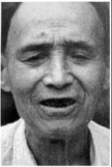
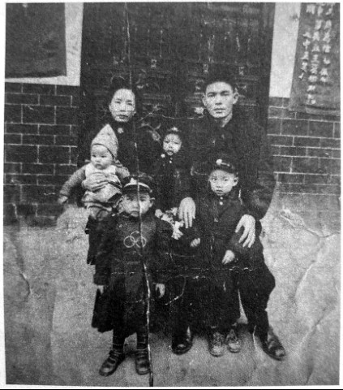

# 别动军：装备比嫡系、王牌都还好

**口述人 /** 何振球，1929年农历十二月十六日出生，宁乡县人，1944年加入别动军第四纵队，任特务队副官。现居宁乡县老粮仓镇新光村。1950年何际元被枪毙后，受牵连被判刑到青海改造18年。1983年平反后回宁乡，现与哥哥的遗孀及子侄辈一起生活。

**采集人 /** 刘见华 **采集时间 /** 2014年6月8日

### “我们哭哭啼啼地回去报告，何司令发了很大的火”

我呢，对于打日本人，对于战争的看法，也没什么好多说的。只知道老百姓很苦，到了1944年，日本人也很困难了，他们经常在村子里扫荡，搜刮粮食，还抓老百姓去给他们做挑伕干杂务。那时我们上宁乡还没有被鬼子占领，老百姓都往这跑。

何际元在宁乡招青年学生还有退伍的官兵抗日，我父亲在何际元的部队，我就和一百五十多个宁乡学生一起，参加了三个月的“宁乡沦陷区青年训练班”。后来又去了宁乡田坪里，分到中美特训班第5期学生队，武器都是美式的，我们学习武器的使用、装卸、养护等[^3]。

田坪里那地方都是山，中间有一块开阔地，是陈家祠堂，有七八间屋子，除了每年祭祀以外，大部分时间闲着。地主庄园和民房也不少，住几百号人不成问题。我们每个队驻扎一个祠堂，屋子很宽敞，都有小操场，场内搭指挥台，让司令训话、阅兵，还有军乐队表演。每天早上，何际元会登台训话，有时也由他的参谋代劳。然后，一起唱班歌，也就是军统局的局歌。

何际元爱体面，他的兵马刚开到宁乡的时候，要经过草冲河的木桥，他就让警卫队骑着马绕着圈子来回过木桥，马蹄“得得得”响了一夜，第二天就有人传开了：何际元回来啦！过了一夜的兵马，不知道他带了多少人回来了！为了扩大影响，显示威风，何际元又在这边的林山学校摆宴席，宴请这地方所有的乡长、保长、甲长、族长，摆上几十桌。何际元穿着高级黄制服，咔叽布做的，戴了少將领章，金质的，摆够了面子。

**何际元全家福，1948年摄于宁乡大宅。（从右至左，后排为何际元、次子何宁生、妻李素梅；前排为长子何衡生、次女何舜珍、三子何蒲生。长女何碧茹在外上学，小女儿何寄婧尚未出生。）**

毕业后，我到了特务队。别动军主要就是抓俘虏[^4]，方法很多，日本人走路的时候，有少数掉队的，我们就从树林中突然冲出来，截住尾巴上的几个，抓了就跑！有的据点日本人不多，搞伙食的、挑水打杂的，常常找中国人效劳。游击队员就装成老实农民，混进去当伙夫，表面上老老实实，一看时候到了，跟外面的队员一起，十多个鬼子的据点就连锅端了。

除了日本兵，其他日本人也抓。其中一个叫春堂芳子的，是三井洋行的，常常自己出去买菜，游击队就派一个队员装扮成卖菜的，故意挑一些晒黄的菜叶，还有烂菜，她嫌菜烂了，那队员就说他的菜园子离这不远，可以让她挑。然后把她带到菜园子，她刚弯腰拣菜，队员就从菜担子下取出麻袋，兜头一罩，背起她就进了林子[^5]。

抓的俘虏都统一在别动军总部，就是宁乡这边看管。我们特务队都是小队员，任务除了警卫总部，就是看俘虏。在长塘湾的屋后有一口大鱼塘，到了夏天，我们就荷枪实弹押着日本俘虏在塘里洗澡。对于当地百姓来说，看着鬼子赤身裸体在中国人的枪口下洗澡，没有什么事比这更痛快的，村民们常常往塘里撒尿，向鬼子身上投石头、吐口水，戏弄日本鬼子。

关押的俘虏大多很老实，但也出现过意外。1945年的一天，我跟另外三名队员，谢迪佳、彭沅浜等押送十二名俘虏。我们几个都是十五六岁的少年兵，警惕性不高，途中突然四个俘虏分别上来抱住我们，其余的一齐上来夺枪，然后一溜烟往山里逃走了。

我们哭哭啼啼地回去报告，何司令发了很大的火，让特务队长戴模宗马上去追，但这地方全是深山老林，哪里找得到？只好在四周设卡，封锁出路。

后来，其中一个俘虏受伤后在池塘边喝水淹死了；有两个被老百姓包围打死；还一个到老百姓的红薯地偷吃红薯，被农民发现，叫来乡丁就地枪毙，农民还把他的头割下去领赏。至于其余的，也许都饿死在深山野林了。

何际元性格比较严谨，治下很严，发起脾气来大家都怕他。但他写得一手好字，也讲道理，喜欢穿白讨衣，并不是什么草莽武夫。

抗战胜利后，我开始当何际元的副官，以后一直跟着他，到现在与他的后代家属还有联系。[^6]

[^3]: 曾在第四纵队任军需主任的张季任撰文（《何际元与别动军第四纵队》，《湖南文史资料》 第32辑）回忆，初期全纵队只有四百多个人，配发一百多支步枪，少数的驳壳枪，建制小，装备也差。1944年到南岳特训，人员进行了扩编，达到一千余人，并配备了若干名盟军顾问。武器换成了清一色的美式，除了汤姆森冲锋枪或卡宾枪外，每人还配有威逊左轮或马牌手枪，此外还有马铃机枪、重机关炮、火箭筒、信号枪、TNT炸药等。纵队与各支队之间，都有美式无线电台联系。四纵队重新整编，下设三个支队，此外还有一个特务队。 南岳受训结束后，为了扩充实力，争取美国人更多的武器支持，何际元又在老家宁乡办训练班。学员来源主要有以下几条渠道：宁乡和附近几县有一定文化基础的青年；没有参加过培训的部队陆续补充进来的人员；在乡的失业军官；部队干部推荐的亲威；较有声望的本乡军官。

[^4]: 张季任回忆，抓日本俘虏是四纵队的特点，由于他们驻地分散，都穿便服，有不少是久经历练的军统特工人员，单打独斗能力强，又规定了高额奖励，抓一名日俘奖稻谷20担，所以抓俘虏的效果好。

[^5]: 春堂芳子的下落，老兵口述中没有提到，宁乡县政府编印的《少将何际元》一书（未出版）提到，春堂芳子在抗战结束后随其他俘虏被一起移交到重庆，但不知后事如何。

[^6]: 1946年别动军裁撤后，何振球随何际元去东北，1949年又回湖南，于长沙起义，被编入中国人民解放军第21兵团。1949年底至广州军区军政大学学习。1950年何际元被枪毙后，何振球受到牵连被判刑送至青海劳动改造18年。1983年平反后回到宁乡，直接离休，后与哥哥的遗孀及子侄辈一起在老家生活。