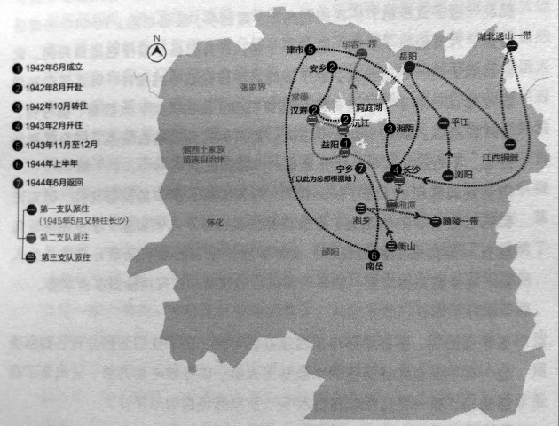

# 四纵队及何际元的结局

别动军为戴笠所控制，抗战胜利后，陈诚力主裁撤别动军，1946年戴笠死后，别动军即与交通警察部队以及汪伪税警总团，合并成立了交通警察总局，别动军至此完成了它的使命。

宁乡县流沙河镇政府编写的《少将何际元》一书（未刊行）记载，别动军解散后，作为四纵队司令的何际元，辗转到东北，后任79师少将师长。当解放军反攻时，何际元认识到，国民党大势已去，便假借母亲病危，请假回家省亲，并辞去了师长之职。1949年春，何际元下决心“反水”，脱离国民党。他组织部队起义，建立“湖南人民自救军湘中纵队”，自任纵队司令，与他接头的共产党党员汤菊中当了政委。

在与国民党军队的交战中，何振球与他的司令何际元生死与共，“何司令曾肋下中了两枪，逃到一家牛棚顶上，才没被发现”。有一次在战斗中被沖散，国民党军队追了过来，那时何振球19岁，“我也背不动司令，只好拖着他跑，看到路边民房有一个厕所，我掀开厕所的木板，一起跳进粪坑里，再盖上木板。敌人把民房、猪圈、牛棚都搜了个遍，就是没到厕所里来”。敌人走后，何际元还告诉何振球，“这件事跟谁都不要说，影响人的尊严”，何振球小声答了一句，“胜败乃兵家常事”，何际元一下子气急了，“不是败在厕所里！”

1949年秋，何际元回到宁乡老家，做起了开明绅士。1950年9月25日，湖南省人民法院判处何际元死刑。罪名有十几条之多，“地主出身” “参加反革命集团” “军统特务” “盘踞一方” “勾结白匪” 等。

行刑地点就在今天的烈士公园内，家人当时不在场，他们是后来才知道。“听说，第一枪打了后，没打死，求生的本能，使他又跑了七八百米，行刑队的另外两个人又各补了一枪，才打死，致命的一枪打在后脑勺”，何志辉说。

何际元死后，他的妻子李素梅带着几个孩子回宁乡，想开个小店自谋生路。“但到了宁乡，地方上就说她跟着何际元，又有文化，上过高小，那肯定也搞过特务工作。就让民兵给逮捕了，关在我们村子的一个破庙里”。何际元有个遗腹子，刚出生，取名何寄婧，也跟妈妈一起关在庙里，夭折于襁褓之中。不久后，李素梅被判处死刑，枪毙的地点在宁乡盘石湾。

**别动军第四纵队的驻地分布图**