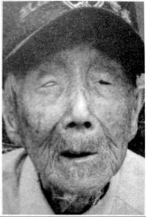

# 根据地：新四军江南挺进支队

_岳阳名山许市镇，在抗战年代属于岳阳县西乡，离当时被日本人占领的岳阳市不远．新四军江南挺进支队到来时，金宜训和颜君福就在这里当了兵。_

_金宜训现在和老伴住在土坯房里，在村子的一角，夏天的门前长满了荒草，儿子也在村里，但他们还是自己住、自己吃。虽然“没读过书，不懂什么大道理”，却与一般农民不同，衣着整洁，会说点普通话。_

_乡土味气息浓厚的颜君福，却是喜欢拉二胡的，“正月探梅是元宵，我看我的小妹子生得这样俏，她在门前走为什么不理我……”老人现在依然会唱岳阳河西民歌《十二月探梅》。他当年当警卫员，喜欢玩手枪，十几年前，还可以拿派出所的手枪，在几十米外打树干，“百发百中”，但“现在差劲了，枪都拿不起了”。_

_新四军江南挺进支队和他们的桃花山抗日根据地，鼎盛时期占地三千多平方公里，有二十七万多人口和七个联乡办事处。“他们虽然打游击，但可不是“乌合之众”。_

**石公华抗日根据地范围图 /** 新四军江南挺进支队建立了桃花山根据地，也称石（首）公（安）华（容）抗日根据地，位于湖南华容县与湖北石首县、公安县边界，东濒洞庭湖到岳阳君山岛，西临虎渡河，南起南县，北抵湖北江陵；荆江横穿而过，把它划成江南、江北两个部分，连绵22.5公里的桃花山横贯其中。桃花山根据地鼎盛时期是一个拥有3000多平方公里、27万多人口和七个联乡办事处的敌后抗日根据地。

**口述人 /** 金宜训，1923年农历三月生，湖南岳阳人，1943年加入新四军五师江南挺进支队，从士兵到班长，一直在洞庭湖流域和湖北一带打游击。抗战胜利后，1946年于中原突围中负伤、被打散，后回家务农至今。

**采集人 /** 刘见华 **采集时间 /** 2015年8月6日

### “常常我们走过去了，连老百姓也不知道过新四军了”

我没读过书，不懂什么大道理，新四军来了我就去参了军，他们不抓丁，但我也不是什么“精忠报国”，就是恨日本人，要打他们，这些个娘操的！

新四军五师名义上是一个师，李先念当师长，但分得很散，活动在洞庭湖这一带的有干把人，我们这个小部队是一个营，三百多人。我所在的特务连，连长黄大金，排长是一个姓易的东北人，班长叫黎松林，后来我也当班长了，手下管12个人，1944年10月又入了共产党。

给我们发的枪有三八式、汉阳造，也有刺刀、手榴弹、轻机枪，打小仗时就是这装备了，打大仗时才能见到重机枪、迫击炮。我进部队后，就没安安静静地训练过，都是一边打仗、一边训练。今天在这里驻扎了，停几天，训练一下，过几天又走了，碰到鬼子就打，打仗比训练管用！不过新兵会放在根据地靠后方的地方，像华容那一带，鬼子少。新兵不是不打仗，是仗打得少一点。等训练得差不多了，有武术、有本事、会打枪、一枪能打死一个了，才放到跟鬼子地盘挨界的地方，那里仗就多了。

我们的基本策略就是转山，会跑、跑得动是我们的基本功。每天要跑一百多里路，碰到小股敌人，就消灭他们，敌人强大，就赶紧跑。不管怎么跑，都是绕着山走，山是我们的保护神啊。一个山环境好，够隐蔽，就多待几天，环境不好的，待一天就走。还虚张声势，人不多，但弄的到处都是新四军，让鬼子搞不清我们的底细。常常我们走过去了，连老百姓也不知道过新四军了。本来我们纪律好，又打鬼子，老百姓是欢迎我们的，但还是偷偷走，不跟老百姓说，是怕鬼子知道来打我们。鬼子会抓老百姓啊，老百姓一吓唬还是会说的，还有汉奸耳目，如果鬼子探听到我们的人数、装备，就会派大部队来剿我们。这事不能让鬼子占便宜，只能让我们探听他们的消息，偷袭他们，不能让他们袭击我们啊，吃亏的事我们不干。

除了绕山，我们也绕湖，哪个地方鬼子多，不好走，就坐小船从湖里绕过去，有时还绕到江北。打游击战，你就得会绕、会打圈圈。

### “我打算假装跟他握手，然后突然用刺刀刺死他”

有次我们袭击了广兴洲[^1]的鬼子，干掉了他们一个中队一百多人，还缴了100条枪。我们就扒下他们的衣服，穿上，拿他们的枪，伪装成日军中队，坐了八条船，在洞庭湖里转。碰到一队鬼子，三条船，大概一个排。他们用中国话问，“你们是哪里来的？”我就回答，“我们是广兴洲的。”然后他就说他们是麦山铺的。为什么会用中国话呢，当时鬼子弄了很多伪军，日军里也有汉奸翻译官，遇到他们都用中国话问。我伪装成鬼子中队长，打头阵，他们打头的像是一个班长。我们两边的船往一起靠的时候，我呢，打算假装跟他握手，然后突然用刺刀刺死他，但我那几个兵没忍住，船刚靠上，他们就一把抓住鬼子兵的枪，夺了过来。鬼子班长身边有个机枪手，抡起机枪就要打，我一刺刀刺过去，咳，太急了，没刺中，他一躲，没站稳，就掉到湖里了，湖水也不深，但到了脖子，他在湖里端机枪扫我们，但也没打到我，也是因为太慌张。他水性也不好，湖底下有淤泥，他踉踉跄跄的，我又刺了一刀过去，这下中了，刺到他右胸，他就倒在湖里了。我们两边的人都是一阵慌慌张张地瞎打，有打枪的，有用刺刀刺的，有的在船上，有的掉到水里，打的都没章法。鬼子后来看我们人多，就划着船跑了。我们死了两个，连长也受伤了。除了被我刺死的机枪手，没看到日本人的尸体，死伤在船上的可能被带走了。这个死的日本人，就因为他是机枪手，所以首先要干掉他，不然他不会这么倒霉。

我又跳到湖里，把那挺“歪把子”机枪捞起来。我们连长受伤不轻，子弹从右腮帮子打进去，从左腮帮子打出来，满嘴满脸全是血，不知道是不是机枪扫中的。我们这次来，除了连长，其他的排长们都不在，连长负伤，我这个班长就成了最大的官，连长交代我把部队带回去，还说功劳也给我。

回到华容驻地，部队为我们开庆功会，连支队长也来了。袭击据点、伪装鬼子、洞庭湖缴机枪，我因此得了一等功。上级给我发了一个功章牌，比啤酒瓶盖大一点，银子做的，写着“新四军五师” “练兵英雄”什么的。不过我这个一等功呢，不是靠这一次仗，我们有个规定，三次小功可以累积算一次大功，我之前有了两次二等功，这次也是二等，就算成一等了。这一仗，赫赫有名，这边老百姓都知道我了。

那股鬼子往回跑的时候，又碰到建新农场过来的日军，以为他们也是新四军假冒的，跟他们又打起来了！不过也没打多久，打一会就发现打错了。这是我们听老百姓传的，没亲眼见到。

没多久，鬼子就来我们驻地报复了，还是那股麦山铺的日军。我们是被偷袭的，我们支队长不熟悉地形，本来我们有力量干他们的，但因为胆子小，没敢怎么打就跑了，死了二三十人，吃了亏。

我们跟国民党是合作的，互相之间不会打，但我们打鬼子，他们也不会帮忙[^2]。1945年鬼子投降，1946年我们跟国民党就打起来了。[^3]

**口述人 /** 颜君福，1925年农历正月出生，湖南岳阳人，1943年加入新四军五师江南挺进支队，先做通讯员，因为一次作战两个人打跑了九个敌人，被“提拔”到支队部当警卫员，后来又当副排长。抗战胜利后，1946年参加中原突围，曾与支队长郑怀远躲在农民家里，只身回家，后在国民党的乡公所里当差。1949年解放军南下，带领乡公所警察起义，迎接“老首长”郑怀远入湖南。之后，复员回家务农至今。

**采集人 /** 刘见华 **采集时间 /** 2015年8月7日

### “我以少胜多立了功，从步枪换了手枪”

我还没出生我老子就死了，长到13岁，娘老子也死了。1943年新四军来到我们这边，我就参军了。新四军五师是李先念的部队，他们搞了个江南挺进支队，我跑去当了通讯员。当时支队长是杨震东，副支队长郑怀远，主力部队活动在岳阳天井山、华容桃花山，还有湖北省的公安、石首、监利、洪湖。

白天我们派人扮成商贩或农民去侦察敌情，晚上找准机会袭击鬼子据点巢穴。为了保存实力，我们一般都选择逢年过节或者天气很坏的时候打鬼子，这时他们麻痹大意，好打。

挺进支队刚来时只有一百多人，后来就发展到五六百人[^4]。仗呢，都是小仗，一般双方都是几十人、上百人，一次战斗死伤几个。敌人那边，真的日本鬼子很少，每次都是一两个日本人骑着马领头，下面全是伪军。日本人还有山炮、野炮，炮弹有尺把长，但我们也很少碰到他们用炮。所以我们打了很多仗，都是中国人打中国人，打死的、俘虏的，还是中国人。像岳阳新沙洲那一仗，敌人三十几条枪，被我们打死十几个，活捉了三个。公安那一仗，下着大雨，碰上伪军百把人，我们打死他们一个，俘虏两个，缴了几条三八式步枪。那两个俘虏是君山岛上广兴洲的，我们有手枪班，看了他们三天，按共产党的政策，俘虏不打不杀，又把他们送回家了。

我们在洞庭湖的洪水港搞了一次夜战，敌人还是伪军，二三十人。我们打死他们一个，自己没伤亡，缴获土手枪一支，这种枪很落后，手枪的形状，却只能装一发子弹，像步枪一样，打一枪后要把枪掰开，退子弹壳。日本人收编了不少土匪，但也不给他们装备、军饷，他们还是穿的破破烂烂的，装备也差，很多人都拿土手枪。

在湖北调关，有次我和另一个通讯员打那路过，刚好碰到九个伪军骑马过来，拿的却都是土手枪。我们就干起来了，他们那破枪哪是我们三八式的对手，被我们干掉了两个，就掉头跑了。我们缴获了两匹马、两支土手枪。因为这一仗以少胜多，我立了功，被提拔到支队当警卫员，我也从步枪换了手枪，快慢机，20发子弹，上面有个扳机，扳到慢机上，像手枪一样“啪啪啪”单发，扳到快机上，像机关枪一样“哒哒哒”连发。

因为是警卫首长，我这以后很少到前线拼刺刀，但还是打了几次大仗。在湖北毛家口，敌人是伪军一个团，我们还用了迫击炮，打死了他们几百人，他们团长是湖北人，也被我们活捉，作为匪首，把他枪毙了。他手下的那些兵，我们跟他们讲政策，愿意留下当兵的就留下，不愿意留的，送你回家，还真有人留下了。这一仗我也受了伤，右小腿被子弹打穿了。

我们还赶跑了华容的两伙土匪。他们一百多人，盘踞在山上，没有投靠国民党也没有当汉奸，但也不打日本人，专打老百姓，抢东西、敲诈勒索。我们出动了一个营，有三挺重机枪、九挺轻机枪，把他们赶走，我们就占了他们的地盘。两个土匪头子和他们的残兵败将，往洞庭湖跑了[^5]。1949年在湖北监利，共产党又抓住了这两个家伙，毙了。

### “枪没响的时候真的怕，枪一响，就不要命了”

我们那时不造枪，都是缴获的，乱七八糟各种枪都有，所以我玩的枪很多。手枪除了快慢机，还玩过五六发子弹的左轮、右轮，八发子弹的“南部式”，就是“王八盒子”；步枪用过汉阳造、中正式、德式的、俄式的，俄式步枪最重，中正式最好用；机枪不玩，但知道怎么用，像“捷克式”“歪把子”，我也懂，日本的“歪把子”，枪托向右边弯，也没“捷克式”好，那是国民党造的。我们连子弹也不造，都是缴获了，统一上交，上面再分派下来。

武器虽然造不了，但新四军的后勤还是尽可能保证的。我们也有后方医院，药品不多，技术不先进，用的也是农民的房子，但治伤还是可以的。军服也是统一的灰色土叽布，每年农历三月发单衣，八月发棉衣，年年都发，这个不缺。

我们也有军事培训，送一些人到师部去学习，不是正规军校，但有老师、有教官，教理论、教技术。我因为表现好，也去学习过，教室都是农民房，教官给我们讲各种战略战术、武器性能等。很多东西，到现在我还可以教你。轻机枪要三个人，一个正射手，一个预备射手，还有一个装弹匣的，换掉的空弹匣要一个人把子弹一发发装进去；重机枪要一个班，有正副射手，有用手托子弹带的，也有人装弹药，换掉的空子弹带，要重新装满250发，还有一个人专门管水敷的，重机枪打完两袋子弹就发烫，枪管要换下，用水冷却；一门迫击炮也要一个班，一个观测，一个架炮，一个装弹，还有人扛炮弹。

布置阵地，步兵在最前面，后面依次是轻机枪、重机枪、迫击炮，打起来是后面的掩护前面，迫击炮掩护重机枪，重机枪掩护轻机枪，轻机枪掩护步兵。打据点的时候，后面轻、重机枪掩护，步兵突击手匍匐前进，匍匐的时候左手撑着地，右手拿枪，快速往前挪。不能直接趴到地上，心脏一贴地，敌人炮弹或手榴弹打过来，即使打不中人，在旁边爆炸了，地一震，就会震坏心脏。共产党的队伍，有组织、有制度，虽然打游击，但可不是乌合之众。

打仗啊，吓人嘞，枪没响的时候真的怕，枪一响，就不要命了。那时人的神经都很紧张嘞，不知道哪一天就死了。我呢，小时候就学了拉二胡，后来一直带着，不打仗的时候，就靠它解闷、娱乐一下。我经常给大家唱《三缘魂》《教儿经》《孟姜女寻夫》《十二月探梅》……“正月探梅是元宵，我看我的小妹子生得这样俏，她在门前走为什么不理我……”

打败日本人后，1946年我们跟国民党干起来了。中原突围，我们吃了大亏，我是一直警卫我们首长郑怀远的，部队打散了，我跟他一起躲在农民家里，后来他自己去找主力部队，还留给我一百块大洋，要我保管的，但这些钱都被我花了。我一路跑回家，又养伤，要花钱的。伤好后到国民党颜先岳部手枪排当班长，后在乡公所当卫兵。解放军南下，我听说老首长郑怀远又回来了，就带着乡公所的人起义，还把乡公所里的一挺机枪和十几支步枪都送给解放军了。[^6]

[^1]: 岳阳君山广兴洲，是新四军江南挺进支队活动区与日军占领区交界的地方，据《岳阳市志》记载，日军在这里驻扎了一个宣抚班30余人，还有一个湖北监利人张世杰的伪军大队，有200人。新四军针锋相对，在这里建立了一个广兴洲乡抗日民主政府，导致日军经过广兴洲的粮草，经常被封锁和断绝。双方在这里频繁交锋，如1944年5月，日伪军对广兴洲实行扫荡，挺进支队就派一个排袭击了日军宣抚班，击毙日军四人。后来，张世杰带领伪军大队从广兴洲出发到华容边境扫荡，挺进支队一连连长彭守春率兵埋伏在柿村岭附近的大道两侧予以代击，打死伪军十多人，俘敌四十多人，缴枪50支。

[^2]: 当时新四军挺进支队与国民党地方武装的关系很复杂，既有合作，也有敌对，还有收编，不仅是像老人说的互不干扰那么简单。《石公华抗日烽火》（《石公华抗日烽火》编写组编，湖北人民出版社 1986年。）一书载，原国民党保安司令张震华部陈玉龙大队有八十多人驻扎在桃花山，挺进支队进驻桃花山后，陈部被改編，分别编入支队各连。华容东山的胡道高组织了一支二十多人的抗日队伍，自称“华容县自卫大队”，1944年初，胡道高要求投奔江南挺进支队，但其部分队员害怕严格的军纪和艰苦生活，不愿投奔，挺进支队经过半年的努力，也收编了这支部队。 而国民党游击大队侯宗瀛部一百多人，多次进攻桃花山根据地，与挺进支队抢夺地盘，1945年2月，挺进支队和候宗源部大打出手，双方互有伤亡。

[^3]: 据《华容县志》记载，日本政府宣布无条件投降后，侵占华容的日军仍从县城调集日伪军180多人，对桃花山根据地发动扫荡。支队长郑怀远率五个连的兵力，于山坡两侧埋伏，打退了日军先头部队七十余人，又派兵截击了日军后路。经此失败，这一带的日军才没有继续顽抗。抗战结束后，金宜训被调到湖北潜江“打国民党”，后来到大别山参加中原突围，左膝盖被手榴弹炸伤，弹片至今没取出来。再后来分散突围到洪湖，熬了一个月，看看没希望了，团长下令部队解散，金宜训自此返家。

[^4]: 《石公华抗日烽火》一书中有挺进支队兵力发展的记录，支队刚成立时仅一百多人，有手枪三支、步枪38支、机枪一挺。后来新四军在根据地内逐级建立了民兵基干队和新兵大队，从民兵基干队和青年学生中挑选人员，为挺进支队输送新兵。从1943年10月至1945年5月，共输送新兵800多人。到1945年9月，挺进支队的主力正规军即发展到五个主力连，一千余人。 打击和收编土匪也是挺进支队扩充实力、赢得声望的一个重要方法。

[^5]: 据《华容县志》记载，他们到华容后，首先收缴了土匪唐云涛部几十支枪。1943年12月，土匪张金芝到板桥乡一带抢劫，支队长杨震东率领挺进支队一百余人赶到板桥乡，活捉了张金芝，缴枪十余支。1944年6月，土匪严忠烈带了八十多人，到沅江县茅草街，将喻仁山、杨大孝等农民抓走，绑票索款，根据地联乡办事处率领民兵基干队，将严忠烈匪部击散，救出农民，赢得了农民的拥护。

[^6]: 因为一直打仗，颜君福27岁才结婚，“那个年代算是很迟了”。“文革”期间，因为曾在国民党的乡公所里当差，颜君福被批斗，说他是土匪。他把负伤证、起义证拿出来给批斗他的人看，但“那些人是‘土蛮子’，不懂政策，也看不懂”；又把证件拿给公社书记看，书记懂，摆了摆手，“算了算了”，颜君福才没被打。1984年平反，岳阳市档案馆从档案中查实颜君福的履历，重新补发了证件。此时他的老领导郑怀远在湖北省军区当司令员，岳阳市“落实办”还把颜君福带到武汉去落实政策，“其实就是玩了一星期”。现在他享受国家优抚复员军人津贴，每月800元。

