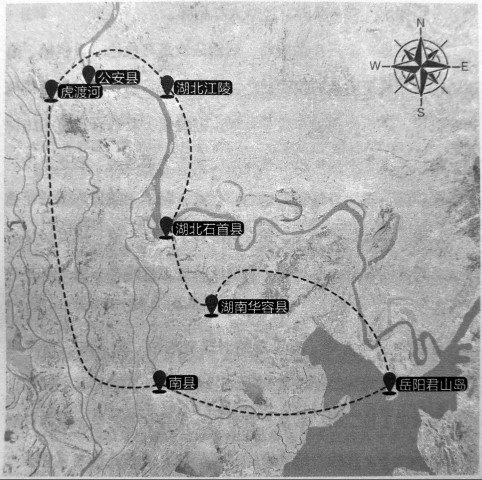

# 根据地：新四军江南挺进支队

_岳阳名山许市镇，在抗战年代属于岳阳县西乡，离当时被日本人占领的岳阳市不远．新四军江南挺进支队到来时，金宜训和颜君福就在这里当了兵。_

_金宜训现在和老伴住在土坯房里，在村子的一角，夏天的门前长满了荒草，儿子也在村里，但他们还是自己住、自己吃。虽然“没读过书，不懂什么大道理”，却与一般农民不同，衣着整洁，会说点普通话。_

_乡土味气息浓厚的颜君福，却是喜欢拉二胡的，“正月探梅是元宵，我看我的小妹子生得这样俏，她在门前走为什么不理我……”老人现在依然会唱岳阳河西民歌《十二月探梅》。他当年当警卫员，喜欢玩手枪，十几年前，还可以拿派出所的手枪，在几十米外打树干，“百发百中”，但“现在差劲了，枪都拿不起了”。_

_新四军江南挺进支队和他们的桃花山抗日根据地，鼎盛时期占地三千多平方公里，有二十七万多人口和七个联乡办事处。“他们虽然打游击，但可不是“乌合之众”。_

**石公华抗日根据地范围图 /** 新四军江南挺进支队建立了桃花山根据地，也称石（首）公（安）华（容）抗日根据地，位于湖南华容县与湖北石首县、公安县边界，东濒洞庭湖到岳阳君山岛，西临虎渡河，南起南县，北抵湖北江陵；荆江横穿而过，把它划成江南、江北两个部分，连绵22.5公里的桃花山横贯其中。桃花山根据地鼎盛时期是一个拥有3000多平方公里、27万多人口和七个联乡办事处的敌后抗日根据地。