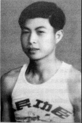

# 游击区：在潇水和湘水间打游击

_1944年，衡阳失陷。日军继续攻陷了永州等地，打通湘桂铁路，这是他们从中国东北到越南的“大陆交通线”的一部分。永州在这时成立了祁阳、零陵、东安三个游击区，但往往又各自为战。_

_曾兴湘、蒋大洁，一个是零陵游击区[^1]总部的文书，一个归属游击区的乡村小队；一个因为父母被鬼子刺伤、家被洗劫，为了报仇而打仗，一个则为保家，也为“吃口饱饭”参和自卫队。_

_约了采访后，曾兴湘就把很多东西写好了，面谈时拿出来。他写的东西，会联系当前时事、中日关系来表达。或许是做了多年干部的原因，交谈中他会有意识地用一些书面语，总是把“爸妈”改为“父母”，还时不时冒出一些成语。在讲当年的战斗时，喜欢用“毛主席”的话来做点评、总结。_

_老人头脑清晰，各种书面语中仍不时有70年前的精彩细节出现。如说起母亲给剁手指的壮丁治伤，记得“草药是后园子里跟菜一起种的，捣药用的还是剁手的菜刀，包扎的布是床单上撕下的”。采访结束后，很是得意他带我看他偷偷在楼下公共花圃里种的草药，把当年治伤的四种药指绘我看。_

_而蒋大洁身体已经很糟糕，2005年得了前列腺增生，开始时家人没在意，等到发观问题严重时已经不能治疗。从那时起，老人身上就插了个管子排小便，每月还要到医院换三次管子。现在蒋的身体天晴的时候好一点，落雨时就坏一点。老人只能每天待在屋里看武侠小说，他喜欢里面的“侠气” “忠义”。_

_但这已是如今幸存的近十位零陵游击区老兵中情况最好的了。情况差一些的老人，要家人用方言在耳边吼才能听见，说的话又前后矛盾，有的还会在正谈话时突然说“我困了，要睡觉了。”_

_70多年前，在海上航线已被美军切断之时，“大陆交通线”是维系日军存亡的大动脉，湖南永州这些为“保家”而战的游击队一直对其进行骚扰，直到日军最后投降。_

**零陵游击区范围分布图 /** 零陵游击区最初由零陵县地方武装编为一个纵队，辖五个支队，由原第七十七师师长罗霖任纵队司令，陆军少将唐步陶为北区指挥所主任，辖三个支队。当时零陵县包括今天双牌县的北部地区。

袁机任游击区司令时，总部设在零陵菱角塘镇的秧秋铺，总部直属队分布在菱角塘镇周围。收编的各地自卫队则遍布零陵全境，今双牌县城是其中一个自卫队较多的地方。此外，还有一些不接受改编的乡村自卫队，各自为战。

**口述人 /** 蒋大洁，1925年农历十一月二十四日出生，湖南省双牌县人，在家中三兄弟里排行“老满”（方言，指年龄最小），哥哥1941年被抽丁后“不知死活”，他18岁报名参加了保里蒋载文组织的自卫队，后并入袁机[^2]的零陵游击区第四大队。现住双牌县城关镇九甲村。

**采集人 /** 刘见华 **采集时间 /** 2015年6月4日

### “以麻雀战为主，鬼子来到村里我们就去搞一下，不来就没事”

我们垸子[^3]里参加自卫队的人很多，前后有60多个人，都是自愿的，自卫队不抽丁[^4]。参加的主要是年轻人、穷人，年纪大的不去，有钱人也不去，他们都读书去了，当什么兵啊。

也不是一个村里的人就到一支部队，随便，你想去哪个就去哪个，去了后想回来也行，来去自由。那你说为啥很多人还想去？就是为了吃口饱饭。当时很多人家里都吃不上饭，自卫队没有军饷，但管饭。所以很多人都去了，像我们村里的蒋大祥、蒋大秀、蒋智贤、唐德清，等等。但他们现在都不在了，这个村（参加自卫队的人）就我还没死。

当时我们这有两个自卫队，除了我们外，另一个叫湘警抗日自卫队，跟警察没关系，湘是湖南嘛，警是警戒，他们就叫了这个名字。

日本人来了后，老百姓都躲到山里了。我们这北面是挂面山，这个山头，那个山头，在两座大山中间的空地上，老百姓搭了棚子，没有雨布，就是茅草盖的，然后老百姓、自卫队就都住那里。鬼子不在的时候老百姓会跑出来种田，但不回村子里住，这样一直到民国三十四年（1945），大家才回到村里。

我们不发军装，都是穿着老百姓的衣服[^5]，也没有皮鞋、胶鞋，好一点的，家里做了布鞋，一般都穿草鞋。平时还是种田，但白天要站岗，晚上要放哨。武器嘛，有中正式、汉阳棒棒，还有一挺捷克机枪，但全队只有10多条枪，有些人只能带砍刀、梭镖、土铳。我拿的汉阳造，打一枪就要重新上子弹，每个人也就七八发子弹。

平时的训练，就是小队长教我们射击、上子弹、退子弹，其他也没什么内容。枪上也没刺刀，不用练刺杀；也没手榴弹，不用练投弹。小队长叫蒋正平，没当过兵，但会打枪，力气大，他一个能拌倒三四个，就因为这些，当了小队长。

大队还有人去泷河里捞鬼子扔下的坏枪[^6]，日本人烧了很多中国部队的枪支，扔到河里，枪上的铁没烧坏，木头烧没了，我们就换了木头安上。

后来我们与双河守备司令部联系上，拜了码头[^7]，但袁司令只给了我们一个名号，叫第四自卫大队，还有一点武器弹药。按照他们的编制，一个大队九十多人，下面还有中队、分队（小队），分队有三十多人，再下面就是班，十来个人。一般大队长要军校毕业，小队长要当过兵的，进过正规军，懂点军事技术。

白卫队以麻雀战为主，鬼子来到村里我们就去搞一下，不来就没事。鬼子经常搜山、打捞，搞吃的、也搞女人。来的多时，我们就躲开，来的少，我们就去打。我就打死过一个日本人。那次他们只来了三个，我们一个班就去找机会搞他们。我们趴在山坡上的草里，他们从下面的路上走过来，也就十来米近，但看不到我们。等他们走过去了，我对准后面的那个，“嘭”的一枪就打倒了。然后我们就跑，钻到山里去。后面日本人就来了很多，要报复，那个被我打中的鬼子估计是死了，尸体被他们抬过来，放在我们垸子前面的狮子坳，那个小山坡上。但是他们找不到我们的人，山这么大，他找哪个？

有时我们也听袁司令号令，统一行动[^8]。还得跑到五十多里路远的守备司令部去领枪，有时自卫队单独行动武器不够时，也会去找司令部借枪用，袁司令都会同意。我只见过袁机一次，那是他带部队过来，训话时我看见的，蛮魁梧，其他没什么印象了。此后就再也没见过他，当兵的，哪容易看得见司令？

我参加自卫队前后也就一年多。民国三十四年（1945）有次我们去打回龙山（现属永州市零陵区富家桥镇），我半路上打摆子（方言，寒热病，表现为间歇性的寒颤，高热），被人送了回来，就再也没去了。

抗战胜利后，我们那个自卫队被袁司令正式收编，至于袁司令，听说他1950年去了台湾。[^9]

**2013年8月30日，双牌县城关镇九甲村，孤独和病痛折磨着蒋大洁**

**口述人 /** 曾兴湘，1928年农历正月初七出生，祖上为江华瑶族，出生在湖南零陵。1944年因为父母被鬼子刺伤，家被洗劫，与哥哥一起到零陵游击区总部，哥哥当上尉秘书，他当上士文书。后来加入解放军，到广西追剿白崇禧残部和地方土匪，转业后在交通部各地方单位调来调去，武汉、徐州、南京、成都，最后回到长沙。

**采集人 /** 刘见华 **采集时间 /** 2015年7月8日

### “我母亲看见了，喊我小名：‘友根，快，把手指头捡起来’”

抗战开始后，我们这抓丁也多起来了。很多人都不想当兵，就自残，剁手剁脚的，最常见的是剁掉右手食指，这样就不能扣扳机、不能打枪了。有一次，一个卖盐巴的到我们街上，过去山里面都是小贩子挑着挑子走街串巷卖盐的，他也是倒霉，到这里碰到抓丁的，就抓他。他呢，就跑，跑到我们家里，话也不说，抢到伙房里，拿了菜刀就剁手指头。我看的清咧，那半截手指掉到地上还蹦了一下，跟活的一样。那些抓丁的跑来一看，这个人没法当兵了，就“啪啪”打了他两巴掌，走了。

我母亲看见了，喊我小名：“友根，快，把手指头捡起来”。她呢，就跑到后园子，我们那园子里有菜，有草药，她找了两种草药，一种叶子圆圆的，一种叶子长条子的像海带的，把根挖出来，那根像疙瘩一样。她心急火燎的，就用那剁手的菜刀，用菜刀把，把那些“疙瘩”捣烂，把剁掉的指头在盐贩手指上对好，用那些搞烂的草药裹了一圈，再从我家床单上撕下一块布包上，扎起来。母亲告诉他，过一个礼拜后再过来看看。一个星期后，那个人来了，竟然这么快好了！他就给我母亲磕头，千恩万谢。他那个指头刚剁下来，肉是新鲜的，没有污染，药用得好，能接上。哎呀，现在不管中药西药，谁还有这个能耐？那两种药草，当时我不认识，后来我也自学中药，想想，圆叶子的可能是姜黄，像海带的可能是昆布。[^10]

1944年春天的时候，军校毕业的哥哥回家来探亲。没想到他还没走呢，日本人就来了。当然咯，首先过来的是难民，逃难的不光是本地的，还有南京、上海的。当时，永州东边是原始森林，南北一条大路，很多人要顺路往广西去[^11]。什么叫人心惶惶？我们家就住在街上，你看你门前大路上到处是难民，一天到晚喊着“日本鬼子来了”，是谁都得慌吧？那我父母也待不住了，急急忙忙卷了一些衣服和吃的，带着我们姐弟就往山里逃，回我爷爷奶奶盖的老屋曾家。

那老屋一直没人住的。我们家本来是瑶族，爷爷奶奶从江华的瑶区迁到零陵的桐梓坪乡朱家村，打长工，到山上砍柴，几十年攒了点钱，就在山脚下买了几亩地，那些地都是没人要的；木材呢，又到处都是，就陆陆续续盖了七八栋两层楼的木房子，像鸟扒窝一样，一年年盖起来的。然后还在桐子坪的街口上买了两间店铺，卖豆腐、做小买卖，算是有两处房产了，哈哈。

逃回老屋不久，街上有个邻居叫朱庆元的，他信天主教，看上了我们家大屋，就把他们教堂的神父、修女还有收养的女孩，一百来号人都介绍到我家来避难了。大屋房间多，能住下，父亲就没说什么。然后还有一些难民，也住进来了。他们往广西跑，有些贵重东西怕路上丢了，或抢了，就存在我们这。有个江苏口音的，在我们家存了一箱子好衣裳，丝绸、弱皮袄之类，结果后来也没来拿，估计是路上死在哪里了。那年头人穷，这东西都好贵重的嘞，要是人还活着，肯定回来找了。

一对江西的兄妹俩，那哥哥看我们人好，就跟我爸爸说，“我还要逃难，我这个妹妹是没钱养活了，就送给你们吧。”这个叫秋秀的女娃后来就成了我妹妹，当时十来岁，我们把她养大，解放后又在村里找个人家把她嫁了。我们一直都还联系呢，她去年才死。至于她哥哥，始终没回来过，可能早就死了。

**年轻时的曾兴湘。**

我们在老屋躲了几天，看风声不大紧了，就回到桐子坪街上看看。咳，整条街都是烂糟糟的，门窗被砸烂了，墙头也给推倒了，家里值钱的、有用的都弄走了，连五十多个腌菜坛子里的腌菜都给捞走了，最气人的，菜坛子里还拉了尿、撒了尿！看路上，逃难的人还是成群结队的，算了算了，我们又回老屋去了。

没想到，那狗日的日本人，又来了第二批。这次还有几个蒙古兵，那蒙古人从长相上可以看出来，我不懂，但有的老百姓懂，他们还说蒙古话[^12]。有两个鬼子还跑到山里，跑到我们大屋来了。就是早晨来的，很突然，人都来不及跑。我就钻到后屋侧门的粮柜底下。清清楚楚地看到，两个鬼子手里拿着指挥刀，穿着大军靴，“咯噔咯噔”向后园子跑了过去。先抓到那些神父、修女，不知怎么的，估计看他们是外国人，没把他们怎么样。然后就抓着我父母，可怜呐，我父母跪在他们面前，磕头，鬼子一声喊“啊——嘿”，就用刺刀把他们一人捅了一刀，我父母“啊”地一声惨叫，就倒在那里了。鬼子还带着军犬，那东西似乎闻到了什么，一下子就扑到柜子前面，我真吓得要死，柜子下面有一根木扁担，我拿起扁担就捅了过去，那狗“汪”叫了一声，也是命大啊，我家两只小猪，不知怎么吓得跑了出来，那狗就追小猪去了。两个鬼子“杀”了我爸妈，又抓走我哥哥当挑夫，还跑到爸妈的卧室，把两块银元也收走了。

我父母也是命不该死，他们是跪着被捅了刺刀的，一个扎到了腰上，一个扎着了腿，都没伤到要害。后来，他们就用自己的药草，治自己。那年头兵荒马乱的，医院早没了，有医院也没钱治，自己治了几个月，居然都好了。[^13]

### “不光枪炮声，连前面拼刺刀的声音都可以听见”

我那被抓去的哥哥进过军校，当过兵嘛，还有点本事，几天后，他就逃回来了，拉着我的手对父母说：“我们只有去当兵，打败日本鬼子，才有好日子过。”这样，我们两个就告别父母，连夜摸黑赶路，到零陵秧秋铺，找到袁机的抗日自卫大队。我们一路上提心吊胆，是爬着去的。为啥是爬呢，因为我们要经过一个叫菱角塘的地方，那里有鬼子的据点，怕日本人发现啊，很多时候要猫着腰，趴在地上。

袁机的大队有3000多人，还有炮兵连、机枪连、特务连，哥哥有个好朋友吕学望在那当副官，就介绍我们参加自卫队了。哥哥是打过仗的军官，跑回来没回部队嘛，怕查出来，他本来叫曾兴华，就改名曾汉屏，留在大队部任上尉秘书。我虛岁才15岁，打不了仗，但哥哥说我从小进私熟，念古文、会书法，还经常给邻居抄写对联，他们也把我安排在特务连当上士文书。在连队就是抄抄写写、打报告、发放通知、整理档案，当然也要起早摸黑操练，夜里要守哨，还得搞大队部的卫生。大队部是一个地主的庄园，现在估计没了。

我们那旁边还有个蔡家铺机场，有时夜里守哨，只要听到日本飞机的声音，就能看到地上有人发信号弹指示目标，信号弹是交叉形的，这些都是汉奸干的，无耻之徒！

我们主要活动在零陵、道县、双牌、东安那一带，穿统一的粗布灰军装，配备的主要是轻武器，很少有重装备。打仗呢，主要是伏击、游击。部队的长官经常派人秘密联络附近的弟兄们，调兵，因为我们和鬼子的地盘都是交叉的嘛，怕鬼子发现，所以上下联系都是秘密的。常干的活就是围攻鬼子的哨所，哨所里人少，我们就去很多人，打下来，把他们抢的老百姓的粮食啊、鸡鸭啊、猪啊、牛啊，统统再抢回来，变成我们的军需了。

我只有偶尔几次投到火线上，但也没来得及杀上去。鬼子一支小部队跑到我们大队部秧秋铺来了，就离了两公里，那也是情况危急，搞近战、拼刺刀了。当时是个什么情况呢，鬼子在那一带有两个哨所，人不多；我们人很多，但都是分散在各个村的，大队部只有特务连、勤务兵，结果就被鬼子偷袭了。我们那时也有冲锋号的，号一吹，前面的就冲上去了。我本来在最后，但估计是前面打败了，我亲眼看到两个人被鬼子刺伤了脚和胸膛，抬下来，那血像喷泉一样，“咕咕”往外冒。不光枪炮声，连前面拼刺刀的声音，“杀——杀”的声音，都可以听见。前面的败了，没办法，我们勤务兵也准备干了，拼个你死我活！就在这时候，我们大队部的增援来了，把鬼子包围，“哗啦啦”地把他们解决了。这个增援是从旁边村子调来的，来得还真及时。用毛主席的话说，我们每次都是绝对优势，就是要把你小股敌人吃掉！

我们这些兵以当地人为主，都是自己家里人啊，所以很少害老百姓。伙食差，吃糙米饭，别说油盐，几乎没有什么菜，连青菜也很难见到。打胜仗的时候，老百姓会有慰问，才吃的好点。

1945年抗战胜利，我们部队要北上整编，路过家门口，被父亲拦下。连长就同意我在家照顾父母，哥哥继续北上裹入内战，后随部队起义。[^14]

[^1]: 接受采访的当地亲历者一般称零陵游击区为双河守备司令部，“双河”指潇水、湘水，二水在零陵交汇，“潇湘八景”之一的“潇湘夜雨”即在此处。

[^2]: 袁机（1904~1973），字定一，双牌县塘底乡塘底村人（原属道县），在家乡的名字叫袁大统。从长沙岳云中学毕业后，于1929年5月入黄埔军校（武汉），1930年7月毕业，任少尉排长。1939年10月任军令部通信参谋、副科长等职，1941年任第四战区长官部参谋处第二科上校课长。据现居广州的袁机曾外孙易雄斌回忆，袁机于1944年6月任零道师管区军官大队少将大队长，负责收留当地的军官和部队流散人员，1945年3月调祁（阳）东（安）自卫区零陵游击区任少将司令。

[^3]: 垸子，湖南、湖北等地沿江沿湖地带围绕田地、房屋修建，用来挡水的堤圩，亦指其所围住的地区。在当地方言中，约相当于现在的村民组。

[^4]: 零陵游击区其他自卫队有抽丁的情况，当地关爱抗战老兵志愿者唐颂走访了双牌县境内的许多老兵，根据他的整理，有的自卫队规定家中有两弟兄没被抓过丁的，必须有一人参加。这也说明，对于人员补充，当时的各地自卫队并没有统一的规制。

[^5]: 当时，零陵游击区总部直属队有统一着装，在曾兴湘的回忆中就是这样，而乡村自卫队都是寻常百姓着装。

[^6]: 即潇水。到河里捞枪的说法得到了很多亲历者的证实，但对于潇水中有这么多枪的原因，据志愿者唐领的走访，1944年衡阳陷落后，大批中国军队撤至永州，他们沿途打了败仗时，会把带不走的枪械毁掉，并投入河中。

[^7]: 唐领介绍，在当地老一辈人的眼里，袁大统是个“土霸王”。据说，到袁机那拜码头，是要送见面礼的。拜了码头之后，就算是袁司令的人了，司令会“罩”着他们。 但也有不拜码头的，当地有一支奇特的“师爷”自卫队即是如此。这支自卫队虽然有队长，但还设了一个“师爷”，行动谋划都是听一个李姓师爷的。师爷在头一天晚上会看天象，预测天气，算一下打哪支日军、从哪里进攻比较有利，还要看士兵的生辰八字，只派八字合的人去打。这样的谋划，“居然次次顺利，前后一年多，只有一个人在撤退时扭了脚，此外没有任何死伤”。队员们都很感激这个师爷，上世纪50年代师爷去世时，很多队员都去送行。

[^8]: 蒋大洁已记不起统一行动的细节。根据唐颂整理的走访材料显示，各种乡村自卫队归属袁司令后，好几次去河里烧了鬼子运输军需物资的帆船，缴了很多三八长枪；还去摸点，有个鬼子被连人带枪抓了回来，本来要送司令部的，结果没保护好，“被老百姓用锄头挖死了”；还有一次在零陵富家桥油山岭与鬼子作战，自卫队出动了好几百人，包围了隔河的鬼子据点，到晚上，“钢炮和机枪打得没停”，等河对面据点里鬼子不再回击时，自卫队坐船冲了过去，发现鬼子逃跑了，据点内留下很多新鲜血迹，却没有发现鬼子尸体。

[^9]: 蒋大洁1947年结婚，1951年儿子出生，也就是在这一年，他因为在山上放牛丢了根烟头，失火烧了山，被送到内蒙劳改八年。八年劳改生涯结束后，又被留在农场里，继续当了十年农场工人，直到1969年才回到双牌。 据易雄斌讲述，袁机1950年3月经缅甸、越南海防、香港去台湾，此后曾返香港接应去台人员，后脱离军界，从事教育工作。1973年农历九月十五日殁于台湾高雄。

[^10]: 据《中华人民共和国药典》（国家药典委员会主编，中国医药科技出版社 2015年）记载，姜黄“性味：辛、苦、温。主治：破血行气”；昆布“性味：咸，寒。主治：软坚散结，消痰，利水”。

[^11]: 抗战开始后，湖南境内聚集了来自江浙及全国各地的大量难民。第四次长沙会战后，长沙、衡阳失守，很多难民沿湘桂铁路及公路，经湖南永州逃往广西。永州东部属九嶷山区，自古以来为瑶民居住区，却不都是原始森林，“原始森林”是曾兴湘的口头说法。

[^12]: 关于日军中的朝鲜兵、台湾兵，史料中有不少记载，对蒙古兵的记载却比较少见，在亲历者的回忆文章中有相关内容。如《老河口屠城纪实》（《老河口文史资料》 第29辑）一文，其中提到，日军中除了有朝鲜“二道毛”和台湾“二皇军”外，还有蒙古“二道毛”，他们长着“草包胡子傻大个子”，这些人都是屠杀我同胞和残害我女同胞的“活鬼”。

[^13]: 曾兴湘的父亲曾德元是零陵法政学堂的毕业生，当过地方团总，懂中药，给人看病也不要钱，在老百姓中威望很高。1934年，曾德元因为收留红军住在家里，被以“私通共匪”的罪名判刑七年，曾兴湘的母亲变卖了家中田产才把他赎了回来。1950年，七十多岁的曾德元被当成富农抓起来，最后死去。

[^14]: 曾兴湘的哥哥曾兴华后来请假回家，但被当敌人对待。他东躲西藏，“家里弄得鸡飞狗跳的”，后来跑到东北，到大庆石油五厂当临时工，在水泥厂里干了几年，得了鼻癌。他发现病情时已经晚了，1966年到长沙找曾兴湘借钱动手术，只是不久后还是去世了。