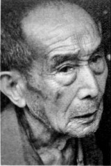

# 游击区：在潇水和湘水间打游击

**口述人 /** 蒋大洁，1925年农历十一月二十四日出生，湖南省双牌县人，在家中三兄弟里排行“老满”（方言，指年龄最小），哥哥1941年被抽丁后“不知死活”，他18岁报名参加了保里蒋载文组织的自卫队，后并入袁机[^2]的零陵游击区第四大队。现住双牌县城关镇九甲村。

**采集人 /** 刘见华 **采集时间 /** 2015年6月4日

### “以麻雀战为主，鬼子来到村里我们就去搞一下，不来就没事”

我们垸子[^3]里参加自卫队的人很多，前后有60多个人，都是自愿的，自卫队不抽丁[^4]。参加的主要是年轻人、穷人，年纪大的不去，有钱人也不去，他们都读书去了，当什么兵啊。

也不是一个村里的人就到一支部队，随便，你想去哪个就去哪个，去了后想回来也行，来去自由。那你说为啥很多人还想去？就是为了吃口饱饭。当时很多人家里都吃不上饭，自卫队没有军饷，但管饭。所以很多人都去了，像我们村里的蒋大祥、蒋大秀、蒋智贤、唐德清，等等。但他们现在都不在了，这个村（参加自卫队的人）就我还没死。

当时我们这有两个自卫队，除了我们外，另一个叫湘警抗日自卫队，跟警察没关系，湘是湖南嘛，警是警戒，他们就叫了这个名字。

日本人来了后，老百姓都躲到山里了。我们这北面是挂面山，这个山头，那个山头，在两座大山中间的空地上，老百姓搭了棚子，没有雨布，就是茅草盖的，然后老百姓、自卫队就都住那里。鬼子不在的时候老百姓会跑出来种田，但不回村子里住，这样一直到民国三十四年（1945），大家才回到村里。

我们不发军装，都是穿着老百姓的衣服[^5]，也没有皮鞋、胶鞋，好一点的，家里做了布鞋，一般都穿草鞋。平时还是种田，但白天要站岗，晚上要放哨。武器嘛，有中正式、汉阳棒棒，还有一挺捷克机枪，但全队只有10多条枪，有些人只能带砍刀、梭镖、土铳。我拿的汉阳造，打一枪就要重新上子弹，每个人也就七八发子弹。

平时的训练，就是小队长教我们射击、上子弹、退子弹，其他也没什么内容。枪上也没刺刀，不用练刺杀；也没手榴弹，不用练投弹。小队长叫蒋正平，没当过兵，但会打枪，力气大，他一个能拌倒三四个，就因为这些，当了小队长。

大队还有人去泷河里捞鬼子扔下的坏枪[^6]，日本人烧了很多中国部队的枪支，扔到河里，枪上的铁没烧坏，木头烧没了，我们就换了木头安上。

后来我们与双河守备司令部联系上，拜了码头[^7]，但袁司令只给了我们一个名号，叫第四自卫大队，还有一点武器弹药。按照他们的编制，一个大队九十多人，下面还有中队、分队（小队），分队有三十多人，再下面就是班，十来个人。一般大队长要军校毕业，小队长要当过兵的，进过正规军，懂点军事技术。

白卫队以麻雀战为主，鬼子来到村里我们就去搞一下，不来就没事。鬼子经常搜山、打捞，搞吃的、也搞女人。来的多时，我们就躲开，来的少，我们就去打。我就打死过一个日本人。那次他们只来了三个，我们一个班就去找机会搞他们。我们趴在山坡上的草里，他们从下面的路上走过来，也就十来米近，但看不到我们。等他们走过去了，我对准后面的那个，“嘭”的一枪就打倒了。然后我们就跑，钻到山里去。后面日本人就来了很多，要报复，那个被我打中的鬼子估计是死了，尸体被他们抬过来，放在我们垸子前面的狮子坳，那个小山坡上。但是他们找不到我们的人，山这么大，他找哪个？

有时我们也听袁司令号令，统一行动[^8]。还得跑到五十多里路远的守备司令部去领枪，有时自卫队单独行动武器不够时，也会去找司令部借枪用，袁司令都会同意。我只见过袁机一次，那是他带部队过来，训话时我看见的，蛮魁梧，其他没什么印象了。此后就再也没见过他，当兵的，哪容易看得见司令？

我参加自卫队前后也就一年多。民国三十四年（1945）有次我们去打回龙山（现属永州市零陵区富家桥镇），我半路上打摆子（方言，寒热病，表现为间歇性的寒颤，高热），被人送了回来，就再也没去了。

抗战胜利后，我们那个自卫队被袁司令正式收编，至于袁司令，听说他1950年去了台湾。[^9]

**2013年8月30日，双牌县城关镇九甲村，孤独和病痛折磨着蒋大洁**

[^2]: 袁机（1904~1973），字定一，双牌县塘底乡塘底村人（原属道县），在家乡的名字叫袁大统。从长沙岳云中学毕业后，于1929年5月入黄埔军校（武汉），1930年7月毕业，任少尉排长。1939年10月任军令部通信参谋、副科长等职，1941年任第四战区长官部参谋处第二科上校课长。据现居广州的袁机曾外孙易雄斌回忆，袁机于1944年6月任零道师管区军官大队少将大队长，负责收留当地的军官和部队流散人员，1945年3月调祁（阳）东（安）自卫区零陵游击区任少将司令。

[^3]: 垸子，湖南、湖北等地沿江沿湖地带围绕田地、房屋修建，用来挡水的堤圩，亦指其所围住的地区。在当地方言中，约相当于现在的村民组。

[^4]: 零陵游击区其他自卫队有抽丁的情况，当地关爱抗战老兵志愿者唐颂走访了双牌县境内的许多老兵，根据他的整理，有的自卫队规定家中有两弟兄没被抓过丁的，必须有一人参加。这也说明，对于人员补充，当时的各地自卫队并没有统一的规制。

[^5]: 当时，零陵游击区总部直属队有统一着装，在曾兴湘的回忆中就是这样，而乡村自卫队都是寻常百姓着装。

[^6]: 即潇水。到河里捞枪的说法得到了很多亲历者的证实，但对于潇水中有这么多枪的原因，据志愿者唐领的走访，1944年衡阳陷落后，大批中国军队撤至永州，他们沿途打了败仗时，会把带不走的枪械毁掉，并投入河中。

[^7]: 唐领介绍，在当地老一辈人的眼里，袁大统是个“土霸王”。据说，到袁机那拜码头，是要送见面礼的。拜了码头之后，就算是袁司令的人了，司令会“罩”着他们。 但也有不拜码头的，当地有一支奇特的“师爷”自卫队即是如此。这支自卫队虽然有队长，但还设了一个“师爷”，行动谋划都是听一个李姓师爷的。师爷在头一天晚上会看天象，预测天气，算一下打哪支日军、从哪里进攻比较有利，还要看士兵的生辰八字，只派八字合的人去打。这样的谋划，“居然次次顺利，前后一年多，只有一个人在撤退时扭了脚，此外没有任何死伤”。队员们都很感激这个师爷，上世纪50年代师爷去世时，很多队员都去送行。

[^8]: 蒋大洁已记不起统一行动的细节。根据唐颂整理的走访材料显示，各种乡村自卫队归属袁司令后，好几次去河里烧了鬼子运输军需物资的帆船，缴了很多三八长枪；还去摸点，有个鬼子被连人带枪抓了回来，本来要送司令部的，结果没保护好，“被老百姓用锄头挖死了”；还有一次在零陵富家桥油山岭与鬼子作战，自卫队出动了好几百人，包围了隔河的鬼子据点，到晚上，“钢炮和机枪打得没停”，等河对面据点里鬼子不再回击时，自卫队坐船冲了过去，发现鬼子逃跑了，据点内留下很多新鲜血迹，却没有发现鬼子尸体。

[^9]: 蒋大洁1947年结婚，1951年儿子出生，也就是在这一年，他因为在山上放牛丢了根烟头，失火烧了山，被送到内蒙劳改八年。八年劳改生涯结束后，又被留在农场里，继续当了十年农场工人，直到1969年才回到双牌。 据易雄斌讲述，袁机1950年3月经缅甸、越南海防、香港去台湾，此后曾返香港接应去台人员，后脱离军界，从事教育工作。1973年农历九月十五日殁于台湾高雄。