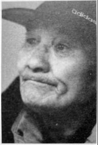
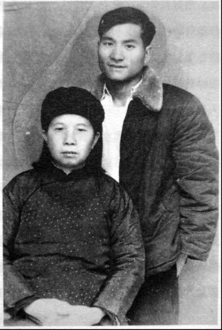
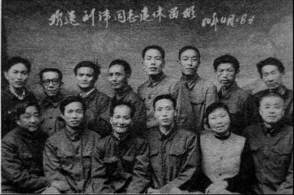

# 游工队：一直游动，一直流浪

_1937年，因战事影响，长沙大东书局的账房先生把两个儿子留在了南县（今属益阳市）的外婆家[^1]。半年后，哥哥刘革凡由南县返回长沙，彼时11岁的弟弟刘津，肩膀上坐着周家的少爷。_

_刘津每天放牛、杀草、做家务，以“骑蛤蟆”的姿势接送周家少爷上学放学。“我是书局帐房先生的儿子，是周家童养媳的侄儿”，刘津说，他是逃难来求生活的，日子不好过。一年后，刘津进入药铺做学徒，却照旧是做家务和接送少爷。_

_因此，当哥哥写信来告诉他游工队[^2]的事情时，刘津看到了生活的转折。在南县呆了两年后，一个寒风凛冽的夜晚，刘津从药铺跑出来，偷倫乘船回了长沙，随即参加了游工队。_

_在游工队，刘津爱上唱歌，他的聪明调皮也赢得了很多人的喜欢。父亲不幸过世后，为养活母亲和年幼的弟弟妹妹，他辗转各个部队剧团，“在旧社会，我做什么都是为了生活出路”，刘津说。_

_无法想象，生活的沉重是如何压伤一颗年幼的心的。1951年，税务所所长刘津遭遇一个女孩的猛烈追求，“她把我拉到她身上，睡到了一个床上，我都哭了”。半个多世纪后，刘津说起此事，依旧激动而悲伤。后来，女孩跟別人结了婚．刘津说：“不是我不要人家，是因为没有钱，没有住处，我自卑啊！”随后谈恋爱，但没有结婚，没有小孩，至今单身……也许在他内心深处，始终有一个因自卑而失去的女孩。_

_2015年5同26日，岳楚区金岭小区。屋里堆放了不少书，大部分是文学书籍。今年90岁的刘津，面色红润，精神矍铄，称自己仍每天看书，“我想写一些这样的故事”，他说。_

**口述人 /** 刘津，1926年农历八月二十九日出生，长沙人。1940年参加第二游工队，后辗转多个部队的剧团。1943年投奔哥哥，进入中美混合空军大队，1944年参加青年军，1947年随204师到台湾，1948年返回大陆后脱离部队。这段口述主要讲的是他在游工队的经历。

**采集人 /** 明鹊 **采集时间 /** 2014年3月21日、2015年5月26日

### “我们在南岳训练了一个月，学会了吹口琴，唱抗日歌”

游工队不属军队，也不归政府管，它其实是由教会组织的一个慰问团，主要是到部队唱歌、跳舞、演剧、放映电影等，进行慰问活动。为什么叫游工队呢？因为我们是游动的，每个队都配有电影机，所以又叫电影游行工作队。

长沙大火的时候，我哥哥进了第一游工队。那个时候，我还在常德外婆家，他就写信给我，我这个心就动了。回长沙后，我参加了第二游工队，里面几乎全部是小孩，我是当中最小的一个，当时只有12岁。游工队成立后，跟着我们就划了区，我哥哥所在的一队叫湘桂区，我们第二队划入湘赣区。

最开始的时候，我们在南岳训练了一个月，学会了吹口琴，讲普通话，唱抗日歌，演街头剧、独幕剧等，我个人喜欢唱歌和指挥合唱团。

我们在部队集中的地方，像王耀武的74军，其中有几个师部，当时在湖南及周边。我们到他的部队去，给士兵们唱歌，进行伤兵慰问，也抢救当地难民，还帮伤员们写家信，说得好笑，我们自己还是小孩子，能够写多通顺的信啊！但那就是一个“情”字。那个时候，我们的思想都是这个样子。我记得，我母亲有一次去教堂，路上碰到日本兵，他们拿刺刀背在我母亲额头上敲，也没有杀我妹妹，当时妹妹小得很。我母亲带着两个妹妹，就这样子逃难到了教堂。这在我心里印象非常深刻，所以一提到日本鬼子，我满肚子的火。当然，比我们家惨的太多了。

**1957年冬，刘津和母亲。**

**1984年，刘津从大凉山农场退休时与同事的合影。**

当时我们游工队有17个人，队长雷子哲，河北保定的，他参加的最早；艺术干事甫才干，专门训练我们唱歌、跳舞和演剧的；电影技师高重沛和生活干事卢文华，另外还有一个炊事员，当时是编外的，我们都叫他叔叔，非常喜欢他。只有这五个是大人，其他的全部是小孩，后来在江西又进来了几个，就不只是17个了，他们的名字我也都还记得。我那个时候不叫刘津，我叫刘建民。

我们里面的小孩子，有几个后来很不简单呢。我记得很清楚，有一个人叫陈瑞陵，从我们进队开始，他就是男孩子里面最倔的一个，也是最能干的一个。游工队解散后，他去了重庆21兵工厂，好像还是工会主席，后来听说，他也是最早加入地下党的。我对我的老战友非常怀念。

### “走到哪住到哪，我们从不打扰人”

游工队常年四季都在出差，走到哪里工作到哪里。我后来还学会推鸡公车（手推独轮车），我们里面小同工[^3]都会。不是要放电影嘛，放电影就要电影机，电影机有放映机、变压器，还有煮饭的炊事箱子，十几个箱子，都要靠我们自己推。

我们队开始划入湘赣区，因为战事转移，后来又划入了浙赣区。南岳培训完后，我们过醴陵，走万载、莲花，到了江西吉安。吉安有国民党军队的修养院、伤病院，都是我们的服务对象。在江西樟树镇，当时在王耀武的部队里，我们遇到了日本飞机的轰炸。那时我十三四岁，背着伤员返回后方，这么大（他两只手在胸前画了一个圈）的碎片穿中我的右小腿，我就这样痛得倒了下去，直到其他同工把我扶回去，你看，伤口现在还看得到。后来有一次，王耀武在台上给士兵讲话，“我们要穿着草鞋，去战胜日本人的皮鞋”。当时这句话，让我印象非常深刻。

后来，我们过鹰潭，到上饶，随后还跑到蒋介石家乡溪口。溪口的环境很好，风景很漂亮，给我的印象很深。我们在一个小街道上，睡两根扁担（两根扁担拼在一起睡），第二天就走了。后来又到了宁波，在那里进行了培训。

我们一路走，经常是哪里有条件，我们就在哪里培训。最远到了镇海，然后我们就返回了吉安。去不得了，再过去就是沦陷区了。当时，我们游工队会训是“非以役人，乃役于人”，就是走到哪住到哪，我们从不打扰人。

我们青年会组织蛮严密的，当时我们还有自己的制服，就是我们工作队的制服。你可能没听说过，我们队在长沙四方塘成立的，就是原来的老疗养电影院，它成立的时候是非常轰动的。长沙青年会的总干事，叫做刘良木，在那时的音乐家里面，他也算很有名气的。我们第二队里面，男女差不多各占一半，年龄也都相差不多。

我们不是部队，我们是属教会组织的，当时一路走过去，沿途有比较乱的地方，当地部队还要派兵保护我们。我们到地方，吃啊，住啊，都是高要求接待的。在九战区，司令长官薛岳还设宴招待我们；74军的王耀武，我们去了一个星期，每餐都陪着我们一起吃饭。但是，我们的生活费不高，初期分每月30块、20块和10块三个等级，但大部分人只有10块。我因为年龄太小，最开始只发了2块，后来到8块，最后才到10块。

我们回吉安后，父亲因肺结核病故，我就回长沙奔丧去了，那是1941年左右。后来好像也冇过多久，第二游工队就解散了[^4]。奔丧后，日本人打过来，我和我母亲分别了。我到教堂（北正街教堂）去的时候，鬼子已经从那边过来了，我和母亲往回走，从三角塘绕过去，还是回到了教堂。我穿着制服，会被杀头，母亲一着急，就叫我快跑。我把制服脱了，穿一个小褂，赤脚沿着湘江边上跑。到南郊公园附近，看到河边有一条小船，是王耀武92师的，就接我去了他们政治部，参加了他们的星海剧团，后来跟着又去了朱亭（株洲县南部的一个古镇）。

一个月后，长沙的鬼子跑了，我们又回来了。第二次长沙会战时，星海剧团被冲散。我到小吴门的码头，就在太平街河堤边，遇到王耀武74军下面的82师。有一个士兵看到我从河边过来，讲话南腔北调的，就说我是小汉奸，把我抓去交给了连长。这样我就被抓了壮丁，跟着去了常德临澧。

他们看我还会唱歌，不知道我是干嘛的，我就说我是干什么干什么的，他们把我当个知识分子，然后把我弄到无线电台，让我在里面摇机器，其实我不会无线电。

常德细菌战的时候，82师又调回长沙。本应该进市里的，因为知道了日本在常德搞细菌战，所以部队绕道回长沙，然后住在了橘子洲。我到那里，就想家了，我是被抓来的嘛。我家在睛佳巷，从橘子洲可以看到。我看到它在冒烟，我的家被炮轰了，但我还不能回去，那个江边不能通过，是戒严啊。

### “那天夜里，弟弟是我抱在手里死掉的”

那个时候，日本人刚刚退，城里戒备森严，还紧张得很。我们部队的班长是湖北人，我记得很清楚，因为他打了我扁担。我跑啊，我想回家，我不知道家人生死存亡，我就跑啊，但没跑成，他把我抓了回来，打了我扁担。我的脚被打烂了，一个娭毑看了，就讲“何事（长沙方言，怎么）下得了手，一个细伢子。”她把我抱起睡到猪楼屋（养猪的房子）里，帮我搞草药，她讲：“伢子，你莫急，你等我把你养好了，我喊我崽伢子（方言，指儿子）把你送过河去。”

部队不管你，你是逃兵，他还管你啊！我们老老实实做人，你抓我当了兵，也要让我去看下母亲，我屋都被炸了咯。后来，那个爹爹和他崽半晚上摸黑把我放到小船上，这样把我送到了岸边。回去后，屋里一个人都没有，什么都冇得了，唯一的念头是教堂。我往教堂跑，轻车熟路，果不其然在教堂，母亲，小妹妹，后面还生了个小弟弟，是我父亲死之后生的，长沙人喊“背腹生”，他们三个人住在教堂的角落里。

我跑了后，班长带起兵来抓，开始他跑到我屋里，后来又跑到教堂。看到他一来了，戴小姐把我藏在她厨房，就是教堂那个牧师啊，她跟我讲：“孩子，你不要管，你等我去。”她就去了，对着国民党兵吼了一阵，然后把他们轰跑了。

总算一家团聚了，但生活却一点出路都没有。离开教堂后，我母亲、我，妹妹和弟弟，四个人只能挤在一个居民楼的楼梯间。那个冬天，我满长沙城找朋友，找工作。正是打仗的时候，哪里有什么朋友可以找？找工作更难。年三十的晚上，弟弟发高烧，没钱买药，连个躲风的地方都没有。什么叫喊天天不应，这就叫喊天天不应。那天夜里，弟弟是我抱在手里死掉的。街道上一个老头子可怜我们，告诉我们可以到哪里去埋。母亲用仅有的一件破棉袄，把弟弟包好后，让我去埋了他。

第三次长沙会战后，我们跟着往衡阳跑，这就喊作逃难，整个大撤走啊。到衡阳后，我们住河边的一个茅草棚棚里。为了一家人的生活，我拿家里仅有的钱跑“单帮”[^5]，那还是靠人家接济得来的钱。后来，遇到原来星海剧团的朋友，跟着进了新三军剧艺社。

领了一点安置费，把母亲安顿好后，我就跟着部队走了。后来，剧艺社解散，我去了桂林的空军招待所。[^6]

## 链接：全国青年会军人服务部部歌

3/4 F调 柳傅作词 舒模作曲

61 33 | 54 33 | 61 33 | 32013 |

献身人类 献身民族 不惜牺牲

3212 | 133— | 6133 | 5433 |

要为抗战服务 鼓励军民 奋发参战

6133 | 544— | 5432 | 133— |

要使战士快活 要使伤者恢复

66— | 6536 | 6536 | 6—— |

愿在 炮火下尽 我们的职责

33— | 3213 | 3213 | 3—— |

愿在危险中求民族的出路

553556 | 635122 | 3322 | 22355 |

完成建国的伟业 建立全民的幸福 齐正我们的步伐

66— | 6536 | 6—— |

踏向光明的道路 踏——

[^1]: 大东书局位于长沙南阳街，这条街以书店集中而闻名。抗战时期，很多书店纷纷撤离，其中也包括大东书局。1937年，作为书局账房先生，刘津的父亲分得了一些书，到南县城关码头开了一个书店。但是，没有多久书店就开不下去了，家人只得又搬回长沙。当时家徒四壁，因家里小孩众多，刘津和哥哥刘革凡被留在南县外婆家。

[^2]: 1937年，青年会全国协会筹措经费组成了“全国基督教青年会军人服务部”，总部最先设在河南许昌，后转移到信阳、汉口和重庆，设立了三十多个支都和三个电影队，分别在各战区和后方开展工作。军人服务部的工作项目主要有：在铁路沿线和公路要地备茶水、稀饭招待过往军人，配送少量书报；在疗养院感问份员、协助换药、代写书信、设立俱乐部等；在前后方，组织电影队，配备马达发电，放映电影以及其他随军服务；运送枪支到前方，接运伤员到后方等。1939~1941年，服务部先后成立了四个游行工作队，全名叫“全国基督教青年会军人服务部游工队”，分别在湖南、江西、浙江、广东、广西等地活动。

[^3]: 在军人服务部内部，志工之间互称“同工”。如果年龄较小，则称“小同工”。

[^4]: 除了基本工作外，军人服务部还定时练歌唱，做游戏，安排读报、读书、座谈等，几乎每周都要举行生活检讨会，开展批评和自我批评。俱乐部的书刊多是生活书店等进步书店和杂志社出版的，这样的工作和生活作风，后来在国统区越来越被某些人注意和怀疑。为避免卷入内战，1945年10月，“全国基督教青年会军人服务部”正式宣布解散。

[^5]: 抗日期间，衡阳相比耒阳要繁华一些，猪肉要贵一点。刘津偷爬火车到耒阳，买上一些猪肉，藏在衣兜里，带回衡阳售卖，这样来赚取其中的差价，叫做“跑单帮”。

[^6]: 刘津的哥哥当时在桂林空军招待所工作。
