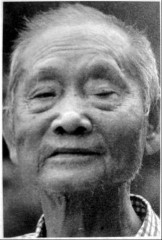
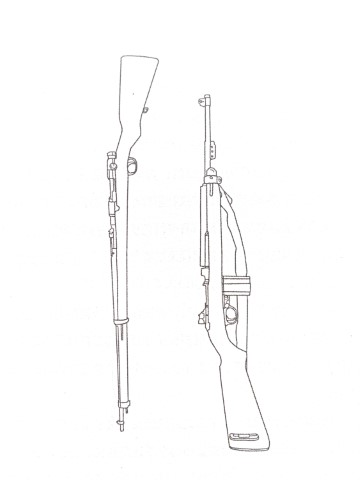
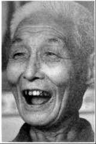
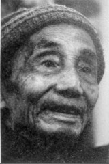

# 自卫团：警察和游击队组成的抗日队伍

_警察，平时维护治安，开战了，有的变成老百姓或难民，有的被编入部队抗日．在湖南临武、新邵、新化，都有警察在自发战斗。长沙县国民抗日自卫团是以长沙县公安局警察为主，整合地方游击队成立的抗日部队。王有恒在这里呆了一年后，去了警察中的“老大”——内政部第一警察总队。_

_现在的王有恒虽然右肩受过伤，总耸拉着右手，但他还是喜欢叼着烟到处串门。埋藏在心中几十年的过往，终于可以光明正大地“扯一扯”了。只是儿子限制他抽烟，一天只许抽五根。_

_90岁的老自卫队员柳元青则透着一股书卷气，他头发全白，坐在板凳上不等发问就一个劲地说下去，说到高兴处，会仰头大笑两声。16岁时身高超过1.7米的他，算是军中的高个子，一直扛着“搞来的歪巴子”在自卫队里做机枪手。_

_黄明德也开朗，但记性不太好，问一句答一句，虽然他在游击队也是个“官”，却似乎不大关心战事，“上头要我们配合正规军，我们就去打，没事我们就啥也不管”。_

_他们的游击队生涯何其相似：在家门口种田，打仗，接着当农民。_

**口述人 /** 王有恒，1924年农历四月二十七日出生，长沙县人，1932年～1936年在老家金华村新学堂读书，1936年后在长沙望城坡和北门等地与父亲一起做小买卖、收废品。1944年参加长沙县国民抗日自卫团[^1]一大队，1945年考入内政部第一警察总队，警卫总统府及国民党中央委员会等地，1950年在四川随部队起义，后因伤复员，回家务农至今。

**采集人 /** 刘见华 **采集时间 /** 2015年7月19日

### “看到马倒在地上，我撒开腿就跑，一口气跑到望城乌山”

1944年农历八月的一天，我到长沙找我老子（方言，父亲），他在北门那边收废品，我去要点钱呷饭。回来的路上碰到日本人，他们叫我两只手举起来，看有没有武器，一个人搜我身，一个人拿钢刀要杀我，吓唬我。我被他们抓到望城坡喂马，每个人每天喂七八匹马。天蒙蒙亮就起来，割草喂马、打扫马厩，夜里睡在马厩里，那马粪味臭死，还有马虱子咬人，只要一停下来，他们就拿鞭子抽我。常常没饭吃，只有在他们心情好的时候，才会给我盐泡饭。他们每天吃抢来的大鱼大肉，还故意在我面前吃，我瞪了他们几眼，有个军官就抽我，还把刀拔出来，嚓嚓响。我很怕啊，说不定哪天也把我杀了啊。

这样过了十来天，我趁着他们出去“打捞”（下乡抢劫）的时候，早早地割了两大筐野芋头喂马。那马我喂了几天，跟我有感情了，我喂什么，它吃什么，毒草它也吃。马吃了野芋头就死了。看到马倒在地上，我撒开腿就跑，一口气跑到望城的乌山，在山上躲了两天，又到白若铺的山上躲了两天，就吃野果、树皮，甚至蚂蚁。

等我回到家，发现家里驻扎了游击队，司令叫邓如灿，是原来长沙县长、警察局长[^2]。驻扎在我家的是一大队，大队长李芳，有个中队长姓徐，长沙县金井人，他跟邓司令说了我毒死日本人马的事，邓司令夸我干得漂亮，就这样我加入了游击队。

邓司令的直属部队是原来他手下的警察，其他各支游击队一般都是乡政府搞的，自愿参加。本地人除了我，还有一个麻田来的刘光荣，他是重机枪手。给我发的手枪、手榴弹，不过队里其他人都是卡宾枪，还有轻重机枪。训练时，徐队长教我用手枪，什么队列之类的根本不学，就直接练打枪。

没过几天日本人就打来了，大概有一个营。他们还先到一个庙里拜了佛[^3]，那庙里现在还有一个和尚呢。拜佛之后，他们就在这山里抢了老百姓的东西，杀猪、呷饭。很多老百姓，包括我老子（方言，指父亲）、母亲、两个姐妹、一个哥哥，都躲到山里去了，没走的几乎都被打死了。

日本人是来打我们县政府的，那时长沙县政府在望城卯田乡，离我们这10多里，我们的口号就是“保卫县政府，保卫邓司令”。除了我们本地人以外，游击队其他人都是外乡的，还有几个乡的联防队员、邓司令手下的警察，乱七八糟有千把人。他们不认得路，我呢，就带路，找到狮子桥一个山坑里，事先埋伏了起来。

我们武器比日本人好，他们用三八式，我们很多人拿的是卡宾枪。我不才训练了两天嘛，啥都不会，徐队长跟我说，我打哪里，你就打哪里。我们很多人都是乱打，嗨，我还真打死了一个。我也是趴在坡上的草丛里，日本人在下面几十米，有个倒霉蛋蹲在那打枪，也不躲，就被我打死了。邓司令在卯田后山指挥，占住山头，架了轻重机枪。从早晨打到中午，邓司令还派人在鬼子两边包抄，到下午的时候，日本人看到地形不利，捞不着便宜，就分成好几队，一边打一边退。

**三八式枪和卡宾枪。**

这一仗我们死的不多，伤的多，但我们本地也死了两个。日本人呢，不晓得他死了多少，他们撤退了，还用马把死的、伤的都运走了。日本人来了这一次后，呷了亏，就再没来过，我们后面就没打过仗了。[^4]

我们的卡宾枪是美国人给的，美国人空投我还看过一次，几架飞机用降落伞把东西丢下来，里面都是美国枪。我们没有军装，也没军饷，但是吃得好，有专门的伙夫，白米饭吃饱，有时还有肉。就为这吃得好，打起仗来就有劲，没一个怕死的，端着枪就往前冲。

我们邓司令，看是看见过咯，但没印象，晓得他是黄埔的。他就住在县政府，我去过那很多次，办公的都是民房，邓司令也是住老屋，还有警卫兵，但也不多，一个重机枪连守在对面的山头上。

他们这些个警察，鬼子来之前搞治安，鬼子来了后，他们一边打鬼子，一边还要搞治安。邓司令不还是县长、警察局长嘛，原来县政府的那一堆事还归他管。就是地盘小了点，很多被鬼子占了，有的乡被鬼子隔开，他又管不了。不打仗的时候，我们就种田。

在游击队待了不到一年，日本人就投降了。1945年9月，国民党内政部的第一警察总队在望城竹马塘招警察，邓司令推荐我考了去。开始就在这里的莲花桥训练，除了用枪，还学了用身边的木棍、树杈等防身。训练后，我到南京当了总统府的传令警长，一个大队只有两个名额，24小时值班。后来又到国民党中央委员会当传令警长。每天的工作就是在南京天王寺、茅山、丹阳、汤山往返，送信、送回执。警察总队待遇好，比一般的军队工资高两倍。晚上我们就和蒋经国、蒋纬国同住一个大院，偶尔还在一起玩玩，打篮球、乒乓球，哈，我那时也学了打球。蒋经国那人个子不高，戴个眼镜。

1949年李宗仁代理总统的时候，我们跟着政府南迁，到广州、贵阳、重庆、成都。1950年在四川的大邑县起义，参加解放军。当年我就因为军训受伤，右肩肩胛骨粉碎性骨折，以伤残复员回家，还是在长沙潘家坪军人招待所登记的。

我们那邓司令[^5]，对我是不错喽，但我去了南京后就没和他联系了，后来太乱了，我要不是因为受伤，还回不来，不晓得会跑到哪里去。

**口述人 /** 柳元青，1925年农历四月二十一日出生，现住长沙县金井镇脱甲村，第三次长沙会战时加入当地的自卫队，当机枪手。1945年抗战结束后进入73军，1948年在济南被解放军收编，1950年入朝。当了那么多年兵，因为婶子的一句“家里就都指望你了”，退伍后回家务农至今。

**采集人 /** 刘见华 **采集时间 /** 2014年8月28日

### “他们把枪扔在一边去抓鸡，我跑过去背了枪就跑”

打仗啊，好多记不起了，70多年了。记得第三次长沙会战，日本人逃回岳阳，大部队跑了，后面还有据点嘛，我们就去搞他的据点。有两次，我们把他们外头那机关枪给搞回来了，还有三十几条三八式，哈哈。日本人在福临铺的据点就是我们的人修的，平时我们穿老百姓的衣服，借着给“维持会”送菜，顺便就搞了他们的枪，主要是偷。有一回被发现了，我做死地往山上跑，背了好多枪嘛，背上被挂得稀烂的，跑了10多里路，跑慢一点就被打死了。

这么危险为什么还参加自卫队？那还不是没办法。家里穷得要死，书没读几天，他们还把我的名字搞错了。我以前叫柳元清，有三点水的，结果到学堂里变成了柳元青，少了三点水，这不好，我还是喜欢有水的。

我12岁到织房学徒，14岁学泥瓦匠，15岁帮人种田，16岁就到乡公所的自卫队去报了名。我个子高噻，他们就让我当机枪手，扛“歪巴子”。家里条件好的都不得去搞那个路，我是走投无路了。我不知道的是，我这一走，就再也没见过我奶奶了。

当时自卫队里大多数是外地人，四川、河南、云南、贵州，有逃难过来的，也有打散的兵。老大叫周应龙，就是我们金井人，他屋里头有资本，不是一般的人咯，自卫队不发饷，他自己想办法筹钱，至少让我们吃饱，不亏待弟兄们。

我们主要是搞游击，都是偷偷摸摸，没有几回正式地打，哈哈，你要是跟我打，我就跑了。日本人下乡来搞老百姓的猪啊、鸡啊，人一少，我们就打他们的伏击，主要是为了抢枪。有一回几个日本兵，也蛮大意啊，几只枪一扔就去抓鸡，我赶快跑过去，背了枪就跑，哈哈。

护路和毁路也搞。就在金井这一带，有时候也跑到星沙那边去一下。再后来，日本鬼子搞报复，周应龙就把我们带到浏阳去了，加入廖义华的抗日挺进军。那个人了不得，从几条枪、几十个人做到了2000多个人，连美国人都相信他。廖义华可能呷鸦片烟，家里那个烟味喷香的。但是他做人呢没有周应龙好，只想着自己拉队伍、占地盘，不管我们的死活。[^6]

日本人投降那会儿，我还打死过一个。我看到两个日本人牵着马往河边走，就用那机关枪打死了一个，另一个跑了。后面有人过来说，日本人都投降了，你还打什么咯。

抗战胜利后，我们划归73军，军长是韩浚。他们来了一群参谋，跟我们各个自卫队的负责人讲，日本鬼子投降了，到我那里去，穿咔叽布军服、穿皮鞋，实在不愿意的呢，就发三个月军饷，回去种田。好多人都不去，但我家里没有人了，又不想回家种田，我就留了下来，还是机枪手，重机枪连的[^7]。

我们司令周应龙是个好人，他没做啥坏事，后来也被当作反革命枪毙了。廖义华那个老地主，不晓得他后来怎么样了。

**2014年8月28日，长沙县金井镇脱甲村，闲不住的柳元青在帮厨。**

**口述人 /** 黄德明，1922年农历五月二十九日出生，长沙县人，1940年参加长沙县白沙乡抗日自卫队，参加了第二、三次长沙会战。1942年到江苏当工兵，破坏铁路、修铁路，抗战胜利后回乡任白沙乡副乡长，1949年后在家务农至今。

**采集人 /** 刘见华 **采集时间 /** 2015年7月15日

### “仗不打了，游击队就分散，各回各家，种田”

第二次长沙会战的时候，我在长沙县白沙乡抗日自卫队当队副，日本人到了新墙河就开始放炮，估计要往长沙来了。游击队员就从各人家里跑出来，在白沙乡这边集合，还有其他乡的游击队，好几百人，往西走，先到古华山，再到影珠山。鬼子已经占了影珠山，他们人蛮多，我们没具体情报，不晓得他们到底有多少，反正是跟正规军一起打。从山下往上面打，那就很吃亏，死了好多人，25师的师长也被打死在这里[^8]，还是我们把他埋在古华山，也就是挖个坑，没有碑，还有很多兵，就都埋在一起。

鬼子从影珠山又打到长沙，我们就一路跟过去打。我们在路上挖一个个的大坑，鬼子的汽车就过不了，又把稻田里放满水，弄得都跟塘似的，人和马都很难走。在长沙这次打得不错，伴着湘江，我们从中山路打到了南门口，打死了蛮多鬼子，就在河边挖万人坑埋他们。我们用铁钩把尸体往坑里拖，4个大坑，每一个大概几米长，埋200多个。咳，坑在哪地方我也记不起了，那以后就没去过。

不打仗的时候，游击队的就各回各家，种田啊，搞搞地方治安啊，还跟土匪打过一次，没看到他们多少人，但火力肯定比我们差咯。

我是1940年8月抽丁入的伍，我们白沙乡自卫队有48个弟兄，都是本地人，穿黄军装，带五发子弹的步枪，还有马枪、轻机枪，手榴弹也多，但那些长官我都不记得了。伙食上呢，白米饭管饱，钱也有一点。

到1942年，我一个弟兄跑到江苏去当兵，把我和刘振芳、高甲连、缪红贵都拉了过去，到那边分在第7连，全连148人，每人一支步枪、一支手枪，主要是在日本人进攻时破坏铁路，自己人反攻时修复铁路。没用炸药，怎么弄呢？铁轨上不是有螺丝嘛，把它拧开，然后把铁轨搬开，就是这样，在南京、蚌埠、徐州到济南那条线上搞了一年多。我也是在南京结的婚，老婆是衡山人。日本人投降后，我就回来当了白沙乡的副乡长。1949年，共产党来了，就又回来种田了。[^9]

[^1]: 在日本人未到长沙以前，长沙县就先后成立过两支自卫武装。有署名李伏波的文章《长沙县抗日自卫团小记》，作者曾是其中一支自卫队的中队长。据李伏波回忆，长沙县第一支抗日自卫团于1937年冬成立，由县长兼任团长，著名武侠小说家向恺然（平江不肖生）当副团长。自卫团买下50师的200支破旧步枪，有汉阳造、日本村田式，还有俄国造步枪。向恺然会武术，曾在湖南省国术馆训练所工作，他邀请一批国术训练所的学生，每个乡中队分一个，给士兵进行武术训练。但这个自卫团因日军当时并未进攻长沙，加上经费困难，于1938年春解散。 1938年冬，曾任湖南《国民日报》总编辑的罗尔瞻任长沙县长，又重组了抗日自卫团。在名义上是每乡一个大队，实际每个大队只有常备兵员20人、破旧步枪13支，其他没有枪的队员，就用大刀、梭标。

[^2]: 邓如灿的自卫团于1944年成立。据现居台湾的邓如灿侄子邓家祎讲述，邓如灿为湖南郴县（现郴州市苏仙区）人，黄埔军校毕业，淞沪抗战时，任薛岳將军的上校作战参谋；部队退却时，曾游泳保护薛岳一同撤退，后随薛岳参加长沙会战。1944年日军占领长沙后，时任长沙县长兼警察局长的邓如灿带领所部警察，將县政府迁往望城县印田乡，并组织抗日自卫团。 有署名史锋、史铎的文章《望城境内抗日战争路述》（邓如灿的长沙县政府迁址在望城县境内），文章记述，此时邓如灿的自卫团是师级单位，下辖两个大队，第一大队队长李芳，第二大队队长龙恒盈。长沙县各乡也建立抗日自卫大队，由乡长兼任大队长，归自卫团司令部统一调遣，协同作战。

[^3]: 老人用“营”来称呼日军的编制，是指大概这么多兵力，实际上日军中并没有“营”的编制。关于日军求神拜佛等“迷信”现象，在当地还有其他传闻，据传有次日军突袭，抓了一个老百姓带路，日军问路线，这个人就编了一首歌谣：出大洞进小洞，搭楼梯到天上。大洞、小洞、楼梯岭、天上山，都是当地的地名，但日军觉得“到天上”是不祥之兆，就掉头走了。

[^4]: 口述者此处记忆可能有误。日军对长沙县政府的进攻有三次，在此前后各有一次。据《望城境内抗日战争略述》所记，第一次进攻是1944年农历九月十七日，当时驻长沙河西的日军千余人突袭卯田，因为自卫团分散设防在莲花桥、小洞一带，仅有少数兵力占领山头，印田被日军攻陷。日军在卯田烧杀之后，于当天下午从原路撤退。 第三次进攻是在1945年四月下旬，日军千余人来扫荡。自卫团第一、二大队和机枪中队、突击队等都守在山上，用机枪多次打退日军冲锋。另一股日军进攻自卫团据点石灰窑，警察大队长温培梧率两个中队阻击，因与司令部联系中断，阵地被日军攻破，温培梧被俘，在遭受酷刑后被杀害。这次战斗打死日军官兵二十余人，其中有日军中队长一名，自卫团阵亡数十人。

[^5]: 王有恒有个妹夫在军队中当技师，“修飞机的”，后来一家去了台湾。上世纪80年代，他们来信，王有恒还不敢要。 自卫团司令邓如灿在1945年日军投降后，与长沙市市长及第四方面军高级幕僚等50余人，在湖南大学参加了受降仪式，后任衡阳县长、长沙市警察局长等职。据邓家祎讲述，邓如灿在任衡山县长期间，曾镇压过手下警察的起义。1949年，他改行从商，但在上世纪50年代初仍被杀，上世纪80年代平反，列为抗日军人。

[^6]: 我们没能在史料中找到廖义华的更多细节。在湖北鄂州的中共鄂南抗日根据地旧址，有碑文介绍说明，1944年3月，国民党鄂南挺进军马钦武部、廖义华部，趁新四军主力部队撤到江北、鄂南根据地兵力空虚之机，联合出兵1500余众，进攻鄂南根据地，根据地进行反击，打死打伤顽军100多人。从这里可以看出，至少廖义华部曾有过“鄂南挺进军”的正式名称，其时，他们有着另一种称谓——“顽军”。 浏阳县政协文史委编撰的《浏阳古今谈》一书中提到，浏阳土布商人罗贵生组织了一支七支枪的游击队，先后截击零散日军十余人，缴到步枪十余支，后被廖义华吞并。一个名叫叶贵吾的老共产党员、老红军，赤手空拳夺了日本人机枪两挺，但后来枪被廖义华“匪部”缴去，人也被他们杀了。

[^7]: 抗战胜利后，柳元青随部队到山东，在济南被解放军收编，还参加过渡江战役。因为婶子讲过一句“退伍回来帮你找个堂客，家里就都指望你了”，柳元青1954年回到老家，结婚，再婚，第二个老婆过世得早，留下他和儿子。

[^8]: 口述者此处回忆可能有误。据《悲歌三湘——湖南五次会战》（黄勇、余吉著，武汉大学出版社 2010年） 等史料记载，国民革命军25师只参加了第一次长沙会战，参加第二次长沙会战的是25军，但也没有师长阵亡的记录。这里阵亡的“师长”可能是副师长或其他级别将领。

[^9]: 现在老人与儿子一起生活，身体不好，有冠心病、前列腺炎，“尿不出，天天呷药”。一个女儿在三岁时发高烧，导致智力低下，至今也和他一起生活。