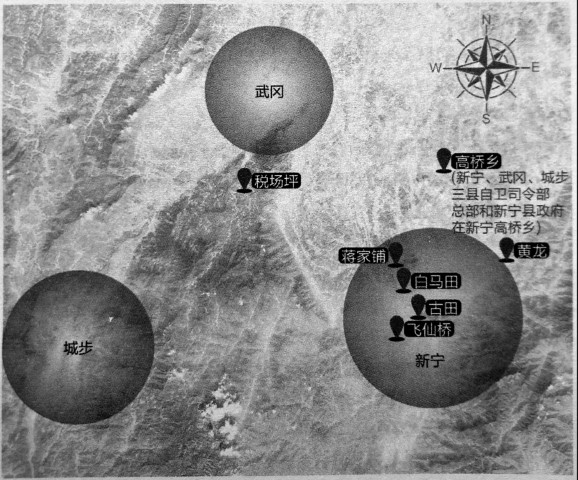
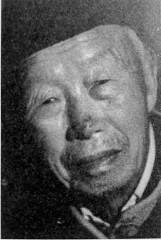

# 自卫队：鬼子一出邵阳三县的县城就开打

_92岁的戴民同一直遗憾没能给老伴许二娘一场婚礼。2015年6月12日，他们在新宁县政府的主持下补办了一场婚礼，白金婚，70年。7月我们到来时，屋里还保留着大红喜字，老伴许二娘身体较好，但很少说话，戴民同除了腿脚不太方便外，精神还不错，能呷饭，酒也每天呷，烟也抽一点。本来没读多少书的戴民同，也会说出“知其然，不知其所以然，这样文气的话。_

_邵阳民风彪悍，1944年日军入侵时，这里也是自卫队遍地开花的地方，而戴民同所在部队的司令徐名虎，更因抗日和整肃地方的功绩，被称为“老虎县长”。当年这支正式名称叫“新宁、武冈、城步三县自卫大队”的地方游击队，分散占据了各个农村、山头，“鬼子一出县城，到了谁的地方，谁就打他。”_

_那时他们也经常唱歌，有《九一八》、《游击队歌》、《黄河大合唱》，“不管是国民党还是共产党的，都唱，唱这歌才像游击队！”_

**三县自卫队在新宁活动地点图 /** 新宁、武冈、城步三县自卫司令部总部和新宁县政府在新宁高桥乡，在新宁境内经常活动的地点有黄龙、白马田、古田、飞仙桥、税场坪、蒋家铺等。

**口述人 /** 戴民铜（同），1923年生，新宁县人，1940年入黄埔武冈分校学兵队，毕业后留校当教官。1944年加入新宁、武冈、城步三县自卫大队，抗战胜利后当过警察所长，又去陈明仁部队当兵，后随部队起义，回家务农至今。

**采集人 /** 刘见华 **采集时间 /** 2015年7月25日

### “当兵嘛，要你送死你就送死”

自卫队啊？比我大的都死了，这边就我一个了。哪一年出生的？记不大清了，只知道我是甲子[^1]的，家里兄妹六个。

参加自卫队是后来的事，我是先到黄埔军校学兵队的，武冈的二分校[^2]，我那时17岁，不是抓丁，就是有人介绍，我认识那里的一个文书，说是叫老表，其实就是乱叫的。我不想等到抓丁，主动当兵就会对你好一些，抓过去的就当成犯人了。学兵跟学生不一样，军校学生至少要中学毕业，我没读什么书，顶多算是预备生。他们学生其实是官嘛，军官，出来后是少尉、中尉、上尉；我呢，就是兵，出来后是二等兵、一等兵、上等兵，然后是上士，当班长，那就是“兵王”，再往上就是官。

军校里先练军姿，两腿绷直、小腹收紧、抬头挺胸；然后练打枪，每人一把中正式，立姿、卧姿、蹲姿，扣扳机的时候，还要屏住呼吸。除了学步枪，也学机枪，像捷克式轻机枪、带个盘子的俄式轻机枪，还有我们叫它水机关枪的重机枪，枪管子打热了要用水冷却，一个带子有200发子弹。还学各种炮，60迫击炮、枪榴弹、掷弹筒、山炮、野炮，只要是军队里用的武器，我们都要学。不是炮兵也学炮，不懂原理，但要会用，叫“知其然，不知其所以然”。后来还有榴弹炮，那都是美国人的，新式武器。

学了炮，又进劈刺班，拼刺刀，练习时要戴护腿、护腕、护面，护腿和护腕是竹片做的，护面是铁的。把这一整套学完，就搞了三四年了。出来后我作为二等兵，留在学校当教官，带新兵，主要是训练，和学兵队一样，军事队喽。出来后怎么混，看个人运气，学兵出来一般最多做到班长，也有少数运气好的，跟军校学生一样，做排长。我教新兵打夜战、打游击战，打仗时到了一个山头，情況不一样，战术也不一样了，很多军官到了山里就“没用”，就跟你硕士、博士没实战经验一样，没用。

1944年打衡阳的时候，我们学校里的学员、学兵，都派到邵阳、衡阳交界的地方，维持秩序、运伤兵、运弹药。当兵嘛，要你挖士你就挖士，要你抬担架你就抬担架，要你送死你就送死。那时老百姓挑着担子，走在路中间，往后方逃难，路两边是伤兵。逃难的成群结队，一听日本人来了，其实还在前边老远的县呢，中间还隔一个县，这边县城的人就跑光了。

我们从武冈、邵阳到衡阳，去的时候运弹药、运补给，回来时运伤兵，都是步行。路上很少有汽车，有，也是烧木炭的，军车有一点油，坐车的都是当官的。伤兵都是衡阳那边正规军的，武冈、新宁这边有第七休养院，把两个县的祠堂、庵子、庙都放伤兵了。伤兵也死了好多，都埋在这边，没得亲人来收尸，但比战场上好一些，至少不是万人坑，都是一个个埋的，排的很整齐，还有小牌子，写着名字、哪支部队、哪里人，等等。死在哪就埋在哪，新宁这边就在老卫生院那里，埋了好几百人。

### “俘虏头一伸，还说‘顶好顶好’”
邵阳跟衡阳没隔好远，日本人从衡阳来了，我们就退，直退到绥宁、新宁，结果日本人打过来，占了新宁县城，我们的县政府跑到高桥农村里去了。我这年7月回新宁来，本来要结婚的，结果到了9月份，婚还没结。听说徐君虎[^3]搞了一个新宁、武冈、城步三县自卫队，我就跑去了。徐君虎那人也是蛮高大的，既是新宁县长，又是总司令。自卫队有三个总队，新宁、城步、武冈每县一个总队，每个总队下面有三个大队，大队下面是中队、分队，分队就相当于班。我毕竟当过兵嘛，就让我当了特务班的班长。

那时日本人占了县城，我们的县政府在农村，但隔的不远，县政府差不多就是前线了。游击队都是分散的，我们占了农村，还有县城往农村的各个路口，日本人一出来我们就打[^4]。也不是所有部队都上，到谁那谁打，一般是消灭他几个，日本人就跑回县城了。

打仗的地点呢，我还记得几个，黄龙、白马田、古田、飞仙桥、税场坪、蒋家，飞仙桥那一仗，我们死了三个，伤了四个，日本人也有死的。他们哪，也真是不怕死，挺起胸膛就冲过来了，也不躲。我们还捉到一个日本人，当然不是我亲手抓的，别人抓来给我看管的，东京的，四十多岁，蛮高大的一个人，名字不记得了。抓来后我们就问他：“你为什么来打中国人？”但怎么问他也不说话，我想想这没办法了，让他写，他就写了“日本中国，兄弟同胞，打倒英美”。我火了，就用枪托砸他脑壳，做样子要枪毙他，他呢，也不怕，把头一伸，还说“顶好顶好”，我们也听不懂，就是听到“顶好顶好”这几个字。

问不出什么东西，我们就把他关在老百姓家的一个谷仓里。饭还是给他吃的，还是白米饭呢，他吃了一大菜碗还嫌不够，还用筷子在桌子上画一个圈，我们就再给他吃。我看他身上脏得很，痒得一直抓，又看着他到塘里洗了个澡。有人听说这里抓了一个日本人，跑来这里要打他，被我们拦住了。哎，他也是炮子嘛，他在家里呷的好好的，上头要他来他就来了，他有啥办法？

别的地方抓到俘虏，都要奖励、给钱，我们这没有，只听说上头奖给司令部一挺轻机枪，但也没到我手里，至于奖没奖钱，我就不晓得了。我们关了这个俘虏七个多月，后来把他送到常德，交给正规军看管了。[^5]

那时，我们游击队也经常唱歌，最喜欢唱的是《九一八》《黄河大合唱》，也唱八路军的《游击队歌》。

日本人投降后，我们就解散了，我在家待了两年，还教了一年书，因为我在军校学了点文化嘛。然后又到宝庆府当了一年城区警察所的警长，相当于班长吧，这差事也是找徐君虎弄来的。后来又去陈明仁部队当了兵。当时我早就成家，有一个小孩了，但还是去当兵，因为家里三兄弟必须有一个当兵的，我当了好多年兵，搞习惯了，再去不吃亏，那两弟兄又不晓得打。在陈明仁的部队，番号我记得，71军88师202团，我先当排长，再当副连长，后来就跟部队起义了。[^6]

[^1]: 甲子年应为1924年，但家人说老人记忆有误，实际生年是1923年。

[^2]: 黄埔武冈分校原为武汉分校，1938年秋，日军进逼武汉，武汉分校被迫迁至武冈，后来又迁会同。至1945年10月，这个分校招收了第14期至19期学员，训练了10个总队，另设军官训练班、技术训练班等，共毕业学员23502人。分校旧址现在武冈二中，于2013年5月被公布为第七批全国重点文物保护单位。

[^3]: 徐君虎（1906~1996），新宁县人，曾在莫斯科中山大学与蒋经国、邓希贤（邓小平）、张闻天等人同学。徐君虎相当一段时期是站在反对蒋介石的立场上的，1931年还曾回新宁“立杆子”，拉武装，打烂了国民党县党部，起义未果，遭湖南省政府主席何键悬赏通缉，辗转广西桂林，开办农场。期间还曾得到桂系支持，到湘西组建“抗日救国义勇军”，对抗蒋介石，与湖南省保安团作战。1937年冬，蒋经国自苏联回国，邀徐君虎赴江西担任赣南专署主任秘书，徐君虎欣然前往，助其实施“建设新赣南”计划，后因意见相左愤而离赣。 1944年日军入侵新宁，徐君虎回乡抗战，后来受命出任新宁县县长兼武冈、城步、新宁三县自卫区司令。而“受命”的原因，据《乱世县长徐君虎》（李波，新宁县政协文史资料委员会编印 1986年）一书载，县城沦陷后，县警察局大队长不听县长廖佩之号令，廖佩之无奈，逃到武冈，并从正规军借来100支长枪，招兵买马，可那里士匪猖獗，土匪们假装投靠廖佩之，领到枪后，就上山去了。廖佩之无奈之下，写了一封言辞恳切的信，请徐君虎出山，主持军务。

[^4]: 据《乱世县长徐君虎》载，徐君虎还曾亲自化装成卖柴的农民混进新宁县城，在日军司令部门口叫卖。司令部厨房买下柴火，徐君虎从厨房烧火的新宁人口中打听到一队日军将进瑶山扫荡，掌握了日军的人数、武器装备和兵力分布等情况。徐君虎带领自卫队在半山伏击这股日军，歼敌150多人，日军司令西原也受了伤，这也是自卫队取得的一场较大的胜利。

[^5]: 据《新宁县志》载，自卫队在一年多时间内，共歼灭日军300多人，活捉了13名俘虏，而新宁在沦陷期间被屠杀民众2800多人，被杀耕牛4280余头，烧毁房屋4900余栋，耗损粮食17万多担。

[^6]: 自卫区司令徐君虎1949年起义，1957年被错划为右派，1979年平反。全国人大常委会发出《告台湾同胞书》后，徐君虎还致信老同学蒋经国，倡导实行第三次国共合作，化干戈为玉帛。 有熟悉徐君虎的人撰文回忆，徐君虎有两大爱好，一是喜欢钓鱼，一是喜欢吃狗肉。上世纪60、70年代徐君虎闲居新宁老家，每天都去城郊的江口老桥或柳山小学旁的银塘湾钓鱼。那时，农田施药少，总能钓出肥鱼。“文革”时期，上小学的娃娃也知道他是“阶级敌人”，每当徐君虎钓鱼，就有孩子扔小石子，让他钓不着鱼。徐君虎则不愠不火，“浅笑挪窝，挂食另钓”。徐君虎吃狗肉，还特别喜欢新宁土狗。1992年，有朋友带两腿新宁狗肉拜访徐君虎，“徐老喜极，时年近九十，然齿力刚健，嚼骨有声”。（事见彭贵珊文《想起徐君虎》）。