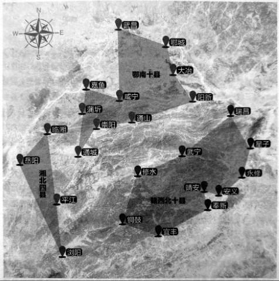
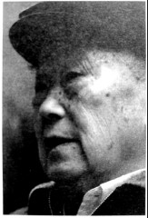
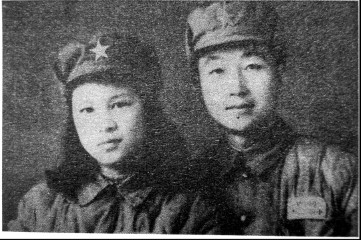

# 边区：国民党在湖南唯一的抗日根据地

_长沙的“文艺兵”易唯诚现在还是一副文质彬彬的样子，说话慢条斯理，不温不火，古文、英文都很不错，1954年后还当了多年古文老师，只是现在“背不出了”。_

_70多年前，在湘鄂赣边区[^1]这个国民党在湖南唯一的抗日根据地，易唯诚是很讨厌“文艺兵”这个身份的。这里有几万正规军，也像游击队那样，专门在三省交界处的日军占领区搞破坏，袭扰、破路、抓俘虏[^2]。正规军打游击，本来就窝囊，作为“文艺兵”，易唯诚更牢骚满腹，“当只不打仗，有什么意思”，仅有的几次战斗，抓了俘虏，却同样是个“文化人”，两个人还聊得“蛮开心”。_

_老实本分的“地主少爷”易唯诚后来娶了一个泼辣的“川妹子”，“文革”时有人要斗他，“我那老婆保护了我，她是贫下中农嘛，又是共产党的干部，根正苗红，她厉害起来，没有人敢惹她”。_

**湘鄂赣边区范围图 /** 湘鄂赣边区自成立后，虽然收编了大量地方武装，但没有明确的管辖界限。1940年2月，第33军团军团长李默庵任总指挥后，正式划定湘北四县（临湘、岳阳、平江、浏阳）、鄂南十县（武昌、大冶、嘉鱼、阳新、鄂城、咸宁、蒲圻、崇阳、通城、通山）、赣西北十县（修水、武宁、铜鼓、宜丰、靖安、奉新、永修、安义、星子、瑞昌）为边区管辖范围，共计面积约10万平方公里，人口约800万。（资料来源：刘公武，《抗日时期国民党的“湘鄂赣边区”》，载于《湖南文史资料》第3辑。）

**口述人 /** 易唯诚，1921年农历十一月五日出生，长沙铜官镇人，生于新疆，长于北京、长沙。抗战期间在国民革命军19师做了两年文艺兵，又在99军做团部参谋兼连训导员，随部队在湘鄂赣边区打游击。

**采集人 /** 刘见华 **采集时间 /** 2013年11月20日

### “和日本俘虏用英语、日语、汉语交流”

我嘛，现在身体没病没灾，还是活的不错的。就是一两年前，记性开始差了，十多分钟前的事，转眼就忘了。但对当年呢，还模模糊糊记得一些，像那个被我抓的日本工程师的名字，荒木虎雄，是不会忘的。

1940年，我到99军197师590团，啊，这个我还记得。我是上尉连训导员，相当于今天的指导员，还是团部参谋。我们这个连是军士连，军士嘛，就是部队里的“官”，所以我们每个兵都是班长级别。部队里很多都是农民嘛，我们有点文化的，就都当官了。上头把我们这些“官”编成一个连，其实是对我们的爱护，很少让我们跟那些大头兵一起打仗。

其实呢，我很讨厌这样。来99军之前，我本来当了两年文艺兵了，在19师。1938年我17岁的时候，19师在长沙招兵，我与广益中学的同学陈泽纯去投军。我们家共有八姐弟，当时我妈妈很开明的咧，她就跟几个孩子说：“你们啊，想去哪就去哪，也别管它是什么党的，去当政府的兵也好，去共产党那边也好，反正国家都这样了”。于是我二姐就去了延安，读了抗大；一个哥哥呢，在铁路上当工程师；我呢，就当了国民党的兵。

当时要我们穿西装短裤，那好羞人的。我们被分到政工队演话剧、搞宣传，演过很多次《放下你的鞭子》《流亡泪》，此外就是讲时事啊，作报告啊。后来我就烦了，这兵当的，多没意思，我就又投了99军，没想到还是文职。唉，我就是长得太书生了，到哪里都把我当文化兵。所以呢，别看我当了那么多年兵，其实没打什么仗，就是偶尔带队搞点袭击，袭击完了，我们又回到团部，被“供”着了。

我们主要在湘鄂赣边区打游击，经常活动的地方，像通山、九宫山、太阳山；县嘛，江西的修水、铜鼓啊，湖北的通城啊，我们湖南的平江啊。

1940年的一次夜袭，我抓了前面说的那个荒木虎雄。当时我带了十几个人，摸到了日本人在大冶的兵工厂。他们也没啥防备，没有什么警卫部队的，都没有打起来。那个日本工程师，晚上没事，在外面散步，就被我们碰上了。他没带枪，但穿了军装，我看了他的军衔，两杠两星，该是中佐。我们要他跟我们走，他也不反抗，也不用绑，大大方方地答应了。路上啊，我就和他聊起天来了，那时我们也没专门的翻译，但因为打日本，每个人都会几句日语。同时呢，我还会点英语，我在教会学校待过嘛，荒木虎雄他是工程师噻，读过大学的，也会英语，我们就用英语交流，再加上中文、日语，聊得还不错。这不能叫审问，根本没问什么军事机密啊，就是聊聊家常，他讲他的大学生活，我说我的经历。具体他说的什么，那不记得了。带回来后，就把他送到99军军部了，也不知他后来是死是活，有没有回到日本。

### “右手握拳，竖起大拇指，路膊平伸出去，眯着眼晴看”

1941年10月，二次长沙会战的时候，197师奉命在洞庭湖一带“策应”[^3]，590团守在资江南岸，我们连也分了好几个小队，这一点那一点。我是指导员嘛，当时我就带着七个人，一挺重机枪，马克沁的，一千多子弹，守一个叫临资口的地方，就是临着资水的入口，在湘阴。

那里有个河堤，我们在大堤后面趴着，我就是机枪手。那日本人呢，两艘汽艇过来了。头一次他们大摇大摆地来，我噼里啪啦打了一通，他们就跑了，也没还手。我们趴着没动。过一会儿，他们又来了，这次聪明了点，没走大河了，从一个小汊子里过来的，两边都是草。我又噼里啪啦打了过去，他们看还捞不着便宜，又跑了。有没有打死人我们不知道，只看到他跑了。这一下我们就兴奋了，大意了，就说这日本人也蛮好打的嘛。我站起来，手叉着腰在那看。我那几个手下呢，也围着我探头探脑地望。这不是活靶子嘛，结果呢，日本人就用那钢炮，一炮打了过来，我那几个兵，把我扑倒了，我倒是没事，连伤也没得，他们就惨了，日本人打了两炮，我们七个人，死的伤的有四五个。[^4]除了偶尔打点仗，更多的时候，我就是当参谋，主要的活是做沙盘。每次打仗前，长官会带我们看地形，跟我们说，“你们都看清楚了，回去要做好”。我们呢，就记下，这是山，这是路，那是河，然后要看距离，右手握拳，竖起大拇指，胳膊平伸出去，眯着眼睛看，这就是目测距离了。有时两手都伸出去，校正一下。咳，那时我们条件差，没设备，就是这样搞的。

在湘鄂赣，因为我们是团部里的文化兵嘛，伙食还马马虎虎，吃红薯多，白米饭少，但至少吃的饱，不像有些个大头兵，饭都没的吃[^5]。没见过军饷，但也没吃什么苦头。我连当兵，都当得平平安安的。

### “在黄埔当教官，蒋介石见的多，他基本上每个月要来训话一次”

湘鄂赣打游击在1942年就结束了[^6]。前头说的我那广益中学的同学陈泽纯，他父亲陈纪川在中央军校，我们就去考中央军校，就是黄埔，当时已经迁到成都了。因为有关系，我只写了一篇作文，题目是《论强国兴邦》，就被录取了。在学校里，学习了“步兵操典” “射击教范”等。毕业后，我还是想上前线，写申请书，但上头说，你这个文质彬彬的样子，打仗不一定顶什么用，你知识这么好，留在这教下一代，也是抗日嘛，我就成了教官。在黄埔当教官，别的没啥，就是蒋介石见的多。蒋介石不一直是黄埔的校长嘛，他基本上每个月要来训话一次。每次都坐得笔直笔直的，对自己要求很严，连茶都不喝，只喝白开水，不像现在电影里放的蒋介石那样，板着脸训人。他跟我也说过很多话，我们就相当于学校里的校长跟老师嘛，话当然说过很多喽。记得最清楚的，是要我们“站的直、走的稳、坐的正”，还教我不要染上坏习惯，“烟酒嫖赌，洪水猛兽”，这都是他的原话。其他的，太多，记不起了。

我在军校一直待到1949年，刘伯承打来的时候，我们就集体投诚了。

哎，我一直都想打仗，却做了半辈子“文化兵”，又做了半辈子文化人，到现在，你看，还是文质彬彬的，哈哈。这是跟家庭出身有关喽，改不了。我是地主家的少爷，小时候旧学、西学都学的不错。从小家里就有家庭教师，所以我古文好，就是那时的基础。我出生没多久又到北京，在那我上的是汇文学校，教会办的，所以我英语也不错嘛。不过嘛，你现在让我背古文，那是背不出来了。把它拿来，我能读，能讲。英语嘛，也不记得哒。

**2013年11月20日，在长沙新开铺“机床厂宿舍”的家中，易唯诚的结婚照。**

[^1]: 早在1938年，国民党军队即按照蒋介石的设想，变更了战斗系列，1/3用于正面战场，1/3进入敌后开展游击战，1/3在后方整训，此时将建立敌后根据地提上了日程。1939年以后，湘鄂赣、苏浙皖、苏鲁豫、鄂豫皖、冀鲁豫、冀晋豫、冀察晋绥、冀察热等八个沦陷区先后设立了游击区。其中的一些游击区就是此前内战时中共的根据地。除了抗战外，国民党设立这些游击区也是为了防止中共势力卷土重来，湘鄂赣边区也不例外。 根据中国第二历史档案馆编写的《抗日战争正面战场》（凤凰出版社 2005年）一书，1938年武汉、岳阳先后沦陷，湘鄂赣边区成为第九战区的前哨阵地和敌后游击区，军委会指示“第九战区以九宫山、幕阜山一带为根据地，取积极行动，夹击转攻武汉之敌，同时截断敌后方之连络线”，并“应以四个师以上兵力，在九宫山建立游击根据地，向敌后方游击”。第九战区于是奉命在鄂南九宫山建立游击根据地，以落阜山为中心，包含九宫山、庐山、岷山等山岳地带，设立了游击总指挥部。后来，国民政府甚至设立了一个湘鄂赣边区，有自己的边区政府和党国机构，独立于湖北、湖南、江西三省之外。先后担任这个根据地总指挥的是第12军团军团长樊崧甫、第33军团军团长李默庵、第93军副军长王劲修。

[^2]: 湘鄂赣边区有一批正规军，如第8军、73军，以及后来的99军等，作为根据地的主力部队。同时也收编各地保安团，组成了“挺进军”八个纵队，一些地方的县长兼任了支队司令。

[^3]: 三次长沙会战期间，湘鄂赣边区的部队都参加了对湘北日军的袭扰活动。如第一、二次长沙会战，“挺进军”分别于通山、大冶、阳新及咸宁、瑞昌等地打游击。白崇禧后来回顾：“本战区之游击战，系以大云山、九宫山、岷山、庐山等为根据地，在第一、二、三次长沙会战时，协助国军将汨罗河南北公路及湖南境内公路彻底破坏，使敌军重炮、野炮、战防炮、卡车等皆不能通行。故第一次会战，敌知难而退。第二、三次会战，则因补充不及，空投无济于事，遭我空军之袭击、侧击、追击，敌铩羽而归。三次长沙会战，我国军将士在攻守方面，固有殊勋，然民众破路之功亦不可没。”

[^4]: 湘鄂赣边区也有一些部队，尤其是地方游击队“挺进军”，贪生怕死，不敢作战。曾任湘鄂赣边区总指挥部政治部主任的刘公武撰有《抗日时期国民党的“湘鄂赣边区”》一文（载于《湖南文史资料》第3辑），作者回忆，当时边区流传一句顺口溜：“挺进军，贼子心，不打日本人，只打老百姓”。而边区的党政人员，一听到日本人来了，就惊慌失措，准备逃命。 同时，边区的国民党武装也力图绞杀中共势力。1939年2月，湘鄂赣边区所属的江西保安十八团司令钟石磐袭击并杀害了中共的赣北工委和赣北游击队负责人刘为泗、田文灼，逮捕后处决了赣北工委宣传部长辛忠荩，共杀害中共干部30多人，剿灭了中共在这里的根据地。

[^5]: 正规军之外收编的地方游击队给养就差很多。据刘公武回忆，当时边区收编的“挺进军”八个纵队，除了纵队司令部由总指挥部发给一点活动经费外，其他官兵给养都是就地自筹，游击队多是些“衣不蔽体、食不得饱，枯瘦如柴的叫花子兵”。这种情况，也造成了这些游击队在地方搞摊派勒索，当时百姓反映他们“游而不击，见敌则逃，扰民有余”。

[^6]: 湘鄂赣边区作为一级政府于1942年正式撤销，其党团机构重新移交各省政府，一些正规军也陆续撤离，但游击武装一直存在。武汉理工大学文法学院教授洪小夏曾撰有《国民党敌后抗日根据地论析》一文（载于《中国现代史学会前沿问题学术研讨会论文集》），指出1943年以后仍旧保持的国民党敌后根据地有晋西、大别山、浙苏皖边区、湘鄂赣、海南游击区、福建广东沿海等。总体来看，国民党在淮河以北的各根据地基本丧失，在长江、淮河之间的各根据地普遍遭到削弱，在长江以南的各根据地，则大多能够保持。