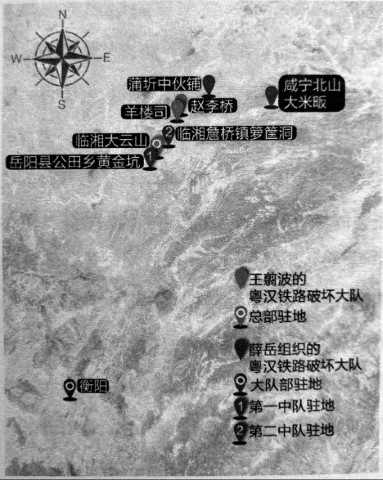
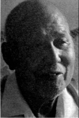

# 铁道线：粤汉铁路上的铁道游击队

_有高血压和血吸虫病的易信贤，却烟酒不沾，“酒每次不到一两，烟呷得多”。开朗、随和的老人，听力也还不错，能听懂说得很快的普通话。采访中总是说自己不安分，喜欢到处跑，“现在只要身体好，就心满意足了”。_

_打鬼子的时候，老人在岳阳的铁道破坏大队，却因为年龄小，只能打掩护。那时在粤汉铁路沿线有几支专门炸铁路、炸桥的“铁道游击队”[^1]。有的是在日军来之前炸桥破路，部队反攻时抓紧修桥修路，有的则长期在敌后，能炸多少是多少。_

_易信贤现在“出名”了，村里有人问，今年（2015）9月3号也到北京去么？老人笑笑说，“那想还是想，估计没我的机会”。_

**湖南“铁道游击队”驻地分布图 /** 现在较确信湖南境内的“铁道游击队”，有两支，一支是王翦波的粤汉铁路敌区铁道破坏大队，总部在临湘大云山，主要在临湘境内活动，如赵李桥、羊楼司等地。

另一支是薛岳下令组织的粤汉路破坏大队，活动范围更为广泛，大队部驻衡阳，下辖三个中队：第一中队驻岳阳县公田乡黄金坑；第二中队驻临湘詹桥镇箩筐洞；第三中队驻地不明。仅第二中队的活动地点，就有湖北咸宁北山大米畈、湖南临湘的羊楼司、湖北蒲圻的中伙铺等地。

**口述人 /** 易信贤，1929年生，湖南岳阳人，14岁时在家乡加入粤汉铁路敌区铁道破坏大队，1944年参加青年军，抗战胜利后到台湾，因为想家又跑回大陆。1958年被打成“美蒋特务”，在劳改农场14年，后返乡务农至今。

**采集人 /** 刘见华 **采集时间 /** 2015年7月11日

### “不跑就会饿死，跑或许还有条活路”

1939年鬼子来的时候，我父亲已经死了。几个鬼子抓住我娘老子（方言，指母亲），把她打得要死，他们把她围着，一个人从这边打一下，推过去、用脚踹过去，另一个人接着打。打完了，一个鬼子要把她摔死，被他们班长劝住，才留了娘老子一命，但鬼子还是把我们家房子拆掉，去修他们的炮楼了。我那娘老子能活哎，大概是1991年才死，活了98岁。

我们家穷，解放后“土改”定成分，就是“下中农”。日本人来了后，那全都乱了，没的饭吃，我就去逃难、乞讨，跟胡春台的侄子一起，他比我大一些。胡春台当过兵，人厉害，后来也搞了自卫队[^2]。那不跑就会俄死，跑或许还有条活路。我家七个兄弟，两个姐姐，我娘老子带着几个小的娃娃，跑到岳阳县的乡下。后来搞了维持会，治安好一点了，她就回来了。我们大的呢，就自己出去逃难。我是走到衡山的，那儿有个“儿童教养所”，名字起的好听，就是“难民学校”，在南岳山底下，分两个大队。在那经常要躲空袭，鬼子飞机来了，就往山上跑。学校还教了我们《难民歌》，我现在还会唱，“日本鬼子的大炮，杀了爸爸又杀了妈妈……打了鬼子，才能建设新中华。”难民学校管饭，糙米饭每人每天一斤，但吃不饱，我很能吃，十一二岁的娃娃，又是长个子的时候。还有饿死的娃娃，看到呷不饱，我也就跑了，不能在那等死啊，我就又跑回来了，在那只待了两个月。跑回来在岳阳县那边的朱家桥，还是乞讨。

我一个哥哥，还是黄埔九期毕业的，都没的活了。他毕业后，本来当岳阳警备队的队长，日本人一来，政府都垮了，他也跟着跑，到湖北沔阳，又到一个什么地方当副乡长，弄口饭呷。

1943年我去了铁路破坏队，正式名字叫“粤汉铁路敌区铁道破坏大队”，大队长是胡戬少将，他就是我们这边人，我进这个大队还靠了他一点关系，我们有一点亲威，但也不是很亲。这个大队上面还有个总司令叫王翦波，他是临湘县的县长，除了铁路破坏队，手下还有好几千人马。[^3]

### “游击队没军饷，但饭管饱，还是白米饭”

我们大队下面有三个中队，总共五六百人。我年纪太小，就是打掩护的，其实从没亲自炸过桥、炸过路。不过我们装备好，我拿的都是冲锋枪，加拿大的，但我也搞不清是加拿大生产的还是加拿大援助的，后面一个铁把子当枪托，前面一个梭子，当手柄[^4]。我们主要是在临湘那边搞鬼子的公路、铁路，还有桥。大队部在临湘大云山[^5]的车廖家、庙湾里、刘正阁，也换了好几个地方，行动的时候还是各中队自己搞自己的，分头打嘛。

炸临湘赵李桥那次，我去了。也不知道那桥下面是什么河，桥有什么战略价值，反正是见了铁路桥就炸。一个中队，两三百游击队员埋伏，打掩护，一二十人上桥，用箩筐担着黄色炸药。炸药有圆的、方的两种，性能上没区别，圆的小一些，三四两重；方的大一些，半斤多，一块块像肥皂一样的，用的时候要把它们捆起来，一次㧢几十上百个，有几十斤重，用导火索连起来。我没上去过，也不知道他们把炸药安在桥的哪里，放的位置、用多少药，这个是有讲究的。我们去的时候没有鬼子守桥，那桥就被炸断了。

在临湘羊楼司炸了日本人的铁路。炸桥呢，是炸断就好，炸路是能炸多长炸多长，不是炸一段、火车不能跑了就完事。炸掉的越多，鬼子修路就越费事。但我们没炸过、也没爬过火车，那基本上都是在晚上去，就是趁日本人不在的时候搞，日本人的车来了，我们就跑了，哪还敢去炸它？所以我们很少跟鬼子干起来，在铁路破坏队，我实际上从来没打过仗。

我们那炸药，还有一个用处，就是洗澡，可以治皮肤病，把那东西弄一点放在水里，洗了几次，身上就不痒了。这个，可能是炸药里有硫磺的缘故。

在游击队没军饷，但饭管饱，还都是白米饭，比在家里好多了；军装嘛，也没有，我们都还是穿老百姓的衣裳。听说总司令王剪波那边，每人每天有8分钱、3升谷，穿的都是灰军装，比我们又阔气多了。

那时老百姓中间也会流传一些关于蒋介石、宋美龄的传闻，除了说宋美龄很漂亮外，还有说蒋介石本来姓郑，叫“郑三发子”，老家不是浙江奉化，是河南许昌的[^6]。不打仗的时候，闲得挺闷的，我们也会聊这些。

我们大队长胡戬，个子高，力气大，人漂亮。他老婆是城陵矶的，也长的好看，很般配的两个人。夫妻俩很和气，从来没见他们吵架、红过脸[^7]。

总司令王翦波，也到我们大队部来过，样子很威武，司令嘛，总要有个厉害的样子。听说他对自己要求特别严，不赌博，不打牌，不抽烟，不喝酒。

### “日月潭的部落头头的女儿，我们叫她公主”

1944年底，我15岁，听说长沙招考青年军，我们就到长沙的广益中学，跟学生一起报名参加青年军，我分到第205师1旅2团1营2连。我是蛮调皮的，看到哪里好就往哪里跑。青年军是要知识青年的，大中专学生才可以加入。好多人学历都是假的，听说青年军待遇好，都想混进来。

青年军几个长官我记的蛮清楚，205师师长覃异之，旅长邓文禧，团长叫张文元，营长是鲁继龙，连长叫车振工。招兵以后，我们就到广东韶关军训，搞了大半年。205师都是一流的装备，军官配的加拿大造的手枪，士兵配的铁把子冲锋枪，脚上穿的是美式胶鞋。当时，我们没事时也会议论，青年军不是蒋经国搞的嘛，我们就觉得他厉害；蒋纬国不行，那时才是一个营长。

没想到那么快日本人就投降了，我们接到命令去接收台湾。在香港登上美国的招商船，先到台湾基隆港，再到台北，后来又到了屏东、嘉义、台中。我们还坐汽艇到日月潭，日月潭的高山族，那时还有部落，但他们都能听懂、也能说一点汉语。部落头头的女儿，我们叫她“公主”，我也调皮噻，就问她：“你是公主，那附马是哪个喽？”她就笑一笑：“驸马不就是你嘛。”在台湾，刚好赶上“二二八”事变。国民党军队本来纪律差，在老百姓中印象很坏，前一支部队去了，台湾的老百姓就打他们。我们青年军的纪律不错，换了我们，老百姓就不打了。

老实讲，我不安分，到台湾没多久，我又没在军队里干了。进过警察学校，毕业了去警务处，后来想家了，又想跑回大陆。警长不放我走，我就要赖，威胁他，你不放我走，等我偷偷跑了，就把你们这里的枪全部偷走，他就放我走了。我在码头，是趁帮人背货装船的机会逃回来的，到上海，再坐船到南京、武汉，回岳阳老家。跑了一大圈，还是回来了。[^8]

[^1]: 据《湖南省志》，湖南境内最早成立的“铁道游击队”，是1939年11月第九战区司令长官薛岳下令成立的粤汉铁路破坏大队，成员从铁道工人中招募，任岳为大队长。大队下辖三个中队，每个中队下辖运输、爆破两个班，每班约十人，他们身穿便服，专门在夜间秘密行动。破坏大队成立以后，仅第二中队就先后在湖北咸宁的北山、蒲圻的中伙铺、湖南临湘羊楼司等地炸坏铁路桥五座、日军装甲车三辆、军运车六辆、巡道车两辆，炸死炸伤日军二百余人。

[^2]: 胡春台（1905~1950），岳阳县人，他后来组织游击队，接受县政府收编，任中队长。这个游击队曾在公路上埋伏，炸日军军车；夜袭筻口日军弹药场，夺了山炮弹三百余发，烧毁炮弹一万余箱。日军将胡春台兄嫂捉去，要挟他投降，他回信给长兄：“兄可为国家正义死，弟不能因骨肉私情降”。1950年，胡春台率旧部在岳阳县窃取枪支后，杀害中共政府区干部十人、农民一人，被逮捕后枪决。

[^3]: 王翦波（1901~1958），临湘人，读过军校，在日军入侵时，临危受命代理县长，并组织游击队抗日。据《临湘县志》载，铁路破坏队只是他的附属武装，他的主力叫挺进纵队，有1500人的兵力，还有保安队维护社会治安，特务排警卫县政府。这支游击队主要配合国军正规军在湘北抗击日军，同时镇压一些铁杆汉奸、维持会长等。

[^4]: 根据老人回忆，结合相关资料如《轻兵器》1995年第2期中关于司登冲锋枪的描述，推测他们配备的可能是“司登冲锋枪”。该冲锋枪是英国1941年研制的一种威力高、成本低但容易走火的冲锋枪。抗日战争期间，英国在加拿大的朗·布奇兵工厂为中国军队也生产了一批，枪上刻有“司登手提机枪·加拿大造”等字样，造价较为低廉，一支枪资费为9美元。

[^5]: 大云山国家森林公园管理处退休干部谢雄宇撰有《王翦波在大云山地区抗战纪实》一文。据文中所述，大云山是王翦波抗日游击队和铁路破坏队的总部，也是迁址后的临湘县政府所在地。除了抗日外，王翦波在这里办纸厂、纺织厂，从江西运来食盐，解决军需民食，将其建设成一个根据地。1942年8月，为纪念三次长沙会战，国民革命军第27集团军司令杨森与王剪波同上大云山，题写了“三战三捷”碑和65字碑文，现已成为第七批全国重点文物保护单位。

[^6]: 关于蒋介石的身世，民国时期确实有一些传闻。老兵易信贤对这些传闻的回忆说明，当时游击队的组织纪律和思想控制可能不是很强，很难制止这样的传闻蔓延。

[^7]: 1950年，易信贤结婚的时候，胡戬还来过，送了一副对联，“信仰结良缘，银河喜渡嫦娥女；贤德成佳偶，珍重新风处事佳”，把易信贤和他妻子的名字——“信贤” “银珍”，都用上了。

[^8]: 1958年，易信贤被打成“美蒋特务”，判刑15年。在岳阳建新农场，易信贤种田、打谷，“力气大，挑河泥时别人挑三方，我挑十方”。刚开始饭也吃不饱，后来军管了，军队里说，“让犯人把饭吃饱，也好干活嘛”。