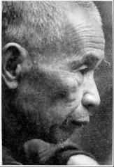
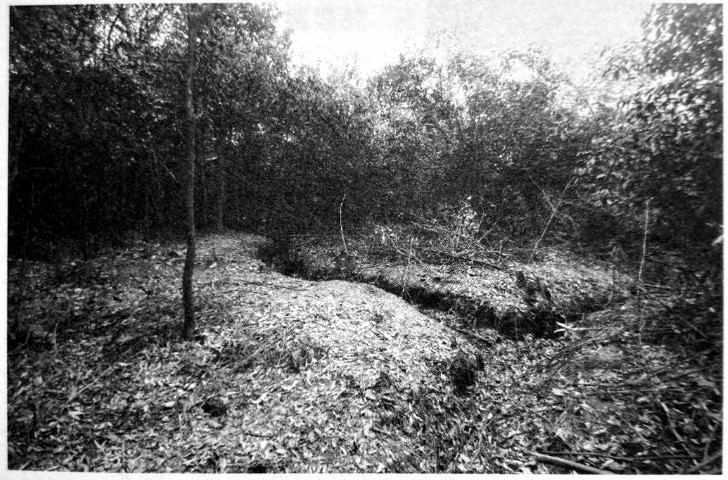
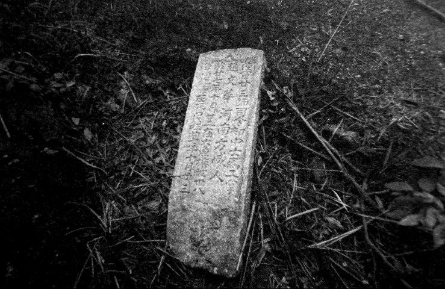

# 春华山：四次长沙会战都争过这里

_这里有小小的山、小小的河、小小的原野、小小的村子和市集，小小的山上生长着小小的山茶树。_

_春华山[^1]位于长沙市区东北，在长沙城区“东拓”后拉通的开元东路东沿线上．以“世界之窗”出发，走大约二十公里就到了镇上．春华大桥旁的河边逢一、五集市，摊贩们的货物有些摆在地上，有些摆在架好的木板上，吆喝声小小的，捞刀河水的呜咽声也是小小的。_

_这是一片安静的土地，其南边就是捞刀河和浏阳河冲积平原[^2]，一马平川。春华山是长沙的“门”，太平天国打过这里，抗战时期的四次长沙会战也打过这里，尤其第三次长沙会战期间的春华山阻击战更是惨烈无比。时至今日，战争的痕迹隐约还在。_

_2015年4月1日，从山脚到爬到最高处白马岭航标处，一路坑坑洼注，仅用时八分钟。想起战时，山岭低矮，让人揪心。两三米高的山茶树把一座山覆盖得郁郁葱葱，透过林木间隙，浅到膝盖，深至大腿的简陋战壕绵延于山腰，达一千余米。它们就是70多年前守卫长沙的那场战事的一处重要遗存，除那些战壕外，还留下了四块墓碑。_

**口述人 /** 刘金国，1948年出生，春华镇春华新街居民，从2009年清明起一直义务为烈士扫墓，被称为“春华山抗日英烈守墓人”。

**采集人 /** 张映科 **采集时间 /** 2015年4月2日

### “老百姓在他身上翻到了身份牌，所以留下了这块墓碑”

由于士地贫瘠，1949年后，春华山村吴寺冲组的人在春华山的白马岭只种了些山茶树。如果把这些山茶树砍了，完全可以复原当时的战场。

保存得蛮好的，还有墓地。由于当时到处都是当兵的人的遗体，只能选择就地掩埋，墓地就是战场，这样的坟墓我估计有百把处。我找到了一些，把坟墓上的山茶树都砍了，那些坟肯定不是我们当地人的坟，明显要大很多，每个墓坑里，都要埋差不多十个人。

这些坟墓基本上都没有立碑，我搜集到的抗战英烈的墓碑只有六块，跟春华山阻击战有关的只有四块。我最早发现的是正面刻有“中央阵亡将士”，背面为“此干长约十四丈 民国三十年公刊”。那还是1965年。

我是春华镇上的人，父亲是镇上的理发师，我子承父业，是吃国家粮的，后来知青下放到春华山村的吴寺冲组，就在白马岭山脚下。那一年我在田坎上锄草皮，发现一块碑被人搭在田间的渠上作铺路石，我一看，是打日本阵亡将士的墓碑。都是姆妈（方言，指妈妈）生的崽，他们抛骨异乡，碑还要让千人踩万人过的，我心痛。我就悄悄把它挪开到路边，用青草覆起，偷偷保存起来。我谁都不敢告诉，藏在心里，沉甸甸的，要是被人知道，肯定会被打成反革命，我就全完了。

直到2009年5月4日，我在墓碑的原址处立了碑，同时立的还有当时阵亡的邱世宦连长的墓碑[^3]，“陆军七四军五八师一七三团一营一连邱世宦之墓/阵亡连长/山东人/民国三十年八月六日立”。这是我在上世纪80年代，为长沙交通学院（今长沙理工大学）修建春华山教学基地打基脚发现的，这是目前唯一一块有姓名的碑，埋他的时候，老百姓在他身上翻到了身份牌，所以留下了这块墓碑。

我们这边一直在找邱连长的后人，给山东省民政部门打了很多个电话，找了当地报纸，还托会上网的在一些论坛到处发，但是大海捞针，没有查到什么消息。只是听说，上世纪六七十年代的时候，邱连长的后人曾经来找过一次。

但其实有更多的烈士估计再也找不到了[^4]，他们的墓也没有了。白马岭是当时的主要战场，东边山坡保存完好，但以白马岭最高点黄花机场航标界石为界的西边山坡，现在整个属于长沙理工大学春华山教学基地，还有更西南边的铁马驾校、春华山镇镇政府一带，一直到最西端的燕山岭以及山南河岸边金潭渡口、春华新街等地，估计还有很多的烈士安眠处，因为当时选择的是就地掩埋。现在，大家都修房子，墓都被破坏了。

我还记得1977年，镇政府盖楼，我在大门口挖基脚，我们参加劳动的十多个人，一共挖出了很多遗骨，还有金戒指、皮带和手表，还有皮带扣子和铜扣子，扣子都是崭新的，几角钱一斤的废铜，我一个人的就卖了几块钱。当时我也没有那个心，想到这些都是烈士的遗物。

**茶树下，过去的战壕依然清晰。**

**刘金国在春华山发现的赵文华墓碑。**

**口述人 /** 章暑林，1926年出生，春华镇桂花村村民，春华山阻击战见证者，当时是一个16岁的农家少年。

**采集人 /** 张映科 **采集时间 /** 2015年4月2日

### “都是就近挖坑一筒一筒埋的，就像码园木那样”

现在电视里打日本的戏，完全看不得，太假了，鬼子哪有那么温和。我看到捞刀河里沖下来一个女的，冇穿衣服，年纪还细得很，脑壳和奶子都冇得了，还抱着个嫩毛毛（方言，指婴儿），靠现在的桥那个地方，在水面上打转转。我还看到，三个民伕，是江西还是浏阳那边过来的，被一个鬼子兵押着，我在黄花那边看到的，饿得实在走不动了，鬼子兵就三刺刀下去，全都刺死了，这些都是我亲眼看到的。

我爷爷被鬼子飞机炸死，屋也炸得不看见了，我父亲被掳后，一直让他挑担，又不给吃的，饿坏了，就得病死了，我也被掳了三次。你问我为什么不跑，到处都是鬼子兵，还有哨卡，哪里都没有地方躲，跑哪里去？就只能在这里打转转。

行程短，三四天到了就放了，还好咯；行程长，就肯定冇得活路。我有次被捉了，挑了三支步枪三口锅，还有米，六七十斤重，走了差不多四天，饿得脚都在打摆子，我想，这下子要被鬼子刺死了。到了夜里，我们靠着墙睡，鬼子守在门口，抱着枪打瞌睡。夜蛮深了，一起被捉的两个人偷偷摸摸把土墙挖通了，看我年轻，就想救我，约我一起跑，在我手臂上掐了一把，我还以为是蚊子咬，就拍了一下，他们又指了我一下，我就醒了，跟着他们跑，他们救了我一命呢。

那天是丁丑日（1941年9月26日），74军也就是王耀武的兵来的时候，我正躲在田里挖红薯，我远远地看着，来了蛮多，密密麻麻的，从上面渡口到下面渡口。鬼子祸害这里，家家都死了人，我想，王耀武的兵来了这么多，终于有安生日子可以过了。

可哪晓得，日本鬼子的飞机也来了，“呜呜呜呜” 地飞了一夜，也扔了一夜的炸弹[^5]，炮火也猛，对门有座水王庙，三炮下去，一个水王庙就炸没了。

听人讲，阵地没有守住，中央要王耀武的兵突围。日本鬼子不留活口，见人就杀，仗打完了，到了傍晚那个时候，在燕子岭到白马岭山脚之间，鬼子兵排成横列单排千把米长的人墙，向捞刀河北岸齐步走，遇见我们受伤或躲在草丛中的兵，什么话都没有，就用刺刀刺死。

渡船码头、河两岸，中央军的遗体到处是一堆一堆的，尤其是河里更多，密密麻麻都浮在水面上。到了壬午年（1942），捞刀河发大水，还冲出了好多遗骨，大家怎么捡都捡不完。

我还记得，就那几天，我看到有一个穿着高木鞋子，腰上系着个布带，光着屁股，挂着个罩卵布（应是相扑装），左腰上挎着把剑，右手拿手枪的鬼子，耀武扬威地从街上走过。

日本鬼子撤走时，把他们死了的兵堆在一起一把火烧了，日本鬼子死了多少？鬼晓得了，现在烧灰的地方都还在，都还有蛮厚的灰。鬼子撤走后，我们不忍心那些兵死了没人埋，就组织劳力挖坑掩埋，我也是其中之一。都是就近挖坑，一筒一筒埋的，一筒一筒，就是像码圆木那样的。我埋的时候看到，蛮多尸休上，不晓得么子原因，脸上手上都生满了泡泡（这是芥子气中毒的症状）。

我的亲戚王月楼，是他组织埋人的，他还组织徐石匠等人刻了碑，就是现在立在白马岭上的那几块没有刻姓名的碑。

后来，我们这边又过了几次兵[^6]，但没有打过仗了。

**春华山，隐没于乔木和灌丛中的阵亡将士坟茔。**

## 延伸 我参加了春华山战役

**口述 /** 何元言 1918年11月2日~2012年7月21日，浙江省天台县街头镇张家桐村人，亲历春华山阻击战时，属74军58师173团，是当时找到的唯一一个春华山阻击战的幸存者。此篇口述文字由林华强整理。

18岁那年，还没抽到我的丁，我就自愿去当了兵。我被分到顾祝同部队修旗头山海防，驻地在永嘉，后来到了浙江驻宁（宁波）游击队。第三年的时候，日本人侵占杭州，后攻到萧山，当时人心惶惶，我趁机跑回了家。回到家正好过春节。下半年我又被抽了壮丁，这次被送到江西鹰潭，部队番号为74军58师173团，几营几连几排想不起来了。听说该部队曾是蒋介石外甥的部队，只记得一个长官的名字叫张灵甫，后来当到军长。

部队几乎每年都要打仗，也打了不少恶仗，先后转战过江西、湘桂铁路、湖南洞口等地，也曾到过浙江。在部队往浙江行军的时候，我正受伤，跟随师里的医院走，我坐的是担架，抬我的是老百姓（民工）。没想到半路上碰到日本人，被打散了。后辗转到收容所，才回到原来部队。

印象最深刻的一次战斗是在春华山打的，那时我已经当了班长。当时日本人攻势很猛，上面有飞机大炮助阵，子弹就如下雨般打过来。打了一天后，部队伤亡很大，地上几乎全是尸体。第二天，阵地实在守不住了，日本人好多人冲了上来，我们就插上刺刀和日本人拼刺刀。拼刺刀前，长官就对我们宣布过下山后的集合地点。我提枪从山上往下冲，见到日本人就打，没人就拼命跑，好不容易冲到山脚下，却被一条河（捞刀河）挡住了去路。这条河深浅不一，我又不会游泳，为了活命，也就顾不了那么多了，反正横竖都是死。可能是运气好吧，我很顺利地趟过了河，过河后就直奔会合的地点。春华山战斗打了两天，战友死伤无数，日本人打死的也很多。我也在那场战斗中负伤——右肩不知什么时候中了一枪，战斗结束后我才在医院里取出子弹。

[^1]: 春华山位于长沙县境内，为幕阜山脉最南端余脉，东西走向。最东端的白马岭为春华山最高峰，山高不足50米，从西端的燕子岭（又称燕山岭）到此，蜿蜒起伏长约一公里，属今春华山村吴寺冲组。从长沙黄花机场起落的客机，引擎轰鸣声刺耳，宽大的机翼好像是擦着山顶而过。入夜时分，长沙城的璀璨灯火，经常映得春华山南边的天空一片通红。

[^2]: 浏阳河的支流捞刀河在春华山以南蜿蜒向西流去，北岸离山脚约200米。捞刀河冲积平原一马平川，直抵浏阳永安、长沙黄花。这一片长约20公里，宽约10多公里的大田野，平坦、静美。如果没有春华山这些低矮的小山包，长沙北郊的整个捞刀河冲积平原将毫无遮拦，在战争中敌军可长驱而入城市，想来就来，想去就去，它是长沙市的最后一道屏障。太平天国打长沙，四次长沙会战，春华山都是攻守双方必争之地。

[^3]: 春华山一役中，58师173团几乎全部罹难，邱世宦墓碑是至今发现的唯一一块有烈士名字、籍贯的墓碑，其余均为无名烈士合葬。刘金国还找到了两块正面刻有“中央阵亡将士”的墓碑，反面不同，一块刻有“计十四名中央阵亡将士 民国三十一年公刊”，被发现时是春华山村章宽云家猪楼屋的垫板，另一块刻有“此干长约十四丈 民国三十年公刊”，是金鼎山村章金泉家老屋塘下水管台面。刘金国“跟村民说了很多好话，也答应他们以后就在白马岭上把碑立起来，我不能用这些墓碑谋利，他们才答应的，我们还签字画了押”。刘金国说：“估计今年（2015年）底，这些墓碑就都能立起来了。我希望烈士的后人能到春华山来祭奠他们的亲人，来看一看他们的先辈牺牲的地方。”

[^4]: 74军是1937年在浙江建立编制的，当时下辖的三个师当中，以58师拥有最多的浙江籍将士。找人的工作主要是湖南老兵之家的志愿者、春华山镇东林小学的梁学平老师在做，他在浙江省档案馆旗下的浙江档案网查询“民国浙江阵亡将士名录”数据库资料，通过对比资料中标注的所属部队及死亡时间，确定有83位浙江籍阵亡将士是牺牲在春华山。英烈们的籍贯具体对应到了每一个县，目前已经搜集到的家属在持续增加，在截稿日止，已经有8位英烈找到亲属。2015年7月18日，由浙江方面组织的春华山抗战阵亡将士公祭暨“接英灵回家”启灵仪式在春华镇举行，烈士忠魂被安放于浙江省杭州市安贤陵园内。

[^5]: 应是9月27日拂晓，据当地老人陈建良、石浦秀、章暑林等回忆，应该没有连续一夜，数十架飞机猛烈轰炸，两个波次，将阵地犁过两遍。

[^6]: 春华山阻击战后，依然有中国军队在这里布防。据抗战老兵孔定安2013年1月23日口述：1941年冬，我们部队奉命从江西修水开往平江县南方向，在春华山附近驻扎。那是一个大晴天，我从战壕里爬出来晒太阳。不远处，另外一个当兵的也出来晒太阳，我们看了对方一眼，都没有说话。正当我有点昏昏欲睡时，敌人的一颗炮弹朝那个人的位置打过去，落在他身边，不过没有爆炸，是个哑炮。那人先是吓呆了，回过神后抱着那颗炮弹大哭起来。看他的滑稽样，我忍不佳哈哈大笑。