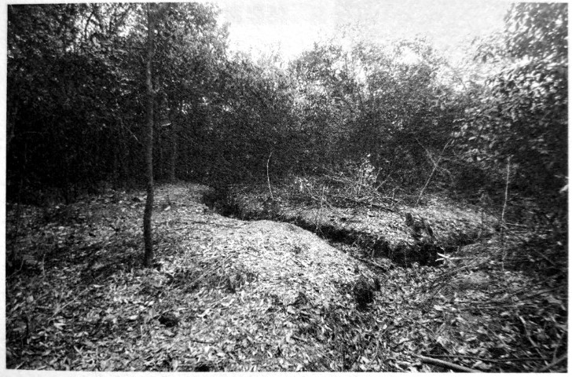

# 春华山：四次长沙会战都争过这里

**口述人 /** 刘金国，1948年出生，春华镇春华新街居民，从2009年清明起一直义务为烈士扫墓，被称为“春华山抗日英烈守墓人”。

**采集人 /** 张映科 **采集时间 /** 2015年4月2日

### “老百姓在他身上翻到了身份牌，所以留下了这块墓碑”

由于士地贫瘠，1949年后，春华山村吴寺冲组的人在春华山的白马岭只种了些山茶树。如果把这些山茶树砍了，完全可以复原当时的战场。

保存得蛮好的，还有墓地。由于当时到处都是当兵的人的遗体，只能选择就地掩埋，墓地就是战场，这样的坟墓我估计有百把处。我找到了一些，把坟墓上的山茶树都砍了，那些坟肯定不是我们当地人的坟，明显要大很多，每个墓坑里，都要埋差不多十个人。

这些坟墓基本上都没有立碑，我搜集到的抗战英烈的墓碑只有六块，跟春华山阻击战有关的只有四块。我最早发现的是正面刻有“中央阵亡将士”，背面为“此干长约十四丈 民国三十年公刊”。那还是1965年。

我是春华镇上的人，父亲是镇上的理发师，我子承父业，是吃国家粮的，后来知青下放到春华山村的吴寺冲组，就在白马岭山脚下。那一年我在田坎上锄草皮，发现一块碑被人搭在田间的渠上作铺路石，我一看，是打日本阵亡将士的墓碑。都是姆妈（方言，指妈妈）生的崽，他们抛骨异乡，碑还要让千人踩万人过的，我心痛。我就悄悄把它挪开到路边，用青草覆起，偷偷保存起来。我谁都不敢告诉，藏在心里，沉甸甸的，要是被人知道，肯定会被打成反革命，我就全完了。

直到2009年5月4日，我在墓碑的原址处立了碑，同时立的还有当时阵亡的邱世宦连长的墓碑[^3]，“陆军七四军五八师一七三团一营一连邱世宦之墓/阵亡连长/山东人/民国三十年八月六日立”。这是我在上世纪80年代，为长沙交通学院（今长沙理工大学）修建春华山教学基地打基脚发现的，这是目前唯一一块有姓名的碑，埋他的时候，老百姓在他身上翻到了身份牌，所以留下了这块墓碑。

我们这边一直在找邱连长的后人，给山东省民政部门打了很多个电话，找了当地报纸，还托会上网的在一些论坛到处发，但是大海捞针，没有查到什么消息。只是听说，上世纪六七十年代的时候，邱连长的后人曾经来找过一次。

但其实有更多的烈士估计再也找不到了[^4]，他们的墓也没有了。白马岭是当时的主要战场，东边山坡保存完好，但以白马岭最高点黄花机场航标界石为界的西边山坡，现在整个属于长沙理工大学春华山教学基地，还有更西南边的铁马驾校、春华山镇镇政府一带，一直到最西端的燕山岭以及山南河岸边金潭渡口、春华新街等地，估计还有很多的烈士安眠处，因为当时选择的是就地掩埋。现在，大家都修房子，墓都被破坏了。

我还记得1977年，镇政府盖楼，我在大门口挖基脚，我们参加劳动的十多个人，一共挖出了很多遗骨，还有金戒指、皮带和手表，还有皮带扣子和铜扣子，扣子都是崭新的，几角钱一斤的废铜，我一个人的就卖了几块钱。当时我也没有那个心，想到这些都是烈士的遗物。

**茶树下，过去的战壕依然清晰。**

**刘金国在春华山发现的赵文华墓碑。**

[^3]: 春华山一役中，58师173团几乎全部罹难，邱世宦墓碑是至今发现的唯一一块有烈士名字、籍贯的墓碑，其余均为无名烈士合葬。刘金国还找到了两块正面刻有“中央阵亡将士”的墓碑，反面不同，一块刻有“计十四名中央阵亡将士 民国三十一年公刊”，被发现时是春华山村章宽云家猪楼屋的垫板，另一块刻有“此干长约十四丈 民国三十年公刊”，是金鼎山村章金泉家老屋塘下水管台面。刘金国“跟村民说了很多好话，也答应他们以后就在白马岭上把碑立起来，我不能用这些墓碑谋利，他们才答应的，我们还签字画了押”。刘金国说：“估计今年（2015年）底，这些墓碑就都能立起来了。我希望烈士的后人能到春华山来祭奠他们的亲人，来看一看他们的先辈牺牲的地方。”

[^4]: 74军是1937年在浙江建立编制的，当时下辖的三个师当中，以58师拥有最多的浙江籍将士。找人的工作主要是湖南老兵之家的志愿者、春华山镇东林小学的梁学平老师在做，他在浙江省档案馆旗下的浙江档案网查询“民国浙江阵亡将士名录”数据库资料，通过对比资料中标注的所属部队及死亡时间，确定有83位浙江籍阵亡将士是牺牲在春华山。英烈们的籍贯具体对应到了每一个县，目前已经搜集到的家属在持续增加，在截稿日止，已经有8位英烈找到亲属。2015年7月18日，由浙江方面组织的春华山抗战阵亡将士公祭暨“接英灵回家”启灵仪式在春华镇举行，烈士忠魂被安放于浙江省杭州市安贤陵园内。