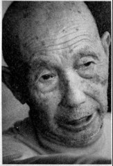
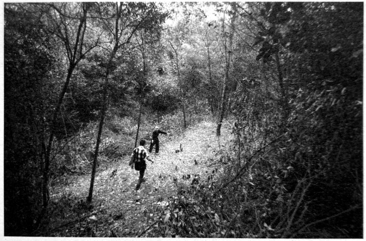

# 春华山：四次长沙会战都争过这里

**口述人 /** 章暑林，1926年出生，春华镇桂花村村民，春华山阻击战见证者，当时是一个16岁的农家少年。

**采集人 /** 张映科 **采集时间 /** 2015年4月2日

### “都是就近挖坑一筒一筒埋的，就像码园木那样”

现在电视里打日本的戏，完全看不得，太假了，鬼子哪有那么温和。我看到捞刀河里沖下来一个女的，冇穿衣服，年纪还细得很，脑壳和奶子都冇得了，还抱着个嫩毛毛（方言，指婴儿），靠现在的桥那个地方，在水面上打转转。我还看到，三个民伕，是江西还是浏阳那边过来的，被一个鬼子兵押着，我在黄花那边看到的，饿得实在走不动了，鬼子兵就三刺刀下去，全都刺死了，这些都是我亲眼看到的。

我爷爷被鬼子飞机炸死，屋也炸得不看见了，我父亲被掳后，一直让他挑担，又不给吃的，饿坏了，就得病死了，我也被掳了三次。你问我为什么不跑，到处都是鬼子兵，还有哨卡，哪里都没有地方躲，跑哪里去？就只能在这里打转转。

行程短，三四天到了就放了，还好咯；行程长，就肯定冇得活路。我有次被捉了，挑了三支步枪三口锅，还有米，六七十斤重，走了差不多四天，饿得脚都在打摆子，我想，这下子要被鬼子刺死了。到了夜里，我们靠着墙睡，鬼子守在门口，抱着枪打瞌睡。夜蛮深了，一起被捉的两个人偷偷摸摸把土墙挖通了，看我年轻，就想救我，约我一起跑，在我手臂上掐了一把，我还以为是蚊子咬，就拍了一下，他们又指了我一下，我就醒了，跟着他们跑，他们救了我一命呢。

那天是丁丑日（1941年9月26日），74军也就是王耀武的兵来的时候，我正躲在田里挖红薯，我远远地看着，来了蛮多，密密麻麻的，从上面渡口到下面渡口。鬼子祸害这里，家家都死了人，我想，王耀武的兵来了这么多，终于有安生日子可以过了。

可哪晓得，日本鬼子的飞机也来了，“呜呜呜呜” 地飞了一夜，也扔了一夜的炸弹[^5]，炮火也猛，对门有座水王庙，三炮下去，一个水王庙就炸没了。

听人讲，阵地没有守住，中央要王耀武的兵突围。日本鬼子不留活口，见人就杀，仗打完了，到了傍晚那个时候，在燕子岭到白马岭山脚之间，鬼子兵排成横列单排千把米长的人墙，向捞刀河北岸齐步走，遇见我们受伤或躲在草丛中的兵，什么话都没有，就用刺刀刺死。

渡船码头、河两岸，中央军的遗体到处是一堆一堆的，尤其是河里更多，密密麻麻都浮在水面上。到了壬午年（1942），捞刀河发大水，还冲出了好多遗骨，大家怎么捡都捡不完。

我还记得，就那几天，我看到有一个穿着高木鞋子，腰上系着个布带，光着屁股，挂着个罩卵布（应是相扑装），左腰上挎着把剑，右手拿手枪的鬼子，耀武扬威地从街上走过。

日本鬼子撤走时，把他们死了的兵堆在一起一把火烧了，日本鬼子死了多少？鬼晓得了，现在烧灰的地方都还在，都还有蛮厚的灰。鬼子撤走后，我们不忍心那些兵死了没人埋，就组织劳力挖坑掩埋，我也是其中之一。都是就近挖坑，一筒一筒埋的，一筒一筒，就是像码圆木那样的。我埋的时候看到，蛮多尸休上，不晓得么子原因，脸上手上都生满了泡泡（这是芥子气中毒的症状）。

我的亲戚王月楼，是他组织埋人的，他还组织徐石匠等人刻了碑，就是现在立在白马岭上的那几块没有刻姓名的碑。

后来，我们这边又过了几次兵[^6]，但没有打过仗了。

**春华山，隐没于乔木和灌丛中的阵亡将士坟茔。**

[^5]: 应是9月27日拂晓，据当地老人陈建良、石浦秀、章暑林等回忆，应该没有连续一夜，数十架飞机猛烈轰炸，两个波次，将阵地犁过两遍。

[^6]: 春华山阻击战后，依然有中国军队在这里布防。据抗战老兵孔定安2013年1月23日口述：1941年冬，我们部队奉命从江西修水开往平江县南方向，在春华山附近驻扎。那是一个大晴天，我从战壕里爬出来晒太阳。不远处，另外一个当兵的也出来晒太阳，我们看了对方一眼，都没有说话。正当我有点昏昏欲睡时，敌人的一颗炮弹朝那个人的位置打过去，落在他身边，不过没有爆炸，是个哑炮。那人先是吓呆了，回过神后抱着那颗炮弹大哭起来。看他的滑稽样，我忍不佳哈哈大笑。