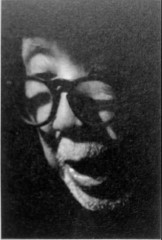
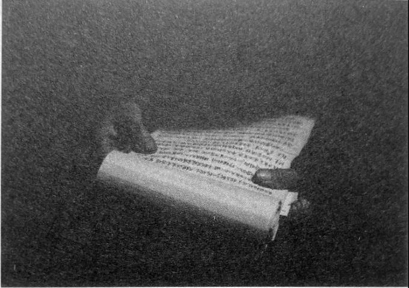
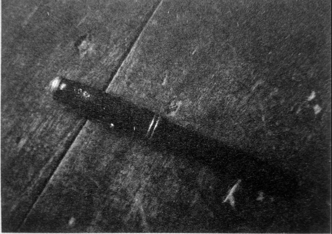

# 木箧：它们都是有故事的

_粟翼航的卧房里有一个民国式样的木箧，放满了写着钢笔字、毛笔字或者没写字的花花绿绿的纸，有信纸、面条和烟壳包装纸、政府过时的宣传单、银行的业务单和移动公司的宣传单。“背后还能写字”，他说。_

_叠得整整齐齐的还有厚厚一册，用缝衣服的线装订的《醒公沉思录》，封面是工工整整的毛笔字，写在香烟外包装内纸页上，翻开，那是他整个一生的回忆。此外，还有他发的一些议论，谈为政，谈做人，还有他为自己写的、为春华山公祭写的悼词。还有他和妻子的情书，又譬如这句：“我们夫妻之间的人生和生活，好像热水瓶一样，外表冰冷，里面滚烫。我们的热情，不是露在表面，而是藏在内心。”譬如这句话：“我想国家存亡之秋，我还年轻，无牵无挂，正好保家卫国，先把鬼子消灭干净，才好衣锦还乡，再来处理终身大事可好？爱情虽可贵，抗日价更高。”_

_除此之外，这个木箧里，还有民国时的识字本、手写的结婚证，做保长时的收粮单，人民公社时期的工分本，还有一支黑色的钢笔。“它们都是有故事的，尤其是那支钢笼。”_

_我呢现在都蛮好，每天两顿，每顿三两米，不吃肉，只吃点小菜。还能活几年呢？已经94岁了。明年的今天，如果你们还能来这里采访，我还能坐在这里，再讲我的那支钢笼、那两杆步枪的故事，那就是锦上添花。”_

_他生下来开始回忆，他的回忆，是从木箧里并没有的两支步枪开始的。_

**口述人 /** 粟翼航，1922年农历五月二十二日出生，曾用名粟俊、粟数南。长沙县路口镇万年桥村人，在他八岁时父亲过世，母子相依为命。1939年入伍，被分配至第99军99师军需处做译电员，1941年，调入师部做师长的警卫员，长沙第二次会战时，调入99军99师295团一营三连第一排，第二次长沙会战时，升为中尉排长。1942年6月，进入黄埔军校第二分校学习，后回家务农至今。1958年，母亲和他的两个儿子饿死，今只有一儿一女。妻子在上世纪80年代去世。不肯挪窝，粟翼航一直住在上世纪70年代修筑的土坯房里。

**采集人 /** 张映科 **采集时间 /** 2015年6月28日

### “当时在我这里躲土匪的有五六百人，后来这些人都很感激我”

1944年，我从广西的部队里回屋里（方言，指家里）结婚，家里沦陷了，马路边上到处都是日本鬼子，设了卡，我想回部队也没办法。山冲冲里，到处都是躲兵的难民，那些难民好造孽，只带了几升米，一点油盐。逃难到这里，其实也要得，这里比较安静，日本鬼子只到大公路上去，不到这山里面来。可是地方上不三不四的人，流氓、地痞，不务正业的人太多了，这些人，脚上穿着油鞋，把脸上搽黑，没有谁认得，在这里耀武扬威，抢东西，甚至强奸，土匪头子有张天泉、毕翰卿、危中杰、周化龙、平江廖义华等人，他们自称挺进军，都是国军被打散的残兵逃亡下来的，自动组合，拉起的土匪，横行霸道。看到这个情况，又没有人管地方上的治安，我就组织了个自卫队，队员是由当地人组成的，有吴鑑、罗桂福、袁义成、张春生、熊斌、谭和生等20个人。

我不怕那些鬼，我是部队里出来的，个把两个人我奈得何，我要保一方平安，对他们不客气，我要他们原形毕露。当时躲在我们这里的，有五六百人，后来这些人都很感激我，说我是救命恩人。搞了三四个月，地方上没人当保长，群众就推举我，我就是这样当了这个保长，花果乡（1949年后撤销，所管各村大部分划入路口镇，小部分划入果园镇）第六保保长，也是三民主义青年团第六分队队长，一个分队有七八个团员，每个乡有个区队，我记得我们区队的区队长叫刘德华，跟一个香港明星同名同姓。

这个自卫队后来改成了抗日后方游击队，我这个队伍是老百姓的队伍，不好带，没受过军事训练，你要他们这样，他们偏要那样做。我记得我有个团员，叫刘思忠，是我们花果乡的人，原籍不知道是哪里的。我们有一次埋伏在（春华）江边，刘思忠偏要伸出个头去看，被鬼子发现了，一枪打在头上，只有十六岁，有个对象都还没结婚。开了个追悼会，“刘君思忠之墓”，现在立在春华山，碑文是我写的[^1]，碑是我用一担谷请人刻的。

**粟翼航相信“文以载道”，他甚至留有民国时期的识字本。**

### “你们也去搞啊，日本鬼子的枪那么多，问我要什么？”

1944年七八月份的时候，日本鬼子下乡到处“打捞”，猖狂得很。青山乡麻林（今属长沙路口镇）自卫队的队长陈重林，是我堂客（方言，指妻子）的老表，就邀我去青山乡早耕坝（今属青山铺镇）去打游击。我们这边只有十四五个人，没一根枪，我们就去了，加起来有六十来个人。日本鬼子在早耕坝的据点有四五十个人，上午在堂屋里吃饭，据点里有围墙。

我们有一个人叫陈满，三十四五岁，在部队里当过连长的，他这个连长我估计是运输连，没有一点作战能力。他手里拿着两个手榴弹，一翻进围墙，到了饭堂，就扔了手榴弹，可能是慌张，没扯导火索，手榴弹没响，日本鬼子不晓得怎么突然进来了一个人，就一枪在陈满脑壳上打了个洞，陈满一声都没叫出来。打死陈满后，日本鬼子尸体也没捡，留了两个人看门，又继续吃饭。我们打草惊蛇了，只有撤回来。

到下午两点，有四个鬼子到蝴蝶湾一带抢东西，又到了砖土坡（蝴蝶湾和砖土坡，均属长沙县青山铺镇），在河边上，还带着三四个伕子。我们有十几个人，乡里发了一根枪给我们，我们个个都有手榴弹，把那四个鬼子围在一个屋里。日本鬼子不晓得我们来了，两个在屋里的灶上炒鸡吃，炒了一锅鸡，两个守在外面堂屋。这次机会来了，我和熊斌两人从后背摸了过去，各执一颗手榴弹，从瓦沟里投了进去，落在灶上，炸死了两个，我随手就把他们的两杆枪提走了，是三八式步枪。在堂屋里的那两个日本鬼子怕死，就跑了，我们就继续打，追了上去，路上碰到些群众，有一个叫汤忠林的，就说：“少队长你们再也莫打了，我们脱不了身，他们明天回来烧我们的屋，你们赔不赔？你们打死了日本鬼子，就是害了我们地方。”我一听就来了脾气，我讲我一定要打，来好多我打好多，我就不信鬼。后来这几个日本鬼子再也没有来过，他们是过路部队。

我缴到的这两杆枪，并没有交给当时的政府。有一个土匪想谋我们的枪，他叫危中杰，原名彭经纶，春华山人。他在大河塘（今属长沙县跳马乡）设下了鸿门宴，请我们花果乡自卫大队全部到大河塘去集中检阅，合作打游击。我晓得这个诡计，就把队伍埋伏在刘公庙（今属长沙县果园镇），一个人去了大河塘。我说：“你这个鸿门宴，项伯还没有死。想谋我的枪，请放马过来，我在刘公庙等你。”他不敢去。

这两杆枪从民国三十四年放到我屋里，一直到解放战争时期，长沙县政府来了我也没给，谁来我都不给。他们说我这枪是从日本鬼子那里搞来的，哦，你们既然晓得那你们也去搞啊，日本鬼子的枪那么多，问我要什么？他们缴不到，这两杆枪在我屋里放了蛮久，就出了名，乡里的人都晓得。

### “我后来用那两杆三八式，兑了两杆中正式”

到1945年八九月份的样子，我这保长就脱了身，我有堂客，有妈妈，部队回来身上只有几块钱，做保长只有担把谷（方言，指一担谷）一个月。我就在我堂屋里教私塾，十五六个学生，每个一年担把谷，我养得起一家人了。这两杆枪我还是放在我屋里，我枪法好，就用这两杆枪打打麂子打下貂。

后来这两杆枪又跑到了县里，有一个人叫黄千骧，是管部队的，我请他吃了一桌饭。七搞八搞，我用那两杆三八式步枪跟他兑到两杆中正式步枪。我为什么要这个中正式步枪呢？因为我有子弹。我多的是子弹，当时中央军从这里过路，子弹丢在塘里，丢一箱我就捡一箱，子弹是打不完的。

后来快解放的时候，花果乡的乡长换了，换到我们姓粟的当，叫粟炯煌，从云南回来的，住在花果乡九家坝，是我叔伯哥哥。花果乡和石门乡两乡成立联防队，有70杆枪，他还想要我这两杆枪。他写信给我，要我去当副官，加上地方上后来也有人劝我，我就去那交了枪，当了十多天副官后，他就要我回来当保长，当时长沙快要和平解放了，别个当保长吃不消不肯当，我就只有又当保长了，花果乡第六保的保长，后来两保划成一保，我又成了花果乡第二保的保长，这个是末代保长。

粟炯煌投诚起义，也是受到我的影响。当时我和粟炯煌在羊鹿咀介湘酒店里吃酒，我说炯哥，现在时局不好了，解放军会来，识时务者为俊杰，现在北京傅作义，那么大的官，几十万正规军，他都投诚起义，何况我们这小小的联防队，加起我那两杆也只有72杆步枪，我们赶紧起义。他说：“老弟唉，如何去摘咯？”还好碰到一个叫黄锡璋的人，在这里教书，是个老地下党员，解放后还当了长沙县民政科科长、长沙市副市长，当时他也在酒店里吃酒，他说：“你们这么说是目中无人啊，如果出于真心．老伯我愿意搭桥。”他帮我们把这72杆步枪送到高桥人民政府手里去了。

解放后到了“土改”，我在地方上杀过两个日本鬼子，怕被说成是杀了两个好人，还好汤忠林可以作证。也因为那两杆枪，又说我是土匪头子，圈子大爷，国民党三青团头子、恶霸、伪保长和反动军官，给了我一大堆的帽子。多亏有“联防队今收到粟骏交来中正式步枪两支”的收条，我才脱了身。

但我还是被关了四个月。当时土地改革工作组组长何佩钦，是个外地人，听了粟庆恒一个人的意见，说我在地方上是打鼓吹唢呐的，还说什么“庆父不死，鲁难末已”，其他村都有反面典型，我们村也要抓一个出来。乡长左学武，农会主席陈绍愃、村长谭和清、村农会主席谭汉云，都为我讲好话，尤其是村干部马永建，他是捞刀河（今属长沙县）的人，爱找群众谈话，为人直爽，办事细心扎实，当场就顶住说：“只听信粟庆恒一个人，不听群众的声音，恐怕说不过去，这份材料不实，是给白人戴一个黑帽子，把好人往死路上逼，判他两年，我不盖章，我宁愿头上这顶乌纱帽不戴了。他最多只关几天了事。”最后也就没有关我两年，从1952年正月关到五月初七，就放我回去了。

### “我要是不放这个地下觉员，就不会有这支钢笔”

再说那支钢笔，我保存七十多年了，我用它写我的《醒公沉思录》。这支钢笔呢，跟一个叫王占兴的人有关，要不因为他，也就没有我后来这许许多多的事。

**1940年，王占兴送给粟翼航的钢笔。**

那还要从我第一次去部队讲起。1939年，我被抓了壮丁，送到浏阳普迹训练了六个月，后来又说我年龄细，放我回来，我就到上马田杨家里（今属路口镇麻林村）看牛，看牛的那个老板的崽叫杨纵珏，在部队里，第二年元月，他介绍我又去了部队，分到了陆军99师师部军需处，在湘阴乔口镇（今属长沙市望城区）。住了几天后，由于我读过四年私垫，来往文书我都读得懂，一个叫黄本英的科长就给我写了介绍信，又把我分到第99师师部驻衡阳鸡窝山通讯处，做译电员，任准尉司书，掌管整个师部里的密码。

99师有两个电台，一个在衡阳鸡窝山（原属衡阳和平乡第九保），一个在贵州。通讯处处长叫蓝文博，台长叫黄卓夫，副台长叫刘光远，我们留守处除了这五六个通信兵，还有一个上尉军士，管钱粮的，给我们发饷，一个叫邱作云的，少尉书记，一个叫王占兴的，上尉副官，这三个人和我经常一起吃饭。

我记得时间应该还是1940年，八九月份的样子，下午5点钟吃完饭，6点钟就收到封电报，师长给我的，他说要处长马上把这个王占兴解送到衡阳第九战区司令部去。当时天有点毛毛黑了，我在马路边上碰到王占兴，我说老王，电报还在我身上，还没送处长看，我首先告诉了你，你赶快走。

他走之前，就把身上带的那只钢笔送给了我。此后我们一直没有联系，我也查不到这个人，只晓得他是河北滦州人。他后来找过我，我的户口在长沙市北大路的雅礼中学，我哥哥以前在那里做事，当工人，但我人不在那里，那个户口是个假住址，他找到雅礼中学，是找不到我这个人的。

后来我看到报纸，据说是粟裕将军和罗荣桓元帅的两万部队在衡阳[^2]，是维护国共合作，保护衡阳的，后来国共关系破裂，薛岳要搞共产党的人。这个王占兴肯定是衡阳地下党支部的，他给外界发电报，被和平乡乡公所发现了，乡公所报告了师部，师部再发电报要捉拿他的。

我为什么要放王占兴以及后来我闹学潮，也是因为受到我舅父的影响，他是一个地下党员，在1927年被国民党捉到，在我们这里的桥头路口杀了，打了三枪，他屋里就绝了户。我在屋里读书时，受过他训导。他们杀了我舅舅，我心里是不服气的。

也是因为我放走王占兴的事，师长不要我管电报了，把我调去给师长做警卫员，三个多月以后又把我放到295团1营3连第一排当少尉排长，参加第二次长沙会战，去了岳阳新墙河河西。

从1941年农历八月份（10月3日）开始打，打了十多天。跟我们一起打的还有99军92师296团，团长好像姓谢，他屋里住在我屋里上面，只有几十里路远。那一仗我们打得好，还缴了步枪两三支，机关枪两挺，步话机一台。就是伤亡有点重，我看到第七排就死了六个，伤了四个。打完那次仗，我升了中尉排长，连长徐展豹也升了。

三个月后的农历十一月十三号 （1941年12月30日），打第三次长沙会战，我们驻扎在芦林场（湘阴县城北的湘江河畔）。师部参谋总长发命令我们死守卢陵潭，敌人要是过来了，那常德、宁乡就麻烦了。

我们就死守，打得蛮恶劣，不称心，徐连长在一次死守反攻中身负重伤，没有救活。我代理连长指挥，机关枪“哒哒哒”地响，我人躲在战壕里，头露在外面，有一发迫击炮打在地上开花，弹片擦过我的头，擦掉好大一块头皮，我流了一头的血。我见不得血，人就晕倒在地上，送到医院里过了三四天就好了。看望我的战士跟我说，我一点事都没有，再送到战场去，还可以再杀几个日本鬼子，就像杀几只鸡鸭一样。[^3]

[^1]: 此碑文为“刘君思忠，任职桑梓，阖里同称，容夏，敌犯长沙，烧杀奸掠，民鲜维生，刘君义愤填膺，竟能自动从众，荷枪与敌相遇于黄狮渡口，经几时激烈战斗，敌不逞败退，乃先入追剿，卒以勇敢殉职，斯人原属xxx（三字模糊）农夫，国难当头，深明大义，终能慷慨成仁，为田舍翁杀敌之先导，同人等愧以身免，爱纪以碑。三民主义青年团湖南支团长沙分团第十三区，全体团员敬卒，民国三十四年元月吉日刊。”

[^2]: 老人此处回忆或有出入。1937年冬，中共中央派遣曾担任过湘南特委书记的陕甘宁边区党委统战部副部长王涛以新四军中校秘书的身份来到湘南，先后与坚持斗争的中共湘南特委负责人周礼和游击队领导人李林、谷子元、谢竹峰等人取得了联系，整编游击武装，仅有两百余人，后开赴前线抗日。

[^3]: 在其自传中，粟翼航描述其受伤情形非常形象：“湘水一片迷茫，寂静无声，我的背上似乎有许多蚂蚁爬上爬下成队而行，匆促的痛叫声，惊飞了宿在芦林场畔的湖鸟，拍起翅膀，冲向晦暗苍穹。哦，我是负伤了倒在阵地，心中乱极了，想起战士们的伤亡，天上月色朦胧，地上黑影幢幢，东北风刮了一整天，堤上泥灰随风而飘，只有附近的枪声还在耳边经过，第二天早上东方日出，幸遇上当地好心人姜荆树将我救回他家。” 这次战役后，因作战有功，粟翼航被师长高魁元推荐进入黄埔军校学习（武冈二分校），毕业时因不满被分配至200师，曾聚合部分同学闹意见而被学校开除。回乡后，粟翼航曾到第五军当了不到三个月的兵，之后返乡结婚。