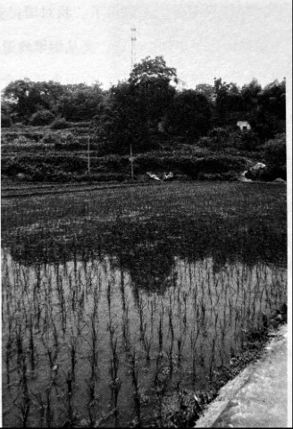
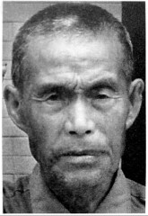
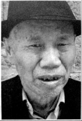

# 烟堆岭：湘西会战在这里拉开序幕

_“班长，想不到我向本全还能来看你，你讲了打完仗要送我回去的。”_

_2015年5月24日，向本全在孙女的搀扶下爬上了邵阳县岩口铺[^1]烟堆岭[^2]，烧着纸钱，他嚎啕大哭。茅草深处，是他班长的埋骨之地，当年，他是抬棺者之一。_

_这是他第二次走在去岩口铺的邵榆公路（湘黔公路，即今320国道）上。_

_1945年4月16日拂晓，驻扎在邵阳的日军主力116师团120联队先遣部队第1、2大队2000余人，由邵阳市北塔区茶元头乡枫林铺村，沿邵榆公路向西南方向进军，与驻扎于岩口铺烟堆岭的100军19师57团的3营第9加强连196名官兵遭遇[^3]，湘西会战就此拉开了序幕。_

_岩口铺村村民陈林华说，“我十四五岁的时候，那些兵都住在山顶上，你说的那个向本全，我第一次见，就在前几天。我认得的人只有罗连长。我那时候在岩口铺看到了好多飞机，还听到枪声整夜在响，后来我还漫山遍野地去捡铜壳子（指弹壳），捡了好多天。这个老兵当时打枪后落下的铜壳子，肯定有被我捡到的。我捡了他们的铜壳子，换到几袋米，我愿意讲岩口铺他们打仗的事。”_

**口述人 /** 陈林华，1930年出生，岩口铺镇岩口铺村村民，岩口铺阻击战时，十四五岁的陈林华并没有远离家。

**采集人 /** 张映科 **采集时间 /** 2015年5月31日

### “仗都是摸黑打的，仗打完后，我们大伢子就去捡铜壳子”

清朝的时候，岩口铺就是一条东西走向的老街。在烟堆岭南边山脚下面有很多抽鸦片烟的，到了民国要禁烟，就把那些收缴的鸦片烟全都堆在这山岭上，一把火烧了，所以这座山岭就叫烟堆岭。山脚下有个岩口（当地方言，指山洞），岩口铺也就是这样叫起来的。以前这山脚下有三口井，井旁有个水塘，跨过这个水塘，就到了老街。“大跃进”时，水塘被填了，变成了现在看到的这两块田。

这座山只有八十多米高，宽我估计八百米的样子。从这里往西北方走，都是起起伏伏的，越往西北这些起起伏伏就越来越厉害，更远就到雪峰山了。往西南走，可以到周旺铺、到隆回去，一路都蛮平。往正东边偏北一点点走，就可以到邵阳市，一路都是平地，日本鬼子要是从邵阳打过来，那肯定是蛮快的。

这一片的岭子都喊成烟堆岭，也讲得通。烟堆岭东北边偏东有个院子（当地方言，指自然村），叫白山王家，以前是蛮大的一个村，鬼子打岩口铺的时候，人被祸害死了蛮多，现在成不了一个村，归东北边的白山村管。

沿着东西走向越来越偏向北方的320国道（邵榆公路）走，可以到岩口铺的白山村。现在的新街就是以国道作为街道，后来建起来的，与老街并排，两条路只隔了几座屋宽。这条国道的南边有个岭，喊作铁丝岭，紧挨着铁丝岭的东边，对着烟堆岭，也有个岭，喊作百弓坨，以前日本鬼子打到这里来的时候，最早是在那两个岭上打起来的，那边没驻着多少人，打了有几天的样子，兵都退到烟堆岭那边去了。

以前的烟堆岭哪有这么深的茅草，现在都埋我腰了，我有十多年没有爬这个岭，这里变化太大了。以前这里的草浅得很，有一点草也被牛羊给吃光了。到“大跃进” 时，山全部被开发成了圷（方言，指旱田或者菜土），一层一层的，用来种点小菜。现在呢，人越来越懒，这些圷绝大多数都荒了，长满了草。

就是这些茅草，打仗时的壕沟完全看不到了，印迹也变得蛮浅，不有心的话，怕是根本找不到。以前壕沟倒是蛮大的。有一个半人肩宽；高呢，低着头猫着腰，能把人完全遮住，每个岭子之间，都被壕沟连通了的。在烟堆岭最高的地方有一个三角碉堡，约二十个平方米，可以躲一两个班的人，哪个面都可以向外面打枪，现在在原位置修了个蓄水塔，建了差不多快十年了。

我屋在这山的南边，看得清这个碉堡，打仗那个时候我是一个十四五岁的伢子（方言，指小孩子），我不怕死，走日本的时候，我就经常跑回来看，我有次看到，碉堡前面有个兵，手里拿根竹竿子，竿子上鄉了个旗子，他在转那根竿子，天上我们的飞机也跟着他的竿子转圈子，当竿子猛地一沉，沉到哪个方向时，机就猛地俯冲下来，向那个方向“突突突”地打机枪。那次我没看到飞机打死日本人，也可能是太远了没看清。

白天，经常有飞机过，都不是鬼子的飞机。

仗都是摸黑打的，我没看到过。仗打完后，我们大伢子都去捡铜壳子卖，烟堆岭上铜壳子最多，我都去那捡了好几次。

**2015年5月31日，老街与烟堆岭之间。这里以前是池塘，现在是几块小田，步行五六分钟就到了烟堆岭的山顶，这里过去是整个湘西会战的最前线。**

那些兵呢我也不记得了，我对国民党地兵印象不好，这些人从对面山里退到烟堆岭，又从烟堆岭退到芙蓉山，打仗就晓得退，要是他们能赶走鬼子，白山也就不会被祸害得这么惨。他们还爱到乡下面去打鸡打狗，打起仗来，就只想到当逃兵，兵头头（当地方言，指军官）都不敢管。我听到有人讲，岩口铺的兵，连兵头头都敢打。

但是我对那个连长（指第九加强连连长罗文生）印象蛮好，和气。他是这里的兵头头，指挥部就设在山脚下，靠岩口西边一点点的那座孤零零的老木屋里，现在都还住着人。我经常在那个屋的屋门前玩，记得天气是要热不热要冻不冻的样子，好像还落着个毛毛雨，是特别容易得感冒的，我正在玩，那个连长估计也得了感冒，他把我喊住：“喂，小鬼，你们这里有医师吗？”我哪晓得医师是什么意思咯，他就改口，问：“有郎中吗？”我记得七里村好像有一个，就帮他去喊。那个郎中谈条件，讲诊完了如果不扣人，他就答应来。连长答应了，诊完了，我看到那个连长还客客气气地送郎中出门。

**口述人 /** 向本全，1926年农历十二月二十二日生，武冈县马坪乡兰清村六组人，户口本上错写为向本金。1944年春末被抽丁入伍，分至第99军197师590团3营9连机枪班，负责装填子弹，曾参与岩口铺阻击战。战后一直在家务农，老人身矮力弱，加上先后两任妻子都早早离世，一生困苦不堪，儿子和儿媳均是农民，有个孙女在东莞打工，唯一的孙子数年前溺水身亡。

**采集人 /** 张映科 **采集时间 /** 2015年6月11日

### “我也跟着举手参加敢死队，我实在不想天天被关着了”

我是在民国三十三年（1944）刚吃完立夏粑粑后[^4]，农历四月中旬，一个当兵的熟人带我入的伍。我们马坪、荆竹这一线当时当兵去的有八百多个人，当时抽丁蛮猛的，除非是独生子，壮劳动力捉到都要入伍，有些人屋里四弟兄，都抽走三个了，它保到你屋里有一个，不绝蔸（当地方言，指绝后）。我屋里四弟兄，我老大，老二还只12岁，我必须要去当兵的。也没想着去当逃兵，捉到还是要编回部队，我们连里以前捉到个逃兵，每个人都要上去打三棍子，他整整一个月都下不来床。

我们部队番号是99军197师59团3营9连，我们先是在武冈荆竹铺杨家祠堂集合，后拉到洞口黄桥，再到安江，在洪江下面的沙栗湾训练了一个月，后来又转到洞口江口。在江口，本来安排要到北方打仗的，衡阳失守了，北方都还有兵退回来，过不去，就转回到绥宁武阳，在那里集训过了冬。

过冬时，只发两件单咔叽布上衣，一条单裤子，都是旧衣服，两根裤管膝盖骨位置都剪断，裤管要用来背口粮的，我们把它灌满粮食，两端扎好，搭在背上。腿上打着绑腿，绑到大腿处，穿的是自己打的草鞋。这一身衣服冻得人死啊，好多人的脚上都生了冻疮。睡就在地上打通铺，睡猪仔一样，一排排一个挨一个。天天被关着训练，关狗一样的，训练就是打人，不照做，或者做不到位，不跟你讲多的，拿起皮带就用皮带抽，摸起棍子就用棍子打。我同营的小炮第三排排长，那个该砍脑壳的，就最喜欢打人，整个排的人都鼻青脸肿，他们都不好意思出来见人。

吃呢是十七两米（旧制，约为634克）一天，一天两餐，完全吃不饱，菜没油，还都是青菜，我们都是骨瘦如柴一个个的。蒋介石的兵，是天底下最可怜、最悲惨的人，比叫花子都不如，打完仗还都回不来，我们这里去了一坪一坪的人（方言，一大群的意思）[^5]，我就光讲我认得的那七八个人，回来了也就两三个。

过完年后，我们又被拉回江口训练，过了惊蛰节，我入伍已经有十个月了，部队就给我们发了根步枪，我晓得我要上战场了。到辰溪搞完野外训练后，部队被拉到洞口县木瓜乡马渡村，营里搞集训，要组织敢死队，编到岩口铺最前线去，愿意去的自己举手。一个叫丘中胡的，是个上士班长，第一个举了手，他是武汉人，打过五六个仗的老兵，我也跟着马上举了手，我实在不想天天被关着了。

### “他的腰被机枪打穿了，整个人差不多被打成了两截”

我们去了两个排，编成了一个加强排，有三个老兵班，六个新兵班。老兵班一班的班长是丘中胡，二班是运输班，三班的班长是荆少山，就是后来我的班长，也是武汉人，他跟丘中胡应该是同时入的伍，老兵里有蛮多湖北的。我们六个新兵班的人都是武冈荆竹铺、洞口黄桥、高沙这一片的人。我们全部被打散，叫老兵带新兵，每个班分的还是14个人，分到八杆步枪，六挺轻机关枪。同时把我们划到100军19师57团去了，团长姓钟[^6]。为什么要划到100军去？我听人讲，这个99军的197师，以前在湖北吃过大败仗[^7]，拉出去打仗日本人不怕，名声不响，100军的名声镇得住场一些。

大概是惊蛰过了半个月，正是开桃花的时候，我们到了岩口铺，马路（指邵榆公路）对面的山已经失守了。我们那个班分到了离烟堆岭最远的最靠近白山的那个山头（西北端）上，那里有五个山尖，每个山尖尖上都放了一两个班的人，壕堑和工事都事先挖好了的，武器弹药都有，我们来了只管守。刚到的那天，日本鬼子打炮炸了山脚下的指挥部，我们存在那里的粮食，被炸得谷啊米啊满山飘起。

**烟堆岭山脚，营部指挥所旧址。战时被炸掉了部分，在炸掉的位置现砌了红砖。**

**指挥所没炸的部分，木房子保留至今。**

到了第二天，又调了个副营长（袁楚俊）过来了，第三天晚上，芙蓉山调来了机枪连的一个排，只有两个班，没满编，每个班都只有十个人，带来了一挺重机枪（马克沁水冷式重机枪），这个枪我们当兵的和老百姓都喊“水管子”，开火的时候要经常加水降温，打仗时要整整一个班的人照拂，不比轻机枪，只需要一两个人。但是呢，重机枪的火力最猛，当晚就开火，一个山坡上日本鬼子都被打穿了。

第四天（4月21日），我们的排长过来了，他叫陈登应，个性强得很，爱打骂士兵，本来我们59团部是不肯放他来岩口铺的，他到团里拿了委任状，硬要来。他最可怜了，刚来就被炸弹炸死了，最不值得。我们才刚刚吃了夜饭，他到了这里，夜饭都还没吃，鬼子发动猛攻，他当时是在掩体里面，掩体是两根大腿一样粗的木头绑在一起，成一根柱子，中间留个架枪的缝，这些柱子密密麻麻一个挨一个，斜斜地靠着陡坡上，子弹是完全打不进的，他运气不好，一颗炸弹从脑壳顶上掉了下来。本来连长还打算派他带兵去支援第一个山尖尖，也就是烟堆岭的那个山尖尖的，那边有两个山尖尖，听说都拼了刺刀了。

日本鬼子那个晚上下了死力气，连修路架桥的兵都派出来了，要夺我们的阵地，我们就一直“哒哒哒”往下面开机枪，我的班长也在那个晚上战死了，他的腰被机枪打穿了，整个人差不多被打成了两截，死的时候眼睛鼓起好大一只。哪个班长都打人，我的班长他就从不打人，他跟我讲，仗打完了就送我回去，我蛮舍不得他。班长是我们埋的，埋在他死的地方，没有立石碑，他的棺材是我们从山下老百姓屋里找到的，我们是拿来直接用了，没有给钱，我们也没钱给，打日本，我们都为国家走了死路，老百姓也应该要做贡献。

日本人的尸身我们就不管了，我们有“水管子”，日本人死得那就多了，上山的小路边上全部都铺满了。我们把尸身上的衣服剥了，东西全部拿走，光溜溜的尸身就扔在山脚下面，摊开摆在那里，也不管。

仗差不多打了快二十个日子，白天警戒，在阵地里不出来，一直是摸着夜打仗，日本鬼子白天哪敢打？我们有飞机，他也怕飞机炸，我们的飞机每天都来[^8]，少的时候一两架，多的时候12架，有人告诉我，芷江机场那边有五十多架飞机呢。日本飞机来过一两次，马上就被赶跑了。说起来也怪，到了战场上，我倒不想着去当逃兵了，一个呢是战场伙食过得好，每餐都有肉，二个呢，脑壳上面每天都有我们自己的飞机飞来飞去，仗打到后面，就算被日本鬼子围死了，脑壳上面有飞机，心里也是个安逸。

我还记得，烟堆岭山顶上的那个小坪坪，我们飞机来的时候，就有个哨兵出来，拿着个锄头旋圈子，飞机也跟着旋圈子，当他的锄头指向那个方向猛地停下来时，飞机就向他锄头停的那个方向扔炸弹。[^9]

### “打完岩口铺，只剩下六七十人，打完芙蓉山，就只剩下二三十个人 ”

仗打完的时候，（罗）连长要我们把打坏的枪和空了的子弹盒子都埋了，我们懒得很，不管那么多，就全部扔到山脚下的那个池塘里去了。连长说（5月2日）晚上撤退，大家在岩口铺的老车站集合，再往南边走，去支援芙蓉山阵地，他会打信号枪指路，看他的信号弹飞向哪里，就向哪个方向走。

我们一两个队的人晚上集合的时候，没看到信号弹。等了一会，丘中胡就讲：“我们再打他一仗，日本鬼子以为我们撤退了，绝对想不到我们还会冲上去，肯定没做好准备。”他是上士班长，也是（军衔）最大的，他讲话就是军令，他要反攻，好，我们就又端着枪冲了回来，就又把烟堆岭抢了回来了。冲的时候，我看到日本鬼子在杀一个俘虏，可惜我们慢了一步，没救到那个人。冲到山尖尖上时，我们班里的阮必章被鬼子的刺刀砍死了，应该是砍在脑壳上面，他是贵州人。

到芙蓉山[^10]后，我们的阵地分在狮子山[^11]。我第一天晚上到，第二天清早，连长就要我送七个伤兵到芷江去，我也不晓得他为什么偏偏要我去。我就从隆回荷香桥动了身，回来后，听说芙蓉山的仗打完了，其他地方也都不打仗了，我就回了屋。

我们去岩口铺的有9个班，126个人，打完岩口铺的仗，只剩下六七十个人了[^12]。不在的，大部分都被打死了，也有逃兵，我记得隔壁班上，夜里那两个人都还在放哨，第二天清早，就只看到两把枪扔在地上。逃走的具体人数我不晓得。剩下那六七十个人，接着又去守狮子山，打到只剩下二三十个人，快死光了，连阵地都没有人守了，这是我听向南顺和段班陆讲的。

向南顺以前跟我一个大队的，1951年洞口设县，他屋在蓼水河对岸，划到洞口县洪茂乡双江村去了；段班陆是隔壁花桥村的人，他跟我打过岩口铺，不是一个班。我们这里打仗回来的，就我们三个，他俩都打过芙蓉山，我问起班长丘中胡的情况，段班陆告诉我，有一次鬼子偷袭，对面山里（指芙蓉山）急急忙忙喊话报警，丘中胡把碗一摔，就去开机枪。鬼子狡猾得很，早瞄准了打机枪的位置，丘中胡好像是头部中弹死的。段班陆告诉我，丘中胡死的时候，就在他身边，他看到情况不好，端起机枪马上偏了下位置，要不，他也要“交代”在那里了。我还问起他们可晓得一个叫曾桂安的人，他是洞口县山门的人，当时只有十五岁，（罗）连长把他拢在屁股后面，专门吹号子的那个，他们两个都讲在芙蓉山没看到那个人，解放后我托熟人到山门去问，也没有问到他的消息。

**口述人 /** 唐亮，1935年生，岩口铺镇岩口铺村村民，岩口铺阻击战发生时，只有九岁多一点。

**采集人 /** 张映科 **采集时间 /** 2016年12月5日

### “罗连长犯了警惕心，摸着黑就把武器弹药全部搬到山上去了”

我八字蛮丑的，半岁无娘，一岁没爹，全靠我那个孤寡奶奶盘大我，她在街上卖小菜，屋背后还有几棵李子树，李子熟了就顺便卖点李子。

1945年农历三月初八，国民党在这里打死几十个日本鬼子，死的人数我们都不清楚，鬼子又不摆尸身，他们把尸身运到狮子庵，一把火烧了的。鬼子死了很多人，他们要报复，农历三月十二，下着个细细雨，来了一个团（指116师团120联队），千把人的样子，围起了烟堆岭，准备攻山。农历三月十四，天气比较凉，岩口铺的人都逃难了，只有我奶奶，是个小脚女人，走不动路，又挂念屋里，就没走远，和一个叫肖桂大娘的，两个都是四十七八岁的女人，躲在山脚下的岩洞里。那个岩洞又不深，百把米的样子，我奶奶她们被搜出来，背靠背捆起。有一个汉奸，我奶奶老死的时候都还记得他的样子，又高又壮，穿着蒙古袍子，满脸横肉，留着个络缌胡子，扔了个炸弹。我奶奶屁股全被炸烂了，肖桂大娘被炸断了脚，痛了一个多小时，死的时候喊我奶奶：“满娘哎，我不行了，要我崽女莫哭。”喊了几声，才不喊了。我奶奶就蛮急，我要是死在这里如何得了，我还有个孤孙没人带啊，她就念岩口铺边上皇觉寺庵堂里菩萨的名号，念完后一摸绳子，绳子就脱了，那真是菩萨保佑。我奶奶一步一磨，磨了四里路，到了杨岩我姑妈家里，才捡了那条命。

在我们老街，有三十多个人被杀了，都是逃难没走脱的，有一户人家不舍得走，祖孙三代人，被杀得干干净净。尸身全部扔在烟堆岭山脚下的那个水塘里，都漂满了。那个上次回来探访的老兵（指向本全）也讲起这件事，我们这里的人都晓得。

农历三月中旬的样子，夜里六点钟左右，鬼子放火，我们这里一里多路长的老街，被烧得干干净净，时不时有屋柱被烧断，屋顶塌下来，“轰嗒轰嗒”响声震天。我挂念我屋背后墙上冬瓜藤上结起的三个大冬瓜，清早赶回来看，都变成一片瓦渣场了。

那个时候我年龄小，蛮多的事我不记得。不过我记得一个驻扎在这里的姓罗的连长，个子很矮，只有那个老兵（指向本全）那么高，一米五多一点点，他看我屋里穷，每次都给我饭吃，每餐还有肉，不是鸡肉就是狗肉。他是个良心好的人，也是个大能干人。日本鬼子要打这里，他们起先偷偷派汉奸到这里侦察地形，侦查到我们的军械弹药都放在老街往东边的那个过路亭子里，罗连长是个蛮稳重的能干人，他犯了警惕心，摸着黑就把武器弹药全部搬到山上去了。第二天清早，日本鬼子来了，起手就炸了那个亭子，结果“轰隆隆”放了一个好大的空炮，亭子半边全都被掀到天上去了。我们这里好多的人都晓得这个半边亭子的事，这是我们这里的传奇故事，大家传领了好久。

## 延伸：1945年岩口铺阻击战进程表

参考《邵阳文史》（钟敦礼编）、向本全和当地老人口述、湘西会战时来往电文等

**4月15日14时** 日军120联队300余人携炮一门来犯。轰炸过路亭，战斗打响。

**4月15日~21日** 敌攻打铁丝岭、百弓坨，守军以手榴弹守卫，至21日晚撤离至邵榆公路对面之烟堆岭。

**4月21日凌晨** 芙蓉山一机枪排来援，守军侧击烟堆岭围敌，敌不支，向东溃散。

**4月（21日晚~22日6时）** 敌调集其赶修邵榆公路的独立工兵四十联队第一大队数百人，携炮两门由东、南、北三面围攻岩口铺烟堆岭，守军官兵自副连长钟蔚文以下伤亡极重。守军即派守备西端的孟宪章排长率兵一班绕入敌后，向敌侧背以手榴弹猛袭，继以白刃拼杀。至6时，敌遗尸52具，纷纷向东溃退，守军夺步枪12支及大批军用品。

**4月24日** 敌又以300余人由东、南、北三面围攻烟堆岭。后来又增山炮一门、迫击炮两门，于25日晚猛攻烟堆岭阵地。

**4月28日** 敌公路已修至岩口铺东北5华里的狮子庵附近，北部白山村、南端鸡笼山各增兵200人，围攻烟堆岭之敌已达500人。敌人并将烟堆岭所抓的老百姓以窝藏罪全部杀害。

**4月29日中午** 敌增兵至800人，四面围攻烟堆岭阵地，炮击300余发，致守军工事全毁。黄昏后，敌蜂拥突进，为守军手榴弹所阻击。拂晓后守军空军飞临助战，敌势稍挫。

**5月2日** 100军19师57团奉军长李天霞令：芙蓉山守备部队奖银元3万元，岩口铺守备部队奖银元2万元，并命令指挥芙蓉山、桃花坪战斗的伍副团长转告岩口铺守备部队于3日黄昏后将残余工事摧毁，午夜由西南方突围，4日归队芙蓉山。当晚，守军集合传令兵、炊事兵扼守核心工事，抽调精兵10余人，向危急的西北据点增援，且利用暗夜潜入敌侧背猛烈冲杀。

[^1]: 岩口铺，位于衡邵盆地和湘西南丘陵地带的分界线上，湘西会战期间，离日军第二十军战役总指挥部驻扎地邵阳仅22千米，是整个湘西会战期间最前沿的阵地。岩口铺阻击战，一共歼敌田丁由五郎大尉以下两百余人。

[^2]: 在很多官方史料上被称作烟袋岭，系以讹传讹。现仍以当地村民称呼烟堆岭为准。

[^3]: 这支部队当时已划归74军57师调配。另据向本全所述，他原属部队参战人数有126人，加上1945年4月21日从芙蓉山调来的一个20人的没有满编的排和岩口铺原有驻守部队，总数为196名官兵应当是较为可信的。湘西会战中，正是这196名官兵的成功阻击，为后方赢得了时间。撤退后，所剩兵力补充到了兵力严重不足的芙蓉山据守部队。

[^4]: 湘西南民俗，在立夏节这一日，吃糖油米粑或汤圆。晚辈带着礼物去看望家中长辈，长辈则赠予吃食。

[^5]: 据向本全回忆，当时武冈一起征召去的有一个团一两千人，全部补充到了受损较大的197师。

[^6]: 钟雄飞，中央军校高教班三期毕业，湖南新邵县洪溪乡人，1908年5月17日出生。抗战时期，其参加了几大主要会战。湘西会战期间，钟雄飞做为团长亲自指挥江口青岩阻击战。1951年其病故于长沙。

[^7]: 此师系1938年1月由丁炳权在长沙组建，承担长沙铁路段护路任务。抗战前中期，一直活动于湘、鄂、赣三省交界地带，也曾参加过武汉会战、鄂南游击战和南昌会战。在湖北有过几次驻扎，期间与日军也发生过数次交火。向本全所说的“在湖北吃的大败仗”，具体是哪一仗，难以考证。

[^8]: 空军中美混合团第5大队。仅在1945年4月19日一天之内，就先后出动58架次，直接配合地面部队战斗。又于4月20日出动战机32架次，直接支援岩口铺守军，并攻击敌新占的桃花坪阵地及后方设施等，计毙敌200余人，马15匹，炸毁仓库5所，弹药库1所及阵地多处。

[^9]: 向本全和陈林华两人均说到地面哨兵旋转标示物给飞机指示方位，此事真实性应确凿无疑。只是一个说用的是竹竿，一个说用的是锄头。可能是在不同的时段，不同的哨兵选择了不同的标示物。

[^10]: 芙蓉山，位于隆回县城以西5公里的双井村，海拔529.7米，扼湘黔公路咽喉，是日军西进必倾全力争夺的要塞。整个湘西会战期间，日军始终不能突破芙蓉山而利用邵榆公路，兵员、辎重输送必须绕山区崎岖小路，时间及精力耗费严重，补给线延长，极大影响了其战力发挥，也阻碍了其溃逃路线。岩口铺、芙蓉山阻击战的胜利，正是湘西会战得以全面胜利的重要保证之一。

[^11]: 狮子山位于芙蓉山东，西为辰江岸边，是芙蓉山阻击战重要阵地。1945年5月22日拂晓，日军217联队在芙蓉山东西线的曾家坳乡大洲村安设迫击炮，向辰江对岸的狮子山守军工事轰击。第9连配合中美空军第5大队重创敌军。后狮子山阵地被日军攻占后，连长罗文生率第9连残部退守芙蓉山。

[^12]: 此役中国军队亦阵亡副连长钟蔚文以下官兵17人，伤31人。