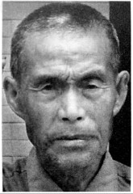
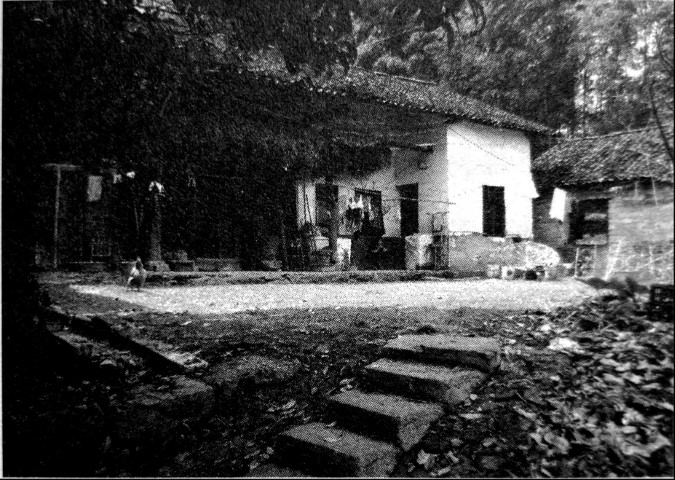
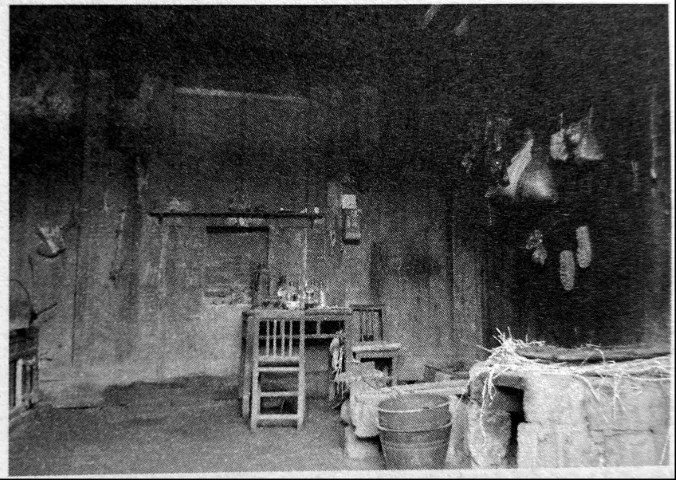

# 烟堆岭：湘西会战在这里拉开序幕

**口述人 /** 向本全，1926年农历十二月二十二日生，武冈县马坪乡兰清村六组人，户口本上错写为向本金。1944年春末被抽丁入伍，分至第99军197师590团3营9连机枪班，负责装填子弹，曾参与岩口铺阻击战。战后一直在家务农，老人身矮力弱，加上先后两任妻子都早早离世，一生困苦不堪，儿子和儿媳均是农民，有个孙女在东莞打工，唯一的孙子数年前溺水身亡。

**采集人 /** 张映科 **采集时间 /** 2015年6月11日

### “我也跟着举手参加敢死队，我实在不想天天被关着了”

我是在民国三十三年（1944）刚吃完立夏粑粑后[^4]，农历四月中旬，一个当兵的熟人带我入的伍。我们马坪、荆竹这一线当时当兵去的有八百多个人，当时抽丁蛮猛的，除非是独生子，壮劳动力捉到都要入伍，有些人屋里四弟兄，都抽走三个了，它保到你屋里有一个，不绝蔸（当地方言，指绝后）。我屋里四弟兄，我老大，老二还只12岁，我必须要去当兵的。也没想着去当逃兵，捉到还是要编回部队，我们连里以前捉到个逃兵，每个人都要上去打三棍子，他整整一个月都下不来床。

我们部队番号是99军197师59团3营9连，我们先是在武冈荆竹铺杨家祠堂集合，后拉到洞口黄桥，再到安江，在洪江下面的沙栗湾训练了一个月，后来又转到洞口江口。在江口，本来安排要到北方打仗的，衡阳失守了，北方都还有兵退回来，过不去，就转回到绥宁武阳，在那里集训过了冬。

过冬时，只发两件单咔叽布上衣，一条单裤子，都是旧衣服，两根裤管膝盖骨位置都剪断，裤管要用来背口粮的，我们把它灌满粮食，两端扎好，搭在背上。腿上打着绑腿，绑到大腿处，穿的是自己打的草鞋。这一身衣服冻得人死啊，好多人的脚上都生了冻疮。睡就在地上打通铺，睡猪仔一样，一排排一个挨一个。天天被关着训练，关狗一样的，训练就是打人，不照做，或者做不到位，不跟你讲多的，拿起皮带就用皮带抽，摸起棍子就用棍子打。我同营的小炮第三排排长，那个该砍脑壳的，就最喜欢打人，整个排的人都鼻青脸肿，他们都不好意思出来见人。

吃呢是十七两米（旧制，约为634克）一天，一天两餐，完全吃不饱，菜没油，还都是青菜，我们都是骨瘦如柴一个个的。蒋介石的兵，是天底下最可怜、最悲惨的人，比叫花子都不如，打完仗还都回不来，我们这里去了一坪一坪的人（方言，一大群的意思）[^5]，我就光讲我认得的那七八个人，回来了也就两三个。

过完年后，我们又被拉回江口训练，过了惊蛰节，我入伍已经有十个月了，部队就给我们发了根步枪，我晓得我要上战场了。到辰溪搞完野外训练后，部队被拉到洞口县木瓜乡马渡村，营里搞集训，要组织敢死队，编到岩口铺最前线去，愿意去的自己举手。一个叫丘中胡的，是个上士班长，第一个举了手，他是武汉人，打过五六个仗的老兵，我也跟着马上举了手，我实在不想天天被关着了。

### “他的腰被机枪打穿了，整个人差不多被打成了两截”

我们去了两个排，编成了一个加强排，有三个老兵班，六个新兵班。老兵班一班的班长是丘中胡，二班是运输班，三班的班长是荆少山，就是后来我的班长，也是武汉人，他跟丘中胡应该是同时入的伍，老兵里有蛮多湖北的。我们六个新兵班的人都是武冈荆竹铺、洞口黄桥、高沙这一片的人。我们全部被打散，叫老兵带新兵，每个班分的还是14个人，分到八杆步枪，六挺轻机关枪。同时把我们划到100军19师57团去了，团长姓钟[^6]。为什么要划到100军去？我听人讲，这个99军的197师，以前在湖北吃过大败仗[^7]，拉出去打仗日本人不怕，名声不响，100军的名声镇得住场一些。

大概是惊蛰过了半个月，正是开桃花的时候，我们到了岩口铺，马路（指邵榆公路）对面的山已经失守了。我们那个班分到了离烟堆岭最远的最靠近白山的那个山头（西北端）上，那里有五个山尖，每个山尖尖上都放了一两个班的人，壕堑和工事都事先挖好了的，武器弹药都有，我们来了只管守。刚到的那天，日本鬼子打炮炸了山脚下的指挥部，我们存在那里的粮食，被炸得谷啊米啊满山飘起。

**烟堆岭山脚，营部指挥所旧址。战时被炸掉了部分，在炸掉的位置现砌了红砖。**

**指挥所没炸的部分，木房子保留至今。**

到了第二天，又调了个副营长（袁楚俊）过来了，第三天晚上，芙蓉山调来了机枪连的一个排，只有两个班，没满编，每个班都只有十个人，带来了一挺重机枪（马克沁水冷式重机枪），这个枪我们当兵的和老百姓都喊“水管子”，开火的时候要经常加水降温，打仗时要整整一个班的人照拂，不比轻机枪，只需要一两个人。但是呢，重机枪的火力最猛，当晚就开火，一个山坡上日本鬼子都被打穿了。

第四天（4月21日），我们的排长过来了，他叫陈登应，个性强得很，爱打骂士兵，本来我们59团部是不肯放他来岩口铺的，他到团里拿了委任状，硬要来。他最可怜了，刚来就被炸弹炸死了，最不值得。我们才刚刚吃了夜饭，他到了这里，夜饭都还没吃，鬼子发动猛攻，他当时是在掩体里面，掩体是两根大腿一样粗的木头绑在一起，成一根柱子，中间留个架枪的缝，这些柱子密密麻麻一个挨一个，斜斜地靠着陡坡上，子弹是完全打不进的，他运气不好，一颗炸弹从脑壳顶上掉了下来。本来连长还打算派他带兵去支援第一个山尖尖，也就是烟堆岭的那个山尖尖的，那边有两个山尖尖，听说都拼了刺刀了。

日本鬼子那个晚上下了死力气，连修路架桥的兵都派出来了，要夺我们的阵地，我们就一直“哒哒哒”往下面开机枪，我的班长也在那个晚上战死了，他的腰被机枪打穿了，整个人差不多被打成了两截，死的时候眼睛鼓起好大一只。哪个班长都打人，我的班长他就从不打人，他跟我讲，仗打完了就送我回去，我蛮舍不得他。班长是我们埋的，埋在他死的地方，没有立石碑，他的棺材是我们从山下老百姓屋里找到的，我们是拿来直接用了，没有给钱，我们也没钱给，打日本，我们都为国家走了死路，老百姓也应该要做贡献。

日本人的尸身我们就不管了，我们有“水管子”，日本人死得那就多了，上山的小路边上全部都铺满了。我们把尸身上的衣服剥了，东西全部拿走，光溜溜的尸身就扔在山脚下面，摊开摆在那里，也不管。

仗差不多打了快二十个日子，白天警戒，在阵地里不出来，一直是摸着夜打仗，日本鬼子白天哪敢打？我们有飞机，他也怕飞机炸，我们的飞机每天都来[^8]，少的时候一两架，多的时候12架，有人告诉我，芷江机场那边有五十多架飞机呢。日本飞机来过一两次，马上就被赶跑了。说起来也怪，到了战场上，我倒不想着去当逃兵了，一个呢是战场伙食过得好，每餐都有肉，二个呢，脑壳上面每天都有我们自己的飞机飞来飞去，仗打到后面，就算被日本鬼子围死了，脑壳上面有飞机，心里也是个安逸。

我还记得，烟堆岭山顶上的那个小坪坪，我们飞机来的时候，就有个哨兵出来，拿着个锄头旋圈子，飞机也跟着旋圈子，当他的锄头指向那个方向猛地停下来时，飞机就向他锄头停的那个方向扔炸弹。[^9]

### “打完岩口铺，只剩下六七十人，打完芙蓉山，就只剩下二三十个人 ”

仗打完的时候，（罗）连长要我们把打坏的枪和空了的子弹盒子都埋了，我们懒得很，不管那么多，就全部扔到山脚下的那个池塘里去了。连长说（5月2日）晚上撤退，大家在岩口铺的老车站集合，再往南边走，去支援芙蓉山阵地，他会打信号枪指路，看他的信号弹飞向哪里，就向哪个方向走。

我们一两个队的人晚上集合的时候，没看到信号弹。等了一会，丘中胡就讲：“我们再打他一仗，日本鬼子以为我们撤退了，绝对想不到我们还会冲上去，肯定没做好准备。”他是上士班长，也是（军衔）最大的，他讲话就是军令，他要反攻，好，我们就又端着枪冲了回来，就又把烟堆岭抢了回来了。冲的时候，我看到日本鬼子在杀一个俘虏，可惜我们慢了一步，没救到那个人。冲到山尖尖上时，我们班里的阮必章被鬼子的刺刀砍死了，应该是砍在脑壳上面，他是贵州人。

到芙蓉山[^10]后，我们的阵地分在狮子山[^11]。我第一天晚上到，第二天清早，连长就要我送七个伤兵到芷江去，我也不晓得他为什么偏偏要我去。我就从隆回荷香桥动了身，回来后，听说芙蓉山的仗打完了，其他地方也都不打仗了，我就回了屋。

我们去岩口铺的有9个班，126个人，打完岩口铺的仗，只剩下六七十个人了[^12]。不在的，大部分都被打死了，也有逃兵，我记得隔壁班上，夜里那两个人都还在放哨，第二天清早，就只看到两把枪扔在地上。逃走的具体人数我不晓得。剩下那六七十个人，接着又去守狮子山，打到只剩下二三十个人，快死光了，连阵地都没有人守了，这是我听向南顺和段班陆讲的。

向南顺以前跟我一个大队的，1951年洞口设县，他屋在蓼水河对岸，划到洞口县洪茂乡双江村去了；段班陆是隔壁花桥村的人，他跟我打过岩口铺，不是一个班。我们这里打仗回来的，就我们三个，他俩都打过芙蓉山，我问起班长丘中胡的情况，段班陆告诉我，有一次鬼子偷袭，对面山里（指芙蓉山）急急忙忙喊话报警，丘中胡把碗一摔，就去开机枪。鬼子狡猾得很，早瞄准了打机枪的位置，丘中胡好像是头部中弹死的。段班陆告诉我，丘中胡死的时候，就在他身边，他看到情况不好，端起机枪马上偏了下位置，要不，他也要“交代”在那里了。我还问起他们可晓得一个叫曾桂安的人，他是洞口县山门的人，当时只有十五岁，（罗）连长把他拢在屁股后面，专门吹号子的那个，他们两个都讲在芙蓉山没看到那个人，解放后我托熟人到山门去问，也没有问到他的消息。

[^4]: 湘西南民俗，在立夏节这一日，吃糖油米粑或汤圆。晚辈带着礼物去看望家中长辈，长辈则赠予吃食。

[^5]: 据向本全回忆，当时武冈一起征召去的有一个团一两千人，全部补充到了受损较大的197师。

[^6]: 钟雄飞，中央军校高教班三期毕业，湖南新邵县洪溪乡人，1908年5月17日出生。抗战时期，其参加了几大主要会战。湘西会战期间，钟雄飞做为团长亲自指挥江口青岩阻击战。1951年其病故于长沙。

[^7]: 此师系1938年1月由丁炳权在长沙组建，承担长沙铁路段护路任务。抗战前中期，一直活动于湘、鄂、赣三省交界地带，也曾参加过武汉会战、鄂南游击战和南昌会战。在湖北有过几次驻扎，期间与日军也发生过数次交火。向本全所说的“在湖北吃的大败仗”，具体是哪一仗，难以考证。

[^8]: 空军中美混合团第5大队。仅在1945年4月19日一天之内，就先后出动58架次，直接配合地面部队战斗。又于4月20日出动战机32架次，直接支援岩口铺守军，并攻击敌新占的桃花坪阵地及后方设施等，计毙敌200余人，马15匹，炸毁仓库5所，弹药库1所及阵地多处。

[^9]: 向本全和陈林华两人均说到地面哨兵旋转标示物给飞机指示方位，此事真实性应确凿无疑。只是一个说用的是竹竿，一个说用的是锄头。可能是在不同的时段，不同的哨兵选择了不同的标示物。

[^10]: 芙蓉山，位于隆回县城以西5公里的双井村，海拔529.7米，扼湘黔公路咽喉，是日军西进必倾全力争夺的要塞。整个湘西会战期间，日军始终不能突破芙蓉山而利用邵榆公路，兵员、辎重输送必须绕山区崎岖小路，时间及精力耗费严重，补给线延长，极大影响了其战力发挥，也阻碍了其溃逃路线。岩口铺、芙蓉山阻击战的胜利，正是湘西会战得以全面胜利的重要保证之一。

[^11]: 狮子山位于芙蓉山东，西为辰江岸边，是芙蓉山阻击战重要阵地。1945年5月22日拂晓，日军217联队在芙蓉山东西线的曾家坳乡大洲村安设迫击炮，向辰江对岸的狮子山守军工事轰击。第9连配合中美空军第5大队重创敌军。后狮子山阵地被日军攻占后，连长罗文生率第9连残部退守芙蓉山。

[^12]: 此役中国军队亦阵亡副连长钟蔚文以下官兵17人，伤31人。