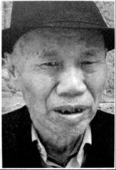

# 烟堆岭：湘西会战在这里拉开序幕

**口述人 /** 唐亮，1935年生，岩口铺镇岩口铺村村民，岩口铺阻击战发生时，只有九岁多一点。

**采集人 /** 张映科 **采集时间 /** 2016年12月5日

### “罗连长犯了警惕心，摸着黑就把武器弹药全部搬到山上去了”

我八字蛮丑的，半岁无娘，一岁没爹，全靠我那个孤寡奶奶盘大我，她在街上卖小菜，屋背后还有几棵李子树，李子熟了就顺便卖点李子。

1945年农历三月初八，国民党在这里打死几十个日本鬼子，死的人数我们都不清楚，鬼子又不摆尸身，他们把尸身运到狮子庵，一把火烧了的。鬼子死了很多人，他们要报复，农历三月十二，下着个细细雨，来了一个团（指116师团120联队），千把人的样子，围起了烟堆岭，准备攻山。农历三月十四，天气比较凉，岩口铺的人都逃难了，只有我奶奶，是个小脚女人，走不动路，又挂念屋里，就没走远，和一个叫肖桂大娘的，两个都是四十七八岁的女人，躲在山脚下的岩洞里。那个岩洞又不深，百把米的样子，我奶奶她们被搜出来，背靠背捆起。有一个汉奸，我奶奶老死的时候都还记得他的样子，又高又壮，穿着蒙古袍子，满脸横肉，留着个络缌胡子，扔了个炸弹。我奶奶屁股全被炸烂了，肖桂大娘被炸断了脚，痛了一个多小时，死的时候喊我奶奶：“满娘哎，我不行了，要我崽女莫哭。”喊了几声，才不喊了。我奶奶就蛮急，我要是死在这里如何得了，我还有个孤孙没人带啊，她就念岩口铺边上皇觉寺庵堂里菩萨的名号，念完后一摸绳子，绳子就脱了，那真是菩萨保佑。我奶奶一步一磨，磨了四里路，到了杨岩我姑妈家里，才捡了那条命。

在我们老街，有三十多个人被杀了，都是逃难没走脱的，有一户人家不舍得走，祖孙三代人，被杀得干干净净。尸身全部扔在烟堆岭山脚下的那个水塘里，都漂满了。那个上次回来探访的老兵（指向本全）也讲起这件事，我们这里的人都晓得。

农历三月中旬的样子，夜里六点钟左右，鬼子放火，我们这里一里多路长的老街，被烧得干干净净，时不时有屋柱被烧断，屋顶塌下来，“轰嗒轰嗒”响声震天。我挂念我屋背后墙上冬瓜藤上结起的三个大冬瓜，清早赶回来看，都变成一片瓦渣场了。

那个时候我年龄小，蛮多的事我不记得。不过我记得一个驻扎在这里的姓罗的连长，个子很矮，只有那个老兵（指向本全）那么高，一米五多一点点，他看我屋里穷，每次都给我饭吃，每餐还有肉，不是鸡肉就是狗肉。他是个良心好的人，也是个大能干人。日本鬼子要打这里，他们起先偷偷派汉奸到这里侦察地形，侦查到我们的军械弹药都放在老街往东边的那个过路亭子里，罗连长是个蛮稳重的能干人，他犯了警惕心，摸着黑就把武器弹药全部搬到山上去了。第二天清早，日本鬼子来了，起手就炸了那个亭子，结果“轰隆隆”放了一个好大的空炮，亭子半边全都被掀到天上去了。我们这里好多的人都晓得这个半边亭子的事，这是我们这里的传奇故事，大家传领了好久。
