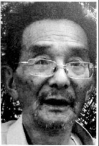
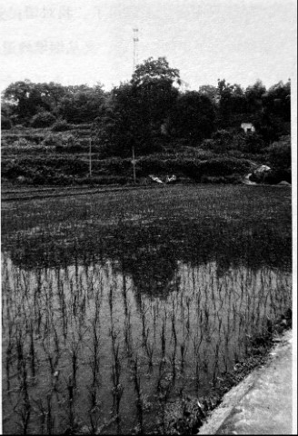

# 烟堆岭：湘西会战在这里拉开序幕

**口述人 /** 陈林华，1930年出生，岩口铺镇岩口铺村村民，岩口铺阻击战时，十四五岁的陈林华并没有远离家。

**采集人 /** 张映科 **采集时间 /** 2015年5月31日

### “仗都是摸黑打的，仗打完后，我们大伢子就去捡铜壳子”

清朝的时候，岩口铺就是一条东西走向的老街。在烟堆岭南边山脚下面有很多抽鸦片烟的，到了民国要禁烟，就把那些收缴的鸦片烟全都堆在这山岭上，一把火烧了，所以这座山岭就叫烟堆岭。山脚下有个岩口（当地方言，指山洞），岩口铺也就是这样叫起来的。以前这山脚下有三口井，井旁有个水塘，跨过这个水塘，就到了老街。“大跃进”时，水塘被填了，变成了现在看到的这两块田。

这座山只有八十多米高，宽我估计八百米的样子。从这里往西北方走，都是起起伏伏的，越往西北这些起起伏伏就越来越厉害，更远就到雪峰山了。往西南走，可以到周旺铺、到隆回去，一路都蛮平。往正东边偏北一点点走，就可以到邵阳市，一路都是平地，日本鬼子要是从邵阳打过来，那肯定是蛮快的。

这一片的岭子都喊成烟堆岭，也讲得通。烟堆岭东北边偏东有个院子（当地方言，指自然村），叫白山王家，以前是蛮大的一个村，鬼子打岩口铺的时候，人被祸害死了蛮多，现在成不了一个村，归东北边的白山村管。

沿着东西走向越来越偏向北方的320国道（邵榆公路）走，可以到岩口铺的白山村。现在的新街就是以国道作为街道，后来建起来的，与老街并排，两条路只隔了几座屋宽。这条国道的南边有个岭，喊作铁丝岭，紧挨着铁丝岭的东边，对着烟堆岭，也有个岭，喊作百弓坨，以前日本鬼子打到这里来的时候，最早是在那两个岭上打起来的，那边没驻着多少人，打了有几天的样子，兵都退到烟堆岭那边去了。

以前的烟堆岭哪有这么深的茅草，现在都埋我腰了，我有十多年没有爬这个岭，这里变化太大了。以前这里的草浅得很，有一点草也被牛羊给吃光了。到“大跃进” 时，山全部被开发成了圷（方言，指旱田或者菜土），一层一层的，用来种点小菜。现在呢，人越来越懒，这些圷绝大多数都荒了，长满了草。

就是这些茅草，打仗时的壕沟完全看不到了，印迹也变得蛮浅，不有心的话，怕是根本找不到。以前壕沟倒是蛮大的。有一个半人肩宽；高呢，低着头猫着腰，能把人完全遮住，每个岭子之间，都被壕沟连通了的。在烟堆岭最高的地方有一个三角碉堡，约二十个平方米，可以躲一两个班的人，哪个面都可以向外面打枪，现在在原位置修了个蓄水塔，建了差不多快十年了。

我屋在这山的南边，看得清这个碉堡，打仗那个时候我是一个十四五岁的伢子（方言，指小孩子），我不怕死，走日本的时候，我就经常跑回来看，我有次看到，碉堡前面有个兵，手里拿根竹竿子，竿子上鄉了个旗子，他在转那根竿子，天上我们的飞机也跟着他的竿子转圈子，当竿子猛地一沉，沉到哪个方向时，机就猛地俯冲下来，向那个方向“突突突”地打机枪。那次我没看到飞机打死日本人，也可能是太远了没看清。

白天，经常有飞机过，都不是鬼子的飞机。

仗都是摸黑打的，我没看到过。仗打完后，我们大伢子都去捡铜壳子卖，烟堆岭上铜壳子最多，我都去那捡了好几次。

**2015年5月31日，老街与烟堆岭之间。这里以前是池塘，现在是几块小田，步行五六分钟就到了烟堆岭的山顶，这里过去是整个湘西会战的最前线。**

那些兵呢我也不记得了，我对国民党地兵印象不好，这些人从对面山里退到烟堆岭，又从烟堆岭退到芙蓉山，打仗就晓得退，要是他们能赶走鬼子，白山也就不会被祸害得这么惨。他们还爱到乡下面去打鸡打狗，打起仗来，就只想到当逃兵，兵头头（当地方言，指军官）都不敢管。我听到有人讲，岩口铺的兵，连兵头头都敢打。

但是我对那个连长（指第九加强连连长罗文生）印象蛮好，和气。他是这里的兵头头，指挥部就设在山脚下，靠岩口西边一点点的那座孤零零的老木屋里，现在都还住着人。我经常在那个屋的屋门前玩，记得天气是要热不热要冻不冻的样子，好像还落着个毛毛雨，是特别容易得感冒的，我正在玩，那个连长估计也得了感冒，他把我喊住：“喂，小鬼，你们这里有医师吗？”我哪晓得医师是什么意思咯，他就改口，问：“有郎中吗？”我记得七里村好像有一个，就帮他去喊。那个郎中谈条件，讲诊完了如果不扣人，他就答应来。连长答应了，诊完了，我看到那个连长还客客气气地送郎中出门。
