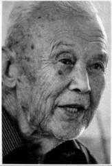
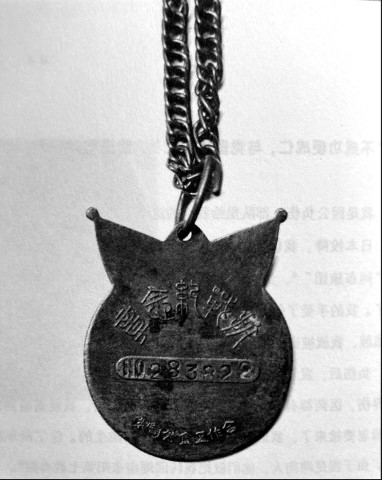
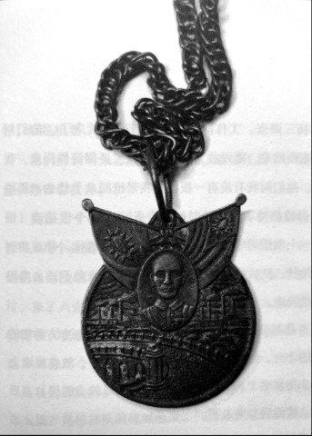

# 纪念章：这一枚编号No.283822

_“你是怎么有这个抗战纪念章的？”_

_“其实，我没有上过战场。我随部队去受降，日本人不肯缴械，双方起了争执，有流弹打着我了，我受伤了，我又是一个中尉军官，就有了这个纪念章[^1]。只有当官的才有，当兵的是没有的”_

_“那你是怎么当上中尉军官的？”_

_“那是因为我爱看戏。”_

_周绍耿的一生有着一次次意外的反转．不想当兵，所以娶亲，却因为妻子的亲威关系入了伍。他稚气未脱，在路边看戏玩耍，又因前来视察的蒋介石的临时起意，被推荐上了军校，人生拐上了另一条完会不同道路。_

_尽管命运一次次地转折，他终归还是老于田舍间，一生平凡之至，没有什么感天动地的生离死別，也没有什么震天动地的儿女情长。他只是对回忆中的那些人，有一份份淡淡的不舍，然而却正是因为蕴含在这平凡之中的不舍，才拥有了感人至深的真实力量。_

_他其实是湘北当时许许多多的行伍青年中的最平凡的一员。_

_只是他多了一个纪念章罢了_

**口述人 /** 周绍耿，1922年农历九月出生，浏阳市古港镇古城村巫塘组人，1942年入伍，隶属国民革命军第99师，任师部参谋部少尉书记，负责处理公文往来。同年插班就读黄埔三分校[^2]，系16期学员。毕业后重回第99师，担任直属炮兵营中尉书记官。日本投降后，在江西缴械，遇日军反抗，手掌被弹片擦伤感染而复员。“土改”时曾被关押过三个月。老人现在乐享天年，不过在口述中，他总是重复其自从当兵后就再也没有看到过父母了，这可能是他一生最解不开的心结。

**采集人 /** 张映科 **采集时间 /** 2014年7月23日

### “‘不成功便成仁，与党国同存亡’，我没有做到”

我是因公负伤，部队里给我发的这个“奖章”。

日本投降，我们去缴他们械[^3]，日本人不愿意，他们的番号是“阿布旅团”[^4]，这支部队都不肯缴枪，就打起来了，我们打赢了。我的手受了伤，首先送十四兵团医院，后来伤口感染，说要截肢，我就被送到安庆二十二后方医院去了。

负伤后，发了奖章，还发了钱，不知道多少，搞不清。在医院养伤，医药都有，我拿中尉薪水，待遇蛮好的，我就请假回家把我老婆接来了，我的大女儿就是在这个医院生的。住了两年左右，由于我是湖南人，他们就把我转回湖南耒阳第七教养院[^5]。

我把我所有的东西，包括证件、纪念章，还有一把枪，放在小孩包裹里，带回了耒阳，那把枪是根手枪，没多长，我一般塞在屁股后面，本来不想从部队里带出来的，那个时候“顿竿子”（当地方言，指土匪）多，我冇得办法。

教养院就是养点“空人”（当地方言，指闲人），每个月都有薪水，有几十块法币，跟部队里一样。后来在那里没有人理了，管的人都跑了，我就自己回来了。有个当连长的，他是浏阳高坪的人，那连长脚被打了，他比我后到教养院，也比我后离开教养院，我后来在浏阳碰到他，问他教养院我走后的情况，他说他也搞不清了。

教养院的院长是黄建龙，也是复员的，他只有一只手，是洞庭湖的人，不知道他还在不在。

**周绍耿的纪念章，编号NO.283822。**

**周绍耿纪念章的正面。**

我五月初三回来，工作队的五月初四夜里就来了，他们问我有没有带东西回来，要没收。我没那么蠢，还带证件回来，我就说我没有。他们问我有没有一根枪，我带枪回来干什么，那根枪以前有，但被搞掉了，走的时候，在耒阳，14个银花边（银元），卖给一个叫伍国华的连长。他们总说我有根枪，带着我到茶山里面到处转，把我屋子拆了，都没搞清，后来他们还去耒阳调查，也都没搞清。

那个奖章是部队里发的，不是每个人都有，打过仗当官的才有，特殊的才有。他们没有找到，我已经收好了，放在屋墩上（当地方言，指房梁上，或者房梁上架木板铺成的小阁层），后来房子倒了，就埋到土里去了。

还有把黄埔军校的匕首[^6]，“土改”时，我怕有人晓得，就把那把匕首丢水塘里去了。学校给我们这把匕首，是要我们“不成功便成仁，与党国同存亡”，我没有做到。只有这个奖章还留着，这个是我用命换回来的，我要带到土里去。

### “蒋介石摸了下我的脑壳：‘小伢子到部队里干什么？部队是要命的。’”

我初中刚毕业，也不晓得死啊活啊，就去当兵了，觉得好玩一样。99师师部[^7]当时驻扎在浏阳。我老婆姓林[^8]，有个军医处长也姓林，就搞熟了，这个熟人介绍我去了师部当书记。我初中毕业，能写，负责抄录往来的公文，不是管密码的，密码不归我管，那是机要，不能公开的。

我们师长叫朱志席[^9]，四川人，最信任我了，随便到哪里开会，都带着我去。

民国三十一年（1942），蒋介石把所有的部队拉到南昌开会[^10]，几个兵团，几十万部队[^11]。我碰到个营长，对我蛮好的，他们在路边唱戏，我就在那里耍，蒋介石正好坐着车子从那儿过，来了六张（当地方言，辆）车子，他坐在第四张，我怎么会晓得啊？我看见他从第四张车子里出来，他把那个营长喊过去问话：“你那个营里有个小伢子，是哪里的？”营长他回答说：“是我们部队的。”蒋介石就说：“这种学生伢子你也收，打仗怎么搞？是你部队的你喊他来。”蒋介石把我喊了去。我那个时候有二十岁了，但看起来小，像个十七岁的伢子。他摸了下我的脑壳，跟我讲：“你这小伢子到部队里干什么？部队里是要命的，不要到部队，打仗要命，你怕不怕？”

他头上没头发，只有周围这里（左额上和头顶偏右位置）有点，戴着个圆眼镜，个子比我高，蛮“煞”（浏阳当地方言，指为人很厉害，有时候也指为人很嚣张）的，不简单，随便走到哪里，哪个碰到都要敬礼。我也算见了一回大脑壳了（浏阳当地方言，指大人物）。他讲话我不太懂，不晓得他讲什么，那个时候我胆子蛮大的，我不怕死，见到蒋介石我也不怕。他问我，我就摇脑売。

这是个机会，营长他们被蒋介石训斥了一顿，本来打算是要把我送回老家的，但蒋介石在上车之前说了一句：“这么小的伢子，送他去读书吧。”他们就把我直接送到黄埔军校（指黄埔军校三分校）读书了，别个去都要考，我去就没考，委员长开了口，哪个还敢有话说？

学校在江西瑞金，我是16期，李默庵当校长，他长得蛮周正，个子不高，还算胖。那个时候他真蛮恶，不认得人，你迟到，他就是一脚踢，不管你是哪个。只有他知道我是蒋介石送来的，也特别照顾我，他不晓得我和蒋介石什么关系，他也怕塌场（当地方言，指落了别人面子，或者指出现场面尴尬）。

我读了不到一年，那几个月我真的受了蛮多的苦。只要一下雨，就吹哨子出操，夜里正淮备睡觉时，他也吹哨子，只能去集合。每个晚上都是那样的。我们晚上睡觉，都不敢解绑腿，怕搞不贏。教官最喜欢打人，他根本不跟你笑，就是一脚踢过来，没什么客气讲。我现在讲起这个事情就愁人，我那几个月，真是吐了舌头（浏阳当地方言，形容很累），每个月给我数不清的钱，我都不想去搞这个事。后来到了真正的黄埔军校[^12]受训，就没这么苦。

毕业后，我就当教官去训练别人了，那个时候不是少尉了，不知道是中尉还是上尉，没有牌子（指佩戴的军衔标志），都不记得了。

后来我又被调回99师，军人以服从命令为天职，没有道理讲，让你上天就上天，下地就下地。我回到99师炮兵营，还是做书记，中尉书记。我随部队到过黄桥，还有如皋。我在江西负的伤，我记得还没过长江，具休哪里我也不记得了。

我回来后就跟我岳父、岳母一起住，“土改”时，我被关了三个月。后来把我调到公社的石灰厂卖石灰，一直卖石灰，后来石灰厂冇搞了，我也老了。

从我20岁起，我去部队后，我就再也冇看到过我的父母了。我是独子，他们是我家里的叔伯兄弟们帮忙埋的。

[^1]: 周绍耿获得的抗战纪念章由国民政府军事委员会颁发，背文：抗战纪念章，合作五金公司制。根据该纪念章颁授条例，该章颁给标准是：(1)在抗战时期之陆、海、空三军军官佐属，曾参加战役三次以上，或在各军事机关、军事学校连续任职五年以上者；(2)非陆、海、空三军军官佐属，在抗战期间曾致力于军用器材之制造、运输等工作达五年以上，著有效绩，经证明属实者；(3)来华参战五年以上，具有光荣合作之盟军军官及同盟国家之军官或非军官，或虽未直接来华参战但于训练或运输之上援助著效绩者。纪念章有编号，周绍耿的纪念章编号为NO.283822。

[^2]: 1938年9月在江西瑞金成立，又称西南干训班，李默庵任校长，校址在今瑞金市杨家祠堂。据瑞金市红土地文化研究会会长严帆编著的《抗战岁月在瑞金创办的黄埔军校第三分校》记载，黄埔军校第三分校共毕业学生7430名，毕业学员5961名。

[^3]: 江西具体受降地点在九江一带。1945年8月，日本投降时，梁汉明驻江西九江，以99军军长兼江西受降官的身份，接受日军投降。周绍耿所在的99师，隶属于99军。

[^4]: 阿布，根据浏阳东乡话音译，具体不详。根据其投降地判断，或估测属日军第十一军团。

[^5]: 长沙沦陷后，做为湖南省临时省会的耒阳，是当时国民政府军政建设的重点所在，故设有较多复员伤病军人教养院等机构。

[^6]: 指中正剑，是蒋介石赠给黄埔军校毕业生、得力部将及有功人员的随身短剑，因在剑柄上刻有“蒋中正赠”宇样，而得名“中正剑”。其制式无一定规格，剑柄上一般刻有“黄埔志工无往不胜”“中正”“校长蒋中正赠”等宇样。

[^7]: 该师从1936年成军，一直驻扎在贵州，有很浓重的“黔军”色彩。1939年春，始由贵州调往湖南，并参入湖南抗日战场。此后，湖南成为其兵源主要所在地。

[^8]: 周绍耿是家中独子，父母怕他被抽丁，安排他在17岁就结婚成家。

[^9]: 朱志席，黄埔军校四期步科毕业，别号上珍，四川资中人，参加过北伐战争和抗日战争，一生战功赫赫。1946年8月26日在苏中战役中被粟裕部俘虏，后一直关在旅顺监狱，并在狱中去世。

[^10]: 1942年夏，蒋介石在南昌开的这次军事会议，应是为浙赣会战备战。

[^11]: 周绍耿指的是参战部队人数。在南昌开会的应为各部所属军事长官以及当地驻扎部队。

[^12]: 黄埔军校本部，其于1938年11月时迁至成都，周绍耿临毕业时，在那儿接受过短期训练。