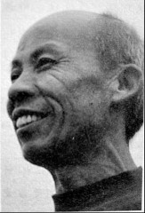
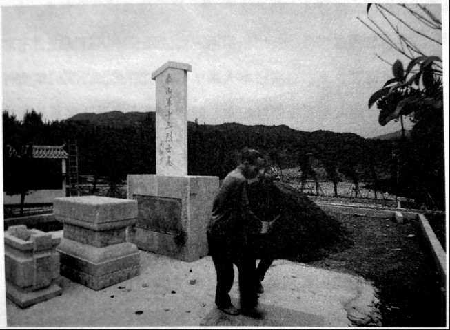

# 花桥：泰山军十三壮士墓

_衡南县花桥镇竹镇村清远组，那栋土坯旁是上世纪70年代修建的，谢治义拄着根自制的拐杖，每天木木地生在门口，木木地望着那块基地。_

_泰山军[^1]十三烈士墓地离他家只有70米，这短短的70米，便是他与他的袍泽70年的阴阳相隔和守候。_

_老人不识字，双耳失聪，记忆衰退，已完全无法交流。他是我们受访者中唯一一个“无言”的，然而他的目光，却最让人动容，尤其是在他望向烈士墓地的时候，饱含了悲伤，却又透露出一份澄澈。_

_所幸，墓还在，守候它的人还在。_

_谢治义原名梁守好，1921年11月28日出生于浙江省丽水县江河乡光河村。1939年被抓丁入伍，编入国民革命军第十军预10师28团通信排，参加过第三次长沙会战、常德会战和衡阳保卫战等。在衡阳保卫战时曾代理排长，战后流落于衡南花桥，入赘一谢姓人家，更名谢治义。_

**口述人 /** 易成秋，1954年出生，衡南县花桥镇竹镇村易家组组长，谢治义的至交好友，泰山军十三烈士墓碑的发现者和墓地重修者。

**采集人 /** 张映科 **采集时间 /** 2015年7月8日

### “我管这些兵是共产党的还是国民党的，我只晓得，他们打了日本”

墓是从1945年端午（6月14日）开始修的，抗战胜利后，刻碑、修亭子，慢慢细细搞了七个月才搞完。当时逃到这里的第十军的兵和罗国璋的皇协军[^2]发生冲突，当时死了21个人，第十军预10师28团第3营的李若栋李营长[^3]，他在碑文里写埋了10个人，实际上埋了13个，李营长他记错了，也有可能是那另外三个他不晓得名字就不写了。李营长他们后来散了场，李营长也离开花桥，还有四个兵伤太重了，没救活，后来也埋在那里面，他不晓得这个事，墓里总共埋了17个。不埋在这里的还有四个，一个埋在藤冲村、一个埋在高新村、一个埋在蒋家大屋，还有一个埋到冠市镇去了。埋人的时候我父亲去挖了土，他叫易积谱，是我们这里一个明事理的读书人，他亲口跟我讲起这个事。

当时给那17口棺材挖了一个蛮大的坑，有一个蛮大的土堆，在重修前长满了茅草，有两三米高。边上有一个亭子，有六块碑，其中一块主碑就是这十三烈士的碑，那五块副碑上面密密麻麻全部是名字，是李营长当时打衡阳保卫战守湘江码头时，他营里牺牲的兵的名字。

亭子是一个六角亭子，木栏杆全部刷了朱红大漆。亭子上挂了副对联，写的是“上为日星，下为河岳，炎黄有子孙，天地流正气。孔曰成仁，孟曰取义，兄弟已在望，生死何足论”。本来我只晓得有副对联，但是写了什么我不晓得，这还是后来我特意去问了文化局的人，他们就去查档案，翻到了唐铁庵[^4]的档案，从他的资料里翻出来的。

墓修好后，留了两个人在这里守墓，除了梁排长（指谢治义），还有个叫史天林，也是浙江的，入赘了一唐姓人家，改名唐天林。五几年就过世了，当时儿子还只两岁，他婆娘后来一直没有改嫁，他儿子大了后，还去找了老家，到浙江统战部去问了，没有得到任何消息。

1958年“大跃进”，大修水利，石丘村的谢红增以前是罗国璋的副手，是皇协军的一个头子。他讲要把这些墓碑全部拖去修水利，没有谁敢阻拦，阻拦是要挨斗的。亭子就被拆了，那几块碑全部被拖到水库做了排水沟的底板。

1991年，我背起喷雾器到田里去杀稻螟虫，在水库边上，那块主碑，被沙子泥巴埋住了，我一脚踩在上面，它是平的，有点滑脚，我就把它翻出来，放在我们这里大王庙里，做拜石，就是祭神的时候用来拜的石头。到1997年，大王庙倒了，我就把它移到我们易家祠堂做拜石。我不是有意去留这块碑，但是也没有想着去把它丢了。到2014年5月份的时候，那块碑才移了回来。

以前听过梁排长打仗的事，我也就上了心，1996年的时候，我就想把墓地重修一下，打报告给衡阳市文化局，一个局长，姓谢，当时他还是办公室主任，说这些人是为国家牺牲的，墓是应该要修一下。文化局最终点了脑壳，同意了，我们才得以去搞这个事。

现在县里付我劳力工资，我每天都在这里，挖排水渠，修护坎，贴瓷砖。有人不要我搞，但是我晓得这墓我是一定要修的，我不管他是哪里人，我只晓得，他们打了日本，抵御外敌洒了血，还保了我们这一方的平安。

**2015年7月8日，衡南县花桥镇竹镇村易家组，正在重修泰山军墓地。**

### “李营长拿出把快慢机，指着梁排长，逼着他走，梁排长不得不走”

梁排长只有三个孙女，都嫁出去了，没一个在身边，早几年要是能生出个孙子就好了。

打完衡阳后梁排长一直在这里，从来就没有回过他的浙江老家，只托人写过一两封信回去过，他老家还有亲人。他做事手脚非常勤快，就晓得死死地做工，天不亮就扛把锄头出来做工了，天全黑了才回去，不爱跟人讲话，有点善（当地方言，指为人懦弱本分），打日本鬼子的事，他只跟合得来的人讲过一点。他身上受的伤，脱了衣服也只给我们几个相处得好的人看过，有四处伤很明显，炮片伤和弹伤，在背上肩胛骨和屁股上，还有两处火伤，在膝盖窝上的，是在守衡阳的时候，日本鬼子用喷火器喷的。

他还打过长沙和常德，这两个地方打仗的情况，他没有跟我讲，就只说过，打常德打得蛮累，本来部队要休一个月，但是只休了七天，就开往衡阳了。

整个衡阳打仗过程，他说就是白天休息，晚上开打。

开始时白天也偶尔打的，打了一个星期后，习惯就成自然了，两边就像签了协议一样，吃了晚饭，6点钟的样子，互相间喊起来了，就淮时开火，打到早上八九点钟太阳大了的时候，就熄火，白天就在汇丰银行的地下室里休息。[^5]

梁排长原来是李若栋李营长的警卫兵，跟李营长的关系特别好，守衡阳时，升到通信排一个班当了班长。仗打到后头，他们排跟28团第3营一起去守离铁路桥不远的湘江渡口码头，跟日本鬼子翻了五番（当地方言，阵地彼此交换了五次的意思），杀得营里只剩下三百个人了，通信排的排长负了重伤，梁排长就代理了排长。

城被攻破后，大家都逃生，李营长右腿负了伤走不动，梁排长都逃走了，他又走回去背李营长，李营长就发脾气，要梁排长先走，梁排长舍不得他，李营长就拿出把快慢机，指着梁排长，逼着他走，他不得不走了。

### “他的头被打破了，流下来的血把短裤全染湿了”

梁排长离开衡阳后，1944年8月中下旬的样子，就流落到我们花桥来了，流落到我们这里来的兵蛮多，有两三百人[^6]，就搞了个收容所，叫衡东收容所。[^7]

梁排长到这里半个月后，李营长才来，拄着根拐棍，一瘸一瘸的。原来他被捉住后，鬼子不晓得他是个官，看管不严，他就趁着夜里偷偷捡了根木头，跳了湘江，水流一直把他冲到衡山，他又从衡山一路过来，到了这里。[^8]

李营长到这里后，就组织那两三百人跟日本人打游击，不准日本鬼子祸害乡下。有次日本人来了三个侦察兵，在我们镇南村刘家组的一间大堂屋里强奸妇女，妇女们哭声震天。李营长和梁排长两个人刚从花桥镇上买青菜回来，走在路上。我父亲亲眼见着，他俩听到哭声，就把青菜往路边地上一扔，抄起枪就冲了过去。日本鬼子打死了两个，跑了一个，从欧东村那边山上跑到石丘村去了，跑回去的日本鬼子报告了这里有第十军，这个鬼子联队连夜就跑回衡阳城了，他们打衡阳时输得很惨，怕了第十军。

到1945年的时候，罗国璋管行署[^9]，他跟李营长是唱对台戏的，不肯给李营长他们军饷，还说要把这一片血洗。石丘村的谢红增是副司令，组织了两三千人，从我们村易家组和清远组后面的两边山上围了过来，谢红增的那两三千人是皇协军，鬼子扫荡乡里时，那个连队就驻扎在石丘，谢红增的那些人也一直驻在石丘，都驻扎在一起，不是皇协军是什么？

他们围过来时，李营长得到了消息，就对我们老百姓讲：“明天12点以前，你们要是没听到我们吹号，就全部逃，躲到山里去。”没吹号就表示日本人有大部队来了，他们只有三百多个人就只能跑，是搞不赢日本人的大部队的。第二天他们吹了号，我们就没跑。他们在这里干了一仗，打死皇协军七百多人[^10]，这些事情我都是听梁排长讲的。

我们这边就只死了21个，仗打完后就立了碑，1945年端午节，李营长的部队散了场，李营长也离开了这里[^11]。梁排长留了下来，他到花桥后一直是住在谢治莲屋里，到1948年上半年，倒插门，就跟谢治莲结了婚。

## 延伸：花桥“泰山军十三壮士墓”主碑碑铭

虾夷猾夏，举国同仇，逯迫衡阳，师达卅万，本军奉命固守，全体誓以身殉。鏖战五旬，歼寇三师，不徒敌胆为寒，鬼神亦为饮泣。方之史丹林格勒之役，艰难不知万几。虽弹尽援绝，致陷城中，犹不为敌所屈。毅然突围东来，为保国家元气，用是设所收容，期再杀敌，还我河山，一点丹心，可质天日。承湘东士绅爱护，行署廖公补给官兵，得以戮力保卫地方，军民相安无事。谁料三月初，罗国璋接长行署，别具野心，排除异己，停发给养，制我死命，任意摧残，遂其诡随令之傫然在墓者，均遭暗杀之袍泽，其中钱军需向璋请粮，被害尤惨。复敢甘为戎首，三月文日，倾巢围攻本所，企图一网打尽，以快其私，幸天夺其魄，被我击溃，民害未清，犹有余憾。呜呼，大敌当前，阋墙之诫，璋竟充耳无闻，倒行若此，心尚可问乎？爰记之勒石，以明忠奸之判，而慰壮士之灵。壮士者谁？江苏钱海文，龙游雷鸣荣，西平夏得河，湖北萧石安，永嘉包岳鹤，山东吕鸿轩，广西王得文，诸暨江士英，安徽岳时提，湖南马森林也。

上饶 郑华轩 撰书（郑华轩印章）

中华民国三十四年五月五日 泰山军衡东收容所

李若栋 谢业彬暨全体官兵

[^1]: 1939年夏，国民革命军第八军在军长李玉堂的率领下，参加武汉会战的南浔线战斗，因战功卓著，李玉堂被蒋介石授予华冑勋章，指挥南浔作战的薛岳则赠送第八军“泰山军”锦旗一面，“泰山军”之名由此而来。第一次长沙会战后，李玉堂调任第十军军长，“泰山军”之名也随之被带到了第十军。

[^2]: 易成秋以及当地村民称罗部东乡游击队为皇协军，这种说法是错误的，下同，不一一纠正。据湖湘文化研究所研究员萧培研究报告《浴血孤城——四十七天衡阳保卫战》，湘南行署指挥部与之前成立的南乡抗日游击指挥部“共与日军发生大小战斗47次，击毙400人，并且营救了飞行员吴国栋、塔佩（TAPE）等4人脱险”。游击队有过对敌战斗，并不是伪军，只是彼此之间也会因利益关系或者有汉奸在推波助澜而发生火拼。民革衡阳市委范林说，“地方上国军游击队成分复杂，当时衡阳被日军占据，参加游击队的人，地痞流氓汉奸啥人都有，又没有办法具体甄别。罗国璋在台湾去世，写有回忆录，提到了这些。”

[^3]: 李若栋后来参加过内战，后被俘。1949年后，曾任长沙县政协委员。

[^4]: 据萧培考证，唐铁庵是墓碑对联的撰写者。唐铁庵又名唐达一，衡南县花桥镇赤水村人，曾任国民政府湖南省省长唐生智幕僚，后回到衡阳市咸益中学当语文教师。

[^5]: 谢治义所在的通信排为非战斗兵种，直到战争的中后期，兵源因伤亡匮乏，通信排才进入战斗序列。其白天躲在汇丰银行地下室里，与李若栋营长的自述吻合。当时战斗的激烈程度，谢治义曾跟67岁的竹镇村清远组村民谢云楚说过一件事：预备第10师工兵连连长黄化仁牺牲以后，部下在废墟中找了一口棺材将他收殓。第二天夜晚，棺材被敌人重炮击中，遗体飞散烧毁，部下仍然捡回部分尸骨，用瓦罐装好，不料当晚又遭炮击，尸骨最后一点都找不到了。李若栋在其回忆录中也记有此事。

[^6]: 关于具体人数有较大的争议，谢治义和当地村民认为，人数有两三百人，但李若栋在其回忆中称，只有一百来人。

[^7]: 收容所所长为第十军第3师谢业彬营长，但因他在普通士兵中的威望没有李若栋高，李到了花桥后，成为了收容所事实上的领导者。

[^8]: 据李若栋回忆，“第二天拂晓我靠岸爬上沙滩时已失去知觉。待醒来时我睡在一个农民家里，原来是衡山县吴集镇（今属衡东县）的曾见过我的一位叫刘洪烈的伯伯救了我。后来他请人抬我回到他家休养，并请土郎中用山草药给我治疗枪伤，约半月我便能勉强行走。正当我准备潜回敌后长沙寻觅妻子时，在衡阳战役负伤而伤愈的第十军官兵十余人找到我，并要我为他们解决衣食问题。部属关系责无旁贷。这样，我不得不放弃个人私愿，带他们回到衡阳东乡蒋家大屋、塘湾、庙前一带求当地保甲施舍。”

[^9]: 自1945年3月罗国璋担任衡阳县行署长官后，罗认为李部游击队人数多，地方上不堪重负，且李若栋只愿带部游击，不愿意接受整编或指挥，两边遂爆发矛盾。

[^10]: 衡阳市石鼓区江霞村二组的曾志立，曾参加东乡游击队。据其回忆，游击队里很少有枪，只有刀棍，缴获到的枪也要上交。罗部的东乡游击队是根本无法抗衡装备较为齐全的李部游击队的。

[^11]: 离开花桥的情况，李若栋回忆，“我本想潜回长沙寻觅妻子。不料行抵衡山将军庙时，原第十军连排级军官20余人追上来要随我解决他们生活。这样，我又不得不拖着一条残腿和他们西渡湘江，经湘乡、安化、新化、芷江，再转黔阳、会同，过着边赶路边讨饭的生活。到会同县找到了第十军老军长李玉堂，此时他已是集团军总司令。把20余下级军官安置好后，我和第3师的谢业彬营长，预备第10师的李振武营长再步行经三穗、遵义、贵阳到重庆，在重庆见到军长方先觉，向他汇报后，他要我到陕西汉中新编第3师任营长，我拒绝了他的任命，又和李振武（他原是我营的连长、副营长，我俩感情好）从重庆步行经黔江、泸溪、沅陵、常德回到长沙。不久日军宣告投降，我总算结束了九个月的讨饭生涯，但在胜利的凯歌、鞭炮声中，我还流落在长沙街头。”

