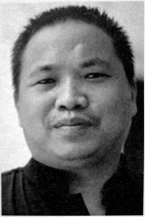
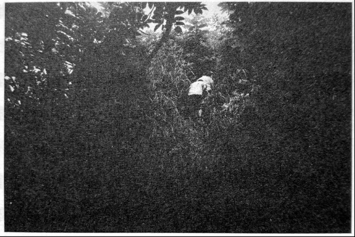
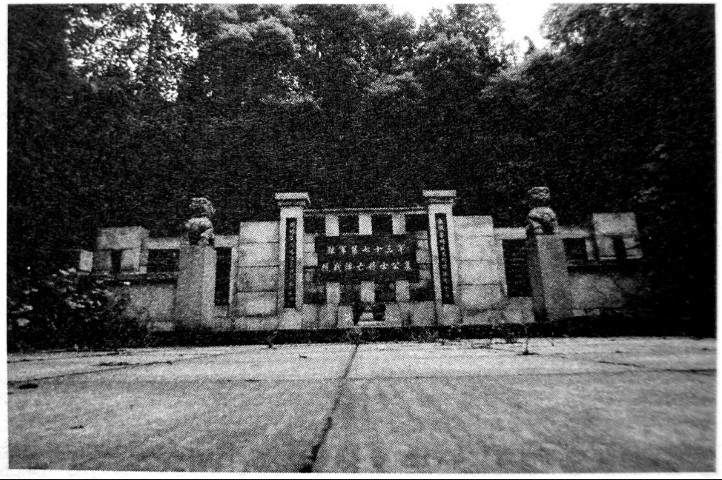
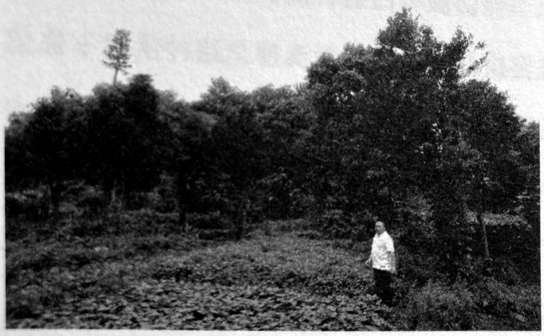
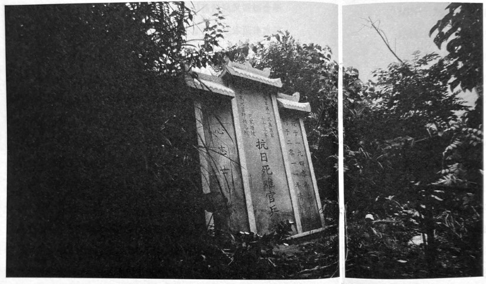
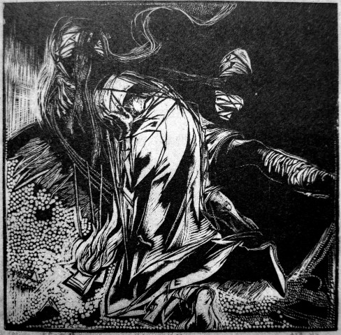
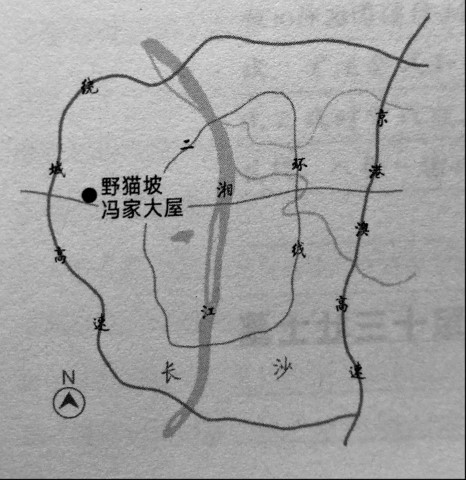

# 野猫坡：一个埋人的故事

_我本想听张景讲当时野战医院是如何救人的，可是我听到的，却是一个埋人的故事。_

_“我们这里把当兵的叫做‘粮子’。从湘北前线退下来受伤的73军‘粮子’，好幸运地没有死在前线，能撤回后方，但到了冯家大屋后方医院，却因为国家太穷，缺医少粮，一个个都拖死了，实在是让我……_

_“我爷爷在世时，每年农历七月半鬼节给老祖宗烧纸钱时，都还会绘那些‘粮子’们也烧一份。经历过那些事的老人，也都会绘那些‘粮子’们烧一份。可惜当时在野战医院帮过忙的老人现在基本上都走了。_

_“我爷爷叫张炳坤，小时候总是抱我坐在他膝盖上，跟一些老爹爹老奶奶们聊天，聊着聊着，就都扯到冯家大屋野战医院的那些‘粮子’。上世纪80年代的时候，他们都还说得出那些‘粮子’的名宇，我后来把他们当时讲的故事都记了下来。也幸亏有一个叫做谭昆山[^1]的抗战老兵，他曾做过73军的作战参谋，副团级军官，他多次来此悼念过，每次都哭得非常伤心，如今走不动了，每逢清明和‘8·15’，还要家人打电话给我问这里的情况。”_

_在一个大热天的中午，刚见到张景时，他骑着一辆城管局为巡查而配发的旧电动摩托车，满头大汗。“我先带你们去天顶公园看看，长沙扩建，2008年这里修楼盘，挖土机挖到很多骨头，都移到天顶公园去了。那里就是个纪念性的陵墓，没什么看头，看完后，我再带你去野猫坡看看。”_

_我坐在张景的摩托车后座上，经过岳麓大道的望安路口时，他开始指着路旁闪过的那些鳞次栉比的高楼，“这里，这里，这里……”就是曾经的野猫坡冯家大屋野战医院旧址所在，现在都埋在高楼大厦底下了。_

_“没有岳麓大道的时候，这里好安静啊，现在已经面目全非了，谁会想到这里以前是偏僻的小丘陵，人烟罕至，杂草丛生，只有孤零零的几座屋．野猫坡，连我们这里很多老人都不晓得这个地名了，但是野猫坡一直都在。我经常来这里走一走，看一看，这个野猫坡，也就是看一看罢了。”_

_“野猫坡也没什么看头。”他说。_

**口述人 /** 张景，1975年生，长沙市岳麓区麓谷一普通城管队员，原长沙市东方红镇延农村人。他生在抗战时曾征用为野战医院的冯家大屋，在冯家大屋长大，是当地抗战史料的热心收集者。冯家大屋征用为野战医院时，张景的爷爷曾在医院帮工。

**采集人 /** 张映科 **采集时间 /** 2015年7月25日

### “来的伤兵几乎都是小病拖重，重的拖死，基本上全死了，死掉了三四百人”

以前长沙麓谷这一片没有马路，只有一条古道，麻石板路。1940年上半年开春以来[^2]，这里走兵不断，在湘北打日本退下来的73军受了伤的一批批的“粮子”，还有医官、医疗设备和油、盐、米等，一船一船地运到麓谷来了。他们从龙王港上岸，十多公里的路，一路上人络绎不绝，扶的扶，走的走，抬的抬担架，挂的拄拐棍，前头的到了这里赶早饭，后头的还在路上。

一路都是毛毛细雨，正是二三月份的时候，那一年的上半年也怪，雨水特别多。73军临时驻扎在这里[^3]，军里绝大部分受伤的就被送到冯家大屋野战医院，这冯家大屋位于原东方红镇延农村和天顶乡永安村的交界处，具体位置应该就是现在荣盛·花语鑫苑楼盘正在修的幼儿园那里。冯家大屋和它东边的这一片都喊做野猫坡，野猫坡的中心位置在现在的中电软件园9号楼附近。野猫坡当时荒凉得很，只有野猫在那里活动。那座大屋占地面积蛮大，有三进，第一进住佃农，第二进住仆人，第三进住家人。清末民初，一个叫做冯八老爷的富商到这里安家落户，打日本的时候，兵荒马乱，又加上他两个儿子都夭折了，就把屋空了，人走了，只留几个佃农帮他守屋，我爷爷就是其中一个。

大屋门前的山背那栋魏氏墓庐屋里驻扎着专门埋人的掩埋班，只有七八个人，本来是些看护兵，野猫坡死人太多了，就专门干埋人的事了。大屋西侧一华里处杨溪冲的龚氏草堂住着卫生班，大概也就这么点人的样子，他们都是些学生和随军志愿者，没有军籍的，也没有工资，有些还是富家千金小姐，她们还用嘴巴去吸伤兵伤口的脓血，我爷爷亲眼看到。医疗班住在东南侧的泉塘李氏大屋，医官的人数也不到十个。那么点人，要照顾四百多伤兵，这点人是完全不够的。

**去往阵亡官兵墓的山路，已茅草丛生。**

**天顶公园，迁葬后的73军阵亡官兵墓。**

在望麓桥附近现在的清水塘中学里，73军还有个野战医院，住的是营级以上的军官，以及在岳麓山炮兵阵地死守不退，被日本鬼子的飞机投燃烧弹烧得乌焦墨黑的炮兵们。清水塘野战医院和当时的省法院在一起，当官的来往得多，医药粮食基本能到位，但还是死掉蛮多人，埋在清水塘中学后面，埋了一个坪。这冯家大屋野战医院，由于交通音讯都不怎么好，情况就更加看不得了。

那些“粮子”以为到了医院就能治好伤，然后再上战场，或者复员回家。哪知一来，除了看到一块一尺来宽，三尺来高上书“野战医院”的牌匾之外，什么东西都没有。没有西药，就靠我们老百姓到山里挖点草药。每天两餐糙米粥，还经常断供。床呢，也没有，就把冯家大屋的谷仓给拆了，拆下来的土砖码成一个格子一个格子，格子里铺点稻草，就当成了床。

刚来的时候那些伤兵精神状态都还好，那些能动的还出来操练，一吹号，周围的老百姓都围过来看。刚来时有些伤兵还能走来走去，过了几天就只能坐起或翻身，再过不了几天，就都动不了了。天天下雨，地面上铺的稻草全部起了潮，洗了的衣服也不得干，那些伤兵又不能动，更不用提翻身了，虱子在他们脸上爬来爬去，像芝麻点点一样。没有西药，医护人员每天过来换换纱布，用井水加点盐洗伤口，把那些臭气洗掉。这种情况下你想想，就是平常人得个感冒都受不了的。

伤兵们整夜整夜地喊“哎哟，哎哟”，声音太凄惨了，本来大屋前的驿道日夜不断人的，可那段时间没有人敢从那里走夜路。周围的老乡看到这种情况，也刚好是农闲时候，那个时候的人良心好，反正闲下来也都闲不住，有些空的就过来白帮忙，用土灰和草药敷伤兵的伤口，趁着天大晴的时候把衣服都洗了拿出来晒，铺满了东边山坡上晒湘粉（湖南特产，又称南粉，以蚕豆、绿豆、豌豆、川豆、四季豆等豆类为原料做成）的木架子。那个时候又经常落雨，老乡们就把冯八老爷家的大甑拿出来，烧起火来蒸衣衫，把虱子蒸死，比起用水洗，衣衫也容易干一些，挂在过道晾两天就能穿了。

可是那些虱子哪那么容易搞干净！

来的伤兵几乎都是小病拖重，重的拖死，饿死的，痛死的，基本上全死了，总共死掉了三四百人，特别轻伤的零星活了几个，还有伤快好了从别的地方转过来暂时住一下的，这些人也活了一些。

当然也有“八字”特别硬的，有个人，一颗子弹笔直打了过来，打在他嘴巴里，嘴巴里全烂了，舌头肿起好大，吊在外面吓死个人，没人敢去动他，当他是死人了。我爷爷于心不忍，就用竹管子插在他嘴巴里，喂他粥，喂了几天，他醒了，自己就用手去抠嘴里，把子弹给抠了出来，活过来了。

**野猫坡，如今已不复过去墓地的样貌。**

**苏家坡，冯家大屋野战医院墓碑，2011年立。**

### “那些伤兵也都晓得自己要死了，向老乡委托屋里的事”

快死和死了的就抬到冯家大屋的磨房里，每天上午和下午，掩埋班的人都会过来。先前还到老乡屋里搞点木板钉些匣子埋人，后来匣子做不赢（方言，指来不及做）了，就把死人的手捆起，用根扦担从手中间穿过去，像吊狗崽子一样把死人吊起，抬到坟山里挖个坑埋了。后来幸亏来了个参谋，看这个样子太不像话，就向上面打了个报告，上面就从码头运来了一些寸把厚的木板，包给当地几个木匠，钉好一副薄木板子就给一块大洋。

可能因为码头离冯家大屋距离远，加上每天死人太多，木匠师傅忙不过来。那个领头的木匠，叫做吴七爹，是个单身汉，就想了个办法，趁着夜里将白天埋下的棺材板子又偷偷摸摸地挖出来，第二天又混到新板子中去凑数，后来被发现了，打了个半死，要不是当地在那里帮白忙的老乡求情，差一点就给枪毙了。

那些伤兵也都晓得自己要死了，就预先把身上的小东西全部送给了在那里帮忙的老乡，向老乡委托屋里的事，托口信啊，请他们帮忙去探望屋里的亲人，等等，主要是一些皮带、水壶和打火机。

每一个大屋的老乡几乎都收到过这样的委托，老乡们也只能诚惶诚恐地点头答应，可是却没有一个人能帮他们完成一件遗愿。主要是老乡们收的委托太多了，又都不识字，就不能做任何笔录和记载，他们从来没有出过远门，到哪里去找人啊？这些事情就全都耽误了下来，直到他们自己临终时都还在忏悔这些事。

我爷爷1982年过世的时候，讲起这些事情，蛮伤心，他有几件委托都没完成，他遗愿未了啊。

他得到了三个打火机和一个水壶，水壶现在还在我屋里，只可惜丢了那三个打火机，其中有一个质量蛮好，看着表面有点黑乎乎的，擦一下，又白又锃亮，里面的弹簧一直没变形，也没起锈。这三个打火机我都放在冯家大屋的老屋里的一个旧木桌的抽屉里面，上世纪90年代拆迁改造，冯家大屋要修小区了，我搬了家，东西全忘记搬了，三个打火机也都丢了。

### “院长金华昆走出来给每一个重伤员磕了一个响头，还烧了一炷香”

1940年七八月份的时候，有一天，太阳快落山了，一个骑马的传令兵来到了这里，急得很，信直接就是从马上甩到地上来的，讲日本鬼子又打过来了，必须马上撤，耽误不得。这冇得办法了，煮饭的铜锅，吃饭的碗盏都可以扔，就扔在了屋前的井里面，但是还有二十多个人伤得太重，抬的人少，带不走，这些重伤员也很难活过来，几个医官在牛栏里开了一个紧急会，野战医院的院长金华昆走出来给每一个重伤员磕了一个响头，还烧了一炷香，“你们已无回天之力，然军令必行！众军们！就请在这安息就义吧！”大概就是这个意思，一再保证抗战胜利后会回来给他们建陵墓之后，就把他们抬进野猫坡的当地村民挖的地窑里，封了土。

第二天，有老乡去那里培士时，还听到窑洞里面喊“哎哟，哎哟”。以后，再也没有人敢从那儿过路了。

除这二十多个人，野猫坡还埋了百把副板子，就在冯家大屋东侧以前中央军做过靶场的一个山坳内，现在在中电软件园九号楼的那个位置，那是苏家塘坡埋满了后埋不下了才埋过来的。抗战一胜利，政府还来过几批人马规划建陵园。我小时候听过大人讲起这个事，可是马上又接着打内战了，忙着打仗，就再也没有人提起这个事，野猫坡就变成了一个荒凉的红土坡，草都不长，生满了荆棘，柴也没有人去那儿砍，一直到2008年。我还记得我小时候，有个别墓穴被野猫打了洞，头骨叼出来了，我们不懂事，就把头骨当足球踢来踢去地玩，大人们看到了，骂我们，又把那些头骨封好土，埋到土里去了。

更西边的苏家塘坡，更加的荒凉，最早死的那一两百个烈士，都埋在那里，因为那里不挡风，也没有人住，位置在冯家大屋西边差不多快有一华里处，即今中电软件园的西侧、明德麓谷学校的西北侧，旺龙路与岳麓大道交汇口北边的旺龙路上及其两边。原先苏家塘坡那里有个小山窝，山窝之间有两口塘，坟墓围着这两口塘，一排排的，埋了一个圈，“大跃进”时那里搞开发，栽树、种茶，所有的封土都推平了，有一个姓段的在那里打地基修屋，还挖出了很多烈士遗骨，装了两大缸子，遗骨上还有弹头、弹片，敲了下来，装了有一麻袋。那个时候工业不发达，废铜烂铁还蛮值钱，酒只有几分钱一斤，五斤废铜可以换一斤酒，他在供销社还兑到了几坛酒。

### “我斗起胆子向外面讲起这个事，社会上才有了反响”

2005年8月份的时候，抗战胜利60周年，我斗起胆子向外面讲起这个事，社会上才有了反响[^4]。当时野猫坡上坟丘一排排，还都是非常清晰的，只是到处生满了荆棘，我加上二十多个志愿者，用了一个星期才砍出道路，坟场的原貌保存得非常好，我们还立了石碑。此后就经常有人来这里祭拜，当地政府部门也组织了几次公祭。

**版刻《无奈的祝福》，卢万学作。**

2008年麓谷搞拆迁开发，烈士遗骸只能进行异地保护，因为野猫坡以前就已经划到了天顶乡，天顶乡政府那边就把烈士遗骸全部都移到了规划中的天顶公园内，还新刻了碑，也有碑文，只是没有落款。苏塘坡这边的工程方找到我，要我想办法把那块鬼子屠杀的十二村民纪念碑[^5]一起迁移，当地政府部门也同意了这个事。我就同一些志愿者在那儿挖遗骸，挖了尺把深，就挖到了。我们尽可能地收集全，将能找到的，都移到旺龙路与岳麓大道交汇口南边与苏塘坡相邻的门山岭上。我自己还花了十多万元在山上修墓庐，也就是一个小小的纪念馆，但不合流程，上面手续办不下来，作为违建拆了，相关部门也如实补了我的损失，只可惜动拆令下得太快了，上山的路和墓坪拜台都没有修好，到处都是草，现在还经常起山火，还好墓冢和碑还在。

相比清水塘，这两个地方保存都还算蛮好了。清水塘死了42个人，当时死的时候都有薄木棺材，埋在清水塘中学后面，埋得也很规范，每人坟头上还有一块木制墓碑，上书番号官阶、出身籍贯、姓名等，都是“陆军七十三军某师某团某营营长某某”，以及“某某军校某期毕业”“长沙会战为国捐躯”，等等。除这些营长外，还有两个旅长，埋在山头上，按照其生前要求，墓正对着南京城，还有碑文，但可惜现在没有人记得了。其实当时本来有规定，营以上军官要将遗骨送到指定地点埋的，估计当时条件不好，说是抗战胜利后再移的，后来也没有移了。到上个世纪80年代，乡里修毛马路时，一条简易公路从那些坟墓上压了过去，现在也仍然有马路从那些坟墓上压了过去。当时又由于有人在旁边打地基建房，泥巴堆了成了一大土丘，两个旅长的坟墓也全给堆了，沧海桑田，这些坟墓现在怕是再也找不到了。我们志愿者也组织了多次祭扫，现在也只能看到一个一丈多宽的大坪。

我们当地人一直想查找出这些烈士们的姓名以及来历，也很想找到他们的后人，想要他们落叶归根，或者叫他们的后人来祭拜一下，于是就找到当时在冯家大屋的一个姓戴的医官头上，他是湖南新化人，当时与我们这里的一个姓彭的妹子偷偷摸摸谈恋爱，那妹子就随军跟着他私奔了，一去就再无音迅。直到上个世纪90年代初，这个戴医官到长沙肿瘤医院来治病，千方百计与我们当地人接上了话，姓彭的妹子也变成了老娭毑（湖南北部方言，[āijiě]指老奶奶）了，她也第一次回娘屋里省了亲。戴医官于是就到了野猫坡冯家大屋原址和苏家塘坡，来做悼念。他还记得哪片墓坑里埋了哪些人，还记得其中二十多个人的名字，可惜当时没有人想到要记下来。

他来野猫坡本来是要祭拜一个叫余排长的人，生前与他关系很好，他记得是第一批埋在野猫坡的，就在前面三五个坟墓里面。可当他到了野猫坡的时候，到处都是荆棘，寸步难行，他又年老体弱，只能算了。他说这这些兵大多是他新化老乡，应该是新化太平铺以及邻近一个水库边上的人，有父子、有兄弟，大多是为粮饷糊口而出来当兵的。他离开的时候，说会发动一些烈士的后人来这里祭扫，可后来不晓得什么原因，一去就是再无音信。后来我找到彭娭毑她娘屋里的侄儿子问情况，只晓得他住在新化太平铺小火车站边上不远，他留下来的电话一个也打不通。

**长沙野猫坡区位图。**

[^1]: 谭昆山，1921年出生于衡阳祁东县，16岁到长沙一所小学任教职。“七七事变”后投笔从戎，先后隶属陆军第90师政训处，74军58师172旅，在74军期间参加南昌会战因作战勇猛，升任该旅343团2营中尉副官，在上高会战中代理第5连连长，并出任敢死队长，在74军中有“谭猛子”之称，战后被廖龄奇旅长推荐，考入黄埔军校成都本校第18期，毕业后不忿廖龄奇被处决而进入73军任作战参谋，参加过长沙会战、常德会战，在常德会战期间受伤退役，在家乡祁东县任祁东自卫区总部中校参谋，率游击队与日军打游击至抗战胜利。

[^2]: 《七十三军抗日战史》（曹湘陵著、长沙市文物局主编，海南出版社 2011年）的作者认为，时间应该是1942年二三月份，第三次长沙会战结束，从湘北退下来的73军在此地整编，军部和77师驻扎在桃花岭，此时军部才配备有野战医院；1942年二三月份，也正是抗战最为艰苦的时候，73军军长彭位仁在株洲视察时，曾发动军人和军属自力更生，种地养菜做手工活，并请医生给家属作讲座，号召去医院照顾伤员；另第三次长沙会战后，岳麓山炮兵阵地炮兵遭受燃烧弹伤害惨重，清水塘野战医院才有很多受伤炮兵。但据采集者调查走访以及张景复述，当地人说到的几乎都能确定时间是第一次长沙会战结束后，1940年二三月左右，故采用此时间。

[^3]: 据张景说，在一份《岳麓区文史》上有记载，当时73军第15师驻扎在天顶乡永安村小龚家湾，第77师在大龚家湾，暂五师驻扎在天顶乡清水塘，但都不是主力作战部队，都是些新编和待编的，整编后就移防了，驻扎时间很短。

[^4]: 有一个叫骆昌国的，是当地民革党员，还有一个人叫雷键敏，是雷锋中学退休校长，还有雨花区原政协主席李炎坤，他们也都非常关注野猫坡的烈士坟墓，并且写了很多文字，也向相关部门反应过情况。

[^5]: 据张景讲述：“第三次长沙会战长沙被围后，有日军在冯家大屋驿道上设卡征夫，有13个村民，只有一张难民证，他们以为是游击队的便衣侦察，就全部抓了关在冯家大屋里。第三天早上日军做饭时，商讨准备枪杀那被俘的13个村民后就撤退。一张姓村民听出其中意思，吃完饭乘其不备，爬入冯家大屋的猪粪池，潜入粪中用一马桶扣在头上。日军捆人时发现少了一个，对关在猪栏的12个人进行询问并开枪警示，枪响引起猪发狂又掉下去几头猪。问不出个所以然，就搜索一番，将那12个人牵到野猫坡西侧的山坡上用机枪射杀了。日军撤走后，我爷爷在猪粪池中打捞小猪仔时才发现张某，已浸泡得奄奄一息了。我爷爷于是灌姜汤、喂米粥，他休养了三天才活了过来。抗战胜利50周年庆典时，当地政府请来了那个死里逃生的张老倌做报告，并树了一个纪念碑。”