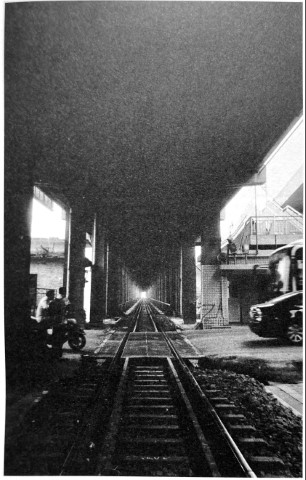
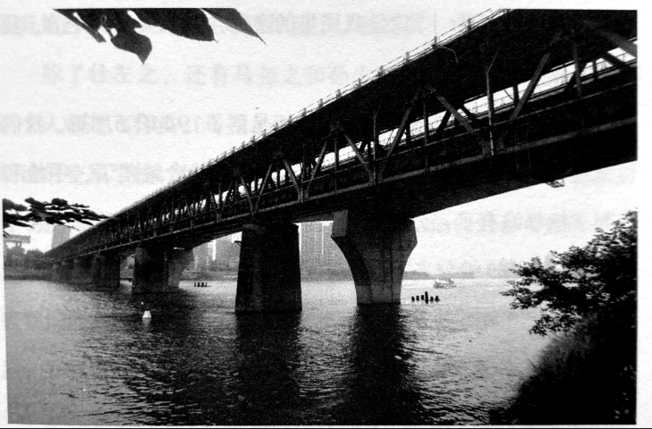
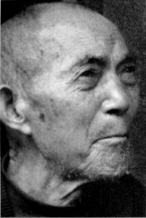
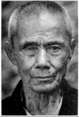

# 铁路桥：南方交通线上的痛点

_衡阳铁路桥[^1]横跨湘江，东岸为粤汉铁路，西岸为湘桂铁路，当时南方最重要的沟通南北和东西的两条铁路在此相交，它就是“肚脐眼”。_

_1944年6月23日，日军猛攻东岸飞机场，为防止日军利用此桥，第四军工兵营陆伯皋中校奉令炸毁此桥，而此桥因资金问题断断续续修了七年，此时通车才刚刚半年。_

_1944年6月24日，以铁路桥西岸据点为中心，衡阳保卫战，第十军以一万八千余人，捐躯七千四百人的代价，对抗十一万日军，至1944年8月8日，致敌死伤七万余人，击毙四万八千人。_

_很难想象，在断桥处阻击日军进攻的那一张张年轻的面孔，他们来自哪里？部队离散后，他们中好不容易活下来的，像蒲公英一样，又飘向哪儿了？_

_曾经蹲在桥头的人，现在，只找到杜学义和马如龙。他们所蹲守的断桥，13年后迎来了重生，原来被炸掉的桥墩得以修复，并扩修成公铁大桥，这是我国第二座公路铁路双用大桥，铁路桥亦改称湘公铁大桥[^2]。2012年初，又扩修成衡州大道湘江大桥，全长2.62公里，其中跨越湘江的主桥493米。_

**2015年7月9日，衡阳铁路桥下，70年前发生在这里的战事已少有人知。**

**2009年重建的衡州大道跨湘江大桥。原位置抗战时期曾为衡阳铁路桥，1944年被炸受，1957年重修为衡湘公铁大桥。**

**口述人 /** 杜学义，1925年农历十月十三日生，武冈县邓家铺镇杨木村人，1975年因居住地建水库，移居邓家铺镇黄塘村。1944年农历正月初八入伍，属国民革命军第四军暂54师直属特务连。参加过衡阳保卫战和湘西会战。湖南和平解放后回家务农，农余也兼做点木工活。现在仍然住在上世纪70年代修建的老旧木房中，衣食也简朴得有些寒酸，但身体健康。

**采集人 /** 张映科 **采集时间 /** 2015年7月9日

### “我们族里12个姓杜的，就回来了我一个”

我现在一餐还能吃个三四两酒，可是我太老了，都老糊涂了，前几天我去镇上，在路边店子里坐了好一会儿，才想起了我的屋在哪里。可有个地方我一直记得的，在衡阳，那个铁路桥，我们跟日本人对着杀，一说起这个地方，我现在都好像还听到子弹在飞，发出的“啾啾啾”的声音，在我耳边响成了一片。

带我去衡阳的是我满满（湘西南方言，指小叔，或者泛指叔权）。他叫杜鸿基[^3]，比我大38岁，北伐就在蒋介石身边当侍卫，一直管警卫团，重庆中央派他到衡阳指挥打仗[^4]。过年的时候，他回来看他的老父亲，顺便就把我带到部队去了。

我是民国三十三年（1944）农历正月初八去的衡阳，中学毕了业还只一个月[^5]。我屋里有四弟兄，我晓得我要去当兵，在读书时就天天练力气，我满满家里有枪、棍、斧头和长刀，我经常拿那些东西玩。我力气蛮大，红砖半边搁在门槛上，我用力一拍，就能打断；一块大石头，别个后生满身是汗地抱起，我抛起有屋那么高，还能用手接住。有次我用手指插我一个婶娘屋里的土夯墙，蛮硬的，别个奈不何，我一插进去就是五个洞，我那个婶娘看见了，拿着根竹枝，赶得我满院子飞。

我晓得练力气没有蛮大的名堂，可练了总归还是好一点。为什么没有蛮大的用呢？因为去当兵，练不练反正都是要死的。在我们这里，经常听到这个或者那个屋里的人讲，他屋里的崽，去当兵打仗打死了，总之，就是没有听到有活着当兵回来的。我们族里12个姓杜的，就回来了我一个，我屋隔壁杜正解家里学文、学武、学富三弟兄，一个都没回来。当了兵，就是这种味，吃了早饭，就不要再去想吃中饭，我也就当自己以后再也回不来了。

我也不是蛮怕死，我有后的，一个崽，去当兵的时候他有一岁多了。我结婚早，13岁结的婚，我婆娘比我大七岁，她最照顾我了，我爹娘没钱，读高中的学费都是她到她娘屋里讨来的，我去当兵，她也没有讲蛮多乱七八糟的话。

我舍不得的是我的学业，我成绩是班上前几名，不管什么书，我读一遍内容都记得。看薛仁贵、薛丁山的戏，他们一出场，我因为读过他们的书，就晓得他们以后的事，就忍不住眼泪水。打江山的，没一个有好下场，北宋的狄青，南宋的岳飞，还有我满满，我晓得这个道理。

我下场还好，解放后没有遭过罪，现在过的日子也蛮好。就我当兵那个时候，人都不当做自己是个人。我记得以前有三个逃兵，过我们邓家铺，被过路部队捉到了，推到田坎下面，挖田坎上面的土，就这样理，人都还是活的，在那土里面拱，拱了好久才不拱了。

### “我大哥是个木匠，我帮他弹过墨线，开枪就用这个方法”

我去部队后倒没受过什么苦，因为是我满满带我去部队的，别个发的是两件烂完了的打着补丁的旧咔叽布单衣，我拿的是新衣服。吃呢我跟着满满在师部里吃，我饭量大，有两三个后生惠的饭量，师部里那些军官他们吃好的，吃不完剩下的就全给我吃了。酒一餐我能喝五斤，我满满出公差，经常带着我，别人把他碗里倒满酒，我就帮他喝，趁人不注意，就换了碗盏，把碗端起，“咕嘟”一口就喝了。

军训也没吃过很多苦，只搞了没多久，我就过关了，以前在学校里每天都要练操，正步走齐步走我熟，我读过书，别人讲什么要我做什么，我一听就懂。新兵枪法比赛，我从没摸过枪呢，我大哥是个木匠，我帮他弹过墨线，开枪的时候，我就用这个方法，枪尖尖靠到靶子，扯成一根线，我心里念叨着“靠到靠到”，一扣板机，报靶的就喊 “中了中了”。我打了五发，中了四发，成绩是一个优，老兵都没有这个成绩，军训完后我就被评为上士了。

我被分到第四军的暂54师直屈特务连，师长是饶少伟，副师长尹立言，我满满在暂54师是参谋官，他是蒋介石派到第四军的钦差大臣，见官大三级，是直接指挥打仗的。我们连驻防在湘江东岸的飞机坪[^6]，专门负责放哨和守卫。我们师部也在那里，那个时候炮弹飞了来，飞了去，就是不打我，我旁边人都出事了我都没事，几次都是这样，我满满就笑我：“炮子都不打你，你就是个打不死的程咬金。”

他勤务兵都不带，专门把我带在身边，我还管着师部里的钱，当时我两边裤腰上别着两把木壳子枪，都是25发子弹的，左边胸兜上还插了一把手枪，两边开弓，都能百发百中。有其他的将官见了，就跟我满满讲：“你这个兵，送给我做勤务兵算了。”我满满就讲：“这是我屋里的亲侄儿，我要带着走的，我要靠他保命呢。”

我跟着我满满，日子过得好，但是到了1944年6月初，我们特务连调到衡阳城内[^7]，我又回到了连队，伙食就差了，手枪和木壳子枪都没有了，分了一把美国造的步枪给我。6月二十几号的样子，我们连被分去守铁路桥，还没两日，日本人就来了。[^8]

### “我在桥头一直开枪，死人越堆越多，把我活埋了”
来的是人山人海，有些是飞机运来的，一飞机能运五十多个人，[^9]有些是坐卡车过来，一车大概有二三十个人吧，一下车就往我们阵地这边涌了过来。

我们这边的人也都涌了过去，大家都尖起喉咙喊杀啊杀啊。两边的人都搅合在一起，飞机和大炮都不敢开火，怕误伤了自己人，我看到对面的日本人，就像风过草地一样，一排排的，呼啦啦全部都倒了。我枪法好，我就单腿跪地射击，子弹在我耳朵边“啾啾啾”飞个不停，我什么事都不想，就想着多杀一个算一个。我就一直开枪，我身边死的人越来越多，都堆起来了，越堆越高，我就被死人堆了，我扣了好久的扳机，虚了力，翻不出来了，我被活埋了。

后来我们这边的人打扫战场，我被人翻出来全身被血湿透了，一身的红，那都是别人的血，我身上一个伤都没有，我真是个打不死的程咬金。那次守铁路桥，连里一个叫杜左之的排长，刚开始打仗没多久就被炸弹炸死了，他跟我一个族上的人。

除了杜左之，还有马尧之和孙少尉，也都是我认得的，这两个人都是飞行员。马尧之也是我们这个地方的人，是我满满资助读的空军学校，他跟我满满还是远房亲威。这两个人都是我在守飞机坪的时候认识的，我们在地下对杀，他们开着飞机就在天上跟日本人的飞机对杀，经常有飞机被打了下来，有他们的，也有我们的，打到后来，我们的飞机慢慢地就来得少了。日本投降后，我再也没得到那两个人的讯息，那肯定就是死了。

铁路桥被炸后[^10]，又被调到花药寺[^11]，也守过其他地方，都不记得了。衡阳失守后，我们特务连逃出来的只有一二十个人。在道县重新整编，我们师只有一千五百来人，又在那里重新征兵，编起了三千来人，移到洞口石板塘，驻扎过一段时间。日本人打了衡阳后，一直在后面赶着我们，我们就把他们引到包围圈里面来，在武冈县荆竹铺赖皮岭[^12]，又过来了另外两个师[^13]，把他们堵住了。我们在两边坳上（方言，指山头）[^14]挖了壕沟，架起机枪，那个时候我满满还没有当师长，还是尹立言，尹立言是我们武冈的人[^15]，他讲：“这些日本鬼子就是当初在衡阳打我们的人，这次还敢打到我屋里来，我要把他们全部搞死。”日本人打到赖皮岭的时候，没有飞机，也没有火了（湘西南方言，指没有火力没有弹药），冲了几次坳上又冲不上，就只能双手举起空枪拜在地上投降，我们只管往下开机枪，投降的也把他们打死了。这次打仗不惊险，没有什么讲头。

**口述人 /** 马如龙，1924年农历五月二十三日生，原名马兴龙，重庆铜梁县人，孤儿，16岁被抓壮丁入伍，后被整编到第十军预10师第33团1营2连当理发兵。衡阳保卫战时，守过铁路桥和张家山阵地，三次负伤。退伍后居郴州市临武县万水乡上横村7组。1960年左右，马如龙与当地的一位寡妇成亲，将三位继子女视如己出。后来马如龙也有了自己的三个儿女，都孝顺。

**采集人 /** 张映科 **采集时间 /** 2012年7月2日

### “从战俘营逃出来后，我一直帮人剃头”

我是第十军预10师第3团1营2连的一个理发兵[^16]，我们部队负责守衡阳城里的铁路桥。在端午节接的火，老蒋下了命令，要死守衡阳，打了20多天，就对杀，整个军死到都没有一个团的人了，所有理发的、烧火做饭的不打仗的兵也都要上战场，我也就上了战场。第一次是在衡阳城里的铁路桥，碰到一个鬼子兵，我们拼刺刀，他伤了我的右腿，现在膝盖骨这个地方还有点点印子，我也没让他占到便宜，一枪扎了他的大腿。我休息了三天。

我第二次受伤是左边屁股，子弹卡在那个骨头里，开刀取的，现在还有个洞，那次我伤得蛮重，休息了一个礼拜。

第三次受伤是在张家山[^17]，仗已经打了30多天了，一个子弹从我的侧面贴着我的脸飞了过来，穿过了我的右眼眶，把我右眼打坏了，坏了眼睛后我就一直待在伤兵医院，没有再上火线了。

我伤一次比一次严重，可现在让我烦的是第一次。我腿脚还没好全我就又去打仗了，打了48天仗（实为47天），我也没有好好睡过。右腿落了疾，现在就有蛮重的风湿，痛得很，拄棍子都走不动。

人打光了，上头就要我们投降，日本人缴了我们的械，把我关在战俘营[^18]。日本人把我们的枪栓卸下，就让我们背个空枪筒筒。我呢因为眼睛坏了，就把我调到跟一个江西籍的兵在一起，跟他搭脚，负责挑水、烧火、煮饭、送饭。在战俘营停了一个礼拜。有一天半夜，我就跟那个江西的兵逃了出来，从衡阳逃到白凤（耒阳市永济镇白凤村，耒河岸边），没钱过河，我们两个人就拜在撑船的人面前，跟他讲我们是从日本人那里逃出来的，要回家，他看见我们穿着队伍上的衣服，就说：“要得，我帮你们撑过去。”

过了河我们就分开了，我一直往南边走，到了常宁县桐梓坪，跟山里的一个老百姓讨饭吃。我跟他讲，我一个孤儿，在重庆铜梁县城当徒弟学理发，16岁就被抓了壮丁，分到第二军。走到云南，要被卖兵卖到印度去，他们嫌我年龄小，连里就留了我，从云南、贵州、广西又一路走回来，又被搞到第十军，到衡阳打仗，讲起这些事我就哭，边吃饭边哭。

那个老乡就说：“你到我家里做事，跟我一起看牛，割草。”我呢就在他家里停了半年，从农历七月份开始，还在他家里过了个年。过完年后我就跟那个老乡说：“叔权，我要回家。”他就说：“你回去，身上又没有钱。”没有钱，我就跟一个挑豆油的走，我帮他挑豆油，走了三天，到了蓝山。

然后我又到林里村（属临武县万水乡）找了个老师傅学理发，我以前不会用剪刀，只会用剃刀剃光头。后来，我就在蓝山县新圩镇下清涵、龙家坊一带，帮那老师傅做了一年，一年只两百担谷子，我就不肯做了，就跟他讲：“唐哥哥哎，我要回去了，我不做了。”他不准我走。林里山下有一个老人家人蛮好，帮我讨工钱，那老板才又给了我两百斤谷子。

结清账了我就走了，到万水乡黄祖江，我又帮一个老师傅做了一年，一年是四百担谷子，在蓝山县新圩镇下清涵、楼下这两个地方帮人剃头。我就在蓝山睡，剃完那两三百个头，我才回黄祖江我老师傅屋里睡。第二年，1946年，我就搬到万水乡上横村，自己给自己做，在下横、上横，剃两百多个人的头，我就在这里落脚了。[^19]

1963年我回过铜梁，经过衡阳时，我还到铁路桥那里看了一下，铁路桥又有了。我回了铜梁，两个姐姐早嫁人了，我们相互也都不认得，我以后就再也没有回过铜梁。

[^1]: 衡阳铁路桥1937年动工，翌年10月仅建好数个桥墩，就因资金不足停工。后由于要联通粤汉、湘桂两铁路，在其上游380米处修建便桥，但屡遭洪水，交通经常中断，最长的一次达五个月之久，又屡毁屡建。1942年12月又决定续修正桥，翌年8月开工，设计为公铁两用桥，但铁路和公路位于同一桥面。建桥本需60.2米的下承华伦式钢梁七孔，后由于广州被日军攻陷，只运到六孔，其余一孔滞留香港。只得修建成为一八孔桥，长427米，两岸均有公路引桥，总共耗资法币166.62万元，并于1943年底竣工，翌年元旦通车。

[^2]: 衡湘公铁大桥1957年12月30日举行通车典礼。本桥下层铁路桥全长426.97米，上层公路桥全长643.15米。桥梁由7孔60.5米的下承桁梁组成，其中第1、2及第3、4孔为两跨连续梁，第5至7孔为三跨连续梁。下层为单线湘桂铁路，右侧有人行道。上层宽10米，有两车道公路，公路宽7米，两侧均有1.5米宽的人行道，两侧有引桥，东岸引桥长130.91米，西岸引桥长85.27米。共计浇筑混凝土5176立方米，安装钢梁2048吨，总投资510.1万元人民币。公铁大桥建成后，拆除便桥，如今在枯水季节仍能看到便桥桥墩。

[^3]: 杜鸿基，武冈县邓家铺镇杨木村人，1887年生，保定军校第四期步兵科第九连毕业，其余不详。对1949年后的杜鸿基，杜学义也有口述：“1949年4月，湖南和平解放，我满满倾向于和平，他就把部队解散了，带着我回老家务农。他是个大善人，对谁都很和善，一口笑，讲道理，哪个屋里没钱吃饭了他就资助，解放后也过了几年好日子。到1953年，“土改”复查，我们村里下来了一个工作队，查到村上一个叫杜学章的，他以前当过土匪，后来又当过国民党的兵，晓得我满满的底细，就跟工作队的人讲：“搞我不应该，我们这里有大鱼（湘西南方言，指大角色）还没砍。’本来以前打仗都是过去的事，解放后都不追究了，他脱不开身，又讲起我满满以前曾枪毙过两个勤务兵，我一直在我满满身边，我还不晓得，完全没有这个事，完全是信口开河，但工作队的人还是把他打了，那是1953年农历正月初六。他以前有个大老婆，早就死了，大老婆有两个崽，跟日本人打仗也都打死了，又娶了个小老婆，叫莫祖秀，1953年时还只32岁，日子过不下去了，就带着我满满的两个嫩崽改嫁给她一个烧木炭的堂表哥，去了绥宁县长铺子镇茶山坳李家塘。这两个崽后来又给我满满生了两个孙，都考上了清华，一个还在中央直属部委管财政，做很高的官。”

[^4]: 第四次长沙会战中，第四军仅守一天就败退衡阳，蒋介石对第四军的指挥系统很不满，特派“身边人”杜鸿基到暂54师当作战参谋，湘西会战胜利后，杜鸿基又接任暂54师师长。

[^5]: 民国时期的教育，入学时间有春季班和秋季班，杜学义读的是春季班，在放寒假前毕业。

[^6]: 暂54师虽然被第十军方先觉调配守卫衡阳，但第九战区司令长官薛岳并不愿暂54师此时投入衡阳战场，师长饶少伟追随薛岳，在此两难之境，只得将暂54师师本部以及所属第1团留在衡阳，负责湘江东岸以及飞机场的守卫。1944年6月23日，日军开始猛攻湘江东岸各地，第1团不支，饶少伟决定由第1团团长陈朝章带领所属第2、第3两个营撤离衡阳，自带师直部队和第1团第1营共一千余人留守飞机场。

[^7]: 杜学义记忆有偏差，据《长沙·常德·衡阳血战亲历记——国民党将领葛先才将军抗战回忆录》（葛先才著、李祖鹏编，团结出版社 2007年）及萧培研究两书记载，不是6月初，应是6月25日。此日黄昏，日军猛攻衡阳机场，交战不久唯一能够接受空军补给的衡阳机场被日军独立第64大队占领。饶少伟带着所属残部退守衡阳。

[^8]: 据《长沙·常德·衡阳血战亲历记——国民党将领葛先才将军抗战回忆录》，6月27日拂晓，敌两个师团，附属野战炮兵第122联队，共计山野炮六十余门，猛攻西岸阵地，置重点于城南。

[^9]: 日军用飞机运兵，此处口述无处考证。

[^10]: 衡阳保卫战爆发之前，衡阳守军将两节装满炸药的火车车厢推至大桥中央引爆，炸毁大桥。2009年12月1日，在修建衡州大道跨湘江大桥时，此火车货车车体一节车厢被施工队在江中打捞出，已锈迹斑斑。

[^11]: 花药寺位于现衡阳市岳屏公园的西南面，始建于南宋景祐五年（1257），当时名为报恩光孝禅寺。该寺后殿毁于日军战火，幸存的前殿1966年7月毁于“文革”，后被拆除建衡阳展览馆。

[^12]: 1945年5月12日清晨，第94军121师攻击驻扎在洞口县高沙镇的日军116师团109联队，至午后4时，毙敌500余名。日军残部3000余人向东逃窜至洞口县高沙镇冷水桥、马鞍石、明月寨、峰形寨、仙人桥等地，沿途烧杀抢掠。第94军第5师、121师各一部紧紧追击，敌多次欲渡廖湄河而不逞。战至13日晨，中国军在峰形寨毙敌300余人，余敌夺路关家桥（三元桥）、鲤鱼渡，部分逃窜至荆竹铺、茶铺子、大塘等地又遭中国军截击，部分强渡廖湄河，部分躲藏于当地山中。1945年5月26日，一股日军败兵50多人，遭遇驻守回马山的121师一部和驻守赖皮岭的第四军暂54师一部，被全歼。

[^13]: 指第94军第121师和第5师。第121师是黔军，军官多为黔籍黄埔军校毕业生，士兵也多为贵州人，湘西会战前驻守于湘黔边境。第5师驻地和番号均变换很大，士兵多来自四川，湘西会战前由湖北开往贵州镇远。两师均在贵州改换美械装备后投入湘西会战南线战场。

[^14]: 回马山是一坐孤山，临靠资水的支流，与马鞍山隔江相望，与赖皮岭东、西相夹，两山中间是低矮谷底，便于围歼作战。

[^15]: 部队驻地洞口县毓兰镇石板塘，离尹立言老家毓兰镇石大托村很近，洞口县直到1951年才由武冈县分拆出来，故杜学义说尹立言是“我们武冈的人”。尹立言（1906年~1994年），黄埔军校中央军校高等教育班第二期毕业，曾留学于日本陆军步兵学校和日本明治大学政治经济系。后定居台湾，并在台湾牵头成立“洪门会”，是台湾黑社会的创始人之一。蒋经国上台后封他为陆军上将，后患脑溢血病故于台北。

[^16]: 马如龙说他的番号为第3团应有误，当时驻守衡阳的没有第3团。与此说法最为接近的为预备第10师第33团，他还说到曾在张家山负伤，而驻守过张家山的，只有第33团。

[^17]: 张家山阵地，是衡阳保卫战战事最为惨烈的地点之一。据《葛先才将军抗战回忆录》记载：张家山阵地，高出地平面约六十余公尺，位于火车西站背后，为全师阵地之中央突出点，乃30团团长陈德坒上校守备区。有两次夜间，伸手不见五指，敌人冲上张家山。我官兵无一后退者，敌我混杂其间，彼此惟恐暴露位置，不敢弄出一点音响，敌我皆用手摸，穿棉布军衣者为自己人，穿卡其布军衣者为敌人，是敌人则以刺刀刺杀，一阵阵枪枝碰击声，乒乒乓乓通宵达旦，惨叫声时有所闻。敌之后续部队被我左右翼猛烈交叉火网，及密集迫击炮炮弹封阻，不能进入缺口。而我增援部队，因天暗分不出敌我，亦停止于半山之间。俟天将拂晓，微有阳光时，才冲上山头，将敌人悉数歼灭。在总计十余次拉锯战中，敌我伤亡共计约七千人。一个月之后，该地工事被敌炮火全毁，遍地集尸，增加了山之高度。腐尸臭气熏天难忍，乃令陈团长放弃，改守后面高地。

[^18]: 实为运输队。据《葛先才将军抗战回忆录》，衡阳保卫战后，日军将放下武器的第十军官兵三百余人编组为一个运输大队，为其运送物资。

[^19]: 1949年后的事情，马如龙亦有口述：“快到1960年的时候，镇南乡到上横搞清查工作的人，把我捉到镇南乡马上村，关了两日，我碰到县里下来了一个干部，他叫黄泽通，是镇南乡茶山村的人，他问我：‘师傅，你是哪个抓来的？’我说是徐中，工作队的徐中把我捉来的，说我是‘远路人’（外乡人），要查我底细。黄泽通就讲：‘回去，哪个说的？’我就回去了。后来又因为我是‘远路人’，我又被捉到县里，关了29天，临武县城的城墙，还有那个大前门，就是我在被关的时候担的土，是我一担一担担出来的。从县里回来后，我就再也没有事了，我就同他（继子黄井富）的母亲结了婚，那个时候我已经三十六七了。”