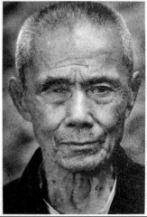

# 铁路桥：南方交通线上的痛点

**口述人 /** 马如龙，1924年农历五月二十三日生，原名马兴龙，重庆铜梁县人，孤儿，16岁被抓壮丁入伍，后被整编到第十军预10师第33团1营2连当理发兵。衡阳保卫战时，守过铁路桥和张家山阵地，三次负伤。退伍后居郴州市临武县万水乡上横村7组。1960年左右，马如龙与当地的一位寡妇成亲，将三位继子女视如己出。后来马如龙也有了自己的三个儿女，都孝顺。

**采集人 /** 张映科 **采集时间 /** 2012年7月2日

### “从战俘营逃出来后，我一直帮人剃头”

我是第十军预10师第3团1营2连的一个理发兵[^16]，我们部队负责守衡阳城里的铁路桥。在端午节接的火，老蒋下了命令，要死守衡阳，打了20多天，就对杀，整个军死到都没有一个团的人了，所有理发的、烧火做饭的不打仗的兵也都要上战场，我也就上了战场。第一次是在衡阳城里的铁路桥，碰到一个鬼子兵，我们拼刺刀，他伤了我的右腿，现在膝盖骨这个地方还有点点印子，我也没让他占到便宜，一枪扎了他的大腿。我休息了三天。

我第二次受伤是左边屁股，子弹卡在那个骨头里，开刀取的，现在还有个洞，那次我伤得蛮重，休息了一个礼拜。

第三次受伤是在张家山[^17]，仗已经打了30多天了，一个子弹从我的侧面贴着我的脸飞了过来，穿过了我的右眼眶，把我右眼打坏了，坏了眼睛后我就一直待在伤兵医院，没有再上火线了。

我伤一次比一次严重，可现在让我烦的是第一次。我腿脚还没好全我就又去打仗了，打了48天仗（实为47天），我也没有好好睡过。右腿落了疾，现在就有蛮重的风湿，痛得很，拄棍子都走不动。

人打光了，上头就要我们投降，日本人缴了我们的械，把我关在战俘营[^18]。日本人把我们的枪栓卸下，就让我们背个空枪筒筒。我呢因为眼睛坏了，就把我调到跟一个江西籍的兵在一起，跟他搭脚，负责挑水、烧火、煮饭、送饭。在战俘营停了一个礼拜。有一天半夜，我就跟那个江西的兵逃了出来，从衡阳逃到白凤（耒阳市永济镇白凤村，耒河岸边），没钱过河，我们两个人就拜在撑船的人面前，跟他讲我们是从日本人那里逃出来的，要回家，他看见我们穿着队伍上的衣服，就说：“要得，我帮你们撑过去。”

过了河我们就分开了，我一直往南边走，到了常宁县桐梓坪，跟山里的一个老百姓讨饭吃。我跟他讲，我一个孤儿，在重庆铜梁县城当徒弟学理发，16岁就被抓了壮丁，分到第二军。走到云南，要被卖兵卖到印度去，他们嫌我年龄小，连里就留了我，从云南、贵州、广西又一路走回来，又被搞到第十军，到衡阳打仗，讲起这些事我就哭，边吃饭边哭。

那个老乡就说：“你到我家里做事，跟我一起看牛，割草。”我呢就在他家里停了半年，从农历七月份开始，还在他家里过了个年。过完年后我就跟那个老乡说：“叔权，我要回家。”他就说：“你回去，身上又没有钱。”没有钱，我就跟一个挑豆油的走，我帮他挑豆油，走了三天，到了蓝山。

然后我又到林里村（属临武县万水乡）找了个老师傅学理发，我以前不会用剪刀，只会用剃刀剃光头。后来，我就在蓝山县新圩镇下清涵、龙家坊一带，帮那老师傅做了一年，一年只两百担谷子，我就不肯做了，就跟他讲：“唐哥哥哎，我要回去了，我不做了。”他不准我走。林里山下有一个老人家人蛮好，帮我讨工钱，那老板才又给了我两百斤谷子。

结清账了我就走了，到万水乡黄祖江，我又帮一个老师傅做了一年，一年是四百担谷子，在蓝山县新圩镇下清涵、楼下这两个地方帮人剃头。我就在蓝山睡，剃完那两三百个头，我才回黄祖江我老师傅屋里睡。第二年，1946年，我就搬到万水乡上横村，自己给自己做，在下横、上横，剃两百多个人的头，我就在这里落脚了。[^19]

1963年我回过铜梁，经过衡阳时，我还到铁路桥那里看了一下，铁路桥又有了。我回了铜梁，两个姐姐早嫁人了，我们相互也都不认得，我以后就再也没有回过铜梁。

[^16]: 马如龙说他的番号为第3团应有误，当时驻守衡阳的没有第3团。与此说法最为接近的为预备第10师第33团，他还说到曾在张家山负伤，而驻守过张家山的，只有第33团。

[^17]: 张家山阵地，是衡阳保卫战战事最为惨烈的地点之一。据《葛先才将军抗战回忆录》记载：张家山阵地，高出地平面约六十余公尺，位于火车西站背后，为全师阵地之中央突出点，乃30团团长陈德坒上校守备区。有两次夜间，伸手不见五指，敌人冲上张家山。我官兵无一后退者，敌我混杂其间，彼此惟恐暴露位置，不敢弄出一点音响，敌我皆用手摸，穿棉布军衣者为自己人，穿卡其布军衣者为敌人，是敌人则以刺刀刺杀，一阵阵枪枝碰击声，乒乒乓乓通宵达旦，惨叫声时有所闻。敌之后续部队被我左右翼猛烈交叉火网，及密集迫击炮炮弹封阻，不能进入缺口。而我增援部队，因天暗分不出敌我，亦停止于半山之间。俟天将拂晓，微有阳光时，才冲上山头，将敌人悉数歼灭。在总计十余次拉锯战中，敌我伤亡共计约七千人。一个月之后，该地工事被敌炮火全毁，遍地集尸，增加了山之高度。腐尸臭气熏天难忍，乃令陈团长放弃，改守后面高地。

[^18]: 实为运输队。据《葛先才将军抗战回忆录》，衡阳保卫战后，日军将放下武器的第十军官兵三百余人编组为一个运输大队，为其运送物资。

[^19]: 1949年后的事情，马如龙亦有口述：“快到1960年的时候，镇南乡到上横搞清查工作的人，把我捉到镇南乡马上村，关了两日，我碰到县里下来了一个干部，他叫黄泽通，是镇南乡茶山村的人，他问我：‘师傅，你是哪个抓来的？’我说是徐中，工作队的徐中把我捉来的，说我是‘远路人’（外乡人），要查我底细。黄泽通就讲：‘回去，哪个说的？’我就回去了。后来又因为我是‘远路人’，我又被捉到县里，关了29天，临武县城的城墙，还有那个大前门，就是我在被关的时候担的土，是我一担一担担出来的。从县里回来后，我就再也没有事了，我就同他（继子黄井富）的母亲结了婚，那个时候我已经三十六七了。”