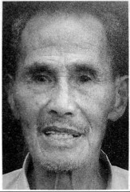
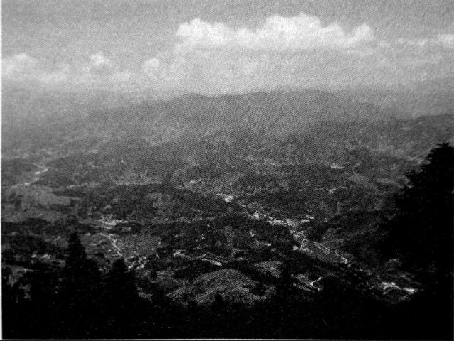
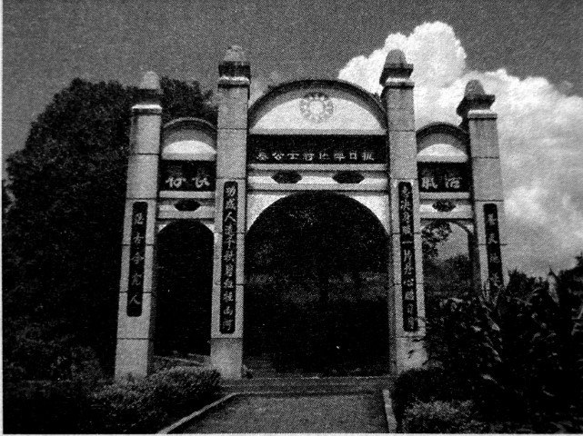
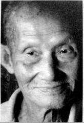
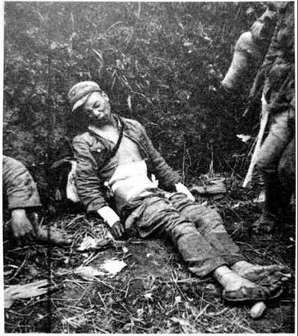

# 龙潭：最后的战场

_溆浦县龙潭镇，是抗日战场中的最后一地。1945年4月18日，109联队第一大队饭岛挺进队1000余人在英雄山[^1]，与国民革命军74军接火，打响了龙潭战役。4月22日，109联队本部，加上炮兵、特种部队约5000人占领木敖洞[^2]，同时，湘西会战中其它各路日军，无论掉头东进、北上、西进，都将龙潭做为其进攻目的地，其作战意图，都是为了会师于龙潭，再以龙潭为跳板，图谋芷江。在太平洋战场上失利的日军，至此开始孤注一掷。_

_74军51师，100军19师和63师在此拼死抵抗，日军撤离大小黄沙时，被歼3000余人，撤离马颈骨时，又被歼2000余人。_

_龙潭战场至今也是国内面积最大的战场遗址地[^3]。其地为雪峰山西麓，是沅水和资水的分水岭，如果把雪峰山比喻成一条巨龙，龙潭战场遗址就位于这条龙的腹部．雪峰山在这里变厚，也变得更高，其中蜡烛岭海拔1000米、红岩岭海拔1363米，遗址所在地的山峰，海拔很多接近或者超过一千米。这里云雾缭绕，松树茂密，灌木丛生，你有多赞美这大自然的美不胜收，当初翻越这些山岭的日军也就有多恐惧这里的寸步难行。_

**口述人 /** 张传成，张传美，张富堂，均为溆浦县龙潭镇大华乡小黄村第一组村民，龙潭战役时分别为16岁、13岁、6岁。张氏三兄弟住在英雄山脚下，口述以张传成为主，张传美、张富堂为辅，张富堂是当地退休民办教师，一直致力于当地抗战史料搜集，整理有《抗战最后一枪——英雄山决战》的小册子。

**采集人 /** 张映科 **采集时间 /** 2015年8月5日

### “两边人马隔得特别近，估计都没有一百米”

民国三十四年（1945）三月初六，早晨六点钟的样子，日本鬼子打来了。

来的是他们的先遣队，叫饭岛挺进队，有千把人，经过隆回白马山、麻塘山，过油溪坪，就到了这里。都是高头大马一个个的，这个先头部队是精选的人，不是后来的娃娃兵可以比的。他们由隆回小沙江过来的汉奸[^4]带路，第一天来，就上了英雄山。日本人好狡猾的，摆了个架势，都以为他们要去打桥江机场[^5]，把中央军都引到北边桥江那边去了，其实呢，他们的目标是大小黄沙。他们为什么要到这里集合呢？是因为我们这里的地理位置很好，往东北方向，翻过山就到了隆回，小沙江、司门前；往东方向，翻过山就就到了洞口的山门；往南，是洪江和洞口的江口；往西边走，过活水、铁托，就到了怀化。鬼子一到怀化，芷江就没救了。

还好，地方上报了信，中央军连夜就调兵回来了，在这里把日本人堵住了，只迟来了几个钟头。晚上十点多就在我们小黄沙布防，是74军51师的153团，团长叫王梦庚，团指挥部设在我们院子（当地方言，指自然村）后面竹山山脚下的张家祠堂里，两座山的直线距离差不多只有四百米，机枪都能互相打得到的，中间只隔了个小溪。中央军一到这里，第二天早上7点钟左右，153团第七机枪连文成海的部队，就跟敌人接上了火。

竹山和英雄山都是山窝窝里面的平地陡山，一个海拔740米左右，一个海拔763米。日本人只占着英雄山的主岭，山顶上有个岩屋（当地方言，指岩洞），叫做豹子岩屋，里面七拐八拐的，有几层通道，能住一两百个人，日本人躲在岩屋里，把它作为指挥部，相当难攻。

我原来帮地主屋里放牛的，屋里穷，买不起难民证出外逃难，只能躲在屋里，打仗的时候我也去了部队里帮忙。我参加了搬运组，专门给守军送饭送水送弹药，有空还帮挖战壕。还有后勤组，他们就在张家祠堂的团指挥部里做伙食，听他们说在那里碰到过周志道[^6]师长，王耀武军长也来住过两日，他住的房间现在还在，只可惜我当时不认得他们。

交接组是最危险的，我们死了两个传奇人物，都是前后两任交接组的组长：一个是袁杆子，5月4日，受了重伤抬往湾潭医疗站，刚抬到文昌阁路上时，突然从英雄山打来一枪，正中肚子，当场就死了；另一个镜和尚是5月7日牺牲的，他们参加第一火线只打了两天，后来编入第二火线（位于枫树垴、英雄山左侧一带），估计他是在第二火线牺牲的。

我也差点死了，子弹打在我的左手小指上，当时我正担着五六十斤的担子，给英雄山半山腰上的守军送饭。我左手搭在扁担上，山顶一颗子弹打来，打在扁担上，把我搭在扁担上的小指打掉了一截，那个时候已经过了4月23日了。4月20、21日我们发动过两次冲锋，文臣海连队的人打得就只剩下了7个人了，连长也死了，到我们院子里抬了一副棺材去埋，当时差不多已经把半山腰占了。到了4月23日，又调来了援军，接着打，打到快到山顶了，从那天起枪声就没停过，晚上的枪炮声噼里啪啦，就像大年晚上放鞭炮一样，我就在那个时候送饭受了伤。

**2015年8月5日，英雄山下的稻禾已开始抽穗。**

### “捡尸队搞了九天都没搞完”

日本人的战壕是一个圆窝窝，只伏了一个人在里面，把半截头露在外面，我们部队的战壕是一线线的，纵横交错，像蜘蛛扯的丝网，两边人马隔得特别近，估计都没有一百米，两边人马都有机枪。中央军还带了电台[^7]，一根电线扯好长，扯到半山腰，只跟飞机上的人讲话。

地面上也有给飞机做标示的哨兵，他们在地上给飞机标记号，要么是用草绳绳扯个“井”字形，要么用白布扯个“十”字形，要么是摇红旗，要么是烧秧草，点起一堆火，这个记号经常变，有记号的地方，飞机就不投弹。飞机也经常来，但是没法在英雄山上投弹，两边人马挨得太近了，怕误伤自己人。到了5月6日，飞机跟守在山腰上的中央军商量好了，中央军退50米，用烧秧草为记号，没有烟的地方就是鬼子的阵地，于是来了六架飞机，投弹，炸得个天翻地覆，树都全部没有了。我看一颗炸弹落在石头上，“嘣”的一声，小石头到处飞，飞得天高。同一天迟一点儿的时候，51师侦查排的高排长，侦查到曾家坳屋后树林里埋伏有很多鬼子，于是插个红旗做记号，飞机接着又把那个地方炸平了。

我还记得，有一颗哑弹还没到英雄山，就从飞机上掉了下来，落在我们院子边上后面竹山的山脚下。我手受伤后就不去送伙食了，当时正躲在院子里看到了，吓了我好大一跳，这颗炸弹还好没有炸，一直到土改后政府才派人取走了。

到5月7日，鬼子就往西边退到木敖洞那边去了。周围都是悬崖峭壁，剩下的日本人摸黑抄小路走的，我们都不晓得。听说黄连江关圣殿庵堂是日本人的一个伤兵医院，也都被他们自己一把火烧了，差不多烧了有五百多个人，我们这里上了年纪的都讲过这个事。

仗打完后，上面要求我们捡尸，这个事是没有报酬的，我们想着那些兵也是中国人，保里就成立了个捡尸队，有30多个人，将英雄山满山的死人根据衣服，稍微分了一下，都捡起来了。被土埋了没找到的就算了，日本兵一小堆，大概有四五百个人，中央军一大堆，大概有一千多人[^8]，然后一担担地都担到弓形山[^9]。三个小时一趟，从5月12日，搞了九天都没搞完。有些人已经死了差不多快一个月了，烂尸和骨架分不清，也就不管了，就统统用畚箕一担担地送到弓形山，我们自己的人埋了一个大堆，立了碑，日本人就埋在北面一点，那些人肯定不会给他们立碑。

我到豹子岩屋打扫战场的时候，捡到一个日本人的医疗盒，还有两颗子弹壳，一直放在我屋里，刚刚还拿出来，现在被我婆娘收到柜子里去了。

**口述人 /** 向梦瑞，土家族，1924年7月生，现居于溆浦县龙潭镇金厂村九组，地方抗日武装第六挺进纵队第四支队部上士文书兼管印员。1945年4月入伍，曾参加过湘西会战龙潭战役，抗战胜利后退伍。

**采集人 /** 张映科 **采集时间 /** 2015年8月5日

### “周师长突然站起来，‘等我死了，再说’”

你一来就突然告诉我，周志道师长他死了，还讲他在台湾1984年就死了，搞得我眼泪水都出来了，我还在想，这么多年了，他怎么就不来我们龙潭看一下呢。

我跟他谈过几次话，他脑壳方方的，一米七零左右。当时我是第四支队支队长向承祖[^10]的文书，专门管印的。人死印在，印我随身拿着，放在胸前口袋里，来了军报我就读，支队长写了字，我就盖印。我随向承祖天天去横板桥的岩湾村周师长那里汇报工作，他在那里坐着，听着我们汇报工作，不多说话，说话很慢，从不谈吃酒谈呷烟的事。

有一天，从山门过来了两匹马，是两个副官，肩膀上有三颗红星子[^11]，马蛮高，他们是远征军的代表，远征军有两三万人呢，一进门就放下了军报：“让我们来打，周师长，您辛苦了。”周师长突然站起来：“等我死了，再说。”过了几天，又来了两个副官，我是文书，这次我就看了他们的名字，他们一个姓吴，一个姓张，这两个人也是远征军派来向周师长抢战的，周师长还是没同意。

我能当上向承祖的文书，是因为我小学毕业了，能写能读，算文化人。我是自愿当兵的，日本搞南京大屠杀，又在长沙和邵阳杀过蛮多人，现在打到龙潭我家了，我就是独生子，我也愿意和他们去打一仗，打死算了。1945年阴历二月份我就去当兵了，部队刚成立，炮就响了，日本人打山门偷偷摸摸过来了，他们运气不好，一来就跟我们谌志锦[^12]的部队在油溪坪碰到了，谌志锦就马上报了信。

向承祖是我们龙潭的名人，一般的人喊他向老高，他有一米八七，比我还高四寸，人蛮威武霸气。他晓得日本要过来了，就在龙潭成立了一个卫戍临时部队，全部是我们龙潭七金片[^13]这一带姓向的，打仗不过父子兵，这就是我们向家的父子兵。来了就登记一个名字，领一杆长枪，最差的枪是汉阳造，也有中正式。我们也没有搞过训练，发枪的时候，会开枪的就告诉不会开枪的。中央军装备比我们要好，他们每个人还有两颗手榴弹，还有轻机枪和重机枪，机枪都摆在山顶上，我们的机枪是“砰砰砰砰”连着响，日本人也有机枪，是“高膨高嘭” 两响连着响的，他们的三八式步枪也是一枪两响。

我们支队跟着中央100军19师，在青山界，打过一些仗，但是听说最惨的是在英雄山，周师长的第三营，叫姜期永营，攻了三次都没攻上去，500多人只剩下十多个人，后来来了飞机帮忙，才攻上去的。

我们的主要任务是看守俘虏，只要来了报捷文书，我就晓得，又捉到日本兵了，送来的就放在屋门前的坪里，吊起捆起。我们就守在山下的据点里，一般是躲在中央军后面。有次日本人打到我们支队部门口了，这个情况很少，在前方放哨的中央军先开枪，我也跟着开枪，我发的是一把快慢机，只能打近的，不能打远的，来的日本人都被打死了，我不晓得有没有被我打死的。打完后我看下左边，有人被打死了，我看下我右边，也有人被打死了，只有我没有受伤。

**青山界。**

**弓形山阵亡将士墓园。**

### “现在这个部队除我外没有一个活人了”

上战场，横竖准备死，大家都不管了，只晓得吃饭，平常吃三碗，现在能吃五碗。

日本人也蛮多不怕死的，缴枪后，就有很多人自杀。如果有三个人是一起的，有两个人死了，一个人伤了手伤了脚，他自己就会拿刀捅自己的肚子。但是一般的日本兵个子都蛮小，十五岁左右的日本人多得很，都不高，枪都比他们的脑壳还高一个脑壳。队伍碰到了，我们只要喊一声“不许动”，他们就把枪举起，投降。我们也不杀他，蒋介石不准我们杀俘虏，捉到的我们就三个五个捆在一起。

平常他们都躲在战壕里，我们一开枪，他们就埋头不出来。我们走路也都是跟着土坎坎走，或者俯倒在地上走，只要一抬头，对面机枪就响了，他们都穿一双靴子，我们穿草鞋，在山路上，他们是走不赢我们的，但是他们拼刺刀比我们厉害蛮多，这些跟电视里放的，都完全不一样。

有个时候我们在山弯弯处，转出来，突然碰到了，就互相用刺刀刺。要是在夜里，看不清，就互相摸一下，日本人穿的是黄呢子衣服，我们穿的是麻纱布，摸起来是不相同的，然后就互相刺。[^14]

日本人被打败后，剩下一点点人，我们就追他们，追到邵阳的黄安冲（位于邵阳县小溪市镇），他们躲在碢堡里不出来，我们也不攻，都没力气了。过了四个月，日本人投降，上面就把我们部队解散，每个人发了两块光洋，愿回家的就回去，不愿回去的还可以继续当兵。我就回家了，过山门马颈骨[^15]时，从龙潭退出来的日本人在那里当野猪一样的被打了，满山满谷的尸骨，七八个堆在一坨，都烂了没人收[^16]，都是个子蛮矮的日本人，也有蛮高大的蒙古人，我算了下有十多二十个，他们每个连队都配有三五个的。我认得蒙古人，他们都是络腮胡子，手长脚短，脚还有点弯，死一个人身边就跟着死一匹马，他们是骑兵。

我们部队有三千多人，到解散前，就只跑了二十多个人，他们都是金屏村向家冲姓向的，到了部队里十多天．就从隆回金谭魏家塅跑回来了，把枪藏在屋里，佯装打了日本。按照当时的军纪，这是要杀头的，但是向承祖没有处理这个事，他也不好处理，因为这些人跟向承祖都是我们向家同一支的。我们组里跟我一路去一路回的，只有个叫向延本的，他回来后就一直没有结婚，死了有38年了，现在这个部队除我外没有一个活人了。

**口述人 /** 曾锡贤，1922年农历五月出生，洞口县高沙镇石堰村人。1940年考入湖南军医预备团第二分团（邵阳）速成班学习，同年毕业分配至74军51师152团第2营，1942年由衡山去昆明进修，毕业后参加龙潭战役，任第二营战场救护站主官。解放战争时参加过孟良崮战役、淮海战役、平潭岛战役，数次被俘又数次逃脱。解放后进了江西中南军政大学江西分校（第23步兵学校）第一大队任主治医生，遭人构陷贴反动标语入狱五年，1956年出狱后回乡务农至今。老人耳聪目明，车子还没进村口，他就出来迎接了，记忆力也非常好，非常风趣幽默。他很自豪地说他一分钱都没花，就把婆娘领回屋了。我们齐声问他婆娘漂亮么？他不做声，丢过来一个“你懂的”眼神。

**采集人 /** 张映科 **采集时间 /** 2015年8月6日

### “伤兵拿着我贴的伤票，去任何医院都要收容的”

我在安化大麓中学读的高中，但是读再多的书有个屁用，我还是去当了兵。

先在邵阳读军医学校，1942年被调到昆明参加美国人办的干部训练团，学战场急救。学完回来，部队已经打完常德了，就到了衡阳。站不住脚，日本人跟着来了，就又到了邵阳、隆回，再到洞口县黄桥镇五里牌的车轮铺。

我当时向团长请假回家，回家干什么？哈哈，结婚。我是四年前订的婚，这回就单身一个去了我岳父家，什么东西都没带，部队里又没发我工资，也没跟我岳父岳母商量，就用两个人抬的轿子，把她接进了我屋里。回来还只一个礼拜，我的卫生兵就跑来了：“医官，马上回去，敌人来了，敌人打到（隆回）荷香桥了，你快走。”

当时我们部队驻在资江这边，就号召老百姓去挖马路，全部挖烂，日本人的汽车和坦克就过不来了。后来我们又回了黄桥，再后来部队拉到了龙潭，在龙潭正式开始打。

第二营副营长伍雄才带着第五连守一个山头，对面的山头被日本鬼子占了，两座山之间只隔一条路，一块田。我和营长周亚求在山下。山下有条小小的街，我住在街上一栋木房子里，部队指挥部设在一个庙里（紫云宫，又名泗神庙，位于龙潭镇圭洞村）。我负责给伤兵打针吃药、包扎，也给伤兵贴伤票，伤票上面写姓名、籍贯、职位、哪个地方受伤、几等伤这样的，拿着我的伤票，去任何医院都要收容的。

有一天早上天还没亮，日本人下山偷袭，虽然我们预料到他们会来，派了一个班守卫，但是没想到日本人不放枪，只带了大刀，把那个班几乎全部剁死了，加排长只剩下三个人。排长吓哑了，围着山脚下走，他要是向山上报警就好了，他没尽到自己的责任。

日本人爬到山上面，哨兵喊：“谁啊？哪一部分的？”，日本人不接话，一枪打过去。我们五连的连长还在说：“谁乱打枪啊？不准乱打枪！”说着他就被日本人近距离一枪打在喉咙上。这时候，已经有一百多个日本人上来了。

伍（副）营长就大喊：“不准退，大家给我打。”手榴弹、机枪一窝蜂都响了。幸亏了这个伍雄才，他不准任何人退，要不队伍一下子就被打垮了。第五连又叫第四连过来帮忙，打了一个小时，日本人打死了七八十多个，只剩下一二十个人，就又退下去了。[^17]

第五连有个黄排长，是我们黄桥乡下的人，行军我们都是走在一起的。他之前跟我说：“医官啊，这次打，我看危险啊。”我就说：“不要紧的呢。”哪个晓得啊，这次却正好打死了他。伍（副）营长不准退，他就拿着轻机枪往前扫，这是美国人的新式枪，每个排长发了一把，他扳着板着扳不动了，就喊：“报告伍（副）营长，我的枪扳不动了。”“扳不动你去修啊！”他原先是卧倒的，这时下意识地站起来，一站起来，就被日本人一枪打倒了，当时还没死，从山顶上一滚滚到山腰，才死的。

**湘西会战中，被200米外日军迫击炮炮弹炸伤的中国士兵。**

我有15副担架，有一个排专门抬人，抬到我这里来，已经落气了，血还从担架往地上流。他胸前的衣服口袋被翻了出来，我估计抬担架的人以为他是个军官，有钱，就搜了他的口袋。我把口袋放进去，里面还有张照片，是他婆娘，我认得他婆娘，部队驻在黄桥的时候，他带着他的爱人。

这次总共打死了四个排长，除了五连的黄排长，还有四连的三个排长。四连的连长是个小个子，他喊着口号冲在最前面，三个排长紧跟着他身后，结果日本人一枪一个，把他身后的三个排长都打死了，连长个子矮，他没事。

### “美国人上完课问问题，答错答对他都喊你坐下”

仗打到吃早饭的时候打完了，我就安排人挖了四个洞，在急救所屋后面的空坪上，排长要单独埋，其他的集体埋。没有棺材，我就用行军毯盖着他们，这已经算特别礼遇了。我还写了木板子，怕亲属过来找。过了不几天，黄排长的岳父带着他的婆娘就来了，他们以为战争结束了，结果一来就听到他死了。

那天天亮停了火后，我以为没事了，就到山上去检查，看还有没有伤兵，看埋的人是不是都埋好了，我还管埋人的事，不埋会臭得很。走了十多分钟到山上，我晓得山上还驻着一百多人，但到了一看，一个都没得。为什么呢？他们都挖了壕沟，头上戴了草做伪装，我看不到，其实他们都在我周围。我还在想人都到哪去了呢，一个排长，就在我脚下面喊：“医官，蹲下！你上来干什么？赶快卧倒！赶快卧倒！”我才蹲下去，对面山上连发三颗子弹打了过来。

我没被打死，要谢谢这个排长。后来我慢慢细细地下山，跟着我溜下来的还有几个兵，他们被周营长带的一个班长堵住了，“上去，谁叫你们下来的”。

龙潭的仗打完后，部队到山门去赶鬼子，我被调到洪江沙湾寨头，美国人在74军开了一个训练班[^18]，51师要派两个医官去，他们不要文盲，152团就派了我，151团派的是他们的卫生队长傅宝龙。教官都是美国人，60个学员，我45号。美国人上完课问问题，答错答对他都喊你坐下。他只要喊：“45号”，我就举手，站起来，他问哪个病是哪个原因，我以前学了的，还学了两次，我都能答出来，结业时，把我算作第一名。毕业典礼，一排桌椅，我坐第一个。

回来的时候，给我发了两箱子药，一米长，一尺宽高的箱子，不好担，我就用马驮着，药是那个时候最新式的药品，吃了最管效的。你要是痛，我就拿治痛的药，你要是出血，我就拿止血的药，给兵用一个，好一个，都不用第二次，他们都说我很能干。我哪里有什么能干，完全是药起的作用。[^19]

[^1]: 英雄山原称为鹰形山，抗战胜利后改名，位于小黄村。

[^2]: 木敖洞，包括现已改名为栗山村的木敖洞村、红丰村、梁家洞村。狭义的木敖洞仅仅指的是栗山村，周围高山耸立，这是一片被高山包围的比较平坦的山间谷地。

[^3]: 龙潭战场遗址，包括大华乡所管辖的木敖洞、小黄村及整个龙潭镇大华乡，龙潭镇的圭洞村（松木坳阵地所在地），溆浦县葛竹坪镇（龙竹湾村青山界阵地和方竹村红岩岭阵地所在地），甚至更远一点的洞口县山门镇铜山乡的马颈骨，隆回麻塘山乡的白马山。除了蜡烛岭、1450高地，以及青山界的羊角山被石材商滥采破坏外，战场遗址地风貌保留尚完整。

[^4]: 此人姓王，不能说是汉奸。据《龙潭战役史简编》（韩赛君，溆浦县志办）记载，为了自卫和防止土匪，1945年4月16日深夜，小黄村村民谌贻位端着步枪在村口巡逻。突然有人叫他：“满老板，您还带着枪在这里干什么？日本人已经上了鹰形山，天亮了要下来搞早饭哩。”湛贻位一看，原来是他家曾经的一个王姓佃户。谌贻位立即绕村呼喊要求大家快躲，但无人相信。所幸，日军到了英雄山后，又要急忙去占领附近相关高地，并挖掘工事，随后中央军赶来，小黄村村民免遭屠戮。

[^5]: 在溆浦县城东郊，战时曾有芷江过来的飞机在这里临时停靠。该机场现已废弃。

[^6]: 周志道（1900~1984），江西永新太崦人，黄埔军校第四期步科毕业。1926年底参加北伐，后参与了抗日战争中的几乎所有重大战事。1949年1月在淮海战役中所部被全歼，只身逃脱。同年到台湾，任“国防部”中将参议、陆军总司令部高参室主任等职。1959年退役，任台湾糖业公司顾问，1984年5月10日在台北病故。

[^7]: 由于日军占领了英雄山等高地，山高林密，地形复杂，在工事伪装下，空中很难发现目标。因此，中国军队特由空军地勤部队芷江航空站指派地对空联络小组四人，携带美制通信装置，安放电台，与航空站进行联络，从而使空军有效地配合了地面部队作战。

[^8]: 中国军队在此牺牲的将士，有名有姓的就有740名，还有无名烈士，一千余人的说法是比较准确的。

[^9]: 弓形山烈士陵园，建于龙潭镇郊外一个山头上，从山脚到山顶有297级花岗石台阶，整个陵园占地8300平方米。进门是一座三门四柱的高大牌坊，其上刻着“陆军第四方面军74军51师湘西会战龙潭战役抗日阵亡将士公墓”。有国民党军政要员题写的12块石碑。陵园最顶部是一座直径12.5、高2米的花岗石墓碑，此陵园“文革”中被毁，今已重修，12块题词碑也找到了11块。

[^10]: 向承祖（1895~1968），字楫中，溆浦县龙潭镇金厂村人。1918年考入张学济所辖湘西靖国联军在沅陵的第二军军官研究所，毕业后参加过北伐战争，1936年所在部队改为地方保安团，任团长，1938年11月任溆浦县县长，因与谌元章交厚次年被开职，此后一直在家乡任教。湘西会战爆发后，积极联系旧部以及游击队，并担任抗日挺进队第六纵队第四支队支队长。1949年春向在湘西收编民团武装4000余人，任湖南雪峰山区自卫指挥部副指挥兼第二总队队长，同年10月率部起义，溆浦和平解放。

[^11]: 北伐胜利后，国民革命军开始实行军衔制。军衔大小以领章上横线条数和立体三角星的数量表示，不同兵种领章的底色有区別，步兵为红色。向梦瑞观察远征军的副官领章为三颗红星，应是记忆有误，实应为红底三颗黄星，军衔为步兵上士。

[^12]: 谌志锦（1907~1955），溆浦县横板桥乡红星村人，谌志锦早先为当地石匠，曾短暂参加过当地军阀组织的北伐部队，也就是从此时开始与向承祖交厚。退伍后与其弟谌志华加入陈月红部当土匪，后与其弟又独自组织地方匪兵武装，是龙潭地区最大的匪兵团伙。他们不会主动骚扰当地民众，明里给地主富户看庄护院，或为行商武装护行，暗地里的所作所为就无从知晓了。1944年至1945年任王耀武抗日游击队大队长，1949年率部参加溆浦和平解放，被任命为湖南省人民政府参事，“土改”期间去世。

[^13]: 指的是溆浦龙潭金洲、金燕、金厂、小金厂、金牛、金黄、金屏七村所在的一片地区。

[^14]: 据《雪峰落日1945》（谌谋盾著 中国文史出版社 2015年），向梦瑞说的应该是此次夜战：1945年4月28日，为夺取青山界，国民革命军第19师55团组织200余名敢死队员，趁月色朦胧之时袭击山顶守敌，接近敌军后肉搏，随后连破三道防线，但我敢死队员遭受敌机枪扫射，牺牲过半，幸亏有63师一部赶来增援，敌109联队第12中队几乎被全歼。此战过后，木敖洞的日军唯一的退路被截断。

[^15]: 据《雪峰落日1945》及其他相关资料记载，1945年5月5日，被包围在木敖洞的日军109联队余部深夜突围后，与赶来增援的133联队一部分、116联队运输队在龙潭黄连江村会师。为躲避我军飞机轰炸和74军以及100军19师衔尾追击，109联队丢掉辎重，于同日清早由山间小路，从洞口县山门镇桐山乡望乡山向山门镇方向逃富。由于山里人猎户居多，几乎家家都有鸟铳，瑶民兰春达组织的游击队对逃跑的日军骚扰不断。在望乡山殿后的日军116联队运输队四百余人被全歼，日军109联队两千三百余人进入了雪峰山的天罗地网，只能以杂草和水充饥，其伤员纷纷剖腹自杀。5月14日，这路日军刚好又被赶过来增援的18军11师，堵在山门桐山乡马颈骨深山峽谷之间，加上有飞机轰炸，除两百余人脱离大部队进入深山逃走外，其部包括联队长在内被全歼。此战中，18军牺牲四百余人，葬于山门镇桐山乡鸡公岭（由于当初这里骨骸很多，后村民将此岭喊作“骨骸岭”），原有纪念牌坊和纪念碑，今只余一圆形坟茔。

[^16]: 由于当地山高林密，地广人稀，追击的部队又急忙赶去追敌，致使日军尸首无人掩埋，臭气熏天。在1945年，此地还因此爆发过瘟疫。

[^17]: 进攻部队为日军109联队第九中队，被全歼。步兵109联队饭岛挺进队第二中队的森川善一在《芷江作战》一诗中记录了松山高地守卫战的惨烈战况：“红岩圭洞龙潭司，夜袭松山冷彼肝。一骑守城成铁壁，全军攻敌为弹丸。前后错纵白兵膻，左右分崩青血酸。食尽无弹只有刃，勇战空百九兵团。”诗中的“九兵团”，就是第九中队。

[^18]: 这个医官进修学校，教官为远征军随军美军医官，生源应该是各军抽调，校部位于沙湾寨头向氏宗祠，其也曾为中国陆军机械化学校校部旧址。1936年3月1日，国民政府在南京组建陆军交辎学校，以培养装甲兵骨干，中国装甲兵之父徐庭瑶任教育长。1938年整编为中国陆军机械化学校，校址改驻湖南长沙，后迁广西柳州。1940年迁址湖南安江沙湾寨头，至1944年秋迁址四川潼南，整个校舍绵延长达十余公里，在抗战时期，这个规模算得上壮观。“文革”期间向氏宗祠成了寨头村的榨油厂，有一定程度的破坏。但宗祠的建筑大部分保存完好。

[^19]: 74军152团打完松山高地后，又去进攻红岩岭，曾锡贤此时已被调离，没有关于红岩岭的回忆，但是对74军152团在抗战胜利后一些情况，曾锡贤曾有亲历，“上面突然就来了个通知，日本人投降了。大家都很欢喜：‘回去哦回去！’谢恺堂团长就劝我们：‘大家莫回去，到大地方去看看哦。到上海、南京去看看哦。’然后就来了命令，要我们到南京去受降，接受日本人的武器弹药。队伍就开往岳阳，再坐船到南京去。 南京到处都是空的，没看到一个老百姓，我坐了两个火车站，到我们51师的驻地栖霞山后才慢慢看到老百姓。我就感到奇怪，南京原来有那么多的人，既然都被日本鬼子打了，死了都有个埋身的，要有个坟，可我没看到一个坟。我就问在栖霞山赶场的老百姓，有人告诉我‘哪里看得到尸体，打死的那些人啊，统统都丢到长江里面去喽’。 “到南京待了一两年，国共谈判破裂，两边翻了脸，要打内战了。74军换了军长张灵甫，他就来栖霞山训话，从我身边过，我不敢看他，我怕呢。他戴着美国人的钢盔，他是个瘸子，蛮高蛮大，大概一米七八。 “训完话后，部队开到了苏北。孟良崮，那是座光溜溜的石头山，我们被围住了，师长、副师长、参谋长他们七个人，都跑到山顶上，躲到一块很大的石头下面。队伍全部打散了，人到处乱走，只有山顶上那七个人的周围还围着百多个警卫。我跑到他们附近，他们不准我进去，我就从边上走过去了。 “我有两天没吃饭，也找不到水喝，我看到有块石头，就钻到石头底下去睡了一两个钟头，醒了跟着一队溃兵逃难，可是我没有搞过军事训练，我走不动，逃难的兵都走到了我的前面，有三四十个人，结果一个炮弹打来，一阵黑烟，我前面三四十个人都不见了。天上掉下坨东西，掉在我身上，是柔和的，是软的，我拿起来看一下，是一个人的肠子。 “没有一个安全的地方，我不晓得走到哪里去。我累了，就在山腰上休息。我坐下来，这边看看，那边看看，看到山上面的人，都举起了手，我就往我身后一看，结果我就看到一个人，拿把上了刺刀的长枪，他向我大喊一声：‘缴枪！’我没有枪，我就赶快举起了手，我不赶快，他会一枪打过来的。‘过来！’我就过去了，结果我到那一看，有一百多个人在那儿坐着，我想，干脆我也到那儿坐着算了。”