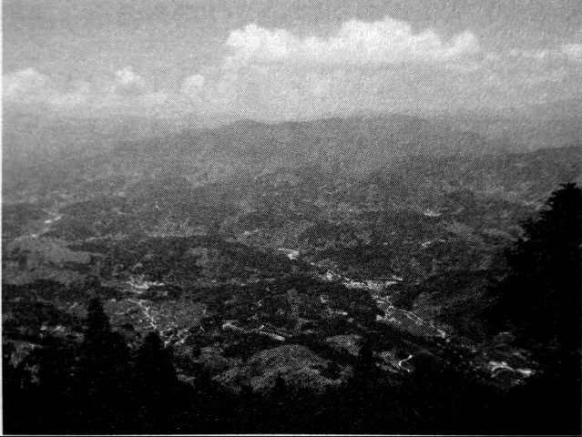

# 龙潭：最后的战场

**口述人 /** 向梦瑞，土家族，1924年7月生，现居于溆浦县龙潭镇金厂村九组，地方抗日武装第六挺进纵队第四支队部上士文书兼管印员。1945年4月入伍，曾参加过湘西会战龙潭战役，抗战胜利后退伍。

**采集人 /** 张映科 **采集时间 /** 2015年8月5日

### “周师长突然站起来，‘等我死了，再说’”

你一来就突然告诉我，周志道师长他死了，还讲他在台湾1984年就死了，搞得我眼泪水都出来了，我还在想，这么多年了，他怎么就不来我们龙潭看一下呢。

我跟他谈过几次话，他脑壳方方的，一米七零左右。当时我是第四支队支队长向承祖[^10]的文书，专门管印的。人死印在，印我随身拿着，放在胸前口袋里，来了军报我就读，支队长写了字，我就盖印。我随向承祖天天去横板桥的岩湾村周师长那里汇报工作，他在那里坐着，听着我们汇报工作，不多说话，说话很慢，从不谈吃酒谈呷烟的事。

有一天，从山门过来了两匹马，是两个副官，肩膀上有三颗红星子[^11]，马蛮高，他们是远征军的代表，远征军有两三万人呢，一进门就放下了军报：“让我们来打，周师长，您辛苦了。”周师长突然站起来：“等我死了，再说。”过了几天，又来了两个副官，我是文书，这次我就看了他们的名字，他们一个姓吴，一个姓张，这两个人也是远征军派来向周师长抢战的，周师长还是没同意。

我能当上向承祖的文书，是因为我小学毕业了，能写能读，算文化人。我是自愿当兵的，日本搞南京大屠杀，又在长沙和邵阳杀过蛮多人，现在打到龙潭我家了，我就是独生子，我也愿意和他们去打一仗，打死算了。1945年阴历二月份我就去当兵了，部队刚成立，炮就响了，日本人打山门偷偷摸摸过来了，他们运气不好，一来就跟我们谌志锦[^12]的部队在油溪坪碰到了，谌志锦就马上报了信。

向承祖是我们龙潭的名人，一般的人喊他向老高，他有一米八七，比我还高四寸，人蛮威武霸气。他晓得日本要过来了，就在龙潭成立了一个卫戍临时部队，全部是我们龙潭七金片[^13]这一带姓向的，打仗不过父子兵，这就是我们向家的父子兵。来了就登记一个名字，领一杆长枪，最差的枪是汉阳造，也有中正式。我们也没有搞过训练，发枪的时候，会开枪的就告诉不会开枪的。中央军装备比我们要好，他们每个人还有两颗手榴弹，还有轻机枪和重机枪，机枪都摆在山顶上，我们的机枪是“砰砰砰砰”连着响，日本人也有机枪，是“高膨高嘭” 两响连着响的，他们的三八式步枪也是一枪两响。

我们支队跟着中央100军19师，在青山界，打过一些仗，但是听说最惨的是在英雄山，周师长的第三营，叫姜期永营，攻了三次都没攻上去，500多人只剩下十多个人，后来来了飞机帮忙，才攻上去的。

我们的主要任务是看守俘虏，只要来了报捷文书，我就晓得，又捉到日本兵了，送来的就放在屋门前的坪里，吊起捆起。我们就守在山下的据点里，一般是躲在中央军后面。有次日本人打到我们支队部门口了，这个情况很少，在前方放哨的中央军先开枪，我也跟着开枪，我发的是一把快慢机，只能打近的，不能打远的，来的日本人都被打死了，我不晓得有没有被我打死的。打完后我看下左边，有人被打死了，我看下我右边，也有人被打死了，只有我没有受伤。

**青山界。**

**弓形山阵亡将士墓园。**

### “现在这个部队除我外没有一个活人了”

上战场，横竖准备死，大家都不管了，只晓得吃饭，平常吃三碗，现在能吃五碗。

日本人也蛮多不怕死的，缴枪后，就有很多人自杀。如果有三个人是一起的，有两个人死了，一个人伤了手伤了脚，他自己就会拿刀捅自己的肚子。但是一般的日本兵个子都蛮小，十五岁左右的日本人多得很，都不高，枪都比他们的脑壳还高一个脑壳。队伍碰到了，我们只要喊一声“不许动”，他们就把枪举起，投降。我们也不杀他，蒋介石不准我们杀俘虏，捉到的我们就三个五个捆在一起。

平常他们都躲在战壕里，我们一开枪，他们就埋头不出来。我们走路也都是跟着土坎坎走，或者俯倒在地上走，只要一抬头，对面机枪就响了，他们都穿一双靴子，我们穿草鞋，在山路上，他们是走不赢我们的，但是他们拼刺刀比我们厉害蛮多，这些跟电视里放的，都完全不一样。

有个时候我们在山弯弯处，转出来，突然碰到了，就互相用刺刀刺。要是在夜里，看不清，就互相摸一下，日本人穿的是黄呢子衣服，我们穿的是麻纱布，摸起来是不相同的，然后就互相刺。[^14]

日本人被打败后，剩下一点点人，我们就追他们，追到邵阳的黄安冲（位于邵阳县小溪市镇），他们躲在碢堡里不出来，我们也不攻，都没力气了。过了四个月，日本人投降，上面就把我们部队解散，每个人发了两块光洋，愿回家的就回去，不愿回去的还可以继续当兵。我就回家了，过山门马颈骨[^15]时，从龙潭退出来的日本人在那里当野猪一样的被打了，满山满谷的尸骨，七八个堆在一坨，都烂了没人收[^16]，都是个子蛮矮的日本人，也有蛮高大的蒙古人，我算了下有十多二十个，他们每个连队都配有三五个的。我认得蒙古人，他们都是络腮胡子，手长脚短，脚还有点弯，死一个人身边就跟着死一匹马，他们是骑兵。

我们部队有三千多人，到解散前，就只跑了二十多个人，他们都是金屏村向家冲姓向的，到了部队里十多天．就从隆回金谭魏家塅跑回来了，把枪藏在屋里，佯装打了日本。按照当时的军纪，这是要杀头的，但是向承祖没有处理这个事，他也不好处理，因为这些人跟向承祖都是我们向家同一支的。我们组里跟我一路去一路回的，只有个叫向延本的，他回来后就一直没有结婚，死了有38年了，现在这个部队除我外没有一个活人了。

[^10]: 向承祖（1895~1968），字楫中，溆浦县龙潭镇金厂村人。1918年考入张学济所辖湘西靖国联军在沅陵的第二军军官研究所，毕业后参加过北伐战争，1936年所在部队改为地方保安团，任团长，1938年11月任溆浦县县长，因与谌元章交厚次年被开职，此后一直在家乡任教。湘西会战爆发后，积极联系旧部以及游击队，并担任抗日挺进队第六纵队第四支队支队长。1949年春向在湘西收编民团武装4000余人，任湖南雪峰山区自卫指挥部副指挥兼第二总队队长，同年10月率部起义，溆浦和平解放。

[^11]: 北伐胜利后，国民革命军开始实行军衔制。军衔大小以领章上横线条数和立体三角星的数量表示，不同兵种领章的底色有区別，步兵为红色。向梦瑞观察远征军的副官领章为三颗红星，应是记忆有误，实应为红底三颗黄星，军衔为步兵上士。

[^12]: 谌志锦（1907~1955），溆浦县横板桥乡红星村人，谌志锦早先为当地石匠，曾短暂参加过当地军阀组织的北伐部队，也就是从此时开始与向承祖交厚。退伍后与其弟谌志华加入陈月红部当土匪，后与其弟又独自组织地方匪兵武装，是龙潭地区最大的匪兵团伙。他们不会主动骚扰当地民众，明里给地主富户看庄护院，或为行商武装护行，暗地里的所作所为就无从知晓了。1944年至1945年任王耀武抗日游击队大队长，1949年率部参加溆浦和平解放，被任命为湖南省人民政府参事，“土改”期间去世。

[^13]: 指的是溆浦龙潭金洲、金燕、金厂、小金厂、金牛、金黄、金屏七村所在的一片地区。

[^14]: 据《雪峰落日1945》（谌谋盾著 中国文史出版社 2015年），向梦瑞说的应该是此次夜战：1945年4月28日，为夺取青山界，国民革命军第19师55团组织200余名敢死队员，趁月色朦胧之时袭击山顶守敌，接近敌军后肉搏，随后连破三道防线，但我敢死队员遭受敌机枪扫射，牺牲过半，幸亏有63师一部赶来增援，敌109联队第12中队几乎被全歼。此战过后，木敖洞的日军唯一的退路被截断。

[^15]: 据《雪峰落日1945》及其他相关资料记载，1945年5月5日，被包围在木敖洞的日军109联队余部深夜突围后，与赶来增援的133联队一部分、116联队运输队在龙潭黄连江村会师。为躲避我军飞机轰炸和74军以及100军19师衔尾追击，109联队丢掉辎重，于同日清早由山间小路，从洞口县山门镇桐山乡望乡山向山门镇方向逃富。由于山里人猎户居多，几乎家家都有鸟铳，瑶民兰春达组织的游击队对逃跑的日军骚扰不断。在望乡山殿后的日军116联队运输队四百余人被全歼，日军109联队两千三百余人进入了雪峰山的天罗地网，只能以杂草和水充饥，其伤员纷纷剖腹自杀。5月14日，这路日军刚好又被赶过来增援的18军11师，堵在山门桐山乡马颈骨深山峽谷之间，加上有飞机轰炸，除两百余人脱离大部队进入深山逃走外，其部包括联队长在内被全歼。此战中，18军牺牲四百余人，葬于山门镇桐山乡鸡公岭（由于当初这里骨骸很多，后村民将此岭喊作“骨骸岭”），原有纪念牌坊和纪念碑，今只余一圆形坟茔。

[^16]: 由于当地山高林密，地广人稀，追击的部队又急忙赶去追敌，致使日军尸首无人掩埋，臭气熏天。在1945年，此地还因此爆发过瘟疫。