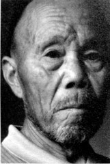

# 龙潭：最后的战场

**口述人 /** 张传成，张传美，张富堂，均为溆浦县龙潭镇大华乡小黄村第一组村民，龙潭战役时分别为16岁、13岁、6岁。张氏三兄弟住在英雄山脚下，口述以张传成为主，张传美、张富堂为辅，张富堂是当地退休民办教师，一直致力于当地抗战史料搜集，整理有《抗战最后一枪——英雄山决战》的小册子。

**采集人 /** 张映科 **采集时间 /** 2015年8月5日

### “两边人马隔得特别近，估计都没有一百米”

民国三十四年（1945）三月初六，早晨六点钟的样子，日本鬼子打来了。

来的是他们的先遣队，叫饭岛挺进队，有千把人，经过隆回白马山、麻塘山，过油溪坪，就到了这里。都是高头大马一个个的，这个先头部队是精选的人，不是后来的娃娃兵可以比的。他们由隆回小沙江过来的汉奸[^4]带路，第一天来，就上了英雄山。日本人好狡猾的，摆了个架势，都以为他们要去打桥江机场[^5]，把中央军都引到北边桥江那边去了，其实呢，他们的目标是大小黄沙。他们为什么要到这里集合呢？是因为我们这里的地理位置很好，往东北方向，翻过山就到了隆回，小沙江、司门前；往东方向，翻过山就就到了洞口的山门；往南，是洪江和洞口的江口；往西边走，过活水、铁托，就到了怀化。鬼子一到怀化，芷江就没救了。

还好，地方上报了信，中央军连夜就调兵回来了，在这里把日本人堵住了，只迟来了几个钟头。晚上十点多就在我们小黄沙布防，是74军51师的153团，团长叫王梦庚，团指挥部设在我们院子（当地方言，指自然村）后面竹山山脚下的张家祠堂里，两座山的直线距离差不多只有四百米，机枪都能互相打得到的，中间只隔了个小溪。中央军一到这里，第二天早上7点钟左右，153团第七机枪连文成海的部队，就跟敌人接上了火。

竹山和英雄山都是山窝窝里面的平地陡山，一个海拔740米左右，一个海拔763米。日本人只占着英雄山的主岭，山顶上有个岩屋（当地方言，指岩洞），叫做豹子岩屋，里面七拐八拐的，有几层通道，能住一两百个人，日本人躲在岩屋里，把它作为指挥部，相当难攻。

我原来帮地主屋里放牛的，屋里穷，买不起难民证出外逃难，只能躲在屋里，打仗的时候我也去了部队里帮忙。我参加了搬运组，专门给守军送饭送水送弹药，有空还帮挖战壕。还有后勤组，他们就在张家祠堂的团指挥部里做伙食，听他们说在那里碰到过周志道[^6]师长，王耀武军长也来住过两日，他住的房间现在还在，只可惜我当时不认得他们。

交接组是最危险的，我们死了两个传奇人物，都是前后两任交接组的组长：一个是袁杆子，5月4日，受了重伤抬往湾潭医疗站，刚抬到文昌阁路上时，突然从英雄山打来一枪，正中肚子，当场就死了；另一个镜和尚是5月7日牺牲的，他们参加第一火线只打了两天，后来编入第二火线（位于枫树垴、英雄山左侧一带），估计他是在第二火线牺牲的。

我也差点死了，子弹打在我的左手小指上，当时我正担着五六十斤的担子，给英雄山半山腰上的守军送饭。我左手搭在扁担上，山顶一颗子弹打来，打在扁担上，把我搭在扁担上的小指打掉了一截，那个时候已经过了4月23日了。4月20、21日我们发动过两次冲锋，文臣海连队的人打得就只剩下了7个人了，连长也死了，到我们院子里抬了一副棺材去埋，当时差不多已经把半山腰占了。到了4月23日，又调来了援军，接着打，打到快到山顶了，从那天起枪声就没停过，晚上的枪炮声噼里啪啦，就像大年晚上放鞭炮一样，我就在那个时候送饭受了伤。

**2015年8月5日，英雄山下的稻禾已开始抽穗。**

### “捡尸队搞了九天都没搞完”

日本人的战壕是一个圆窝窝，只伏了一个人在里面，把半截头露在外面，我们部队的战壕是一线线的，纵横交错，像蜘蛛扯的丝网，两边人马隔得特别近，估计都没有一百米，两边人马都有机枪。中央军还带了电台[^7]，一根电线扯好长，扯到半山腰，只跟飞机上的人讲话。

地面上也有给飞机做标示的哨兵，他们在地上给飞机标记号，要么是用草绳绳扯个“井”字形，要么用白布扯个“十”字形，要么是摇红旗，要么是烧秧草，点起一堆火，这个记号经常变，有记号的地方，飞机就不投弹。飞机也经常来，但是没法在英雄山上投弹，两边人马挨得太近了，怕误伤自己人。到了5月6日，飞机跟守在山腰上的中央军商量好了，中央军退50米，用烧秧草为记号，没有烟的地方就是鬼子的阵地，于是来了六架飞机，投弹，炸得个天翻地覆，树都全部没有了。我看一颗炸弹落在石头上，“嘣”的一声，小石头到处飞，飞得天高。同一天迟一点儿的时候，51师侦查排的高排长，侦查到曾家坳屋后树林里埋伏有很多鬼子，于是插个红旗做记号，飞机接着又把那个地方炸平了。

我还记得，有一颗哑弹还没到英雄山，就从飞机上掉了下来，落在我们院子边上后面竹山的山脚下。我手受伤后就不去送伙食了，当时正躲在院子里看到了，吓了我好大一跳，这颗炸弹还好没有炸，一直到土改后政府才派人取走了。

到5月7日，鬼子就往西边退到木敖洞那边去了。周围都是悬崖峭壁，剩下的日本人摸黑抄小路走的，我们都不晓得。听说黄连江关圣殿庵堂是日本人的一个伤兵医院，也都被他们自己一把火烧了，差不多烧了有五百多个人，我们这里上了年纪的都讲过这个事。

仗打完后，上面要求我们捡尸，这个事是没有报酬的，我们想着那些兵也是中国人，保里就成立了个捡尸队，有30多个人，将英雄山满山的死人根据衣服，稍微分了一下，都捡起来了。被土埋了没找到的就算了，日本兵一小堆，大概有四五百个人，中央军一大堆，大概有一千多人[^8]，然后一担担地都担到弓形山[^9]。三个小时一趟，从5月12日，搞了九天都没搞完。有些人已经死了差不多快一个月了，烂尸和骨架分不清，也就不管了，就统统用畚箕一担担地送到弓形山，我们自己的人埋了一个大堆，立了碑，日本人就埋在北面一点，那些人肯定不会给他们立碑。

我到豹子岩屋打扫战场的时候，捡到一个日本人的医疗盒，还有两颗子弹壳，一直放在我屋里，刚刚还拿出来，现在被我婆娘收到柜子里去了。

[^4]: 此人姓王，不能说是汉奸。据《龙潭战役史简编》（韩赛君，溆浦县志办）记载，为了自卫和防止土匪，1945年4月16日深夜，小黄村村民谌贻位端着步枪在村口巡逻。突然有人叫他：“满老板，您还带着枪在这里干什么？日本人已经上了鹰形山，天亮了要下来搞早饭哩。”湛贻位一看，原来是他家曾经的一个王姓佃户。谌贻位立即绕村呼喊要求大家快躲，但无人相信。所幸，日军到了英雄山后，又要急忙去占领附近相关高地，并挖掘工事，随后中央军赶来，小黄村村民免遭屠戮。

[^5]: 在溆浦县城东郊，战时曾有芷江过来的飞机在这里临时停靠。该机场现已废弃。

[^6]: 周志道（1900~1984），江西永新太崦人，黄埔军校第四期步科毕业。1926年底参加北伐，后参与了抗日战争中的几乎所有重大战事。1949年1月在淮海战役中所部被全歼，只身逃脱。同年到台湾，任“国防部”中将参议、陆军总司令部高参室主任等职。1959年退役，任台湾糖业公司顾问，1984年5月10日在台北病故。

[^7]: 由于日军占领了英雄山等高地，山高林密，地形复杂，在工事伪装下，空中很难发现目标。因此，中国军队特由空军地勤部队芷江航空站指派地对空联络小组四人，携带美制通信装置，安放电台，与航空站进行联络，从而使空军有效地配合了地面部队作战。

[^8]: 中国军队在此牺牲的将士，有名有姓的就有740名，还有无名烈士，一千余人的说法是比较准确的。

[^9]: 弓形山烈士陵园，建于龙潭镇郊外一个山头上，从山脚到山顶有297级花岗石台阶，整个陵园占地8300平方米。进门是一座三门四柱的高大牌坊，其上刻着“陆军第四方面军74军51师湘西会战龙潭战役抗日阵亡将士公墓”。有国民党军政要员题写的12块石碑。陵园最顶部是一座直径12.5、高2米的花岗石墓碑，此陵园“文革”中被毁，今已重修，12块题词碑也找到了11块。