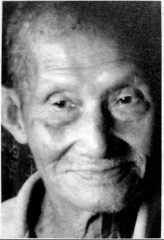

# 龙潭：最后的战场

**口述人 /** 曾锡贤，1922年农历五月出生，洞口县高沙镇石堰村人。1940年考入湖南军医预备团第二分团（邵阳）速成班学习，同年毕业分配至74军51师152团第2营，1942年由衡山去昆明进修，毕业后参加龙潭战役，任第二营战场救护站主官。解放战争时参加过孟良崮战役、淮海战役、平潭岛战役，数次被俘又数次逃脱。解放后进了江西中南军政大学江西分校（第23步兵学校）第一大队任主治医生，遭人构陷贴反动标语入狱五年，1956年出狱后回乡务农至今。老人耳聪目明，车子还没进村口，他就出来迎接了，记忆力也非常好，非常风趣幽默。他很自豪地说他一分钱都没花，就把婆娘领回屋了。我们齐声问他婆娘漂亮么？他不做声，丢过来一个“你懂的”眼神。

**采集人 /** 张映科 **采集时间 /** 2015年8月6日

### “伤兵拿着我贴的伤票，去任何医院都要收容的”

我在安化大麓中学读的高中，但是读再多的书有个屁用，我还是去当了兵。

先在邵阳读军医学校，1942年被调到昆明参加美国人办的干部训练团，学战场急救。学完回来，部队已经打完常德了，就到了衡阳。站不住脚，日本人跟着来了，就又到了邵阳、隆回，再到洞口县黄桥镇五里牌的车轮铺。

我当时向团长请假回家，回家干什么？哈哈，结婚。我是四年前订的婚，这回就单身一个去了我岳父家，什么东西都没带，部队里又没发我工资，也没跟我岳父岳母商量，就用两个人抬的轿子，把她接进了我屋里。回来还只一个礼拜，我的卫生兵就跑来了：“医官，马上回去，敌人来了，敌人打到（隆回）荷香桥了，你快走。”

当时我们部队驻在资江这边，就号召老百姓去挖马路，全部挖烂，日本人的汽车和坦克就过不来了。后来我们又回了黄桥，再后来部队拉到了龙潭，在龙潭正式开始打。

第二营副营长伍雄才带着第五连守一个山头，对面的山头被日本鬼子占了，两座山之间只隔一条路，一块田。我和营长周亚求在山下。山下有条小小的街，我住在街上一栋木房子里，部队指挥部设在一个庙里（紫云宫，又名泗神庙，位于龙潭镇圭洞村）。我负责给伤兵打针吃药、包扎，也给伤兵贴伤票，伤票上面写姓名、籍贯、职位、哪个地方受伤、几等伤这样的，拿着我的伤票，去任何医院都要收容的。

有一天早上天还没亮，日本人下山偷袭，虽然我们预料到他们会来，派了一个班守卫，但是没想到日本人不放枪，只带了大刀，把那个班几乎全部剁死了，加排长只剩下三个人。排长吓哑了，围着山脚下走，他要是向山上报警就好了，他没尽到自己的责任。

日本人爬到山上面，哨兵喊：“谁啊？哪一部分的？”，日本人不接话，一枪打过去。我们五连的连长还在说：“谁乱打枪啊？不准乱打枪！”说着他就被日本人近距离一枪打在喉咙上。这时候，已经有一百多个日本人上来了。

伍（副）营长就大喊：“不准退，大家给我打。”手榴弹、机枪一窝蜂都响了。幸亏了这个伍雄才，他不准任何人退，要不队伍一下子就被打垮了。第五连又叫第四连过来帮忙，打了一个小时，日本人打死了七八十多个，只剩下一二十个人，就又退下去了。[^17]

第五连有个黄排长，是我们黄桥乡下的人，行军我们都是走在一起的。他之前跟我说：“医官啊，这次打，我看危险啊。”我就说：“不要紧的呢。”哪个晓得啊，这次却正好打死了他。伍（副）营长不准退，他就拿着轻机枪往前扫，这是美国人的新式枪，每个排长发了一把，他扳着板着扳不动了，就喊：“报告伍（副）营长，我的枪扳不动了。”“扳不动你去修啊！”他原先是卧倒的，这时下意识地站起来，一站起来，就被日本人一枪打倒了，当时还没死，从山顶上一滚滚到山腰，才死的。

**湘西会战中，被200米外日军迫击炮炮弹炸伤的中国士兵。**

我有15副担架，有一个排专门抬人，抬到我这里来，已经落气了，血还从担架往地上流。他胸前的衣服口袋被翻了出来，我估计抬担架的人以为他是个军官，有钱，就搜了他的口袋。我把口袋放进去，里面还有张照片，是他婆娘，我认得他婆娘，部队驻在黄桥的时候，他带着他的爱人。

这次总共打死了四个排长，除了五连的黄排长，还有四连的三个排长。四连的连长是个小个子，他喊着口号冲在最前面，三个排长紧跟着他身后，结果日本人一枪一个，把他身后的三个排长都打死了，连长个子矮，他没事。

### “美国人上完课问问题，答错答对他都喊你坐下”

仗打到吃早饭的时候打完了，我就安排人挖了四个洞，在急救所屋后面的空坪上，排长要单独埋，其他的集体埋。没有棺材，我就用行军毯盖着他们，这已经算特别礼遇了。我还写了木板子，怕亲属过来找。过了不几天，黄排长的岳父带着他的婆娘就来了，他们以为战争结束了，结果一来就听到他死了。

那天天亮停了火后，我以为没事了，就到山上去检查，看还有没有伤兵，看埋的人是不是都埋好了，我还管埋人的事，不埋会臭得很。走了十多分钟到山上，我晓得山上还驻着一百多人，但到了一看，一个都没得。为什么呢？他们都挖了壕沟，头上戴了草做伪装，我看不到，其实他们都在我周围。我还在想人都到哪去了呢，一个排长，就在我脚下面喊：“医官，蹲下！你上来干什么？赶快卧倒！赶快卧倒！”我才蹲下去，对面山上连发三颗子弹打了过来。

我没被打死，要谢谢这个排长。后来我慢慢细细地下山，跟着我溜下来的还有几个兵，他们被周营长带的一个班长堵住了，“上去，谁叫你们下来的”。

龙潭的仗打完后，部队到山门去赶鬼子，我被调到洪江沙湾寨头，美国人在74军开了一个训练班[^18]，51师要派两个医官去，他们不要文盲，152团就派了我，151团派的是他们的卫生队长傅宝龙。教官都是美国人，60个学员，我45号。美国人上完课问问题，答错答对他都喊你坐下。他只要喊：“45号”，我就举手，站起来，他问哪个病是哪个原因，我以前学了的，还学了两次，我都能答出来，结业时，把我算作第一名。毕业典礼，一排桌椅，我坐第一个。

回来的时候，给我发了两箱子药，一米长，一尺宽高的箱子，不好担，我就用马驮着，药是那个时候最新式的药品，吃了最管效的。你要是痛，我就拿治痛的药，你要是出血，我就拿止血的药，给兵用一个，好一个，都不用第二次，他们都说我很能干。我哪里有什么能干，完全是药起的作用。[^19]

[^17]: 进攻部队为日军109联队第九中队，被全歼。步兵109联队饭岛挺进队第二中队的森川善一在《芷江作战》一诗中记录了松山高地守卫战的惨烈战况：“红岩圭洞龙潭司，夜袭松山冷彼肝。一骑守城成铁壁，全军攻敌为弹丸。前后错纵白兵膻，左右分崩青血酸。食尽无弹只有刃，勇战空百九兵团。”诗中的“九兵团”，就是第九中队。

[^18]: 这个医官进修学校，教官为远征军随军美军医官，生源应该是各军抽调，校部位于沙湾寨头向氏宗祠，其也曾为中国陆军机械化学校校部旧址。1936年3月1日，国民政府在南京组建陆军交辎学校，以培养装甲兵骨干，中国装甲兵之父徐庭瑶任教育长。1938年整编为中国陆军机械化学校，校址改驻湖南长沙，后迁广西柳州。1940年迁址湖南安江沙湾寨头，至1944年秋迁址四川潼南，整个校舍绵延长达十余公里，在抗战时期，这个规模算得上壮观。“文革”期间向氏宗祠成了寨头村的榨油厂，有一定程度的破坏。但宗祠的建筑大部分保存完好。

[^19]: 74军152团打完松山高地后，又去进攻红岩岭，曾锡贤此时已被调离，没有关于红岩岭的回忆，但是对74军152团在抗战胜利后一些情况，曾锡贤曾有亲历，“上面突然就来了个通知，日本人投降了。大家都很欢喜：‘回去哦回去！’谢恺堂团长就劝我们：‘大家莫回去，到大地方去看看哦。到上海、南京去看看哦。’然后就来了命令，要我们到南京去受降，接受日本人的武器弹药。队伍就开往岳阳，再坐船到南京去。 南京到处都是空的，没看到一个老百姓，我坐了两个火车站，到我们51师的驻地栖霞山后才慢慢看到老百姓。我就感到奇怪，南京原来有那么多的人，既然都被日本鬼子打了，死了都有个埋身的，要有个坟，可我没看到一个坟。我就问在栖霞山赶场的老百姓，有人告诉我‘哪里看得到尸体，打死的那些人啊，统统都丢到长江里面去喽’。 “到南京待了一两年，国共谈判破裂，两边翻了脸，要打内战了。74军换了军长张灵甫，他就来栖霞山训话，从我身边过，我不敢看他，我怕呢。他戴着美国人的钢盔，他是个瘸子，蛮高蛮大，大概一米七八。 “训完话后，部队开到了苏北。孟良崮，那是座光溜溜的石头山，我们被围住了，师长、副师长、参谋长他们七个人，都跑到山顶上，躲到一块很大的石头下面。队伍全部打散了，人到处乱走，只有山顶上那七个人的周围还围着百多个警卫。我跑到他们附近，他们不准我进去，我就从边上走过去了。 “我有两天没吃饭，也找不到水喝，我看到有块石头，就钻到石头底下去睡了一两个钟头，醒了跟着一队溃兵逃难，可是我没有搞过军事训练，我走不动，逃难的兵都走到了我的前面，有三四十个人，结果一个炮弹打来，一阵黑烟，我前面三四十个人都不见了。天上掉下坨东西，掉在我身上，是柔和的，是软的，我拿起来看一下，是一个人的肠子。 “没有一个安全的地方，我不晓得走到哪里去。我累了，就在山腰上休息。我坐下来，这边看看，那边看看，看到山上面的人，都举起了手，我就往我身后一看，结果我就看到一个人，拿把上了刺刀的长枪，他向我大喊一声：‘缴枪！’我没有枪，我就赶快举起了手，我不赶快，他会一枪打过来的。‘过来！’我就过去了，结果我到那一看，有一百多个人在那儿坐着，我想，干脆我也到那儿坐着算了。”